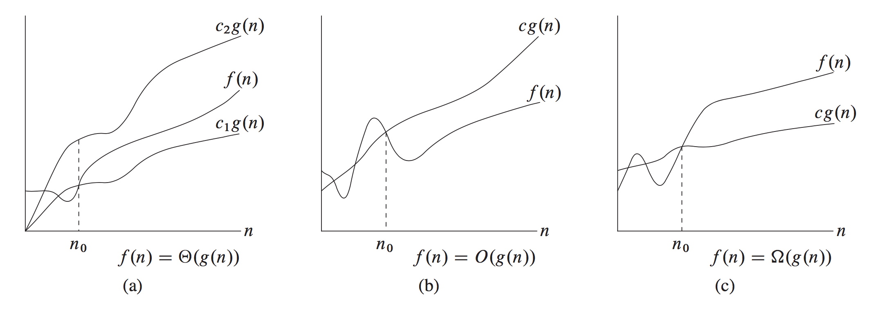

*****************************
Algorithm analysis and design
*****************************

   Taken from *Introduction to algorithms*

#. :math:`\Theta \text{-notation}` - asymptotically tight bound

   .. math::

      \Theta(g(n)) = \{0 \le c_1g(n) \le f(n) \le c_2g(n) \}

#. :math:`O \text{-notation}` - asymptotic upper bound

   .. math::

      O(g(n)) = \{0 \le f(n) \le cg(n) \}

   .. note::

      O-notation is often used to bound the worse-case running
      time of an algorithm.

#. :math:`\Omega \text{-notation}` - asymptotic lower bound

   .. math::

      \Omega(g(n)) = \{0 \le cg(n) \le f(n) \}

#. Theorem 3.1

   For any two functions f(n) and g(n), we have :math:`f(n)= \Theta(g(n))`
   if and only if :math:`f(n)=O(g(n))` and :math:`f(n)=\Omega(g(n)).`

#. :math:`o \text{-notation}` - upper bound

   .. math::

      o(g(n)) = \{0 \le f(n) \lt cg(n) \}

   .. note::

      The main difference between O-notation and o-notation is that
      in :math:`f(n)=O(g(n))`, the bound :math:`0 \le f(n) \le cg(n)` holds
      true for some constant c > 0. but in :math:`f(n)=o(g(n))`, the bound
      :math:`0 \le f(n) \lt cg(n)` holds true for all constants c > 0.
      that is, :math:`\lim \limits_{n \to \infty} \frac{f(n)}{g(n)} = 0.`

#. :math:`\omega \text{-notation}` - lower bound

   .. math::

      o(g(n)) = \{0 \lt cg(n) \le f(n) \}

   .. note::

      By analogy, :math:`\omega-notation` is to :math:`\Omega-notation` as
      o-notation is to O-notation, the relation :math:`f(n) = \omega(g(n))`
      implies that :math:`\lim \limits_{n \to \infty} \frac{f(n)}{g(n)} = \infty.`

#. Randomized algorithms - hiring problem

   .. code-block:: none

      Hire-assistant(n)
         best = 0 // candicate 0 is the least-qualified dummy one
         for i=1 to n
            interview candicate i
            if candicate i is better than best
               hire candicate i
               best = i

      Randomized-hire-assistant(n)
         // radomly permute the list of candicates
         best = 0 // candicate 0 is the least-qualified dummy one
         for i=1 to n
            interview candicate i
            if candicate i is better than best
               hire candicate i
               best = i

#. Randomized algorithms - randomly permuting arrays

   .. code-block:: none

      Permute-by-sorting(A)
         n = A.length
         let P be a new array with length n
         for i=1 to n
            P[i] = Random(1, n^3)
         sort A, using P as sorting keys

