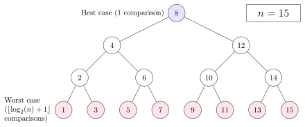

*************
Binary search
*************

**Algorithm**

Given an array A of n elements with records :math:`A_0, A_1, ..., A_{n−1},` sorted such that 
:math:`A_0 \le A_1 \le ... \le A_{n−1},` and target value T, the following subroutine uses binary search 
to find the index of T in A.

.. code-block:: none

    binary_search(A, n, T)
       L, R= 0, n-1
       while L <= R
           m = floor((L + R) / 2)
           if A[m] < T
               L = m + 1
           else if A[m] > T
               R = m - 1
           else
               return m
       return unsuccessful

The procedure may return any index whose element is equal to the target value, 
even if there are duplicate elements in the array. However, which to return is undefined.
**it is sometimes necessary to find the leftmost element or the rightmost element if the target value is duplicated in the array.** 

**Procedure for finding the leftmost element**

To find the leftmost element, the following procedure can be used:

    #. Set L to 0 and R to n.
    #. If L >= R, go to step 6.
    #. Set m to ``floor((L + R)/2).``
    #. If A[m] < T, set L to m + 1 and go to step 2.
    #. Otherwise, if A[m] >= T, set R to m and go to step 2.
    #. Now L = R, the search is done, return L.

If L < n and A[L] = T, then A[L] is the leftmost element that equals T. 
Even if T is not in the array, L is the rank of T in the array, or the 
number of elements in the array that are less than T.

.. code-block:: none

    lowerBound(A, n, T)
        L, R = 0, n
        while L < R
            m = floor((L + R) / 2)
            if A[m] < T
                L = m + 1
            else
                R = m
        return L

**Procedure for finding the rightmost element**

To find the rightmost element, the following procedure can be used:

    #. Set L to 0 and R to n.
    #. If L >= R, go to step 6.
    #. Set m (the position of the middle element) to ``floor((L + R)/2).``
    #. If A[m] > T, set R to m and go to step 2.
    #. Otherwise, if A[m] <= T, set L to m + 1 and go to step 2.
    #. Now L = R, the search is done, return L - 1.

If L > 0 and A[L-1] = T, then A[L-1] is the rightmost element that equals T. 
Even if T is not in the array, n - L is the number of elements in the array 
that are greater than T.

.. code-block:: none

    upperBound(A, n, T)
        L, R = 0, n
        while L < R
            m = floor((L + R) / 2)
            if A[m] <= T
                L = m + 1
            else
                R = m
       return L - 1

**Performance**

   Performance Analysis
      
   The worst case is reached when the search reaches the deepest level of the tree, 
   while the best case is reached when the target value is the middle element.

The performance of binary search can be analyzed by reducing the procedure to 
a binary comparison tree, where the root node is the middle element of the array. 
The middle element of the lower half is the left child node of the root and the middle 
element of the upper half is the right child node of the root. The rest of the tree is 
built in a similar fashion. This model represents binary search; starting from the root 
node, the left or right subtrees are traversed depending on whether the target value is less 
or more than the node under consideration, representing the successive elimination of elements.

The worst case is :math:`{ \lfloor \log_{2}{n}+1 \rfloor }` iterations of the comparison loop, 
The worst case is reached when the search reaches the deepest level of the tree, equivalent to 
a binary search that has reduced to one element and, in each iteration, always eliminates the 
smaller subarray out of the two if they are not of equal size.

**Applications**

#. std binary search
   
    .. code-block:: c

        #include <stdlib.h>
        void* bsearch( const void *key, const void *ptr, size_t count, size_t size,
                          int (*comp)(const void*, const void*) );
        void* bsearch_s( const void *key, const void *ptr, rsize_t count, rsize_t size,
                          int (*comp)(const void *, const void *, void *), void *context);

    Finds an element equal to element pointed to by `key` in an array pointed to by ptr. 
    The array contains `count` elements of `size` bytes and must be sorted with elements compared 
    using function pointed by `comp`. If the array contains several elements that `comp` would 
    indicate as equal to the element searched for, then it is unspecified which element the 
    function will return as the result.

    .. note::
    
        Despite the name, neither C nor POSIX standards require this function to be implemented 
        using binary search or make any complexity guarantees.
    
        Until `bsearch_s`, users of bsearch often used global variables to pass additional 
        context to the comparison function.

#. bound search
   
    .. code-block:: cpp

        template<class ForwardIt, class T, class Compare>
        bool binary_search(ForwardIt first, ForwardIt last, const T& value, Compare comp)
        {
            first = std::lower_bound(first, last, value, comp);
            return (!(first == last) && !(comp(value, *first)));
        }

        template<class ForwardIt, class T, class Compare>
        ForwardIt lower_bound(ForwardIt first, ForwardIt last, const T& value, Compare comp)
        {
            typename std::iterator_traits<ForwardIt>::difference_type count, step;
            count = std::distance(first, last);
            ForwardIt it;
 
            while (count > 0) 
            {
                it = first;
                step = count/2;
                std::advance(it, step);
                if (comp(*it, value)) 
                {
                    first = ++it;
                    count -= step+1;
                }
                else
                {
                    count = step;
                }
            }
            return first;
        }

        template <class ForwardIt, class T, class Compare>
        ForwardIt upper_bound(ForwardIt first, ForwardIt last, const T& value, Compare comp)
        {
            typename std::iterator_traits<ForwardIt>::difference_type count, step;
            count = std::distance(first, last);
            ForwardIt it;
            while(count > 0)
            {
                it = first;
                step = count/2;
                std::advance(it, step);
                if(!comp(value, *it))
                {
                    first = ++it;
                    count -= step+1;
                }
                else
                {
                    count = step;
                }
            }
            return first;
        }

        template<class ForwardIt, class T, class Compare>
        std::pair<ForwardIt,ForwardIt> equal_range(ForwardIt first, ForwardIt last, const T& value, Compare comp)
        {
            return std::make_pair(std::lower_bound(first, last, value, comp),
                                std::upper_bound(first, last, value, comp));
        }

    .. note::

        `upper_bound` returns an iterator pointing to the first element in the range `[first, last)` 
        that is greater than `value`. while `lower_bound` returns an iterator pointing to the first 
        element that is not less than `value`. Otherwise `last` if no such element is found.
        `equal_range` returns a range containing all elements equivalent to value in the range [first, last).
        If there are no elements not less than value, `last` is returned as the first element. 
        Similarly if there are no elements greater than value, `last` is returned as the second element

        comp - binary predicate which returns ​true if the first argument is less than the second. 
        
        Elements in the range `[first, last)` must be sorted using `comp`.

        Complexity: :math:`\log_2(last-first) + O(1)`