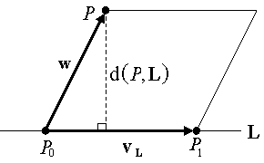
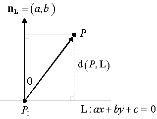
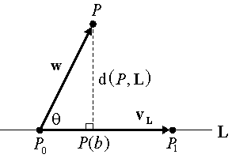

***************************
Distance of a point to line
***************************

Distance definition
===================

To calculate the distance between two points. We assume this is the standard Euclidean metric "L2 norm" 
based on the Pythagorean theorem. That is, for an n-dimensional vector :math:`v=(v_1,v_2,...,v_n),` its 
length :math:`|v|` is given by

.. math::

   |v|^2 = \sum_{i=1}^{n} {v_i}^2   

and for two points :math:`P=(p_1,...,p_n) \text{ and } Q=(q_1,...,q_n)`, the distance between them is:

.. math::

   d(P, Q) = | P - Q | = \sqrt{\sum_{i=1}^{n} (p_i - q_i)^2}

Line Equations
==============

======================  ===========================  ===========================
Type                    Equation                     Usage                      
======================  ===========================  ===========================
Explicit 2D Equation    :math:`y=f(x)=mx+b`          a non-vertical 2D line     
Implicit 2D Equation    :math:`f(x,y)=ax+by+c=0`     any 2D line                
Parametric Equation     :math:`P(t) = P_0 + tv_L`    any line in any dimension  
======================  ===========================  ===========================

PS: :math:`v_L` is the unit directional vector.

Specificly, for paramatic equation, 

.. sidebar:: Parametric equation

   .. image:: images/parametric_equation.gif

.. math:: 

   P(t) &= P_0 + tv_L \\
        &= P_0 + t(P_1 - P_0) \\
        &= (1-t)P_0 + tP_1

Distance of a Point to an Infinite Line
=======================================

Given a line L and any point P, let d(P,L) denote the distance from P to L. 
This is the shortest distance separating P and L. If L is an infinite line, 
then this is the length of a perpendicular dropped from P to L. However if L 
is a finite segment S, then the base of the perpendicular to the extended line 
may be outside the segment, and a different determination of the shortest distance 
needs to be made. We first consider perpendicular distance to an infinite line.

The 2-Point Line
----------------

In 2D and 3D, when L is given by two points P0 and P1, one can use the cross-product 
to directly compute the distance from any point P to L. The 2D case is handled by embedding 
it in 3D with a third z-coordinate = 0. The key observation to make is that the magnitude of 
the cross-product of two 3D vectors is equal to the area of the parallelogram spanned by them, 
since :math:`|v \times w| = |v||w| \sin{\theta}` where :math:`\theta` is the angle between 
the two vectors v and w. However, this area is also equal to the magnitude of the base times 
the height of the parallelogram, and we can arrange the geometry so that the height is the 
distance d(P,L). Let :math:`v_L=P_1 - P_0` and :math:`w = P - P_0` as in the diagram:

   Distance of point to a line by cross product

   .. math::

      d(P, L) = \frac{|P_0P \times P_0P_1|}{|P_0P_1|}

The 2D Implicit Line
--------------------

In 2D, there are applications where a line L is most easily defined by an implicit equation. 
For any 2D point P = (x, y), the distance d(P,L) can be computed directly from this equation.

Assume that the vector :math:`n_L = (a, b)` is normal vector for the line L. Using :math:`n_L`, 
we can compute the distance of an arbitrary point P to L by first selecting any specific point 
:math:`P_0` on L and then projecting the vector :math:`P_0P` onto :math:`n_L`. as shown in the 
diagram:

Writing out the details,

#. since not both a and b are zero, assume :math:`a \ne 0` and select :math:`P_0 = (-c / a, 0)` which is on the line.
#. for any :math:`P_0` on L we have: :math:`n_L \cdot P_0P = |n_L||P_0P| \cos{\theta} = |n_L| d(P, L).`
#. also for our specific :math:`P_0`: :math:`n_L \cdot P_0P = (a, b) \cdot (x+c/a, y) = f(P).`

yields the formula:

.. math::

   d(P,L) = \frac{f(P)}{|n_L|} = \frac{ax+by+c}{\sqrt{a^2 + b^2}}

Further, one can divide the coefficients of f(x,y) by :math:`|n_L|` to prenormalize the implicit equation so that 
:math:`|n_L| = 1.` This results in the very efficient formula:

.. math::

   d(P,L) = ax+by+c \text{, when } a^2 + b^2 = 1

The Parametric Line
-------------------

To compute the distance d(P,L) (in any n-dimensional space) from an arbitrary point P 
to a line L given by a parametric equation, suppose that P(b) is the base of the perpendicular 
dropped from P to L. Let the parametric line equation be given as: :math:`P(t) = P_0 + t (P_1 – P_0).` 
Then, the vector :math:`P_0P(b)` is the projection of the vector :math:`P_0P` onto the segment 
:math:`P_0P_1,` as shown in the diagram:

So, with :math:`v_L = (P_1 – P_0) \text{ and } w = (P – P_0),` we get that:

.. math::

   b = \frac{d(P_0P(b))}{d(P_0, P_1)} = \frac{|w|\cos{\theta}}{|v_L|} 
     = \frac{|w||v_L|\cos{\theta}}{|v_L|^2} = \frac{w \cdot v_L}{v_L \cdot v_L}

and thus:

.. math::
   
   d(P, L) = |P - P(b)| = |w - bv_L| = |w-(w \cdot u_L)u_L| 
   \text{, where } u_L \text{ is the unit direction vector of L.}

This computation has the advantage of working for any dimension n and of also computing 
the base point P(b) which is sometimes useful. In 3D, it is just as efficient as the cross 
product formula. But in 2D, when P(b) is not needed, the implicit method is better, especially 
if one is computing the distances of many points to the same line.

Distance of a Point to a Ray or Segment
=======================================

A ray R is a half line originating at a point :math:`P_0` and extending indefinitely in some direction. 
It can be expressed parametrically as P(t) for all :math:`t /ge 0` with :math:`P(0) = P_0` as the starting point. 
A finite segment S consists of the points of a line that are between two endpoints :math:`P_0 \text{ and } P_1.` 
Again, it can be represented by a parametric equation:

.. math::

   p(t) = 
   \begin{cases}
   P(0), & t=0 \\
   P(t), & 0 \lt t \lt 1 \\
   P(1), & t=1
   \end{cases}

The thing that is different about computing distances of a point P to a ray or a segment is that 
the base P(b) of the perpendicular from P to the extended line L may be outside the range of the 
ray or segment. In this case, the actual shortest distance is from the point P to the start point 
of the ray or one of the endpoints of a finite segment.

+-----------------------------------------+----------------------------------------+
| .. image:: images/distance_with_ray.gif | .. image:: images/distance_segment.gif |
+-----------------------------------------+----------------------------------------+

.. sidebar:: Distance of a point to a segment

   .. image:: images/distance_segment_2.gif
   .. image:: images/distance_segment_3.gif

.. math::

   w_0 = P - P_0 \text{ and } \theta_0 \in [0, 180^\circ] \\
   w_0 \cdot v \le 0 \\
   \Leftrightarrow \theta_0 \ge 90^\circ \\
   \Leftrightarrow d(P,S) = d(P,P_0) \\

   w_1 = P - P_1 \text{ and } \theta_1 \in [0, 180^\circ] \\
   w_1 = w_0 - v \\
   w_1 \cdot v \ge 0  \Leftrightarrow w_0 \cdot v \ge |v|^2 \\
   \Leftrightarrow \theta_0 \le 90^\circ \\
   \Leftrightarrow d(P,S) = d(P,P_1) \\

Finally let us streamline the algorithm as shown in the pseudo code::

   distance( Point P,  Segment P0:P1 )
   {
          v = P1 - P0
          w = P - P0
   
          if ( (c1 = w·v) <= 0 )  // before P0
                  return d(P, P0)
          if ( (c2 = v·v) <= c1 ) // after P1
                  return d(P, P1)
   
          b = c1 / c2
          Pb = P0 + bv
          return d(P, Pb)
   }

Implementations
===============

Here are a few sample "C++" applications using these algorithms. We assume that the low level classes and functions are already given.

.. code-block:: cpp
   :caption: C++  implementations

   // Assume that classes are already given for the objects:
   //     Point and Vector with
   //          coordinates {float x, y, z;} (z=0  for 2D)
   //          appropriate operators for:
   //               Point  = Point ± Vector
   //               Vector = Point - Point
   //               Vector = Scalar * Vector
   //     Line with defining endpoints {Point P0, P1;}
   //     Segment with defining endpoints {Point P0, P1;}
   //===================================================================
   
   // dot product (3D) which allows vector operations in arguments
   #define dot(u,v)   ((u).x * (v).x + (u).y * (v).y + (u).z * (v).z)
   #define norm(v)     sqrt(dot(v,v))     // norm = length of  vector
   #define d(u,v)      norm(u-v)          // distance = norm of difference

   // closest2D_Point_to_Line(): find the closest 2D Point to a Line
   //     Input:  an array P[] of n points, and a Line L
   //     Return: the index i of the Point P[i] closest to L
   int closest2D_Point_to_Line( Point P[], int n, Line L)
   {
        // Get coefficients of the implicit line equation.
        // ax + by +c = 0
        // Do NOT normalize since scaling by a constant
        // is irrelevant for just comparing distances.
        float a = L.P0.y - L.P1.y;
        float b = L.P1.x - L.P0.x;
        float c = L.P0.x * L.P1.y - L.P1.x * L.P0.y; // cross product of OP_0 and OP_1
   
        // initialize min index and distance to P[0]
        int mi = 0;
        float min = a * P[0].x + b * P[0].y + c;
        if (min < 0) min = -min;     // absolute value
   
        // loop through Point array testing for min distance to L
        for (i=1; i<n; i++) {
             // just use dist squared (sqrt not  needed for comparison)
             float dist = a * P[i].x + b * P[i].y  + c;
             if (dist < 0) dist = -dist;    // absolute value
             if (dist < min) {      // this point is closer
                  mi = i;              // so have a new minimum
                  min = dist;
             }
        }
        return mi;     // the index of the closest  Point P[mi]
   }

   // dist_Point_to_Line(): get the distance of a point to a line
   //     Input:  a Point P and a Line L (in any dimension)
   //     Return: the shortest distance from P to L
   float dist_Point_to_Line( Point P, Line L)
   {
        Vector v = L.P1 - L.P0;
        Vector w = P - L.P0;
   
        double c1 = dot(w,v);
        double c2 = dot(v,v);
        double b = c1 / c2;
   
        Point Pb = L.P0 + b * v;
        return d(P, Pb);
   }

   // dist_Point_to_Segment(): get the distance of a point to a segment
   //     Input:  a Point P and a Segment S (in any dimension)
   //     Return: the shortest distance from P to S
   float dist_Point_to_Segment( Point P, Segment S)
   {
        Vector v = S.P1 - S.P0;
        Vector w = P - S.P0;
   
        double c1 = dot(w,v);
        if ( c1 <= 0 )
             return d(P, S.P0);
   
        double c2 = dot(v,v);
        if ( c2 <= c1 )
             return d(P, S.P1);
   
        double b = c1 / c2;
        Point Pb = S.P0 + b * v;
        return d(P, Pb);
   }
