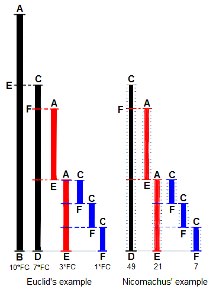

*******************
Euclidean Algorithm
*******************

**Introduction**

In mathematics, the Euclidean algorithm, is an efficient method for computing the :abbr:`GCD (greatest common divisor)` 
of two numbers, the largest number that divides both of them without leaving a remainder. It is named after the ancient 
Greek mathematician **Euclid,** who first described it in his **Elements** (c. 300 BC). It is an example of an algorithm, 
a step-by-step procedure for performing a calculation according to well-defined rules, and is one of the oldest algorithms 
in common use. It can be used to reduce fractions to their simplest form, and is a part of many other number-theoretic 
and cryptographic calculations.

The Euclidean algorithm is based on the principle that **the greatest common divisor of two numbers does not change 
if the larger number is replaced by its difference with the smaller number.** For example, 21 is the GCD of 252 and 105, 
and the same number 21 is also the GCD of 105 and 252 − 105 = 147. Since this replacement reduces the larger of the 
two numbers, repeating this process gives successively smaller pairs of numbers until the two numbers become equal. 
When that occurs, they are the GCD of the original two numbers. By reversing the steps, the GCD can be expressed as 
a sum of the two original numbers each multiplied by a positive or negative integer, e.g., 21 = 5 × 105 + (−2) × 252. 
The fact that the GCD can always be expressed in this way is known as **Bézout's identity.**

The version of the Euclidean algorithm described above (and by Euclid) can take many **subtraction** steps 
to find the GCD when one of the given numbers is much bigger than the other. A more efficient version of 
the algorithm shortcuts these steps, instead replacing the larger of the two numbers by its **remainder** 
when divided by the smaller of the two (with this version, the algorithm stops when reaching a zero remainder). 
With this improvement, the algorithm never requires more steps than five times the number of digits (base 10) 
of the smaller integer. This was proven by *Gabriel Lamé* in 1844, and marks the beginning of 
**computational complexity theory.** 

The Euclidean algorithm has many theoretical and practical applications. 
It is used for reducing fractions to their simplest form and for performing 
division in modular arithmetic. Computations using this algorithm form part 
of the cryptographic protocols that are used to secure internet communications, 
and in methods for breaking these cryptosystems by factoring large composite numbers. 
The Euclidean algorithm may be used to solve Diophantine equations, such as finding 
numbers that satisfy multiple congruences according to the Chinese remainder theorem, 
to construct continued fractions, and to find accurate rational approximations to real numbers. 
Finally, it can be used as a basic tool for proving theorems in number theory such as Lagrange's 
four-square theorem and the uniqueness of prime factorizations. The original algorithm was described 
only for natural numbers and geometric lengths (real numbers), but the algorithm was generalized in 
the 19th century to other types of numbers, such as Gaussian integers and polynomials of one variable. 
This led to modern abstract algebraic notions such as Euclidean domains.

.. code-block:: none
   :caption: Implementation

   // gcd - greatest common divisor 
   // or
   // gcf - greatest common factor

   gcd-division(a, b)
      while b != 0
         t = b
         b = a mod b
         a = t
      return a

   gcd-recursion(a, b)
      if b == 0
         return a
      else 
         return gcd(b, a mod b)

   gcd-substraction(a, b)
      while a != b
         if a>b
            a = a - b
         else
            b = b - a
      return a

**Application**

#. Find LCM - solution one
   
   In arithmetic and number theory, the :abbr:`LCM (least common multiple)` of two integers a and b, 
   usually denoted by **LCM(a, b),** is the smallest positive integer that is divisible by both a and b.
   
   The following formula reduces the problem of computing the LCM to the problem of computing the GCD:
   
   .. math::
   
      \operatorname {lcm}(a,b)=\frac{|a\cdot b|}{\operatorname {gcd}(a,b)}
   
   This formula is also valid when exactly one of a and b is 0, since ``gcd(a, 0) = |a|.`` 
   However, if both a and b are 0, this formula would cause division by zero; 
   ``lcm(0, 0) = 0`` is a special case.
   
   Because ``gcd(a, b)`` is a divisor of both a and b, it is more efficient to compute the LCM 
   by dividing before multiplying:
   
   .. math::
   
      \operatorname {lcm}(a,b) = \left({|a| \over \operatorname{gcd} (a,b)}\right)\cdot |b|
                               = \left({|b| \over \operatorname{gcd} (a,b)}\right)\cdot |a|
       
   
   This reduces the size of one input for both the division and the multiplication, 
   and reduces the required storage needed for intermediate results (overflow in the ``a*b`` computation). 
   Because ``gcd(a, b)`` is a divisor of both a and b, the division is guaranteed to yield an integer, 
   so the intermediate result can be stored in an integer. 
   
   Proof
   
   According to the fundamental theorem of arithmetic a positive integer is the product of prime numbers, 
   and, except for their order, this representation is unique:
   
   .. math::
   
      n = 2^{n_{2}}3^{n_{3}}5^{n_{5}}7^{n_{7}} \cdots = \prod_{p} p^{n_{p}}
   
   where the exponents :math:`n_2, n_3, \ldots` are non-negative integers; 
   for example, :math:`84 = 2^2 \times 3^1 \times 5^0 \times 7^1 \times 11^0 \ldots`
   
   Given two positive integers: :math:`{a=\prod_{p} p^{a_{p}}}` and :math:`{b=\prod_{p} p^{b_{p}}},` 
   their LCM and GCD are given by the formulas:
   
   .. math::
   
      \operatorname {gcd}(a,b) &= \prod_{p} p^{\min(a_{p},b_{p})} \\
      \operatorname {lcm}(a,b) &= \prod_{p} p^{\max(a_{p},b_{p})}
   
   Since :math:`{\min(x,y)+\max(x,y)=x+y,}` this gives :math:`{\operatorname {gcd}(a,b) \operatorname {lcm}(a,b) = ab.}`

   Refer to `Least Common Multiple <https://en.wikipedia.org/wiki/Least_common_multiple>`_ for further information.
   

#. Find LCM - solution two
   
   This method works as easily for finding the LCM of several integers.

   Let there be a finite sequence of positive integers :math:`X = (x_1, x_2, ..., x_n), n > 1.` 
   The algorithm proceeds in steps as follows: on each step m it examines and updates the sequence 
   :math:`X^{m} = (x_1^{(m)}, x_2^{(m)}, ..., x_n^{(m)}), X^{(1)} = X,` where :math:`X^{(m)}` is 
   the mth iteration of X, The purpose of the examination is to pick the least element of the 
   sequence :math:`X^{(m)}.` Assuming :math:`x_{k_0}^{(m)}` is the selected element, 
   the sequence :math:`X^{(m+1)}` is defined as

   .. math::

      x_k^{(m+1)} &= x_k^{(m)}, k \ne k_0  \\
      x_{k_0}^{(m+1)} &= x_{k_0}^{(m)} + x_{k_0}^{(1)}

   The algorithm stops when all elements in sequence :math:`X^{(m)}` are equal. 
   Their common value is exactly ``LCM(X).``

   .. code-block:: c
   
      #include <stdio.h>
      
      void printArray(int* a, int count, int i)
      {
          printf("%03d iteration: ", i);
          for(int j=0; j<count; j++)
              printf("%03d ", a[j]);
          printf("\n");
      }
      
      int isAllEqual(int*a, int count)
      {
          int yes = 1;
          for(int i=1; i<count; i++) 
          {
              if(a[i] != a[i-1])
              {
                  yes = 0;
                  break;
              }
          }
          return yes;
      }
      
      int findMin(int* a, int count)
      {
          int idx = 0;
          int bmin = a[idx];
          for(int i=1; i<count; i++)
          {
              if(a[i] < bmin)
              {
                  idx = i;
                  bmin = a[i];
              }
          }
          return idx;
      }
      
      int main()
      {
          int a[] = {1,2,3,4,5,6};
          int b[] = {1,2,3,4,5,6};
          int n = sizeof(a)/sizeof(a[0]);
          
          int idx, loop = 0;
          while(!isAllEqual(a, n))
          {
              loop++;
              printArray(a, n, loop);
              idx = findMin(a, n);
              a[idx] += b[idx];
          } 
         
          return 0;
      }
   