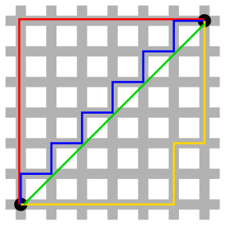

***********************
Path Finding Algorithms
***********************

    Manhanttan Distance
   
    | Red: Manhattan distance.
    | Green: diagonal, straight-line distance. 
    | Blue, yellow: equivalent Manhattan distances.

The Manhattan distance is the simple sum of the horizontal and vertical components, 
whereas the diagonal distance might be computed by applying the Pythagorean theorem. [勾股定理]

.. code-block:: py

    # breadth-first logic
    frontier = Queue()
    frontier.put(src)
    visited = {}
    visited[srced] = True
    while not frontier.empty():
        current = frontier.get()
        for next in graph.neighbours(current):
            if next not in visited:
                frontier.put(next)
                visited[next] = True
    
    # keep track of where we came from for every visited location
    frontier = Queue()
    frontier.put(src)
    came_from = {}
    came_from[srced] = None
    while not frontier.empty():
        current = frontier.get()
        if current == dest:
            break
        for next in graph.neighbours(current):
            if next not in came_from:
                frontier.put(next)
                came_from[next] = current
    
        # reconstruct the path
        current = dest
        path = []
        while current != None:
            path.append(current)
            current = came_from[current]
        path.reverse() # optional

    # Dijkstra's algorithm using distance from src
    frontier = PriorityQueue()
    frontier.put(src, 0)
    came_from = {}
    came_from[src] = None
    cost_sofar = {}
    cost_sofar[src] = 0
    while not frontier.empty():
        current = frontier.get()
        if current == dest:
            break
        for next in graph.neighbours(current):
            new_cost = cost_sofar[current] + graph.cost(current, next)
            if next not in came_from or new_cost < cost_sofar[next]:
                cost_sofar[next] = new_cost
                priority = new_cost
                frontier.put(next, priority)
                came_from[next] = current    

    def heuristic(a, b):
        # Manhattan distance on a square grid
        return abs(a.x-b.x) + abs(a.y-b.y)

    # Greedy-first search using distance to dest
    frontier = PriorityQueue()
    frontier.put(src, 0)
    came_from = {}
    came_from[src] = None
    while not frontier.empty():
        current = frontier.get()
        if current == dest:
            break
        for next in graph.neighbours(current):
            if next not in came_from:
                priority = heuristic(dest, next)
                frontier.put(next, priority)
                came_from[next] = current

    # A* algorithm using both
    frontier = PriorityQueue()
    frontier.put(src, 0)
    came_from = {}
    came_from[src] = None
    cost_sofar = {}
    cost_sofar[src] = 0
    while not frontier.empty():
        current = frontier.get()
        if current == dest:
            break
        for next in graph.neighbours(current):
            new_cost = cost_sofar[current] + graph.cost(current, next)
            if next not in came_from or new_cost < cost_sofar[next]:
                priority = heuristic(dest, next) + new_cost
                frontier.put(next, priority)
                came_from[next] = current

.. rubric:: Footnotes

.. [#] `Introduction to A* (Animated) <https://www.redblobgames.com/pathfinding/a-star/introduction.html>`_
.. [#] `Introduction to A* Algorithm <http://theory.stanford.edu/~amitp/GameProgramming/AStarComparison.html>`_