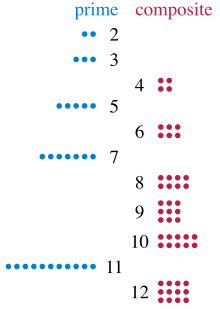

**********
Prime Test
**********

A **prime number** is a natural number greater than 1 that cannot be formed
by multiplying two smaller natural numbers. A natural number greater
than 1 that is not prime is called a **composite number**.

The simplest primality test is **trial division:** Given an input number n,
check whether any prime integer m from 2 to :math:`\sqrt{n}` evenly divides.
If n is divisible by any m then n is composite, otherwise it is prime.
Thus, its running time is polynomial in the size of the input.

.. code-block:: cpp
    :caption: Trial Division

    bool isPrime(int n)
    {
        if (n != 2)
        {
            if (n < 2 || n % 2 == 0)
            {
                return false;
            }
            for(int i=3; (i*i)<=n; i+=2)
            {
                if(n % i == 0 )
                    return false;
            }
        }
        return true;
    }

    bool isPrime_02(int n)
    {
        if(n <= 1)
            return false;
        else if(n <= 3)
            return true;
        else if( n%2 == 0 || n%3 == 0)
            return false;
        for(int i=5; i*i <= n; i+=6)
        {
            if((i%n == 0) || ((i+2)%n == 0))
                return false;
        }
        return true;
    }

More sophisticated methods described below are much faster for large n.
Refer to [#Primality_test]_ for further information.

.. image:: images/Sieve_of_Eratosthenes_animation.gif

In mathematics, the sieve of Eratosthenes [#Sieve_of_Eratosthenes]_ is a simple,
ancient algorithm for finding all prime numbers up to any given limit.

It does so by iteratively marking as composite the multiples of each prime,
starting with the first prime number, 2. The multiples of a given prime are
generated as a sequence of numbers starting from that prime, with constant difference
between them that is equal to that prime. This is the sieve's key distinction from using
trial division [#Trial_division]_ to sequentially test each candidate number for divisibility by each prime.

.. code-block:: none
    :caption: the sieve of Eratosthenes implementation

    // Complexity: O(nlog log n)
    SieveOfEratosthenes(n)
        Let A be an array of Boolen values, indexed by
        integers 2 to n, initially all set to true

        for i=2 to sqrt(n)
            if A[i]
                for j=i^2 to n
                    A[j] = false
                    j += i
        output all i such that A[i] is true

.. [#Primality_test] https://en.wikipedia.org/wiki/Primality_test
.. [#Sieve_of_Eratosthenes] https://en.wikipedia.org/wiki/Sieve_of_Eratosthenes
.. [#Trial_division] https://en.wikipedia.org/wiki/Trial_division
