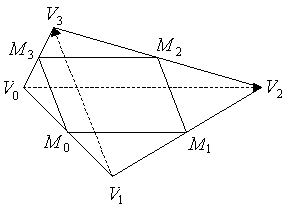

****************************
Area of Triangle and Polygon
****************************

Triangle
========

Ancient Triangles
-----------------

Before Pythagoras, the area of the parallelogram (including the rectangle and the square) 
had been known to equal **the product of its base times its height**. Further, two copies 
of the same triangle paste together to form a parallelogram, and thus the area of a triangle 
is half of its base b times its height h. So, for these simple but commonly occurring cases, 
we have:

+--------------------------------------------+---------------------------------------+
| Parallelogram                              | Triangle                              |
+============================================+=======================================+
| .. image:: images/Area_Parallelogram_1.gif | .. image:: images/Area_Triangle_1.gif |
+--------------------------------------------+---------------------------------------+
| :math:`S = bh`                             | :math:`S = \frac{1}{2} bh`            |
+--------------------------------------------+---------------------------------------+

However, except in special situations, finding the height of a triangle at an arbitrary orientation 
usually requires also computing the perpendicular distance of the top vertex from the base.

For example, if one knows the lengths of two sides, a and b, of a triangle and also the angle 
:math:`\theta` between them, then this is enough to determine the triangle and its area. Using 
trigonometry, the height of the triangle over the base b is given by :math:`h = a\sin \theta`, 
and thus the area is:

+----------------------------------------+---------------------------------------+
| :math:`S = \frac{1}{2} ab \sin \theta` | .. image:: images/Area_Triangle_2.gif |
+----------------------------------------+---------------------------------------+

Modern Triangles
----------------

More recently, starting in the 17-th century with *Descartes* and *Fermat*, 
linear algebra produced new simple formulas for area. In 3 dimensional space (3D), 
**the area of a planar parallelogram or triangle can be expressed by the magnitude 
of the cross-product of two edge vectors**, since :math:`\| V \times W \| = \|V\| \|W\| \sin \theta` 
where :math:`\theta` is the angle between the two vectors V and W. Thus for a 3D triangle with 
vertices :math:`V_0V_1V_2` putting :math:`v=V_1-V_0` and :math:`w=V_2-V_0`, one gets

.. sidebar:: Area of a Triangle using cross product

   .. image:: images/Area_Triangle_3.gif 

   .. math::

      S =& \frac{1}{2} \| V \times W \| \\
        =& \frac{1}{2} \|(V_1-V_0) \times (V_2-V_0)\|

**Note** that the signed area will be positive if the vertices :math:`V_0V_1V_2` are oriented counterclockwise 
around the triangle, and will be negative if the triangle is oriented clockwise; and so, **this area computation 
can be used to test for a triangle's orientation.** This signed area can also be used to test whether the point 
:math:`V_2` is to the left (positive) or the right (negative) of the directed line segment :math:`V_0V_1` . 
So this value is a very useful primitive, and it's great to have such an efficient formula for it.

Quadrilaterals
==============

The Greeks singled out certain quadrilaterals (also called quadrangles) for special treatment, 
including the square, the rectangle, the parallelogram, and the trapezium. Then, given an arbitrary 
quadrilateral, they showed how to construct a parallelogram or square with an equal area. And the 
area of the parallelogram was equal to its base times its height. But there was no general formula 
for the quadrilateral's area.

In modern linear algebra, as already noted, the area of a planar parallelogram is the magnitude 
of the cross product of two adjacent edge vectors. So, for any 3D planar parallelogram 
:math:`V_0V_1V_2V_3`, we have:

+--------------------------------------+--------------------------------------------+
| :math:`S=(V_1-V_0) \times (V_3-V_0)` | .. image:: images/Area_Parallelogram_2.gif |
+--------------------------------------+--------------------------------------------+

In 2D, with vertices :math:`Vi=(x_i,y_i)=(x_i,y_i,0) \text{ for } i=0,3,` this becomes:

.. math:: 

   S = \| (x_1-x_0)(y_3-y_0) - (x_3-x_0)(y_1-y_0) \|

which is again a signed area, just as we had for triangles. It also indicates **orientation**.

Next, for an **arbitrary quadrilateral**, one can compute its area using a parallelogram 
discovered by *Pierre Varignon* (first published in 1731). It is amazing that the Greeks 
missed Varignon's simple result which was discovered 2000 years after Euclid! Given any 
quadrilateral, one can take the midpoints of its 4 edges to get 4 vertices which form a 
new quadrilateral. It is then easy to show that this midpoint quadrilateral is always a 
parallelogram, called the **Varignon parallelogram**, and that **its area is exactly one-half 
the area of the original quadrilateral**. To see this, for any quadrilateral :math:`S_{V_0V_1V_2V_3}`, 
let the midpoint vertices be :math:`S_{M_0M_1M_2M_3}` as shown in the diagram:

The area relation is also easy to demonstrate. And we can then compute the area as:

.. math:: 

   S_{V_0V_1V_2V_3} =& 2 S_{M_0M_1M_2M_3} \\
                    =& 2 \| (M_1 - M_0) \times (M_3 - M_0) \| \\
                    =& 2 \| \left(\frac{V_1+V_2}{2} - \frac{V_1+V_0}{2} \right) 
                                 \times \left(\frac{V_3+V_0}{2} - \frac{V_1+V_0}{2}\right) \| \\
                    =& \frac{1}{2} \| (V_2 - V_0) \times (V_3 - V_1) \|

which is one-half the magnitude of the cross-product of the two diagonals of the quadrilateral.
For simple quadrilaterals, the area is positive when the vertices are oriented counterclockwise, 
and negative when they are clockwise. However, it also works for nonsimple quadrilaterals and is 
equal to the difference in area of the two regions the quadrilateral bounds. For example, in the 
following diagram where **I** is the self-intersection point of a nonsimple quadrilateral 
:math:`V_0V_1V_2V_3`, we have:

.. sidebar:: Nonsimple polygon

   .. image:: images/Area_Parallelogram_4.gif

.. math::
   
   S_{V_0V_1V_2V_3} =& S_{V_0V_1I} + S_{IV_2V_3} \\
                    =& S_{V_0V_1I} - S_{IV_3V_2}

Polygon
=======

2D polygon
----------

A 2D polygon can be decomposed into triangles. For computing area, there is a very easy decomposition 
method for simple polygons (i.e. ones without self intersections). Let a polygon :math:`\Omega` be defined 
by its vertices :math:`Vi=(xi,yi) \text{ for i=0,n with } V_n=V_0`. Also, let **P** be any point; and for each 
edge :math:`e_i=V_iV_{i+1} \text{ of } \Omega`, form :math:`\triangle{PV_iV_{i+1}}`. Then, the area of :math:`\Omega` 
is equal to the sum of the signed areas of all the triangles; and we have:

+-----------------------------------------------------+---------------------------------+
| :math:`S_{\Omega} = \sum_{i=0}^{n} S_{PV_iV_{i+1}}` | .. image:: images/Polygon_1.gif |
+-----------------------------------------------------+---------------------------------+

Notice that, for a counterclockwise oriented polygon, when the point P is on the "inside" left side of an edge 
:math:`V_iV_{i+1}`, then the area is positive; otherwise negative. If instead the polygon is oriented clockwise, 
then the signs are reversed, and inside triangles become negative.

One can make the formula more explicit by picking a specific point **P** and expanding the terms. 
By selecting **P=(0,0)**, the area formula of each triangle reduces to 
:math:`2S{\triangle_i}=(x_iy_{i+1}-x_{i+1}y_i)`. This yields:

.. sidebar:: 2D Polygon Area Deduction

   .. image:: images/Polygon_2.gif

.. math:: 

   \begin{align}
      2S_{\Omega} &= \sum_{i=0}^{n-1} {(x_iy_{i+1}-x_{i+1}y_i)} \\
                  &= \sum_{i=0}^{n-1} {(x_i + x_{i+1})(y_{i+1} - y_i)} \\
                  &= \sum_{i=1}^{n} {x_i (y_{i+1} - y_{i-1})} \\
   \end{align} \\
   \text{where } V_i=(x_i, y_i) \text{, with i mod n}

This computation gives a signed area for a polygon; and, similar to the signed area of a triangle, 
is positive when the vertices are oriented counterclockwise around the polygon, and negative when 
oriented clockwise. So, this computation can be used to test for a polygon's **global orientation**. 
However, there are other more efficient algorithms for determining polygon orientation. The easiest 
is to find the rightmost lowest vertex of the polygon, and then test the orientation of the entering 
and leaving edges at this vertex. This test can be made by checking if the end vertex of the leaving 
edge is to the left of the entering edge, which means that the orientation is counterclockwise, otherwise 
it is clockwise.

3D Planar Polygons
------------------

An important generalization is for planar polygons embedded in 3D space. We have already shown that the area 
of a 3D triangle is given by half the magnitude of the cross product of two edge vectors.

+---------------------------------+---------------------------------+
| .. image:: images/Polygon_3.gif | .. image:: images/Polygon_4.gif |
+---------------------------------+---------------------------------+

A general 3D planar polygon has vertices :math:`V_i=(x_i,y_i,z_i) \text{for i=0,n with } V_n=V_0`, where all 
the vertices lie on the same 3D plane which has a **unit normal vector k**. Now, as in the 2D case, let **P** 
be any 3D point (not generally on the plane); and for each edge :math:`e_i=V_iV_{i+1}` of the polygon, form 
the 3D :math:`\triangle PV_iV_{i+1}`. We would like to relate the sum of the areas of all these triangles to 
the area of the polygon in the plane. But what we have is a pyramidal cone with **P** as an apex over the polygon 
as a base. We are going to project the triangular sides of this cone onto the plane of the base polygon, and 
compute signed areas of the projected triangles. Then the sum of the projected areas will equal the total area 
of the planar polygon.

To achieve this, start by associating to each :math:`\triangle PV_iV_{i+1}` an area vector 
:math:`\alpha_i = \frac{PV_i \times PV_{i+1}}{2}`, which is perpendicular to :math:`\triangle PV_iV_{i+1}`, 
and whose magnitude we know is equal to that triangle's area. Next, drop a perpendicular from **P** to a 
point :math:`P_0` on the plane , and consider the projected :math:`\triangle P_0V_iV_{i+1}`. Then drop a 
perpendicular :math:`P_0B_i` from :math:`P_0` to :math:`B_i` on the edge :math:`e_i=V_iV_{i+1}`. Since :math:`PP_0` 
is also perpendicular to :math:`e_i`, the three points :math:`PP_0B_i` define a plane that is perpendicular 
to :math:`e_i`, and thus :math:`PB_i` is a perpendicular from P to :math:`e_i`. Thus :math:`\|PB_i\|` is 
the height of :math:`\triangle PV_iV_{i+1}`, and :math:`\|P_0B_i\|` is the height of :math:`\triangle P_0V_iV_{i+1}`. 
Further, the angle between these two altitudes = :math:`\theta` = the angle between **n** and :math:`\alpha_i` 
since a 90° rotation (in the :math:`PP_0B_i` plane) results in congruence. This gives:

.. math::

   & S(\triangle P_0V_iV_{i+1}) = \frac{\|V_iV_{i+1}\| \|P_0B_i\|}{2}
                              = \frac{\|V_iV_{i+1}\| \|PB_i\| \cos{\theta}}{2}
                              = S(\triangle PV_iV_{i+1}) \cos{\theta} 
                              = \alpha_i \cdot k

   & S(\Omega) = \sum_{i=0}^{n-1} {S(\triangle P_0V_iV_{i+1})} = \sum_{i=0}^{n-1} {\alpha_i \cdot k}
             = k \cdot \sum_{i=0}^{n-1} {\alpha_i} = \frac{k}{2} \cdot \sum_{i=0}^{n-1} {PV_i \times PV_{i+1}}

Finally, by selecting **P = (0,0,0),** we have :math:`PV_i = V_i` and this produces the concise formula:

.. math::

   S(\Omega) = \frac{k}{2} \cdot \sum_{i=0}^{n-1} {V_i \times V_{i+1}}

Similar to the 2D case, this is a signed area which is positive when the vertices are oriented **counterclockwise** 
around the polygon when viewed from the side of the polygon pointed to by k.

Further, *Van Gelder* has shown how to significantly speed up this computation by using a decomposition 
into quadrilaterals instead of triangles. As we have already shown, the area of a 3D planar quadrilateral 
:math:`\Theta = V_0V_1V_2V_3` can be computed in terms of the cross-product of its diagonals; namely as: 
:math:`2S(\Theta) = {\|V_2V0 \times V_3V_1\|}`, which reduces four expensive cross-product computations 
to just one! Then, any polygon (with n > 4 vertices) can be decomposed into quadrilaterals formed by 
:math:`V_0` and three other sequential vertices :math:`V{2i–1}, V_{2i}, and V_{2i+1}` for **i = 1,h** where 
``h = \floor((n-1)/2).``  This gives:

.. math::

   S &= \sum_{i=1}^{h} S(V_0V_{2i-1}V_{2i}V_{2i+1}) \\
     &= \frac {\sum_{i=1}^{h} { V_0V_{2i} \times V_{2i-1}V_{2i+1})}}{2} \\
     & \text{ Where i = i % n}

**Note** that When n is odd, the decomposition ends with a triangle.

Implementations
===============

Here are some sample "C++" implementations of these formulas as algorithms. 
We just give the 2D case with integer coordinates, and use the simplest structures 
for a point, a triangle, and a polygon which may differ in your application. We 
represent a polygon as an array of points, but it is often more convenient to have 
it as a linked list of vertices (to allow insertion or deletion during drawing 
operations), and the polygon routines can be easily modified to scan through the 
linked list.

.. code-block:: cpp

   typedef struct {int x, y, z;} Point;  // set z=0 for a 2D Point
   
   // a Triangle is given by three points: Point V0, V1, V2 
   
   // a Polygon is given by:
   //       int n = number of vertex points
   //       Point* V[] = an array of n+1 vertex points with V[n]=V[0]
    
   // isLeft(): test if a point is Left|On|Right of an infinite 2D line.
   //    Input:  three points P0, P1, and P2
   //    Return: >0 for P2 left of the line through P0 to P1
   //          =0 for P2 on the line
   //          <0 for P2 right of the line
   inline int isLeft( Point P0, Point P1, Point P2 )
   {
       return ( (P1.x - P0.x) * (P2.y - P0.y)
              - (P2.x - P0.x) * (P1.y - P0.y) );
   }
   //===================================================================
   
   
   // orientation2D_Triangle(): test the orientation of a 2D triangle
   //  Input:  three vertex points V0, V1, V2
   //  Return: >0 for counterclockwise 
   //          =0 for none (degenerate)
   //          <0 for clockwise
   inline int orientation2D_Triangle( Point V0, Point V1, Point V2 )
   {
       return isLeft(V0, V1, V2);
   }
   //===================================================================
   
   
   // area2D_Triangle(): compute the area of a 2D triangle
   //  Input:  three vertex points V0, V1, V2
   //  Return: the (float) area of triangle T
   inline float area2D_Triangle( Point V0, Point V1, Point V2 )
   {
       return (float)isLeft(V0, V1, V2) / 2.0;
   }
   //===================================================================
   
   
   // orientation2D_Polygon(): test the orientation of a simple 2D polygon
   //  Input:  int n = the number of vertices in the polygon
   //          Point* V = an array of n+1 vertex points with V[n]=V[0]
   //  Return: >0 for counterclockwise 
   //          =0 for none (degenerate)
   //          <0 for clockwise
   //  Note: this algorithm is faster than computing the signed area.
   int orientation2D_Polygon( int n, Point* V )
   {
       // first find rightmost lowest vertex of the polygon
       int rmin = 0;
       int xmin = V[0].x;
       int ymin = V[0].y;
   
       for (int i=1; i<n; i++) {
           if (V[i].y > ymin)
               continue;
           if (V[i].y == ymin) {   // just as low
               if (V[i].x < xmin)  // and to left
                   continue;
           }
           rmin = i;      // a new rightmost lowest vertex
           xmin = V[i].x;
           ymin = V[i].y;
       }
   
       // test orientation at the rmin vertex
       // ccw <=> the edge leaving V[rmin] is left of the entering edge
       if (rmin == 0)
           return isLeft( V[n-1], V[0], V[1] );
       else
           return isLeft( V[rmin-1], V[rmin], V[rmin+1] );
   }
   //===================================================================
   
   
   // area2D_Polygon(): compute the area of a 2D polygon
   //  Input:  int n = the number of vertices in the polygon
   //          Point* V = an array of n+1 vertex points with V[n]=V[0]
   //  Return: the (float) area of the polygon
   float area2D_Polygon( int n, Point* V )
   {
       if (n < 3) return 0;  // a degenerate polygon

       float area = 0;
       int  i, j, k;   // indices
   
       for (i=1, j=2, k=0; i<n; i++, j++, k++) {
           area += V[i].x * (V[j].y - V[k].y);
       }
       area += V[n].x * (V[1].y - V[n-1].y);  // wrap-around term
       return area / 2.0;
   }
   //===================================================================
   
   
   // area3D_Polygon(): compute the area of a 3D planar polygon
   //  Input:  int n = the number of vertices in the polygon
   //          Point* V = an array of n+1 points in a 3D plane with V[n]=V[0]
   //          Point N = a normal vector of the polygon's plane
   //  Return: the (float) area of the polygon
   float area3D_Polygon( int n, Point* V, Point N )
   {
       if (n < 3) return 0;  // a degenerate polygon

       float area = 0;
       float an, ax, ay, az; // abs value of normal and its coords
       int  coord;           // coord to ignore: 1=x, 2=y, 3=z
       int  i, j, k;         // loop indices
   
       // select largest abs coordinate to ignore for projection
       ax = (N.x>0 ? N.x : -N.x);    // abs x-coord
       ay = (N.y>0 ? N.y : -N.y);    // abs y-coord
       az = (N.z>0 ? N.z : -N.z);    // abs z-coord
   
       coord = 3;                    // ignore z-coord
       if (ax > ay) {
           if (ax > az) coord = 1;   // ignore x-coord
       }
       else if (ay > az) coord = 2;  // ignore y-coord
   
       // compute area of the 2D projection
       switch (coord) {
         case 1:
           for (i=1, j=2, k=0; i<n; i++, j++, k++)
               area += (V[i].y * (V[j].z - V[k].z));
           break;
         case 2:
           for (i=1, j=2, k=0; i<n; i++, j++, k++)
               area += (V[i].z * (V[j].x - V[k].x));
           break;
         case 3:
           for (i=1, j=2, k=0; i<n; i++, j++, k++)
               area += (V[i].x * (V[j].y - V[k].y));
           break;
       }
       switch (coord) {    // wrap-around term
         case 1:
           area += (V[n].y * (V[1].z - V[n-1].z));
           break;
         case 2:
           area += (V[n].z * (V[1].x - V[n-1].x));
           break;
         case 3:
           area += (V[n].x * (V[1].y - V[n-1].y));
           break;
       }
   
       // scale to get area before projection
       an = sqrt( ax*ax + ay*ay + az*az); // length of normal vector
       switch (coord) {
         case 1:
           area *= (an / (2 * N.x));
           break;
         case 2:
           area *= (an / (2 * N.y));
           break;
         case 3:
           area *= (an / (2 * N.z));
       }
       return area;
   }
   //===================================================================
   