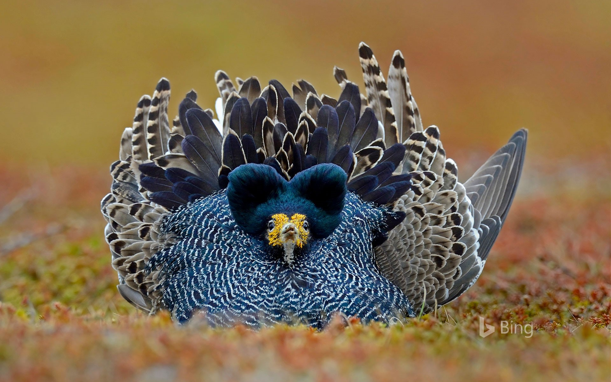
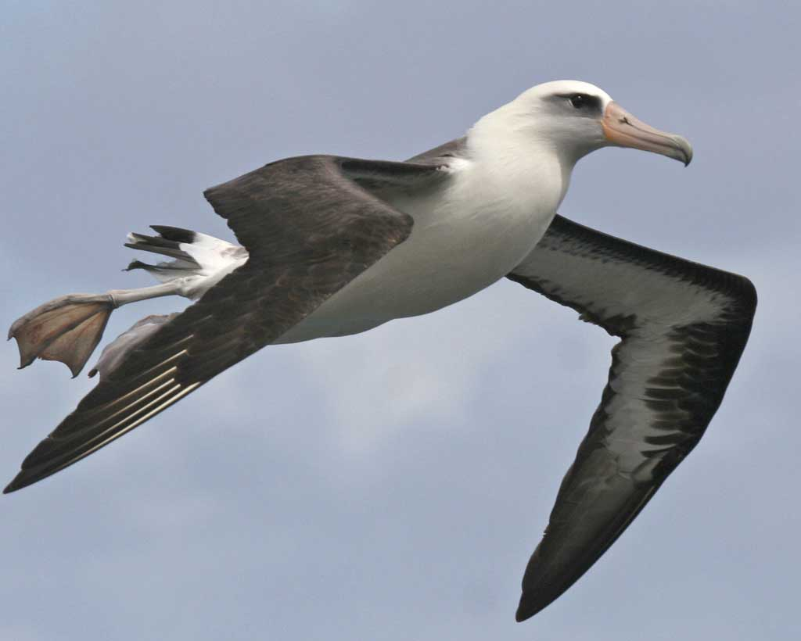
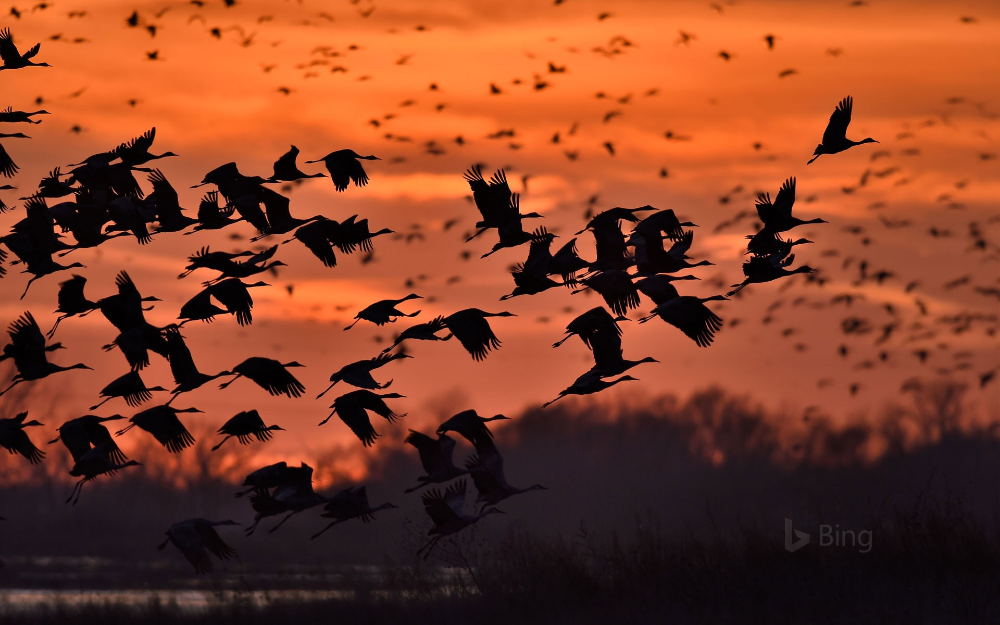
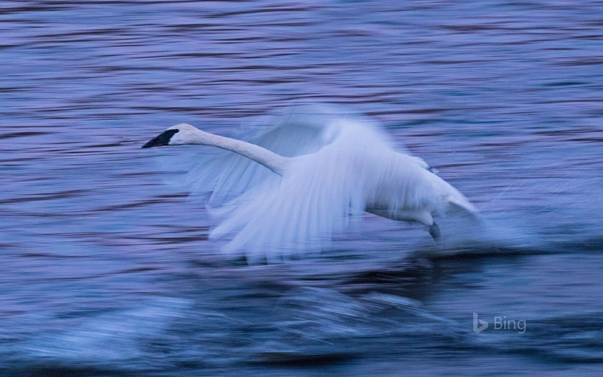
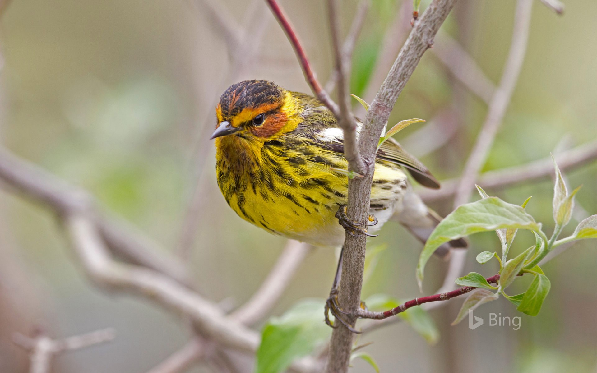
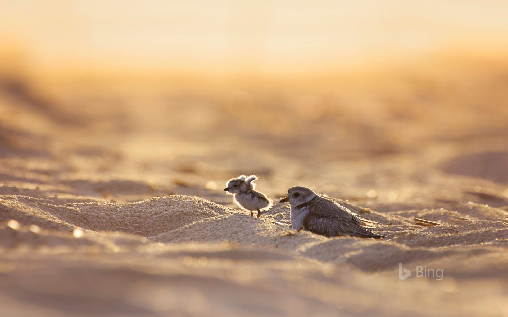

*********************
Biology Terms - Birds
*********************

.. image:: images/feathers.jpg
.. image:: images/plume_types.jpg

.. image:: images/laysan_albatross_chick.jpg

    Laysan Albatross [信天翁]

.. figure:: images/gull.jpeg

    Gull [海鸥]

.. image:: images/black_swan.jpg

    Swan

.. figure:: images/black-crested_titmouse.jpg

    Black-crested titmouse

.. figure:: images/european_goldfinch.jpg

    Red in the face

.. image:: images/magpie_tixi.jpg
.. image:: images/white_strokes.jpg

.. figure:: images/Warbler.jpg

    Warbler/Songbird [黄莺]

.. figure:: images/owl_on_halloween.jpg

    Owl [猫头鹰]

    Piping plover [笛鸻]

.. figure:: images/hummingbird_02.jpg
.. figure:: images/hummingbird.jpg

    A rufous-tailed hummingbird in Costa Rica

   Loon [潜鸟]

.. image:: images/penguin_1570672289.jpg
.. image:: images/sea_bird_flock.jpg
