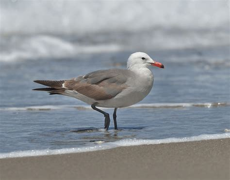
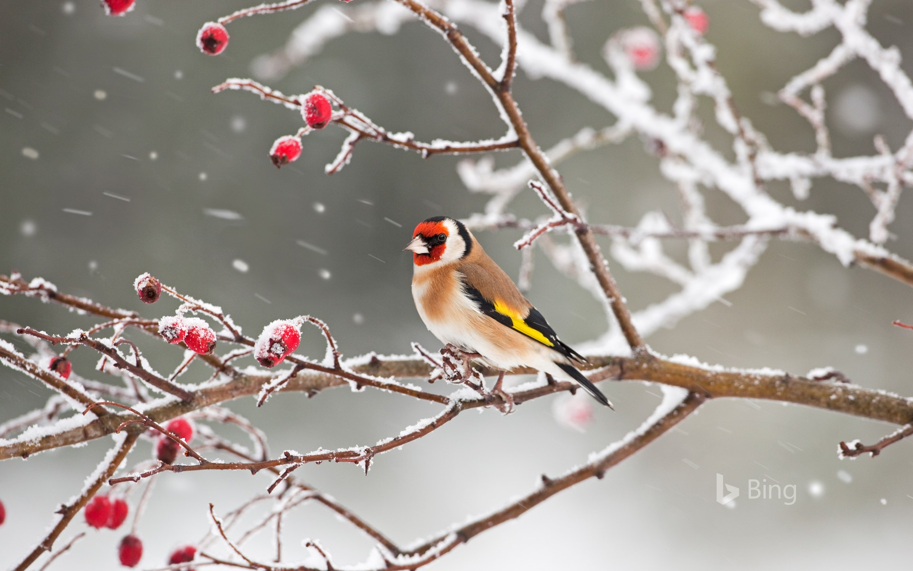

*********************
Biology Terms - Birds
*********************

.. image:: images/ruff_male_displaying.jpg
.. image:: images/feathers.jpg
.. image:: images/plume_types.jpg

.. image:: images/laysan_albatross_chick.jpg
.. figure:: images/Laysan_Albatross.jpg

    Laysan Albatross [信天翁]

    Gull [海鸥]

.. image:: images/cygnus_buccinator_1577490792.jpg
.. image:: images/black_swan.jpg
.. figure:: images/tundra_swan.jpg

    Swan

.. figure:: images/black-crested_titmouse.jpg

    Black-crested titmouse

    Red in the face

.. image:: images/magpie_tixi.jpg

.. image:: images/songbird_in_jersey_wood.jpg
.. figure:: images/Warbler.jpg

    Warbler/Songbird [黄莺]

.. figure:: images/owl_on_halloween.jpg

    Owl [猫头鹰]

.. figure:: images/piping_plover.jpg

    Piping plover [笛鸻]

.. figure:: images/hummingbird_02.jpg
.. figure:: images/hummingbird.jpg

    A rufous-tailed hummingbird in Costa Rica

.. image:: images/southernyellow.jpeg

.. figure:: images/loon_1568887120.jpg

   Loon [潜鸟]

    Woodpecker [啄木鸟]

.. image:: images/gentoo_penguin_1577185016.jpg

.. image:: images/sandhill_crane_take_flight.jpg

