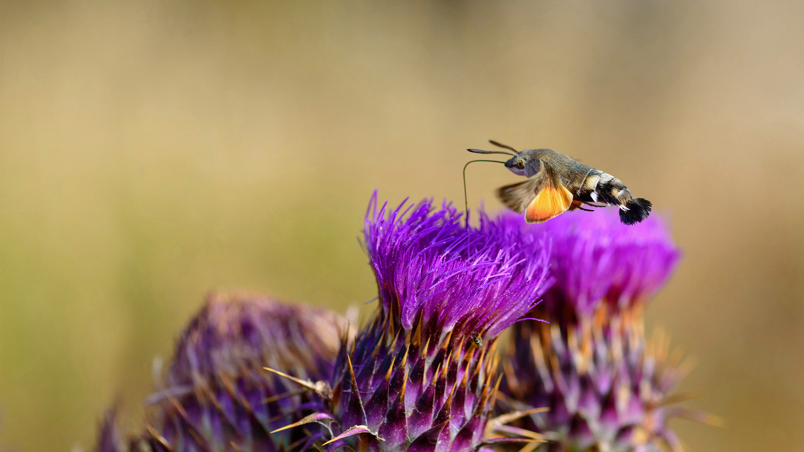
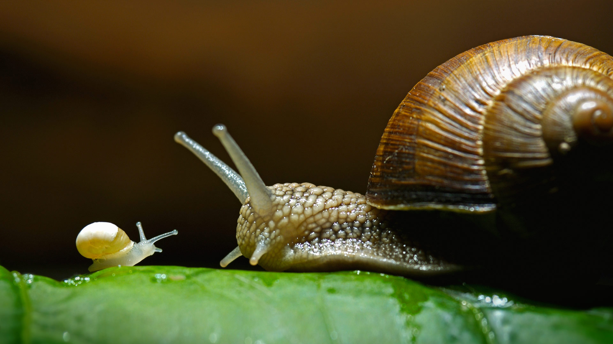
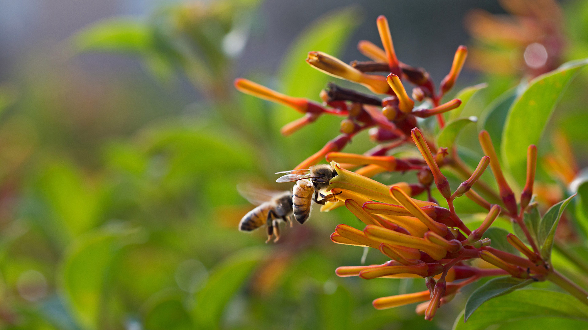
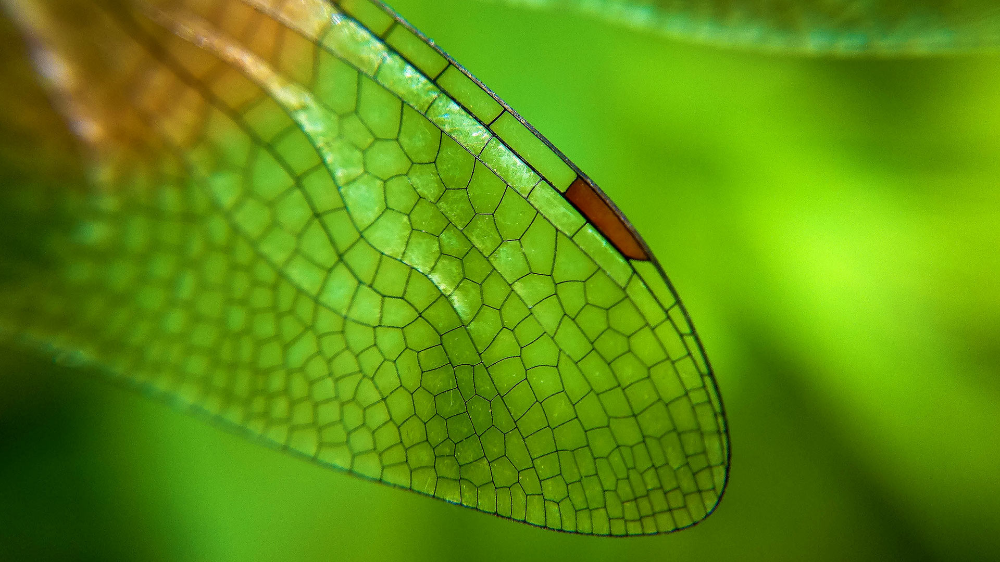

***********************
Biology terms - Insects
***********************

.. figure:: images/rhinoceros_beetle.jpg

    Rhinoceros beetle [独角仙]

.. figure:: images/brown-cockroach.jpg

   Cockroach [蟑螂]

.. figure:: images/scorpion.png

   Scorpion [蝎子]

.. image:: images/life_cycle_of_a_17_year_periodical_cicada.jpg
.. image:: images/cicada-metamorphosis.jpg
.. figure:: images/cicada.png

   Cicada  [知了，蝉]

.. figure:: images/hoverfly.jpg

   Hoverfly [蝇虎]

.. image:: images/honey_bee.jpg
.. figure:: images/wasp.jpg

   wasp [黄蜂]

.. figure:: images/winter_time.jpg

    A Ladybird [七星瓢虫] hibernates in Tewin, England

.. figure:: images/praying_mantis.jpg

    Praying mantis [螳螂] man-eater

