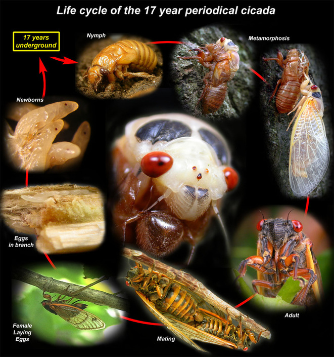
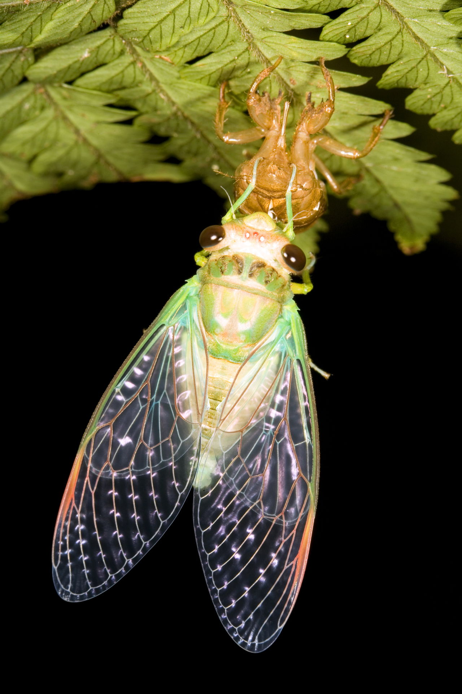
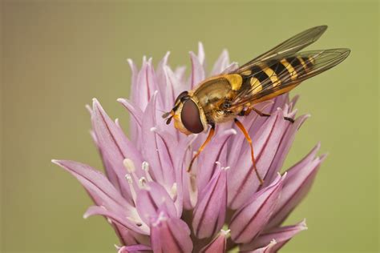
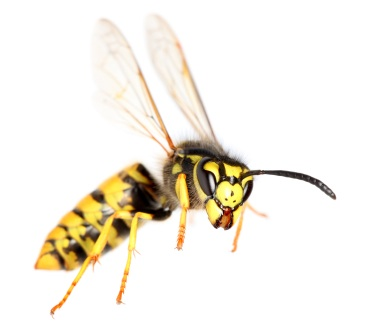

***********************
Biology terms - Insects
***********************

.. figure:: images/rhinoceros_beetle.jpg

    Rhinoceros beetle [独角仙]

.. figure:: images/brown-cockroach.jpg

   Cockroach [蟑螂]

.. figure:: images/scorpion.png

   Scorpion [蝎子]

.. image:: images/burgundy_snail.jpg

.. figure:: images/cicada.png

   Cicada  [知了，蝉]

   Hoverfly [蝇虎]

.. image:: images/honey_bee.jpg

   wasp [黄蜂]

.. figure:: images/winter_time.jpg

    A Ladybird [七星瓢虫] hibernates in Tewin, England

.. figure:: images/praying_mantis.jpg

    Praying mantis [螳螂] man-eater

