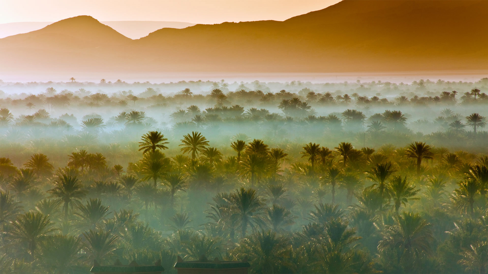
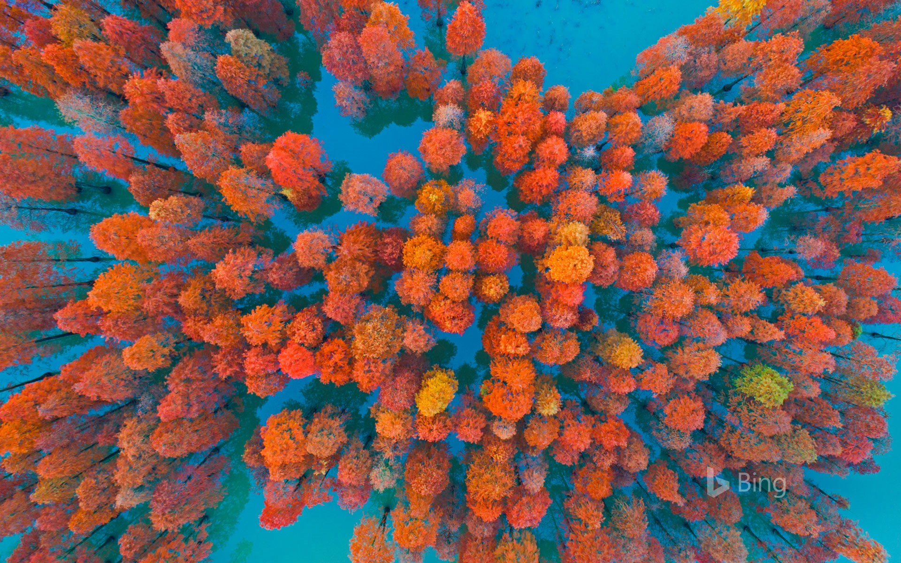
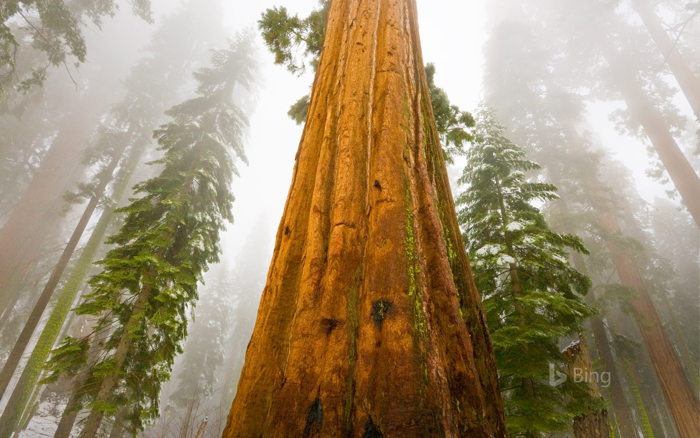
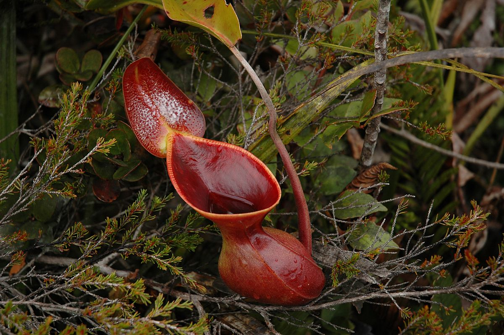
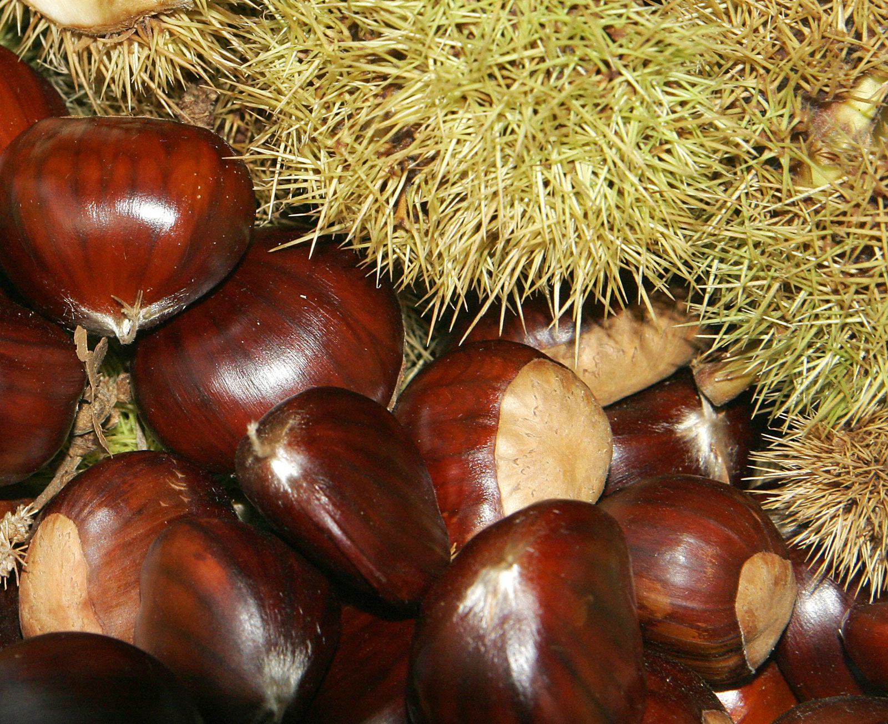
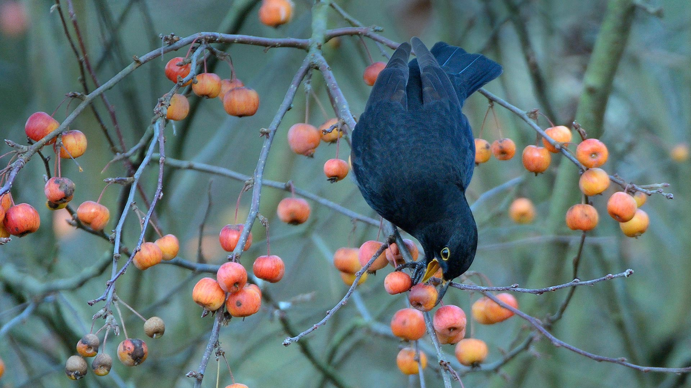
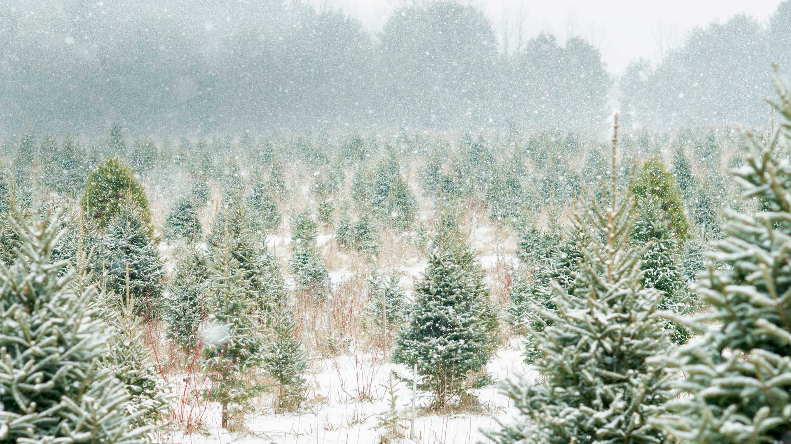

**********************
Biology Terms - Plants
**********************

    Redwood [红树林]

    Sequoia [红杉树]

    Aspen [白杨]

    Pitcher plant [猪笼草]

.. figure:: images/fungi.jpg

    Fungi

.. image:: images/walnut_01.jpg
.. figure:: images/walnut_open_husk.jpg

    Walnut [核桃]

.. figure:: images/Chestnut_02.jpg

    Chestnut [板栗]

.. figure:: images/Petal-sepal.jpg

   Petal [花瓣] and Sepal [花萼]

.. figure:: images/iris_plant.jpg

   Iris [虹膜，鸢尾]

.. figure:: images/narcissus_sneeze_spring_1581380852.jpg

    Crocus flower / Daffodil [水仙花]

    蓝铃花

    Broccoli [西兰花]

    Crab apple [海棠果]

.. figure:: images/cork_tree_forest.jpg

    Cork Tree [软木橡树，一种被剥皮后仍能存活的树]

    Saffron [藏红花]

#. Sequoia National Park

    Sequoia National Park was founded on this day in 1890, and while the park’s 128 years is nothing to sneeze at,
    some trees in the giant sequoia grove had called this home for thousands of years before they were given the
    protection of a national park. The Giant Forest in Sequoia National Park is where **General Sherman,** the largest
    tree in the world, stands. It is estimated to be 2,300 to 2,700 years old—a silent witness to both natural and human
    history. By the time Spanish explorer Vasco Núñez de Balboa ‘found’ the Pacific Ocean in 1513, General Sherman had
    been growing for more than 1,500 years.
