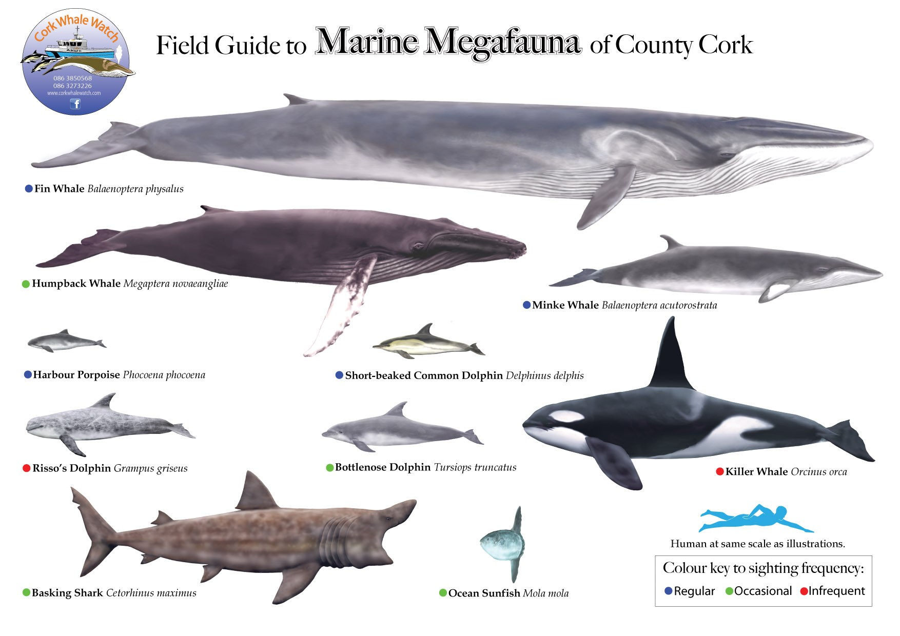
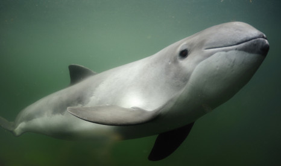
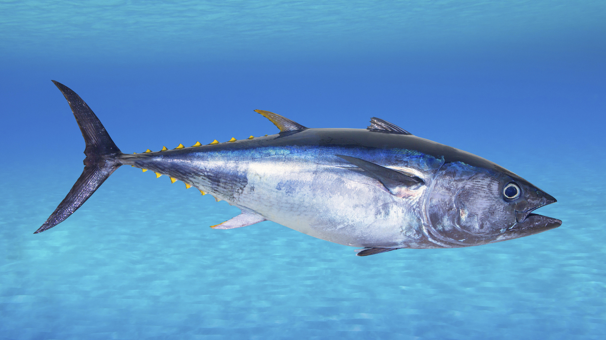

***************************
Biology Terms - Sea Animals
***************************

.. image:: images/green_sea_turtle.jpg
.. image:: images/seal.jpg
.. image:: images/seal_mock_emotion.jpg
.. image:: images/Ceatacean_Drawing.jpg

.. image:: images/whales-of-the-world-laura-row.jpg
.. image:: images/ken-hurd-a-collection-of-whales.jpg
.. image:: images/fin_whale.jpg

    Harbor Porpoise

   
    Tuna [金枪鱼]

.. figure:: images/bonito.jpeg
   
    Bontino
