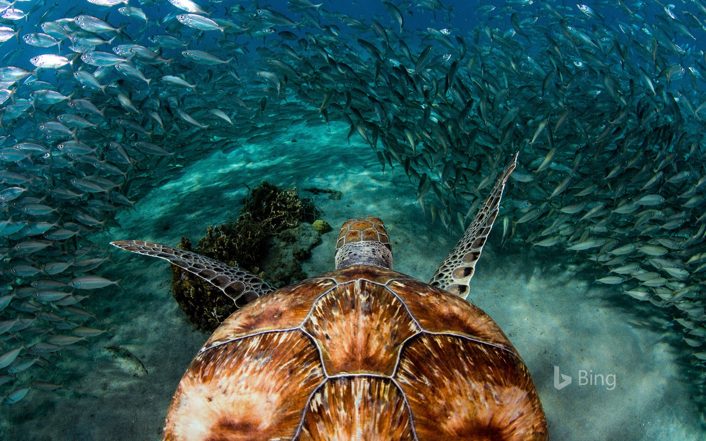
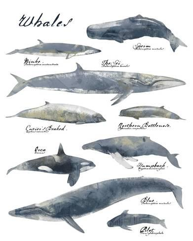

***************************
Biology Terms - Sea Animals
***************************

.. image:: images/giant_tortoise_in_galapagos_island.jpg
.. image:: images/leatherback_sea_turtle.jpg

.. image:: images/seal_1568600334.jpg

.. image:: images/Ceatacean_Drawing.jpg
.. image:: images/marine_megafauna.jpg
.. image:: images/whales-of-the-world-laura-row.jpg

.. image:: images/fin_whale.jpg
.. figure:: images/harbor-porpoise.jpg

    Harbor Porpoise

.. figure:: images/tuna.jpg

    Tuna [金枪鱼]

.. figure:: images/bonito.jpeg

    Bontino

    Walrus [海象]

.. figure:: images/eel.png

    Eel [鳗鱼]

    Given recent weather events in Texas, however,
    it's possible that rought winds and strong currents
    played a part in the animal's demise. The eels do
    occasionally venture into the shallows, so it's hard
    to say for sure.

    Octopus [章鱼]
