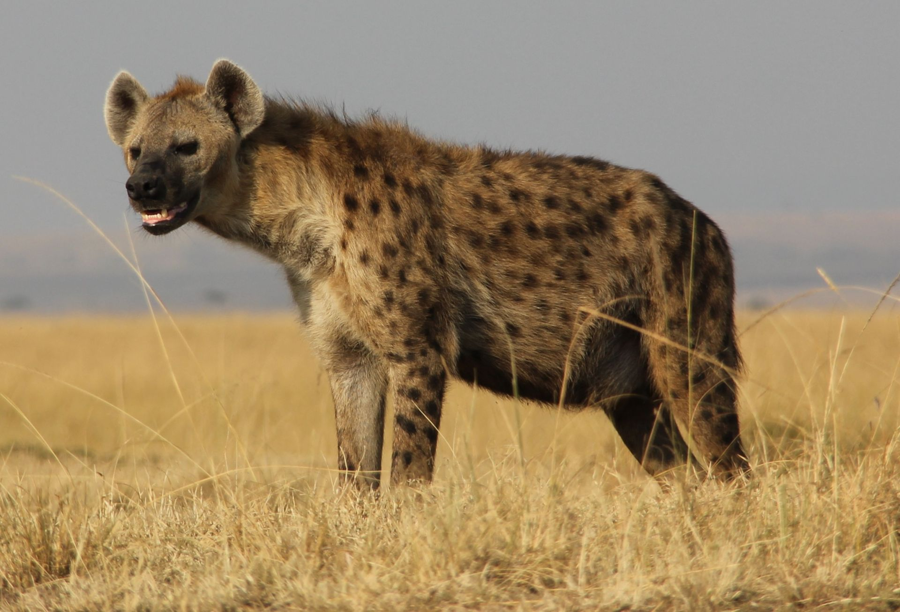
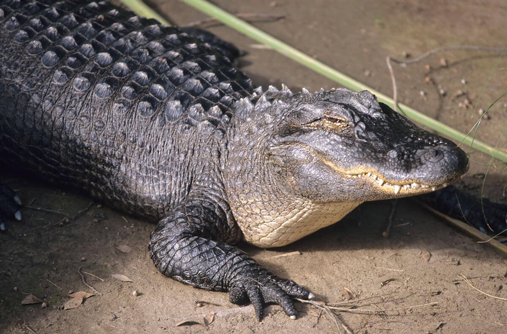

Biology Terms
=============

| womb
| Definition: the organ in the lower body of a woman or femal mammal where offsprings are conceived and in which they gestate before birth.
| Synonyms: uterus
| 
| vagina
| Definition: the muscular tube leading from the external genitals to the cervix of uterus in women and most female mammals.
| Synonyms: pussy [阴道]
| Definition: any sheathlike structure, especially a sheath formed around a stem by the base of a leaf.
| 
| genital 
| Synonyms: dick [阴茎]
| cum [高潮]
| precum, pre-seminal fluid [男性性生活时阴茎的分泌物]
| semen [精液]
| Definition: the male reproductive fluid, containing spermatozoa in suspension.
| Vaginal sex 性交
| Anal sex 肛交
| Oral sex 口交
| blood bank 血库
|
| masochist
| masochism
| Definition: the tendency to derive pleasure, especially sexual gratification, from one’s own pain or humiliation.
| Definition: (in general use) the enjoyment of what appears to be painful or tiresome.
| Usage: Isn’t there some masochism involved in taking on this kind of project?
| 
| sadist
| sadism
| Definition: the tendecy to deprive pleasure, especially sexual gratification, from inflicting pain, suffering, or humiliation on others.
| Usage: (in general use) deliberate cruelty.
|  
| sadomasochism
| sadomasochist
| Definition: psychological tendency or sexual practice characterized by both sadism and masochism.
|
| castrate
| castrator
| castration [去势，阉割]
| Definition: remove the testicles of (a male animal or man). 
| Definition: deprived of power, vitality, or vigor.
| Usage: The nation is a castrated giant, afraid to really to punish subversives.
| 
| masturbate
| masturbation [手淫，自慰]
| Definition: stimulate one’s own genitals for sexual pleasure.
| 
| orgasm [性高潮]
| Definition: a climax of sexual excitement, characterized by feeling of pleasure centered in the genitals and (in men) experienced as an accompaniment to ejaculation.
|
| hectic
| hectically
| Definition: (medicine) relating to, affected by, or denoting a regularly recurrent fever typically accompanying tuberculosis(肺炎), with flushed cheeks and hot, | dry skin. [潮红]
| Definition: full of incessant or frantic activity; busy; tight.
| Usage: A hectic business schedule.
| 
| fetal
| foetal
| fetus
| Definition: an unborn offspring of a mammal, in particular an unborn human baby more than eight weeks after conception.
| 
| somatic
| Definition: relating to the body, especially as distinct from the mind.
| Usage: somatic cell [体细胞].
| 
| impregnate
| Definition: When a man or a male animal impregnates a female, he makes her pregnant.
| Usage: For centuries, war entailed killing men and raping and impregnating the surriviving women.
| Definition: If someone or something impregnate a thing with substance, they make the substance spread through it and stay in it.
| Usage: Undercover officers found drug-making equipment used to impregnate paper with LSD.
| 
| pregnant
| Definition: If a woman or femal is pregnant, she has a baby, she has a baby or babies developing in her body.
| Usage: Tina was pregnant with their first daughter.
| Definition: A pregnant silence or moment has a special meaning which is not obvious but which people are aware of.
| Usage: A deceptive peace, pregnant with invisible threats.
| 
| froth
| Definition: rise or overflow in a soft, light mass.
| Definition: She wore an ivory silk blouse, frothing at nect and cuffs.
| Definition: form or contain a rising or overflowing mass of small bubbles; foam [啤酒沫]
| Usage: He took a quick quick sip of beer as it frothed out of the can.
| 
| ravage
| Definition: casue severe and extensive damage to.
| Usage: Fears that a war could ravage their country. [蹂躏，摧残]
| Definition: the severely damaging or destructive effects of something.
| Usage: His face had withstood the ravages of time.
| 
| cucumber [黄瓜]
| serine [丝氨酸]
| asparagine [天冬氨酸]
| Definition: Asparagine is an amino acid [氨基酸] - a building block of protein - and takes its name from asparagus. [天冬，芦笋]
|

.. figure:: images/asparagus.png

   Asparagus

| endocrap
| Definition: the innermost layer of the pericarp that surrounds a seed in a fruite, it may be membranous (as in apples) or woody (as in the stone of a peach or cherry or plum [李子])
| 
| harem [后宫]
| Definition: (in former times) the separate part of a Muslim household reserved for wives, concubines, and femal servants.
| Definition: a group of female animals sharing a single mate.
| Definition: a group of women preceived as centering around a particular man.
| Usage: Rich men with their extensive harems of buxom blondes.
| 
| buxom
| Definition: (of women) plump, especially with large breasts.
| 
| concubinary
| concubine [妾]
| Definition: (in polygamous societies) a woman who lives with a man but has lower status than his wife.
| 
| polygamy
| polygamist
| polygamous [非一夫一妻制]
| Definition: the practice or custom of having more than one wife or husband at the same time.
| Definition: (Zoology) a pattern of mating in which an animal has more than one mate.
| Definition: (Botany) the condition of bearing some male, some female, and sometimes some perfect flowers on the same plant.
| 
| sinew
| Definition: A piece of tough fibrous tissue uniting muscle to bone or bone to bone; a tendon or ligament. [韧带]
| Definition: The parts of a structure, system, or thing that give it strength or bind it together.
| Usage: The sinews of government.
|
| fungus  
| Plural: fungi [真菌]
| 
| mass extinction event [大灭绝事件]
| asteroid 
| crater
| Definition: A crater is a large hole, which has been caused by something hitting it or by an explosion.
| 
| gustation [味觉]
| Definition: The faculty of distinguishing sweet, sour, bitter or salty properties in the mouth.
| 
| ego
| egoism
| Definition: (psychology) the part of the mind that responsible for your sense of your identity). [自我]
| Definition: a person’s sense of self-esteem or self-importance.
| Usage: Winning the prize really boosted her ego. [自信，自我认同]
| Usage: He had the biggest ego of anyone I’ve ever met. [自负]
| Usage: My ego and my pride have alway been my Achilles heel.
| egotist
| Definition: a person who is excessively conceited or self-absorbed; self-seeker.
| Usage: He is a self-absorbed egotist.
|
| conceited [虚荣]
| Definition: excessively proud of oneself; vain.
| 
| superego
| Definition: the part of a person’s mind that acts as a self-critical conscience, reflecting social standars learned from parents and teachers. [like super() | in Java??]
| 
| proliferation
| Definition:rapid increase in numbers.
| Definition: rapid reproduction of a cell, part or organism.
| Usage: We attempted to measure cell proliferation.
| 
| heterogeneous homogeneous
| 
| cortex
| Definition:  (anatomy) the outer layer of an organ in the body, especially the brain.
| Usage: The cerebral cortex(大腦皮層).
|
| coronary 冠狀動脈
| 
| Forensic 法醫
| Definition: relating to or denoting the application of scientific methods and techniques to the investigation of crime.
| Usage: Forensic evidence.
|
| krait 环蛇
| corba 眼镜蛇
| viper 蝮蛇
| rattlesnake 响尾蛇
| gopher 囊地鼠
| scorpion 蝎子

.. image:: images/scorpion.png

| cicada  [知了，蝉]

.. image:: images/cicada.png

| decomposition
| Definition: Decomposition is the process of decay when a living thing changes chemically after dying.
| 
| 
| pollen [花粉]
| pollinate
| pollination [传粉]
| Definition: to pollinate a plant or tree means to fertilize it with pollen. this is often done by insects.
| Usage: Without sufficient pollination, the growth of the corn is stunted.
| 
| hoverfly
| Definition: many hoverflies have strips and resemble bees and wasps.

.. figure:: images/hoverfly.jpg
   
   hoverfly

.. figure:: images/wasp.jpg

   wasp

New clues to decline to of bees and other pollinators.

they provide ecosystem service s indluding pollination and for some spieces, biological control of crop pests.

It remains to be seen how the virus may affect the ability to hoverflies to undergo a strenuous long-distance mirgation or how long the virus may persist in their bodies given no virus replication was detected.

| pigment [色素]
| Definition: A pigment is a substance that gives something a particular color.
| Usage: The brown pigment in the skin.
| 
| soot [炭灰]
| Definition: Soot is black powder which rises in the somke from a fire and collects on the inside of chimneys.
| Usage: A wall blackened by soot.
| 
| motify
| Definition: A motif is a theme or idea that is frequently repeated throughout a piece of literature or music.
| Usage: The motif of these volume is that 'solitude is the richness of the soul, loneliness is its poverty.'
| Definition: A motif is a desigh which is used as a decoration or as part of an artistic pattern.
| 
| cockroach [蟑螂]
| Definition: A cockroach is a large brown insect that is sometimes found in warm places or where food is kept.

.. figure:: images/brown-cockroach.jpg

   cockroach

hemorrhoid 痔疮

finch

dove

pigeon

tit

| pox 流感
| smallpox 天花
| chickenpox 禽流感
| Definition: People sometimes refer to the diseases syphilis as the pox.
| 
| get on someones's tits
| Definition: irritate someone intensely.
| 
| tits and ass
| Definition: used in reference to the use of crudely sexual image of women.
| 
| plumage
| Definition: A bird's plumage is all the feathers on its body.
| 
| regurgitate
| regurgitation [反刍喂食]
| Definition: bring (swallowed food) up again to the mouth.
| Usage: Gulls regurgitate food for the chicks.
| Definition: repeat (information) without analysing or comprehending it.

.. figure:: images/penguin_regurgitation.jpg

   Penguin regurgitation

.. figure:: images/gull.jpeg

   Gull 

Given recent weather events in Texas, however, it's possible that rought winds and strong currents played a part
in the animal's demise. The eels do occasionally venture into the shallows, so it's hard to say for sure.

.. figure:: images/eel.png

   eel

| demise
| Definition: an animal's death.
| Definition: the end or failure of an enterprise or institution.

   Hyena 鬣狗

.. figure:: images/nile-crocodile.jpg

   crocodile 尼罗鳄

   Alligator 短吻鳄

.. figure:: images/rhino.jpg

   rhinoceros

.. figure:: images/spotted-house-gecko.jpg

   Gecko 壁虎

.. figure:: images/chameleon.jpg

   Chameleon 变色龙

| chammeleon
| Definition: a person who changes their opinions or behavior according to the situation. [墙头草]
|
| hock
| Definition: A hock is a piece of meat from above the foot of an animal, especially a pig.
| Definition: The hock of an animal, especially a horse, is the joint in its back leg that points backwards.

.. image:: images/pork-cut-diagram.jpg

.. image:: images/horse_hock-knee.jpg

| collagen [胶原蛋白]
| Definition: the main structural protein found in animal connective tissue, yielding gelatin when boiled.
| 
| rib
| Definition: your ribs are the 12 pairs of curved bones that surrond your chest. [肋骨]
| Definition: a rib of meat such as beef or pork is a piece that has been cut to include one of the animal's ribs.

She was so badly malformed as to be unable to feed.
In her condition, she would have end up in neonatal :abbr:`ICU (Intensive Care Unit)`.

| 
| neonatal
| neonatology
| neonatologist
| Definition: relating to newborn children (or other animals).
| Usage: Special attention is given to mortality in the neonatal period.
|
| poikilotherm
| poikilothermic [冷血动物]
| Definition: an organism that cannot regulate its body temperature except by behavioral means such as basking or burrowing.
| Often contrasted with homeotherm; compare with cold-blooded.
| Synonyms: cold-blooded.
| Antonyms: homeotherm [恒温动物]
| 
| stasis
| Definition: a period or state of inactivity or equilibrium.
| Definition: (Medicine) a stoppage of flow of a body fluid.
| 
| imprint
| Definition: (of a young animal) come to recognize (another animal, person, or thing) as a parent or other object of habitual trust. [印随]

| 
| chimera
| Definition: (in Greek mythology) a fire-breathing femal monster with a lion's head, a goat's body, and a serpent's tail.
| Definition: any mythical animal with parts taken from various animals.
| Definition: a thing that is hoped or wished for but in fact is illusory or impossible to achieve.
| Usage: THe economic sovereignty you claim to defend is a chimera.
| Definition: (Biology) an organism containing a mixture of genetically different tissues, formed by a processes such as fusion of early embryos, grafting, or mutation.
| Definition: A DNA molecule with sequences derived from two or more different organisms, formed by laboratory manipulation.
| 

| omnivore [杂食动物]
| Definition: an animal or person that eats food of both plant and animal origin.
| 
| medication
| Definition: a substance used for medicial treatment, especially a medicine or drug.
| Usage: He'd been taking medication for depression.
| Definition: treatment using drugs. [药物治疗]
| Usage: Chronic gastrointestinal symptoms which may require prolonged medication. [慢性胃炎]
| 
| gastrointestinal
| Definiton: realting to the stomach and intestines. [肠胃]
| 
| migraine [偏头痛]
| Definition: a recurrent throbbing headache that typically affects one side of the head and is often accompanied by nausea and disturbed vision.
| Usage: The FDA just approved a new preventative migraine treatment

| saliva [唾液]
| Definition: watery liquid secreted into the mouth by glands, providing lubrication for chewing and swallowing, and aiding digestion.
| Usage: Getting spit on is unpleasant and messy, but not a danger as far as catching HIV.
| 
| gland [腺体]
| Definition: an organ in the human or animal body that secretes particular chemical substances for use in the body or for discharge into the surroundings.
| Usage: the thyroid gland. [甲状腺]
| 
| viviparous
| Definition: (of an animal) bringing forth live young that have developed inside the body of the parent. [胎生]Compare with oviparous and ovoviviparous.
| Definition: Botany (of a plant) reproducing from buds that form plantlets while still attached to the parent plant, or from seeds that germinate within the fruit.
| 
| oviparous
| Definition: (of a bird, etc.) producing young by means of eggs that are hatched after they have been laid by the parent. [卵生]
| 
| ovoviviparous
| Definition: (of an animal) producing young by means of eggs that are hatched within the body of the parent, as in some snakes. [卵胎生]

.. image:: images/dolphin_baby.jpg
.. image:: images/chick.jpg
.. image:: images/american_reptiles.jpg

| phosphorescent
| phosphorescence
| Definition: light emitted by a substance without combustion or perceptible heat. [荧光]
| Usage: the stones overhead gleamed with phosphorescence.
| Physics the emission of radiation in a similar manner to fluorescence but on a longer timescale, so that emission continues after excitation ceases.
| 
| fluorescence 
| Definition: the visible or invisible radiation emitted by certain substances as a result of incident radiation of a shorter wavelength such as X-rays or ultraviolet light.

.. image:: images/fluorescence.jpeg
.. image:: images/phorsphorescence_1.jpg
.. image:: images/phorsphorescence_2.jpg
.. image:: images/phorsphorescence_3.jpg
.. image:: images/phorsphorescence_4.jpg

.. figure:: images/Warbler.jpg

   Warbler [黄莺]

.. figure:: images/elk.jpg

   Elk [麋鹿]

.. figure:: images/hare.jpg

   Hare [野兔]

.. figure:: images/tuna.jpg
   
   Tuan [金枪鱼]

.. figure:: images/bonito.jpeg
   
   Bontino

.. figure:: images/harbor-porpoise.jpg

   Harbor Porpoise

+----------------------------------+----------------------------------+
| .. image:: images/lavender_1.jpg | .. image:: images/lavender_2.jpg |
+----------------------------------+----------------------------------+

+--------------------------------+-------------------------------------+
| .. image:: images/stallion.jpg | .. image:: images/mare-and-foal.jpg |
+--------------------------------+-------------------------------------+

.. figure:: images/steer.jpg
   
   Steer [肉用牛]

.. figure:: images/shark_gill.jpeg

   Gill 腮

   The paired respiratory organ of fishes and some amphibians, 
   by which oxygen is extracted from water flowing over surfaces 
   within or attached to the walls of the pharynx.

.. image:: images/paramecium-diagram-detailed.jpg
.. image:: images/paramecium_1.jpg
.. figure:: images/Paramecium-Teilung.jpg

   Paramecium [草履虫]
