************
Nature Lifes
************

| peg
| Definition: a short cylindrical piece of wood, metal, or plastic, typically tapered at one end, 
| that is used for holding things together, hanging things on, or marking a position.
| Definition: drape individual plants with nets, pegging down the edges.
| Usage: I have otoya-kun pegged down as a herbivore.
| Phrase: a peg to hang a matter on
| Definition: something used as a pretext or occasion for the discussion or treatment of a wider subject.
| Phrase: a square peg in a round hole
| Definition: a person in a situation unsuited to their abilities or character.
| Phrase: take someone down a peg or two
| Definition: make someone realize that they are less talented or important than they think are.
| 
| herbivore
| Definition: an animal that feeds on plants
| 
| viviparous
| Definition: (of an animal) bringing forth live young that have developed inside the body of the parent. [胎生]Compare with oviparous and ovoviviparous.
| Definition: Botany (of a plant) reproducing from buds that form plantlets while still attached to the parent plant, or from seeds that germinate within the fruit.
| 
| oviparous
| Definition: (of a bird, etc.) producing young by means of eggs that are hatched after they have been laid by the parent. [卵生]
| 
| ovoviviparous
| Definition: (of an animal) producing young by means of eggs that are hatched within the body of the parent, as in some snakes. [卵胎生]

.. image:: images/dolphin_baby.jpg
.. image:: images/chick.jpg
.. image:: images/american_reptiles.jpg

| phosphorescent
| phosphorescence
| Definition: light emitted by a substance without combustion or perceptible heat. [荧光]
| Usage: the stones overhead gleamed with phosphorescence.
| Physics the emission of radiation in a similar manner to fluorescence but on a longer timescale, so that emission continues after excitation ceases.
| 
| fluorescence 
| Definition: the visible or invisible radiation emitted by certain substances as a result of incident radiation of a shorter wavelength such as X-rays or ultraviolet light.

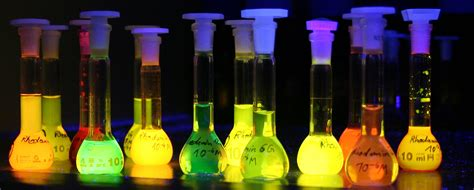
.. image:: images/phorsphorescence_1.jpg
.. image:: images/phorsphorescence_2.jpg
.. image:: images/phorsphorescence_3.jpg
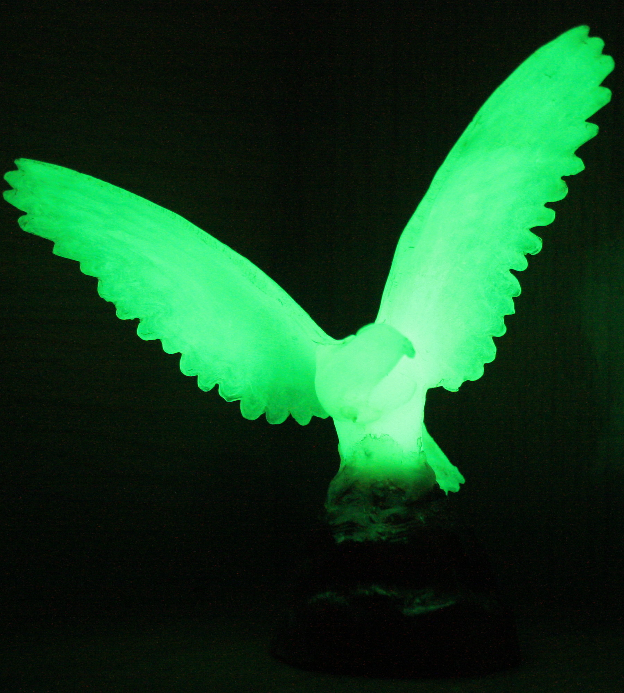

.. figure:: images/Warbler.jpg

   Warbler [黄莺]

.. figure:: images/elk.jpg

   Elk [麋鹿]

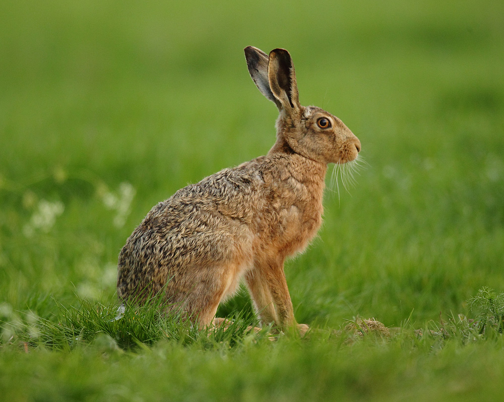

   Hare [野兔]

.. figure:: images/tuna.jpg
   
   Tuan [金枪鱼]

.. figure:: images/bonito.jpeg
   
   Bontino

.. figure:: images/harbor-porpoise.jpg

   Harbor Porpoise

+----------------------------------+----------------------------------+
| .. image:: images/lavender_1.jpg | .. image:: images/lavender_2.jpg |
+----------------------------------+----------------------------------+

+--------------------------------+-------------------------------------+
| .. image:: images/stallion.jpg | .. image:: images/mare-and-foal.jpg |
+--------------------------------+-------------------------------------+

.. figure:: images/steer.jpg
   
   Steer [肉用牛]

.. figure:: images/shark_gill.jpeg

   Gill [腮]

   The paired respiratory organ of fishes and some amphibians, 
   by which oxygen is extracted from water flowing over surfaces 
   within or attached to the walls of the pharynx.

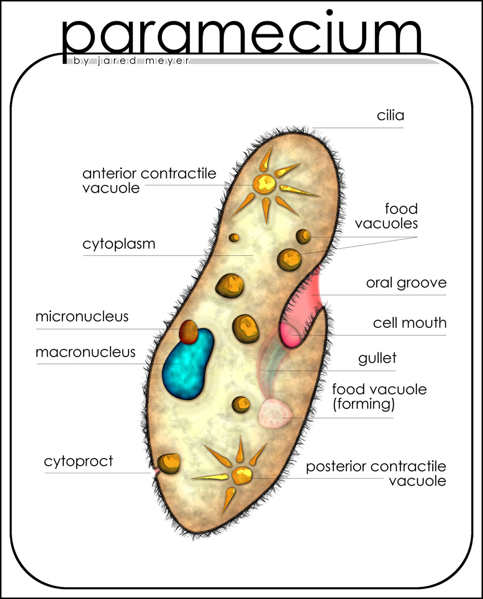
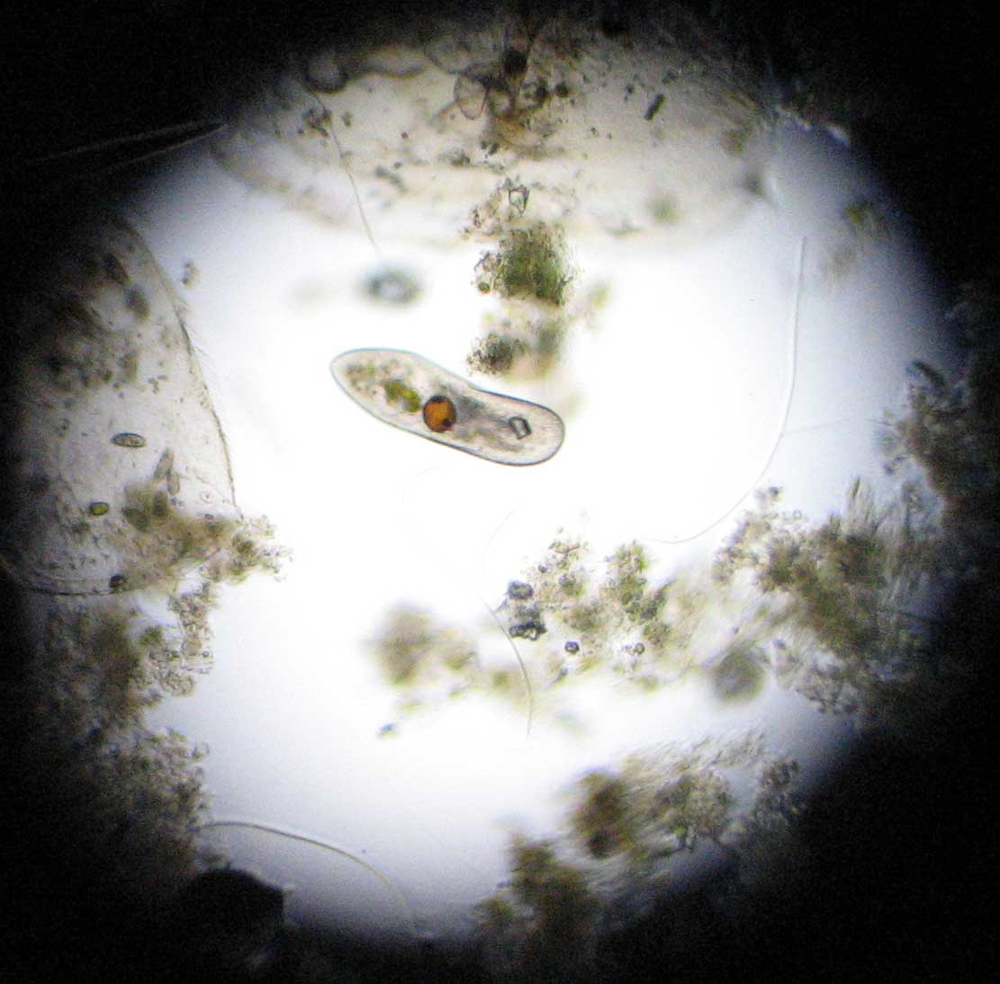
.. figure:: images/Paramecium-Teilung.jpg

   Paramecium [草履虫]

.. figure:: images/giant_sequoia.jpg

   Sequoia [红杉树]
   
   Sequoia National Park was founded on this day in 1890, and while the park’s 128 years is nothing to sneeze at, 
   some trees in the giant sequoia grove had called this home for thousands of years before they were given the 
   protection of a national park. The Giant Forest in Sequoia National Park is where **General Sherman,** the largest 
   tree in the world, stands. It is estimated to be 2,300 to 2,700 years old—a silent witness to both natural and human 
   history. By the time Spanish explorer Vasco Núñez de Balboa ‘found’ the Pacific Ocean in 1513, General Sherman had 
   been growing for more than 1,500 years.

.. figure:: images/spotted-hyena-kenya.jpg

   Hyena [鬣狗]

.. figure:: images/nile-crocodile.jpg

   crocodile [尼罗鳄]

.. figure:: images/alligator_american.jpg

   Alligator [短吻鳄]

.. figure:: images/rhino.jpg

   rhinoceros

.. figure:: images/spotted-house-gecko.jpg

   Gecko [壁虎]

.. figure:: images/chameleon.jpg

   Chameleon [变色龙]

   A person who changes their opinions 
   or behavior according to the situation. [墙头草]

| krait 环蛇
| corba 眼镜蛇
| viper 蝮蛇
| rattlesnake 响尾蛇
| gopher 囊地鼠
|
| hock
| Definition: A hock is a piece of meat from above the foot of an animal, especially a pig.
| Definition: The hock of an animal, especially a horse, is the joint in its back leg that points backwards.

.. image:: images/pork-cut-diagram.jpg
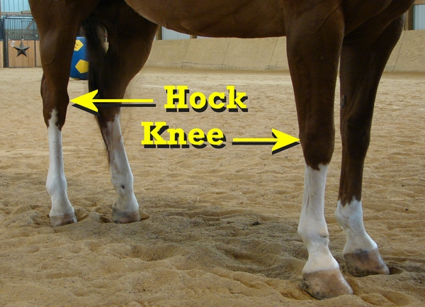

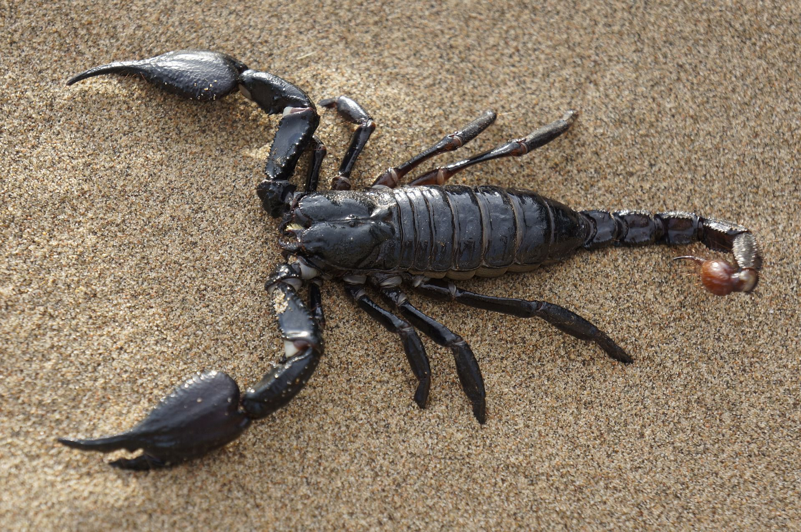

   Scorpion 蝎子

.. figure:: images/cicada.png

   Cicada  [知了，蝉]

.. figure:: images/hoverfly.jpg
   
   Hoverfly [蝇虎]

.. figure:: images/wasp.jpg

   wasp [黄蜂]

.. figure:: images/gull.jpeg

   Gull [海鸥]

.. figure:: images/eel.png

   Eel [鳗鱼]

   Given recent weather events in Texas, however, 
   it's possible that rought winds and strong currents 
   played a part in the animal's demise. The eels do 
   occasionally venture into the shallows, so it's hard 
   to say for sure.

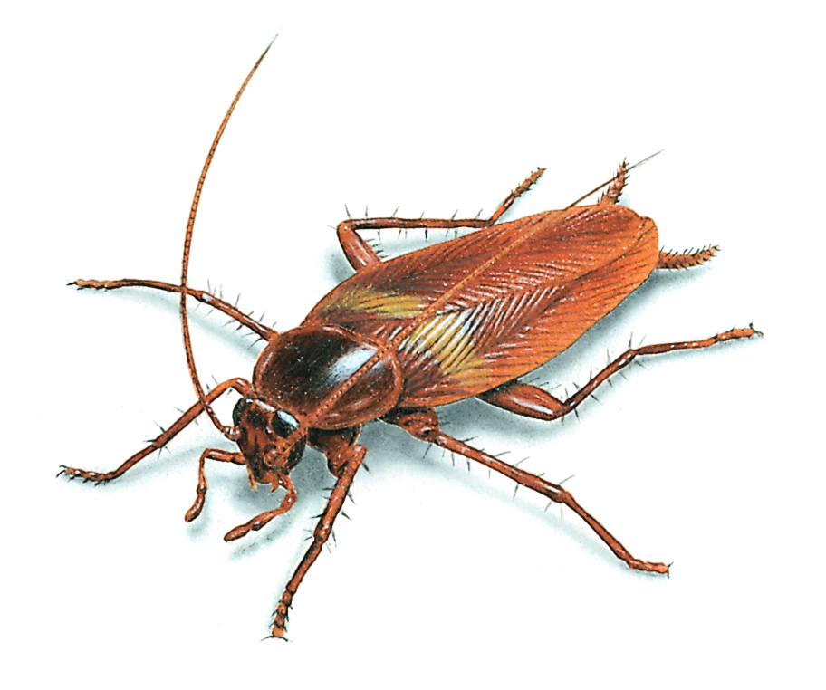

   Cockroach [蟑螂] 

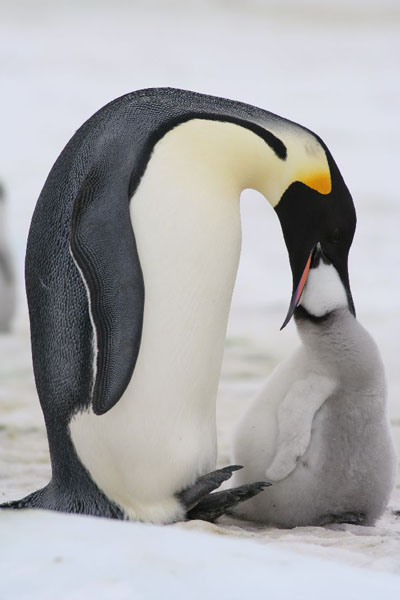

   Penguin regurgitation [反刍喂食]

.. figure:: images/skunk.jpg

   Skunk [美洲臭鼬]

.. figure:: images/wolverine-walking.jpg

   Wolverine [狼獾，金刚狼]

.. figure:: images/buffalo.jpg

   Buffalo

.. figure:: images/redwood.jpg

   Redwood [红树林]

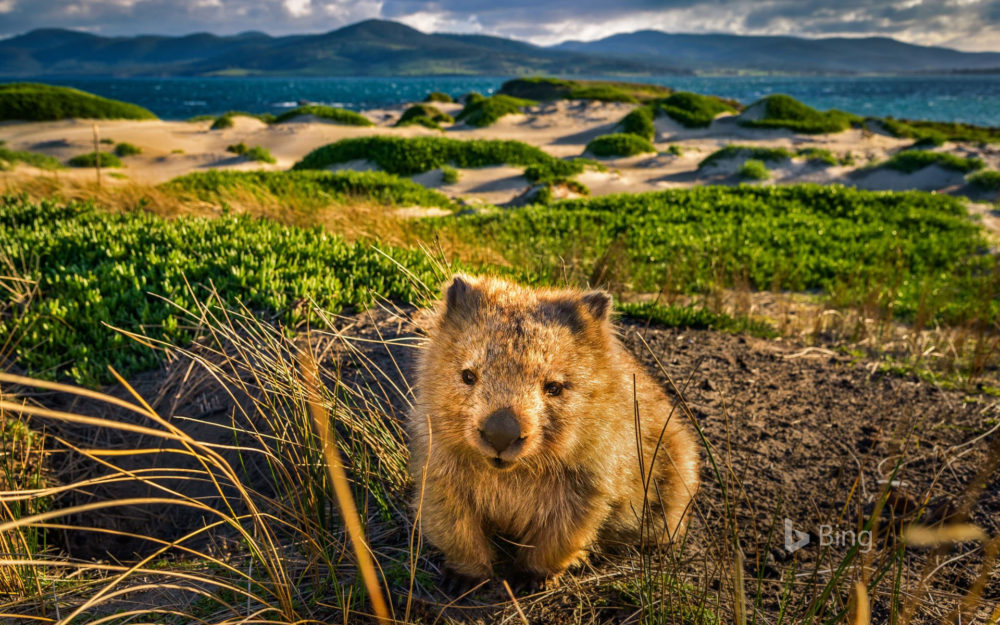

   Wombat [袋熊]

.. figure:: images/CommonPipistrelle.jpg

   Pipistrelle bat

   a small insectivorous Old World bat with jerky, erratic flight.

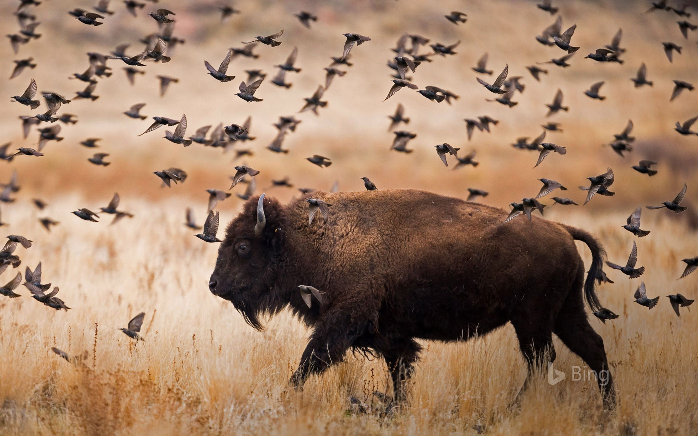

   Bison day 11-03

   Fungi

.. image:: images/black_swan.jpg
.. figure:: images/tundra_swan.jpg

   Swan

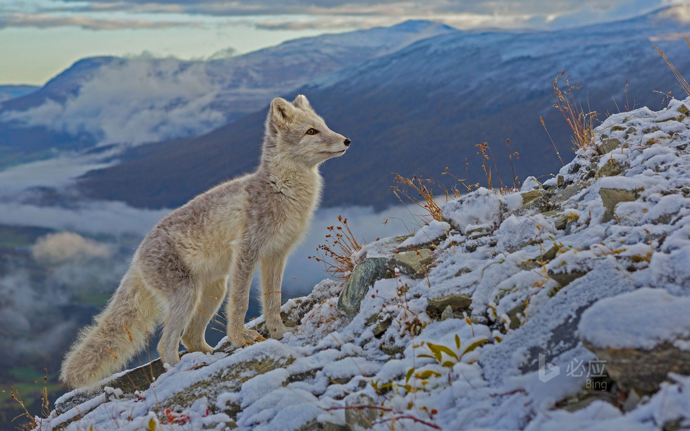

.. image:: images/walnut_01.jpg
.. figure:: images/walnut_open_husk.jpg

   Walnut [核桃]

.. image:: images/Chestnut_01.jpg

   Chestnut [板栗]

#. taxonomy
   
   Taxonomy is the science of defining groups of biological organisms 
   on the basis of shared characteristics and giving names to those groups. 
   Organisms are grouped together into taxa (singular: taxon) and these groups 
   are given a taxonomic rank; groups of a given rank can be aggregated 
   to form a super group of higher rank, thus creating a taxonomic hierarchy.

#. Biosimilar 
   
   Biosimilars also known as follow-on biologics are biologic medical products 
   whose active drug substance is made by a living organism or derived from 
   a living organism by means of recombinant DNA or controlled gene expression 
   methods.