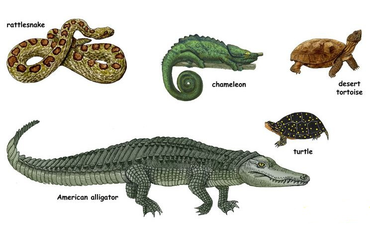
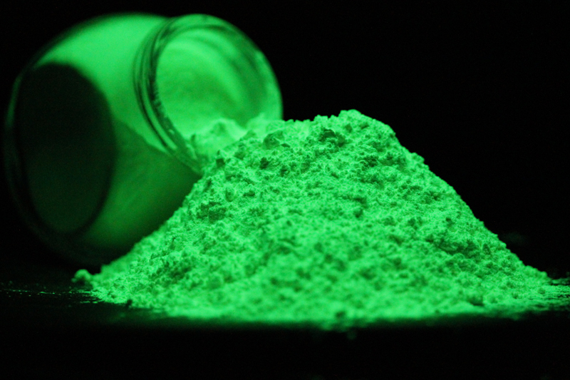
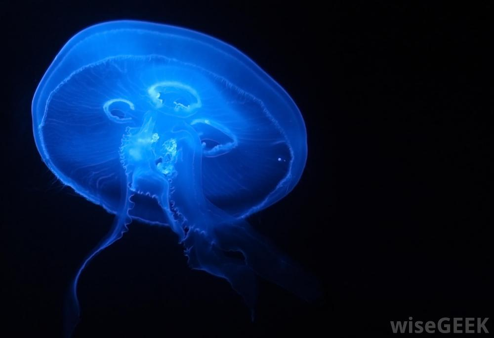
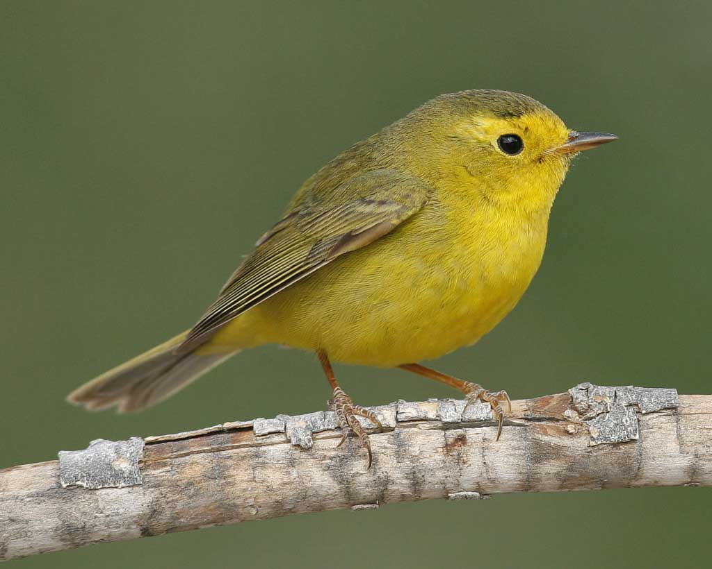
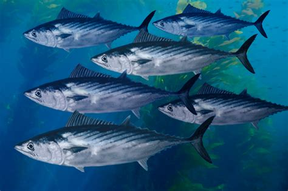
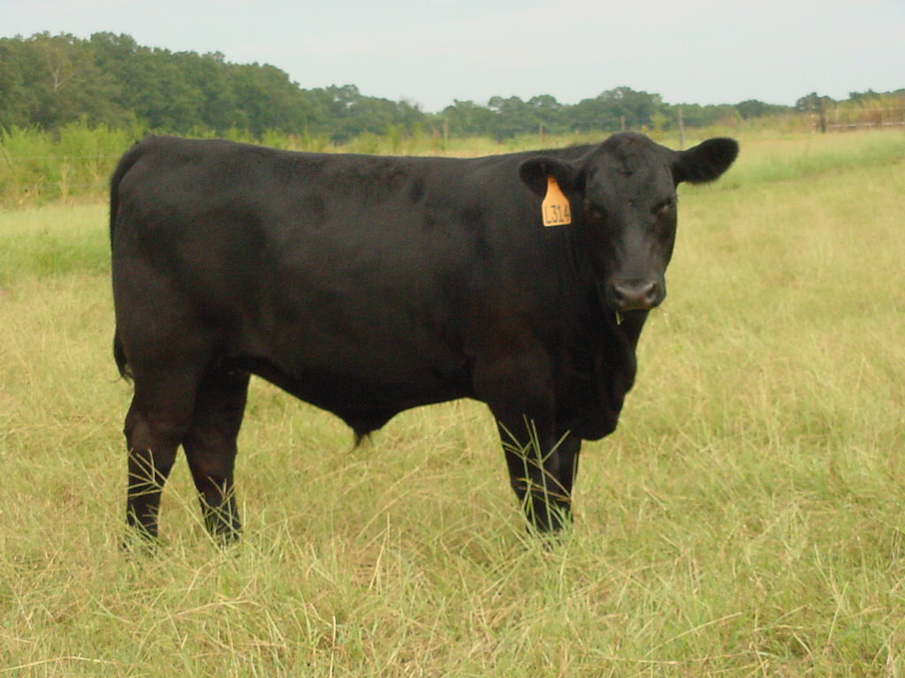

************
Nature Lifes
************

| viviparous
| Definition: (of an animal) bringing forth live young that have developed inside the body of the parent. [胎生]Compare with oviparous and ovoviviparous.
| Definition: Botany (of a plant) reproducing from buds that form plantlets while still attached to the parent plant, or from seeds that germinate within the fruit.
| 
| oviparous
| Definition: (of a bird, etc.) producing young by means of eggs that are hatched after they have been laid by the parent. [卵生]
| 
| ovoviviparous
| Definition: (of an animal) producing young by means of eggs that are hatched within the body of the parent, as in some snakes. [卵胎生]

.. image:: images/dolphin_baby.jpg
.. image:: images/chick.jpg

| phosphorescent
| phosphorescence
| Definition: light emitted by a substance without combustion or perceptible heat. [荧光]
| Usage: the stones overhead gleamed with phosphorescence.
| Physics the emission of radiation in a similar manner to fluorescence but on a longer timescale, so that emission continues after excitation ceases.
| 
| fluorescence 
| Definition: the visible or invisible radiation emitted by certain substances as a result of incident radiation of a shorter wavelength such as X-rays or ultraviolet light.

.. image:: images/fluorescence.jpeg

.. image:: images/phorsphorescence_2.jpg

.. image:: images/phorsphorescence_4.jpg

   Warbler [黄莺]

.. figure:: images/elk.jpg

   Elk [麋鹿]

.. figure:: images/hare.jpg

   Hare [野兔]

.. figure:: images/tuna.jpg
   
   Tuan [金枪鱼]

   
   Bontino

.. figure:: images/harbor-porpoise.jpg

   Harbor Porpoise

+----------------------------------+----------------------------------+
| .. image:: images/lavender_1.jpg | .. image:: images/lavender_2.jpg |
+----------------------------------+----------------------------------+

+--------------------------------+-------------------------------------+
| .. image:: images/stallion.jpg | .. image:: images/mare-and-foal.jpg |
+--------------------------------+-------------------------------------+

   
   Steer [肉用牛]

.. figure:: images/shark_gill.jpeg

   Gill 腮

   The paired respiratory organ of fishes and some amphibians, 
   by which oxygen is extracted from water flowing over surfaces 
   within or attached to the walls of the pharynx.

.. image:: images/paramecium-diagram-detailed.jpg
.. image:: images/paramecium_1.jpg
.. figure:: images/Paramecium-Teilung.jpg

   Paramecium [草履虫]

.. figure:: images/giant_sequoia.jpg

   Sequoia 红杉树
   
   Sequoia National Park was founded on this day in 1890, and while the park’s 128 years is nothing to sneeze at, 
   some trees in the giant sequoia grove had called this home for thousands of years before they were given the 
   protection of a national park. The Giant Forest in Sequoia National Park is where **General Sherman,** the largest 
   tree in the world, stands. It is estimated to be 2,300 to 2,700 years old—a silent witness to both natural and human 
   history. By the time Spanish explorer Vasco Núñez de Balboa ‘found’ the Pacific Ocean in 1513, General Sherman had 
   been growing for more than 1,500 years.

.. figure:: images/spotted-hyena-kenya.jpg

   Hyena 鬣狗

.. figure:: images/nile-crocodile.jpg

   crocodile 尼罗鳄

.. figure:: images/alligator_american.jpg

   Alligator 短吻鳄

.. figure:: images/rhino.jpg

   rhinoceros

.. figure:: images/spotted-house-gecko.jpg

   Gecko 壁虎

.. figure:: images/chameleon.jpg

   Chameleon 变色龙

   A person who changes their opinions or behavior according to the situation. [墙头草]

|
| hock
| Definition: A hock is a piece of meat from above the foot of an animal, especially a pig.
| Definition: The hock of an animal, especially a horse, is the joint in its back leg that points backwards.

.. image:: images/pork-cut-diagram.jpg
.. image:: images/horse_hock-knee.jpg
