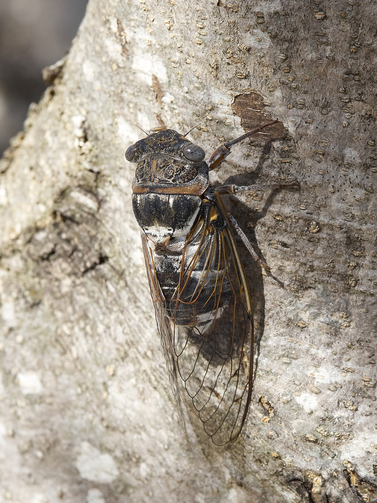
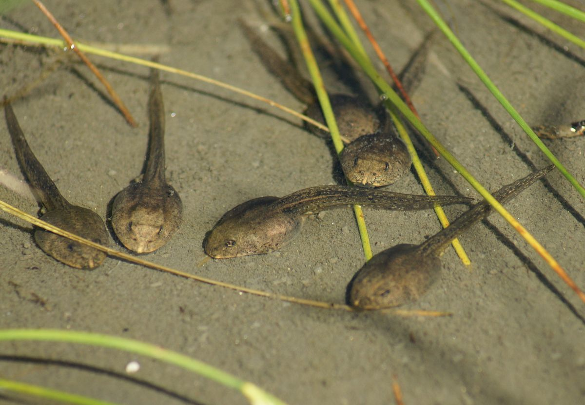
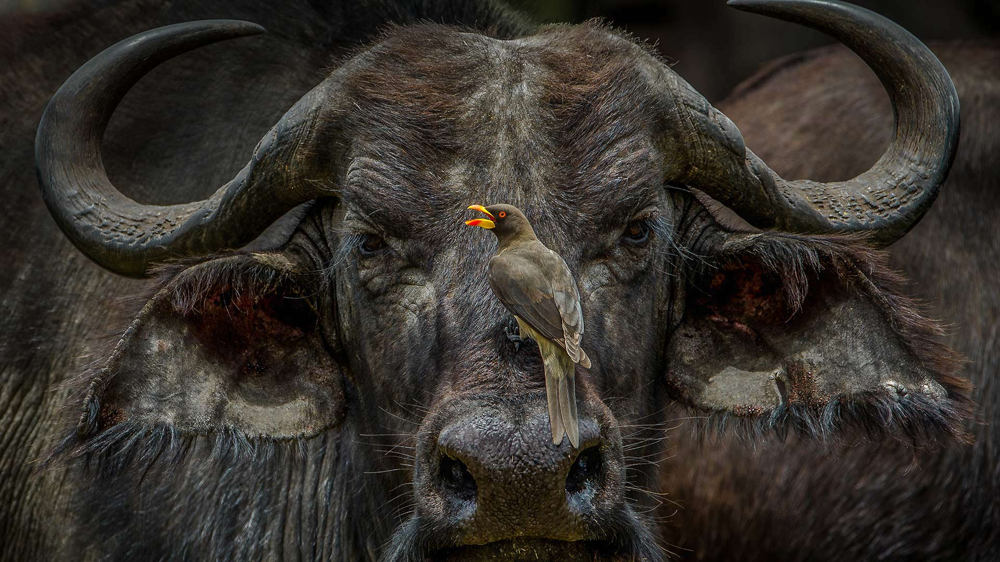

*************
Wild Lives 03
*************

| tailing [尾矿]
| the residue of something, especially ore[矿石]. 
| 
| flora [植物群]
| Definition: the plants of a particular region, habitat, or geological period. 
| Usage: the river's flora and fauna have been inventoried and protected.
| 
| fauna [动物群]
| Definition: the animals of a particular region, habitat, or geological period.
| Usage: "the flora and fauna of Siberia.
| 
| nocturnal
| Definition: Done, active or occurring at night.
| Usage: Most owls are nocturnal.
| 
| nocturne
| Definition: a short composition of a romantic or dreamy character suggestive of night, typically for piano. [夜曲]
| Definition: a picture of a night scene.

.. figure:: images/Chupacabra.jpg

    Chupacabra 传闻一种喜欢吸血的动物

    Lynx 猞猁

.. figure:: images/spotted-hyena-kenya.jpg

    Hyena [鬣狗]

.. figure:: images/nile-crocodile.jpg

    Crocodile [尼罗鳄]

.. figure:: images/alligator_american.jpg

    Alligator [短吻鳄]

    Rhinoceros

    Rhinoceros beetle [独角仙]

.. figure:: images/spotted-house-gecko.jpg

    Gecko [壁虎]

.. figure:: images/chameleon.jpg

    Chameleon [变色龙]

    A person who changes their opinions 
    or behavior according to the situation. [墙头草]

.. image:: images/pangolin_02.jpg
.. figure:: images/pangolin.jpg

    Pangolin [穿山甲]

   Sengi [桑吉鼠]

.. figure:: images/brown-cockroach.jpg

   Cockroach [蟑螂] 

.. figure:: images/scorpion.png

   Scorpion [蝎子]

.. image:: images/life_cycle_of_a_17_year_periodical_cicada.jpg
.. image:: images/cicada-metamorphosis.jpg

   Cicada  [知了，蝉]

.. figure:: images/hoverfly.jpg
   
   Hoverfly [蝇虎]

.. figure:: images/wasp.jpg

   wasp [黄蜂]

    A Ladybird [七星瓢虫] hibernates in Tewin, England

.. figure:: images/praying_mantis.jpg

    Praying mantis [螳螂] man-eater

.. figure:: images/porcupine.jpg

    Porcupine [豪猪]

| Tertiary period [三叠纪]
| Jurassic period [侏罗纪]
| Cretaceous period [白垩纪]

    Allosaurus [异特龙]

.. image:: images/moros_intrepidus.jpg
.. figure:: images/t-rex.jpg

    Tyrannosaurus Rex [霸王龙]

    Tyrannosaurus rex wasn't always the king of the dinosaurs. 
    Before they became towering predators [顶级掠食者], tyrannosaurs started 
    out much smaller, and a newly discovered fossil is helping fill the gap between those two extremes.

.. figure:: images/Great-Rift-Valle.jpg

   The Great Rift Valley

.. figure:: images/baboon.jpg

   Baboon [狒狒]

.. figure:: images/black-crested_titmouse.jpg

    Black-crested titmouse

.. figure:: images/european_goldfinch.jpg

    Red in the face

.. image:: images/songbird_in_jersey_wood.jpg
.. figure:: images/Warbler.jpg

    Warbler/Songbird [黄莺]

.. figure:: images/piping_plover.jpg

    Piping plover [笛鸻]

    A rufous-tailed hummingbird in Costa Rica

.. figure:: images/heartbreaking_pollution.jpg

    A tailing pond found deep within western Australia

    Australia fauna

.. image:: images/gray_fox.jpg
.. figure:: images/arctic_fox.jpg

    Arctic fox [北极狐]

.. figure:: images/polar_bear.jpg

    Polar bear [北极熊]

.. figure:: images/ursus_arctos.jpg

    Ursus Arctos [棕熊]

.. figure:: images/wombat.jpg

    Wombat [袋熊]

    Raccoon [浣熊]

.. image:: images/sandhill_crane_take_flight.jpg

.. figure:: images/tundra_swan.jpg

    Swan

.. image:: images/marine_megafauna.jpg

.. image:: images/ken-hurd-a-collection-of-whales.jpg

.. figure:: images/harbor-porpoise.jpg

   Harbor Porpoise

.. image:: images/elephant_herd_in_namibia.jpg

    Salamander [蝾螈]

.. image:: images/tree_frog.jpg
.. image:: images/life-cycle-of-a-frog-1.jpg
.. image:: images/life-cycle-of-a-frog-2.png

    Tadpole [蝌蚪]

.. image:: images/lion.jpg

.. image:: images/fathers_day.jpg

.. image:: images/beaver.jpg

.. figure:: images/elk.jpg

    Elk [麋鹿]

.. image:: images/rabbit_in_the_grass.jpg
.. figure:: images/hare.jpg

    Hare [野兔]

.. figure:: images/Laysan_Albatross.jpg

    Laysan Albatross [信天翁]

.. figure:: images/gull.jpeg

   Gull [海鸥]

.. figure:: images/tuna.jpg
   
   Tuan [金枪鱼]

.. figure:: images/bonito.jpeg
   
   Bontino

   Skunk [美洲臭鼬]

   Wolverine [狼獾，金刚狼]

   Buffalo

.. figure:: images/bison_day.jpg

   Bison day 11-03

   Pipistrelle bat

   a small insectivorous Old World bat with jerky, erratic flight.

    Sloth [树懒]

.. image:: images/ruff_male_displaying.jpg

.. image:: images/zebra.jpg

.. image:: images/green_sea_turtle.jpg
.. image:: images/seal.jpg

#. Ontogeny
   
    Ontogeny (also ontogenesis or morphogenesis) is the origination and development of an organism, 
    usually from the time of fertilization of the egg to the organism's mature form. Yet, the term 
    can be used to refer to the study of the entirety of an organism's lifespan.

    .. image:: images/Ontogeny.jpg
    .. image:: images/prokaryotic_creatures.jpg

#. Phlogeny
   
    Phylogenetics, in biology, is the study of the evolutionary history and relationships 
    among individuals or groups of organisms (e.g. species, or populations). These relationships 
    are discovered through phylogenetic inference methods that evaluate observed heritable traits, 
    such as DNA sequences or morphology under a model of evolution of these traits.

    .. image:: images/Phylogenetic-tree.png
    .. image:: images/phylogeny_tree_02.jpg
    .. image:: images/strom-zivota.jpg
    .. image:: images/Evolution__Biologia.jpg

#. Ontogeny recapitulates phylogeny

    The phrase "ontogeny recapitulates phylogeny" refers to a scientific theory 
    that an organism's fetal development follows the species' previous evolutionary 
    forms. This theory has been disproven.

    .. image:: images/Embryological-evidences.jpg

#. Metamorphosis
   
   (in an insect or amphibian) the process of transformation from an immature 
   form to an adult form in two or more distinct stages.

   .. image:: images/Butterfly-life-cycles.png
   .. image:: images/metamorphosis.jpg
