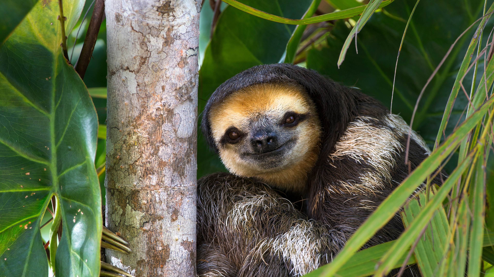

*************
Wild Lives 03
*************

| tailing [尾矿]
| the residue of something, especially ore[矿石].
|
| flora [植物群]
| Definition: the plants of a particular region, habitat, or geological period.
| Usage: the river's flora and fauna have been inventoried and protected.
|
| fauna [动物群]
| Definition: the animals of a particular region, habitat, or geological period.
| Usage: "the flora and fauna of Siberia.
|
| nocturnal
| Definition: Done, active or occurring at night.
| Usage: Most owls are nocturnal.
|
| nocturne
| Definition: a short composition of a romantic or dreamy character suggestive of night, typically for piano. [夜曲]
| Definition: a picture of a night scene.

    Chupacabra 传闻一种喜欢吸血的动物

.. figure:: images/lynx_czech.jpg

    Lynx 猞猁

.. figure:: images/spotted-hyena-kenya.jpg

    Hyena [鬣狗]

.. figure:: images/nile-crocodile.jpg

    Crocodile [尼罗鳄]

.. figure:: images/alligator_american.jpg

    Alligator [短吻鳄]

.. figure:: images/rhino.jpg

    Rhinoceros

.. image:: images/pangolin_02.jpg
.. figure:: images/pangolin.jpg

    Pangolin [穿山甲]

.. figure:: images/sengi.jpg

   Sengi [桑吉鼠]

    Porcupine [豪猪]

| Tertiary period [三叠纪]
| Jurassic period [侏罗纪]
| Cretaceous period [白垩纪]

.. figure:: images/allosaurus.png

    Allosaurus [异特龙]

.. image:: images/moros_intrepidus.jpg
.. figure:: images/t-rex.jpg

    Tyrannosaurus Rex [霸王龙]

    Tyrannosaurus rex wasn't always the king of the dinosaurs.
    Before they became towering predators [顶级掠食者], tyrannosaurs started
    out much smaller, and a newly discovered fossil is helping fill the gap between those two extremes.

.. figure:: images/spotted-house-gecko.jpg

    Gecko [壁虎]

.. image:: images/lazard_1565776378.jpg

    Chameleon [变色龙]

    A person who changes their opinions
    or behavior according to the situation. [墙头草]

.. figure::  images/salamander.jpg

    Salamander [蝾螈]

.. figure:: images/Kaulquappen_Tadpole.jpg

    Tadpole [蝌蚪]

    山地大猩猩

.. image:: images/MapGreatRiftValley.png

   The Great Rift Valley [东非大裂谷]

.. image:: images/gelada_baboon.jpg

   Baboon [狒狒]

    A tailing pond found deep within western Australia

.. figure:: images/Australisk_fauna_Nordisk_familjebok.jpg

    Australia fauna

.. image:: images/gray_fox.jpg
.. figure:: images/arctic_fox.jpg

    Arctic fox [北极狐]

.. image:: images/brown_bears_1566782396.jpg

    Ursus Arctos [棕熊]

.. figure:: images/polar_bear.jpg

    Polar bear [北极熊]

.. figure:: images/wombat.jpg

    Wombat [袋熊]

.. figure:: images/raccoon.jpg

    Raccoon [浣熊]

.. image:: images/elephants_1564717511.jpg

.. image:: images/leopard_snoozing_in_a_tree.jpg
.. image:: images/jaguar_in_pentanal_wetlands.jpg
.. image:: images/lion.jpg
.. image:: images/lion_cubs.jpg

.. image:: images/beaver.jpg

.. image:: images/zebra.jpg

.. figure:: images/elk.jpg

    Elk [麋鹿]

.. figure:: images/hare.jpg

    Hare [野兔]

.. figure:: images/skunk.jpg

   Skunk [美洲臭鼬]

.. figure:: images/wolverine-walking.jpg

   Wolverine [狼獾，金刚狼]

.. figure:: images/buffalo.jpg

   Buffalo

.. figure:: images/bison_day.jpg

   Bison day 11-03

.. figure:: images/CommonPipistrelle.jpg

   Pipistrelle bat

   a small insectivorous Old World bat with jerky, erratic flight.

.. figure:: images/sloth_1571582236.jpg

    Sloth [树懒]

    Martes [貂]

#. Ontogeny

    Ontogeny (also ontogenesis or morphogenesis) is the origination and development of an organism,
    usually from the time of fertilization of the egg to the organism's mature form. Yet, the term
    can be used to refer to the study of the entirety of an organism's lifespan.

    .. image:: images/Ontogeny.jpg
    .. image:: images/prokaryotic_creatures.jpg

#. Phlogeny

    Phylogenetics, in biology, is the study of the evolutionary history and relationships
    among individuals or groups of organisms (e.g. species, or populations). These relationships
    are discovered through phylogenetic inference methods that evaluate observed heritable traits,
    such as DNA sequences or morphology under a model of evolution of these traits.

    .. image:: images/Phylogenetic-tree.png
    .. image:: images/phylogeny_tree_02.jpg
    .. image:: images/strom-zivota.jpg
    .. image:: images/Evolution__Biologia.jpg

#. Ontogeny recapitulates phylogeny

    The phrase "ontogeny recapitulates phylogeny" refers to a scientific theory
    that an organism's fetal development follows the species' previous evolutionary
    forms. This theory has been disproven.

    .. image:: images/Embryological-evidences.jpg

#. Metamorphosis

   (in an insect or amphibian) the process of transformation from an immature
   form to an adult form in two or more distinct stages.

   .. image:: images/Butterfly-life-cycles.png
   .. image:: images/metamorphosis.jpg
