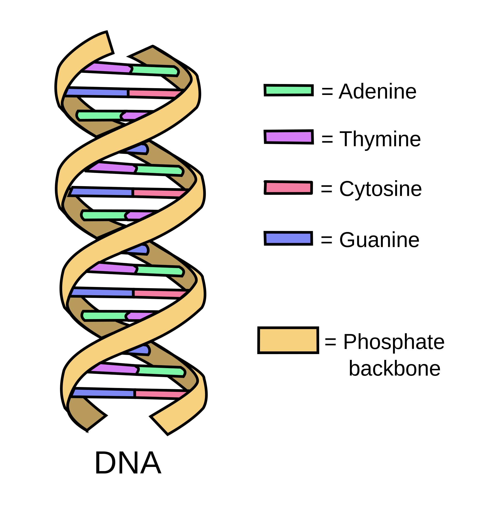

*************
Genetic Terms
*************

    DNA Structure

    | adenine [腺嘌呤]
    | guanine  [鸟嘌呤]
    | cytosine [胞嘧啶]
    | thymine [胸腺嘧啶]

#. Transcription

    Transcription is the first step of gene expression, in which a particular segment of DNA is copied into RNA (especially mRNA) 
    by the enzyme RNA polymerase. Both DNA and RNA are nucleic acids, which use base pairs of nucleotides as a complementary language. 
    During transcription, a DNA sequence is read by an RNA polymerase, which produces a complementary, antiparallel RNA strand called 
    a primary transcript.

    .. image:: images/MRNA.svg
