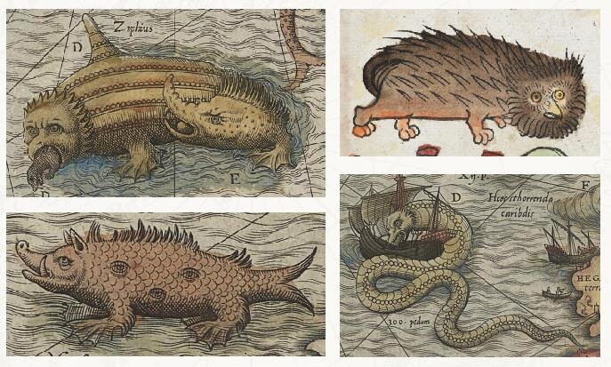
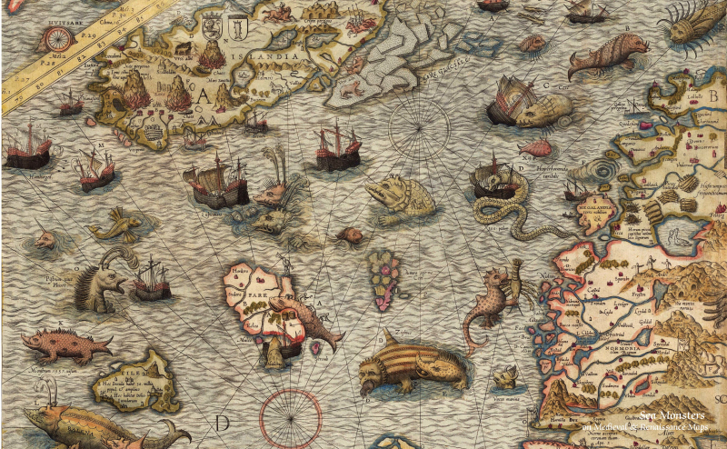

****************
Reading Progress
****************

Sometimes to love someone, you gotta to be a stranger.

To be or not to be, this is a question.

-- William Shakespeare

.. contents::
   :local:

Introduction To Algorithm
=========================

   - Ch03 Growth of Functions (Finished 2018-10-13)
     
   - Ch04 Divide-and-conquer (2018-10-13 -- 10-24)
     
     - The maximum-subarray problem (finished)
     - Strassen’s algorithm for matrix multiplication (finished)
     - The substitution method for solving recurrences (finished)
     - The recursion-tree method for solving recurrences (finished)
     - The master method for solving recurrences (finished)
   
   - Ch05 Probabilistic Analysis and Randomized Algorithms (2018-10-24 -- )

   - Ch10 Elementary Data Structures (Finished before 2018-09)
   - Ch11 Hash tables (Finished before 2018-10)
   - Ch12 Binary search tree (Finished 2018-10-13)

Advanced Programming in UNIX Environment
========================================

   - Ch01 Unix system overview (Finished before 2018-09)
   
   - Ch03 File I/O
     
      - File descriptor (finished, 2018-11-06)
      - I/O efficiency (finished, 2018-11-07)
      - File sharing (finished, 2018-11-06)
      - Atomic operations (finished, 2018-11-02)
      - dup and dup2 function (finished, 2018-11-07)
      - sync, fsync and fdatasync functions (finished, 2018-11-07)
      - fcntl function (finished, 2018-11-07)
      - /dev/fd (finished, 2018-11-03)
        
   - Ch04 Files and directories
     
      - stat, fstat, and lstat function (finished, 2018-11-02)
      - File types (finished, 2018-11-01)
      - Sticky bit (finished, 2018-11-01)
      - File systems (finished, 2018-11-01) [i-node]
      - link, unlink and remove functions (finished, 2018-11-01)

   - Process (Finished before 2018-09)
     
      - Ch07 Process environment (Finished)
      - Ch08 Process control (Finished, but skipped several sections)
      - Ch09 Process relationship (Finished)

   - Ch10 Signal (Finished before 2018-10)
     
   - Pthread

      - Ch11 Threads (finished)
        
         - Introduction (finished, 2018-10-23)
         - Thread concepts (finished, 2018-10-23)
         - Thread identification (finished, 2018-10-23)
         - Thread creation (finished, 2018-10-23)
         - Thread termination (finished, 2018-10-23)
         - Mutex and rwlock (finished, 2018-10-24 -- 10-25)
         - Condition variable, spin locks, barrier (finished,  2018-10-25)

      - Ch12 Thread control (2018-10-26 -- 10-28)
        
         - Introduction (finished)
         - Thread Limits (finished)
         - Thread Attributes (finished)
         - Sychronization Attributes (finished)
         - Reentrancy (finished)
         - Thread-specific data (finished)
         - Cancle option (finished)
         - Threads and signal (finished)
         - Threads and fork (finished)
         - Threads and IO (finished)

   - Ch14 Advanced I/O
     
      - Memory-mapped I/O (2018-10-09, finished)

   - Ch15 Interprocess Communication
     
      - Shared memory (2018-10-08, finished)

   - Ch16 Network IPC: Sockets (2018-09-27 -- 2018-10-08)
   
   - Ch17 Advanced IPC
     
     - Introduction (Finished, 2018-10-13)
     - Unix Domain Sockets (Finished, 2018-10-13)
     - Unique connections (Finished, 2018-10-14)
     - Passing File Descriptors (Finished, 2018-10-14)
     - Open Server(Finished, 2018-10-13 -- 10-20)

   - Ch18 Terminal I/O
   
      - Overview (finished)
      - Special Input Characters (finished)
 
    
Programming Pearls
==================

   - Column 01 (reviewed, 2018-10-13)
   - Column 02 (reviewed, 2018-10-15)
   - Column 04 (reviewed, 2018-10-07)
   - Column 05 (reviewed, 2018-10-28)
   - Column 07 (reviewed, 2018-10-28)
   - Column 08 (reviewed, 2018-10-28)
   - Column 09 (reviewed, 2018-10-06 - 10-07)
   - Column 11 (reviewed, 2018-10-19)
   - Column 12 (reviewed, 2018-10-14)
   - Column 13 
   - Column 14 (reviewed, 2018-10-22)
   - Column 15 (2018-10-01 -- 2018-10-06)
     

More Programming Pearls
=======================

   - Column 01 (finished, 2018-10-21)
   - Column 03 (finished, 2018-10-22)
   - Column 04 (finished, 2018-10-22 -- 10-23)
   - Column 05 (finished, 2018-10-21)
   - Column 06 (finished, 2018-10-22)
   - Column 07 (finished, 2018-10-21)
   - Column 08 (finished, 2018-10-31)
   - Column 09 (finished, 2018-11-03)
   - Column 10 (finished, 2018-11-03)
   - Column 11 (finished, 2018-11-03)
   - Column 12 (finished, 2018-10-30)
   - Column 13 (finished, 2018-10-23)
   - Column 14 (finished, 2018-10-21)
   - Column 15 (finished, 2018-10-22 -- 10-23)

Marked Books
============

   海怪 : 中世纪与文艺复兴时期地图中的海洋异兽
