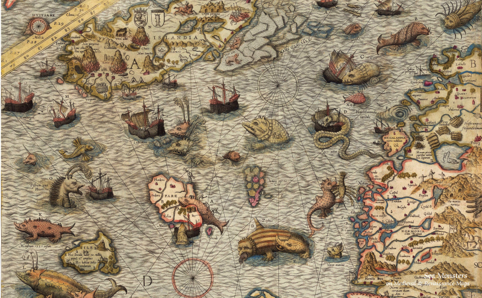
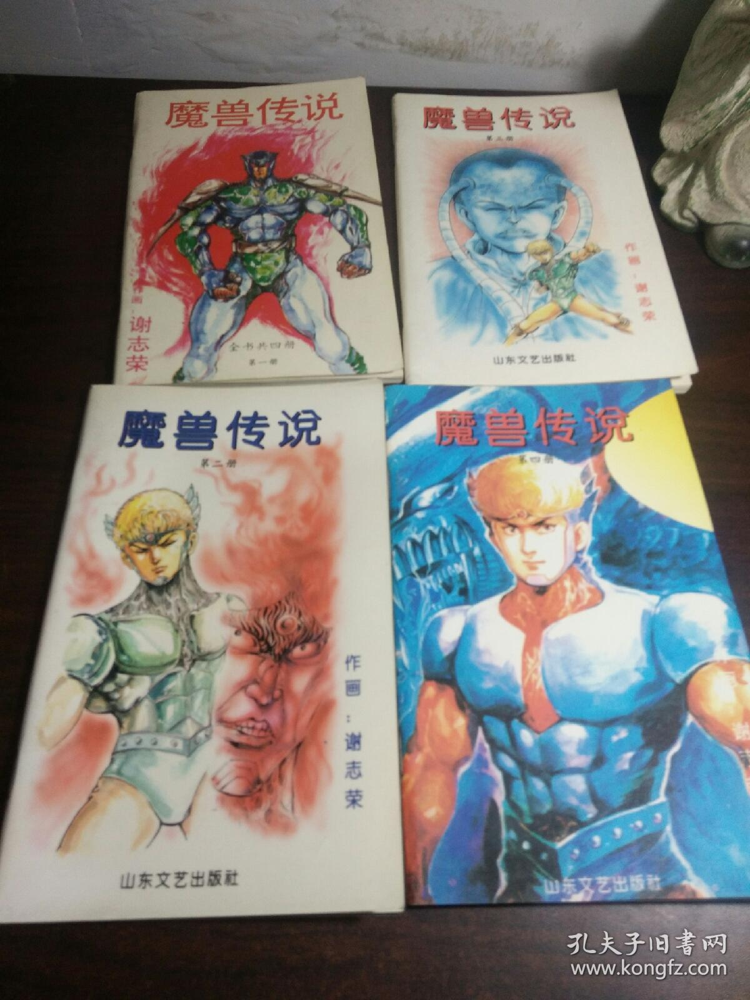

****************
Reading Progress
****************

Sometimes to love someone, you gotta to be a stranger.

To be or not to be, this is a question.

-- William Shakespeare

.. contents::
   :local:

Unix Network Programming Volume one
===================================

    - Ch01 Introduction ( -- 2019-10-01)
    - Ch02 The Transport Layer ( -- 2019-10-02)
    - Ch13 Daemon Process and the inetd superserver ( -- 2019-10-03)
    - Ch05 TCP Client/Server Example ( -- 2019-09-25) [3 days behind schedule]
    - Ch06 I/O Multiplexing: select and poll ( -- 2019-09-29) [7 days behind schedule]
    - Ch16 Nonblocking I/O ( -- 2019-10-07)
    - Ch24 Out-of-Band Data ( -- 2019-09-30) [8 days behind schedule]
    - Ch25 Signal-driven I/O ( -- 2019-10-07)
    - Ch30 Client/Server Design Alternatives ( -- 2019-10-08)

TCP/IP Illustrated Volume one
=============================

    - Ch01 Introduction (Finished, 2018-12-08 - 2018-12-09)
    - Ch04 and Ch05 ARP and RARP
    - Ch14 the Domain Name System
    - Ch15 the Trivial File Transfer Protocol

Deep Learning
=============

    - Part I (finished 2019-03-26)

    - Part II

        - Chapter 6 Deep Feedforward Networks

Introduction machine learning with python
=========================================

    - Ch01 Introduction (finished 2019-03-26)
    - Ch02 Supervised Learning Algorithms (finished, 2019-03-31)
    - Ch03 Unsupervised Learning Algorithms and Preprocessing (finished, 2019-03-31 - 2019-04-13)
    - Ch04 Summary of scikit-learn methods and usage (finished, 2019-04-13)
    - Ch05 Representing Data and Engineering Features (finished, 2019-04-14 - 2019-04-15)
    - Ch06 Model evaluation and improvement (finished, 2019-04-15 - 2019-04-18)
    - Ch07 Algorithm Chains and Pipelines (finished, 2019-04-19 - 2019-04-20)
    - Ch08 Working with Text Data (finished, 2019-04-20)

Introduction To Algorithm
=========================

    - Ch03 Growth of Functions (Finished 2018-10-13)

    - Ch04 Divide-and-conquer (2018-10-13 -- 10-24)

        - The maximum-subarray problem (finished)
        - Strassen’s algorithm for matrix multiplication (finished)
        - The substitution method for solving recurrences (finished)
        - The recursion-tree method for solving recurrences (finished)
        - The master method for solving recurrences (finished)

    - Ch05 Probabilistic Analysis and Randomized Algorithms (2018-10-24 -- )
    - Ch06 Heapsort (reviewed, 2018-11-20 -- 2018-11-25)
    - Ch07 Quicksort (reviewed, 2018-11-25)
    - Ch08 Sorting in linear time (Finished, 2018-11-11 -- 2018-11-12)
    - Ch09 Medians and order statistics (Finished, 2018-11-12 -- 2018-11-18)
    - Ch10 Elementary Data Structures (Finished before 2018-09)
    - Ch11 Hash tables (Finished before 2018-10)
    - Ch12 Binary search tree (Finished 2018-10-13, Reviewed)
    - Ch13 Red black tree (Finished 2018-12-04)
    - Ch14 Augmenting data structure (Finished 2018-12-05)
    - Ch15 Dynamic programming (2018-12-08 -- 2018-12-31)
    - Ch16 Greedy Algorithms (Finished 2019-01-25)
    - Ch17 Amortized Analysis (Finished, 2019-01-14)

    - Ch22 Elementary Graph Algorithms

        - Representations of graph (Finished, 2019-02-14)
        - Breadth-first search (Finished, 2019-02-14)
        - Depth-first search (2019-03-06 -- 2019-04-23)

    - Ch23 Minimum Spanning Trees

        - 23.1 Growing a minimum spanning tree
        - 23.2 The algorithm of Kruskal and Prim

    - Ch24 Single-source shortes paths

        - The Bellman-Ford algorithm (Finished)
        - Single-source shortest paths and relation (Finished)
        - Dijkstra's algorithm (Finished)

Advanced Programming in UNIX Environment
========================================

    - Ch01 Unix system overview (Finished before 2018-09)

    - Ch03 File I/O

        - File descriptor (finished, 2018-11-06)
        - I/O efficiency (finished, 2018-11-07)
        - File sharing (finished, 2018-11-06)
        - Atomic operations (finished, 2018-11-02)
        - dup and dup2 function (finished, 2018-11-07)
        - sync, fsync and fdatasync functions (finished, 2018-11-07)
        - fcntl function (finished, 2018-11-07)
        - /dev/fd (finished, 2018-11-03)

    - Ch04 Files and directories

        - stat, fstat, and lstat function (finished, 2018-11-02)
        - File types (finished, 2018-11-01)
        - Sticky bit (finished, 2018-11-01)
        - File systems (finished, 2018-11-01) [i-node]
        - link, unlink and remove functions (finished, 2018-11-01)

    - Ch06 System data file and information (finished, 2018-11-24)

    - Process (Finished before 2018-09)

        - Ch07 Process environment (Finished)
        - Ch08 Process control (Finished, but skipped several sections)
        - Ch09 Process relationship (Finished)

    - Ch10 Signal (Finished before 2018-10)

    - Pthread

        - Ch11 Threads (finished)

            - Introduction (finished, 2018-10-23)
            - Thread concepts (finished, 2018-10-23)
            - Thread identification (finished, 2018-10-23)
            - Thread creation (finished, 2018-10-23)
            - Thread termination (finished, 2018-10-23)
            - Mutex and rwlock (finished, 2018-10-24 -- 10-25)
            - Condition variable, spin locks, barrier (finished,  2018-10-25)

        - Ch12 Thread control (2018-10-26 -- 10-28)

            - Introduction (finished)
            - Thread Limits (finished)
            - Thread Attributes (finished)
            - Sychronization Attributes (finished)
            - Reentrancy (finished)
            - Thread-specific data (finished)
            - Cancle option (finished)
            - Threads and signal (finished)
            - Threads and fork (finished)
            - Threads and IO (finished)

    - Ch14 Advanced I/O

        - Memory-mapped I/O (2018-10-09, finished)

    - Ch15 Interprocess Communication

        - Shared memory (2018-10-08, finished)

    - Ch16 Network IPC: Sockets (2018-09-27 -- 2018-10-08)

    - Ch17 Advanced IPC

        - Introduction (Finished, 2018-10-13)
        - Unix Domain Sockets (Finished, 2018-10-13)
        - Unique connections (Finished, 2018-10-14)
        - Passing File Descriptors (Finished, 2018-10-14)
        - Open Server(Finished, 2018-10-13 -- 10-20)

    - Ch18 Terminal I/O

        - Overview (finished)
        - Special Input Characters (finished)

Programming Pearls
==================

    - Column 01 (reviewed, 2018-10-13)
    - Column 02 (reviewed, 2018-10-15)
    - Column 04 (reviewed, 2018-10-07)
    - Column 05 (reviewed, 2018-10-28)
    - Column 07 (reviewed, 2018-10-28)
    - Column 08 (reviewed, 2018-10-28)
    - Column 09 (reviewed, 2018-10-06 - 10-07)
    - Column 11 (reviewed, 2018-10-19)
    - Column 12 (reviewed, 2018-10-14)
    - Column 13
    - Column 14 (reviewed, 2018-10-22)
    - Column 15 (2018-10-01 -- 2018-10-06)

More Programming Pearls
=======================

    - Column 01 (finished, 2018-10-21)
    - Column 03 (finished, 2018-10-22)
    - Column 04 (finished, 2018-10-22 -- 10-23)
    - Column 05 (finished, 2018-10-21)
    - Column 06 (finished, 2018-10-22)
    - Column 07 (finished, 2018-10-21)
    - Column 08 (finished, 2018-10-31)
    - Column 09 (finished, 2018-11-03)
    - Column 10 (finished, 2018-11-03)
    - Column 11 (finished, 2018-11-03)
    - Column 12 (finished, 2018-10-30)
    - Column 13 (finished, 2018-10-23)
    - Column 14 (finished, 2018-10-21)
    - Column 15 (finished, 2018-10-22 -- 10-23)

Marked Books
============

    海怪 : 中世纪与文艺复兴时期地图中的海洋异兽

    魔兽传说 谢志荣

