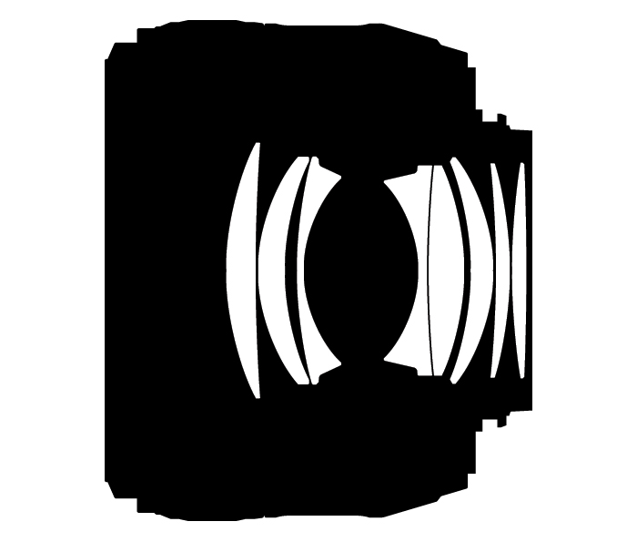

Terminology
===========

| Canon 
| Nikon
| Nikkor
| Viewfinder - 取景窗
| prism - 棱镜
| Shutter - 快门
| Aperture - 光圈
| Focal length - 焦距
| Prime lens - 定焦镜头
| Zoom lens - 变焦镜头
| Normal lens - 标头 （40 - 60 mm）
| Wide-angle lens - 广角镜头
| Telephoto lens - 长焦镜头
| Macro lens - 微距镜头
| magnification ratio / reproduction ration
| APS - 全画幅
| APS-C - Advanced Photo System-Classic, 残幅
| close-up -- a photograph, movie, or video taken at close range and showing the subject on a large scale [写真？？]
| depth of field - 景深
| Sharpness - 锐度
| Blur
| ISO - 感光度
| White balance - 白平衡
| VR - Viberation Reduction
| AF - autofocus
| AE - autoexposure
| IF - internal focus 
| EV - Exposure Value
| EC - Exposure Compensation
| Transistor - 晶体管
| Bipolar junction transistor
| Triode - 三极管
| LED - Light-Emitting Diode
| OLED - organic LED
| WMU - wireless mobile utility
| 
| freeze
| Definition: prevent (assets) from being used for a period of time.
| Usage: The charity’s bank account has been frozen.
| Definition: stop (a moving image) at a particular frame when filming or viewing.
| Usage: The camera will set fast shutter speeds to freeze the action.
| Definition: (of a computer screen) become temporarily locked because of system problems.
| 
| prism
| Definition: A prism is a block of clear glass or plastic which separates the light passing through it into different colors.
| Definition: If you see something through a prism of something such as time or memory, your idea of it is affected by that thing.
| Usage: Through the smoky prism of time, I could just barlely make out my father as a young man.
| 
| lens
| Definition: A lens is a thin curved piece of glass or platistic used in things such as cameras, telescopes, and pairs of glasses. You look through a lens in | order to make things look larger, smaller, or clearer.
| Definition: In your eye, the lens is the part behind the pupil that focuses light and helps you to see clearly.
| Usage: A camera lens.
| 
| halation [光晕]
| Definition: the spreading of light beyond its proper boundaries to form a fog around the edges of a bright
| image in photograph or on a television screen.
|
| focal
| Definition: Focal is used to describe something that releates to the point where a number of rays or lines meet.
| Definition: The focal length of the lens. [焦距]
| Definition: Focal is used to describe something that is very important.
| Usage: Now Shanghai is a great metropolis and one of the focal centres of the Far East.
| 

Aperture ring - 光圈环

focus ring - 对焦环

A ring on the lens of a camera that can be rotated to allows users
to manually focus the camera.

zoom ring - 变焦环

A zoom adjustment ring found on many digital video recorders and digital cameras.
Zoom rings enable motorized zoom that allows you to change the focal length in
real-time as you shoot. A 4X zoom lens, for example, will enlarge or reduce the
subject in an image by four times depending on which way it's zoomed. Zoom lenses
are either optical zoom or digital zoom.

optical zoom - 光学变焦

On a digital camera, optical zoom is a true zoom feature. It allows you to zoom in
(or out) on the subject in the LCD or viewfinder. This will enable you to get a
closer view of the subject before taking your picture. Optical zoom changes the
magnification of images with the actual optical glass before the images reach
the imaging sensor. Optical zoom allows for better photo quality than digital zoom.

digital zoom - 光学变焦

Digital zoom is a function of a digital camera used to make the image seem more close-up.
Digital zoom on a digital camera works the same as cropping and enlarging a photo in a
graphics program. This type of zoom will result in a loss of quality and image resolution
because the image is simply being enlarged without any extra details or pixels being added.
Due to the quality of photos taken when using the digital zoom function, these photos may
not be of good enough quality to print images larger than 4"x6".

total zoom

Some digital camera manufactures advertise a camera's zoom capability as a total zoom.
When you see a total zoom listing, it is the digital zoom multiplied by the optical zoom.
For instance, a camera touting a 20x total zoom could be a digital camera with 4x optical
and 5x digital zoom.

F-stop

In digital photography and digital video recording, F-stop refers to the international standard
sequence of numbers that express relative aperture. F-stop is the "lens focal length" divided by
the "effective aperture diameter." The smaller the F-number, the greater the amount of light that
passes through the lens. Each change of F-stop halves or doubles the image brightness as you step
up or down.

   AF-S NIKKOR 50mm 1.4G Construction

See `Terminology about Nikkor lens <http://www.nikon.com.cn/sc_CN/learn_and_explore/lens_glossary.page>`_.

Reproduction ratio - 成像率

In close-up and macro photography, the reproduction ratio (or magnification ratio,
magnification factor, magnification) specifies the ratio of the size of an image
projected on the film or sensor of a camera, and the size of the subject itself:

.. math::

   R = \frac{s}{S}

where R is the reproduction ratio, S the size of the subject and s the size of its image.
As an example, if the length of an object is 100mm and its image on the film or camera
sensor is 10mm, the reproduction ratio is 10/100=0.1. Thus, the reproduction ratio can
be written as x0.1 or 0.1x, where x stands for "times" (i.e., the subject is magnified
0.1 times). In practice, however, it is customary to specify the reproduction ratio as
a fraction (in this case, 1/10) or ratio (in this case, 1:10).

Typical examples of reproduction ratios are 1:3 (one-third the original size) and 1:100
(one-hundredth the original size). To obtain the original size of the subject, you simply
calculate:

.. math::

   S = \frac{s}{R}

