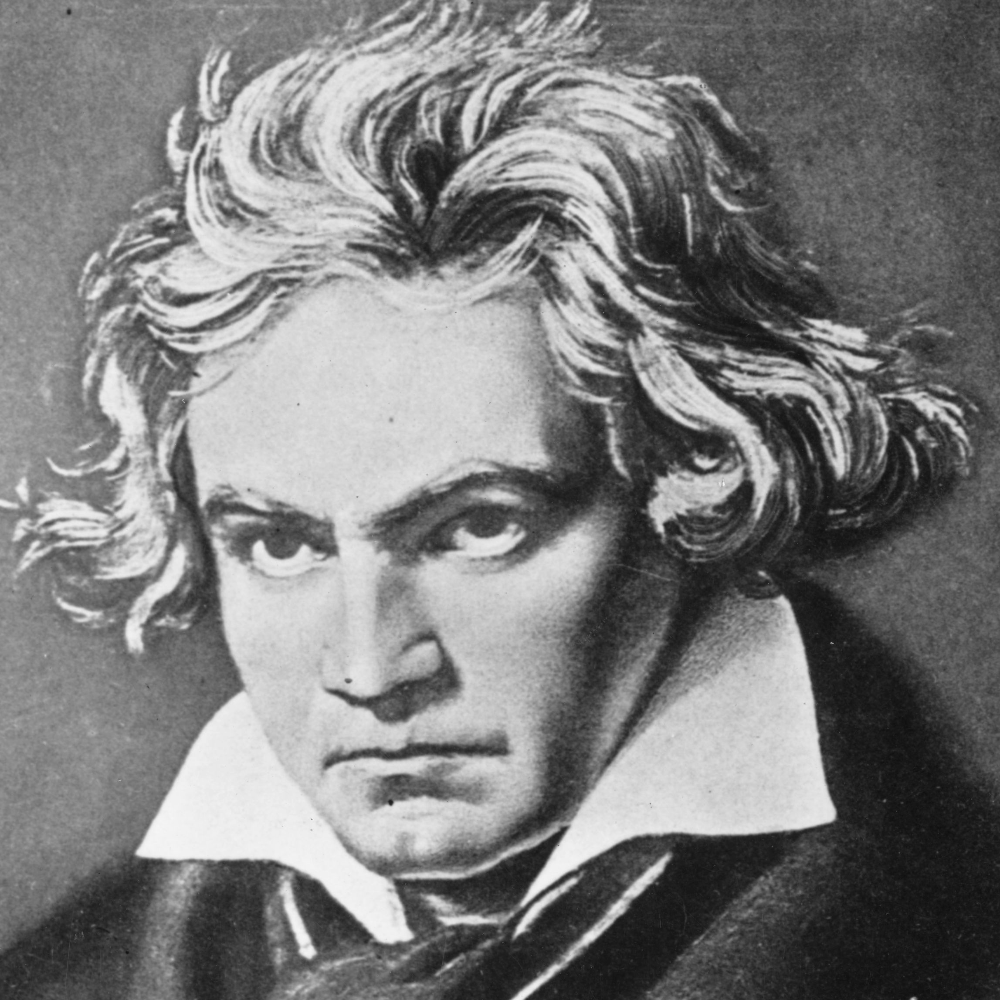
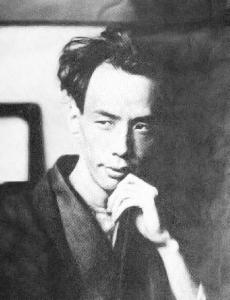
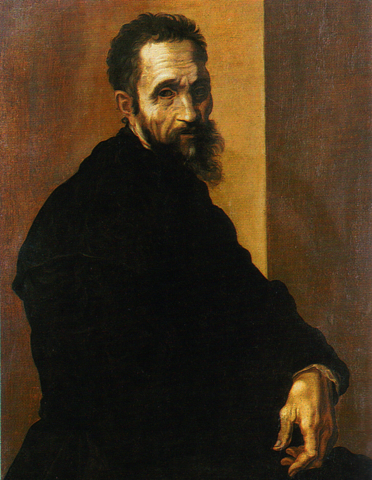
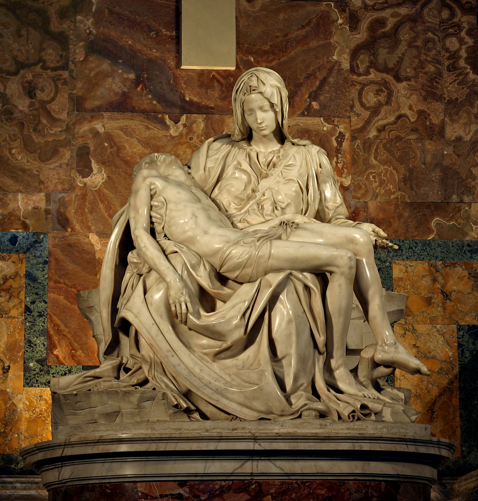
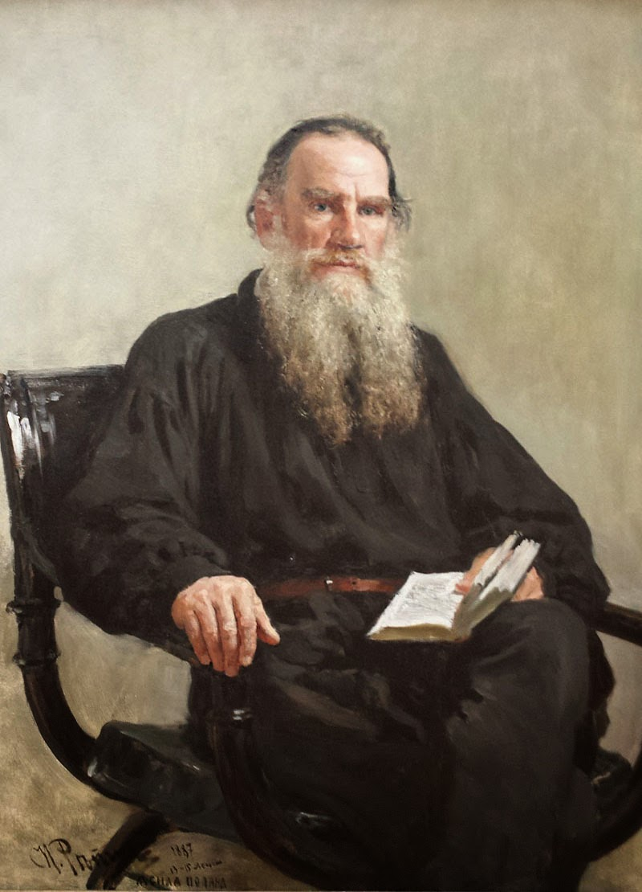
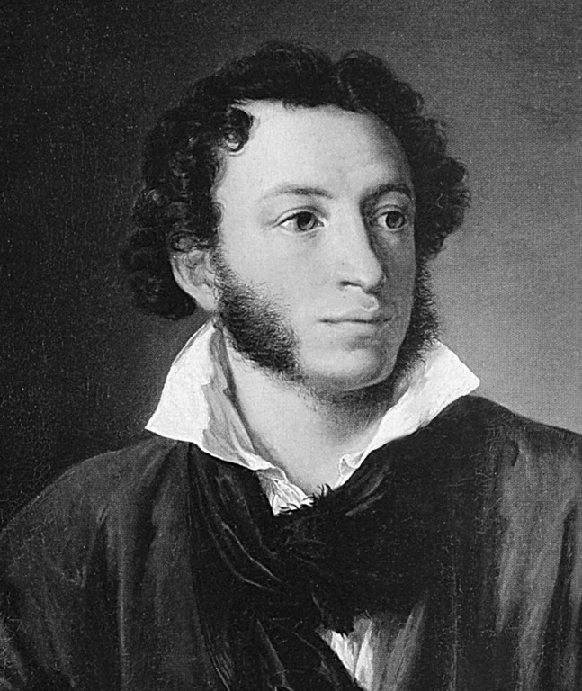
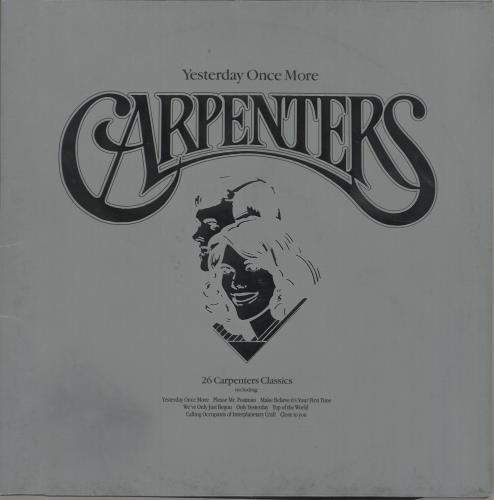

*******
Mottoes
*******

我的作品一经完成，就没有再加修改的习惯。因为我深信部分的变换足以改变作品的性格。

-- 路德维希·凡·贝多芬

删除我一生中的任何一个瞬间,我都不能成为今天的自己。

-- 芥川龙之介

愈使我受苦的我愈喜欢。

我的欢乐是悲哀。

千万的欢乐不值一单独的烦恼。

多么想望而来得多么迟的死，因为，对于不幸的人，死是懒惰的。

-- 米开朗琪罗

    Michelangelo Buonarroti

    米开朗琪罗 - 悼基督

我自己想，像我这样一个鼻子那么宽，口唇那么大，眼睛那么小的人，世界上是没有他的快乐的。

骄傲是我的大缺点，一种夸大的自尊心，毫无理智的我的野心，那么强烈。
如果我必得在光荣与德性（我爱好的）中选择其一，我确信我将选择前者。

-- 列夫·尼古拉耶维奇·托尔斯泰 

    Лев Николаевич Толстой

生而为人，我很抱歉。

-- 太宰治 《人间失格》

.. figure:: images/Osamu_Dazai.jpg

    太宰治

.. code-block:: none

    假如生活欺骗了你

    [俄] 普希金

    假如生活欺骗了你，
    不要悲伤，不要心急！
    忧郁的日子里须要镇静：相信吧，快乐的日子将会来临！
    心儿永远向往着未来；现在却常是忧郁。
    一切都是瞬息，一切都将会过去；
    而那过去了的，就会成为亲切的怀恋。

    Александр Сергеевич Пушкин

一切命运的安排都建立在你的努力之上。

这个世界没有奇迹，有的只是偶然和必然，以及人的所作所为，仅此而已。

-- EF - A tale of melodies

只要活着，伤口总会愈合。

-- 驱魔少年

杀生的罪恶感会伴随一生。

We have to honor the past, but we make our own future.

-- Hotel Transylvania

人生五十年，如梦亦如幻。有生方有死，壮士何所憾。

-- 织田信长

力拔山兮气盖世。时不利兮骓不逝。骓不逝兮可奈何！虞兮虞兮奈若何！

-- 项羽

I think, therefore I am

-- *Descartes*

What doesn't kill you will make you stronger.

努力只不过是为了结果的过程，无论努力是怎样珍贵的行为，只对于过程本身而感到骄傲的话就是本末倒置了。

-- 吉井玲《笨蛋测验召唤兽》

将自己的生命燃烧到灰一样白。

-- 矢吹丈 《明日之丈》

    There is always one song that brings back old memories.

The more a man knows, the less he knows what he knows.

The soul is not where it lives, but it loves.

They who cannot do what they would must do as they can.

Thinking well is wise, planning well wiser, doing well wisest and the best of all.

Tomorrow you thought of comes never.

天予不取，反受其咎。