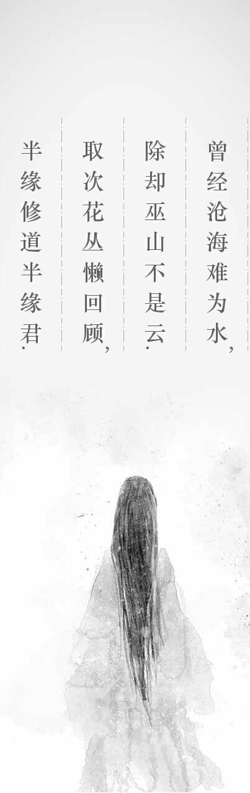
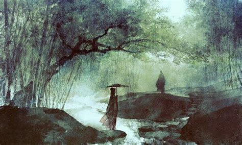

********
诗词曲赋
********

.. code-block:: none

   临江仙•滚滚长江东逝水  
   
   滚滚长江东逝水，浪花淘尽英雄。是非成败转头空，青山依旧在，几度夕阳红。  
   白发渔樵江渚上，惯看秋月春风。一壶浊酒喜相逢，古今多少事，都付笑谈中。  

.. code-block:: none
   :caption: 悼亡詩詞

   離思•其三
   [唐]   元稹
   山泉散漫繞階流, 萬樹桃花映小樓.
   閒讀道書慵未起, 水晶簾下看梳頭.
   
   離思•其四
   [唐]   元稹
   曾經滄海難為水, 除卻巫山不是雲.
   取次花叢懶回顧, 半緣修道半緣君.
   
   江城子•乙卯正月二十日記夢
   [北宋]  蘇軾
   十年生死兩茫茫, 不思量, 自難忘. 千里孤墳, 無處話淒涼.
   縱使相逢應不識, 塵滿面, 鬢如霜.
   小軒窗, 正梳妝, 相顧無言, 惟有淚千行.
   料得年年腸斷處, 明月夜, 短松岡. 

.. image:: Illustration/dream-2.jpg

.. code-block:: none
   :caption: 念歸

   渡汉江
   [唐] 宋之问
   岭外音书断，经冬复历春。
   近乡情更怯，不敢问来人。

   遊子吟
   [唐] 孟郊
   慈母手中線，遊子身上衣。
   臨行密密縫，意恐遲遲歸。
   誰言寸草心，報得三春暉！
   
   九月九日憶山東兄弟
   [唐] 王維
   獨在他鄉為異客，每逢佳節倍思親。
   遙知兄弟登高處，遍插茱萸少一人。

   天净沙•秋思
   [元] 马致远
   枯藤老树昏鸦,小桥流水人家,古道西风瘦马.
   夕阳西下, 断肠人在天涯.

.. image:: Illustration/home.jpg

.. code-block:: none

   春江花月夜

   [唐] 张若虚

   春江潮水连海平，海上明月共潮生。
   滟滟随波千万里，何处春江无月明！
   江流宛转绕芳甸，月照花林皆似霰。
   空里流霜不觉飞，汀上白沙看不见。
   江天一色无纤尘，皎皎空中孤月轮。
   江畔何人初见月，江月何年初照人？
   人生代代无穷已，江月年年望相似。
   不知江月待何人，但见长江送流水。
   白云一片去悠悠，青枫浦上不胜愁。
   谁家今夜扁舟子？何处相思明月楼？
   可怜楼上月徘徊，映照离人妆镜台。
   玉户帘中卷不去，捣衣砧上拂还来。
   此时相望不相闻，愿逐月华流照君。
   鸿雁长飞光不度，鱼龙潜跃水成文。
   昨夜闲潭梦落花，可怜春半不还家。
   江水流春去欲尽，江潭落月复西斜。
   斜月沉沉藏海雾，碣石潇湘无限路。
   不知乘月几人归，落月摇情满江树。

   虞美人·聽雨

   [南宋] 蔣捷

   少年聽雨歌樓上，紅燭昏羅帳。
   壯年聽雨客舟中，江闊雲低，斷雁叫西風。
   而今聽雨僧廬下，鬢已星星也，悲歡離合總無情，一任階前，點滴到天明。

   武陵春·春晚

   [南宋] 李清照

   风住尘香花已尽，日晚倦梳头。物是人非事事休，欲语泪先流。
   闻说双溪春尚好，也拟泛轻舟，只恐双溪舴艋舟，载不动许多愁。