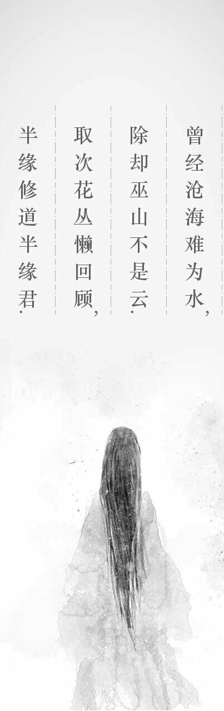
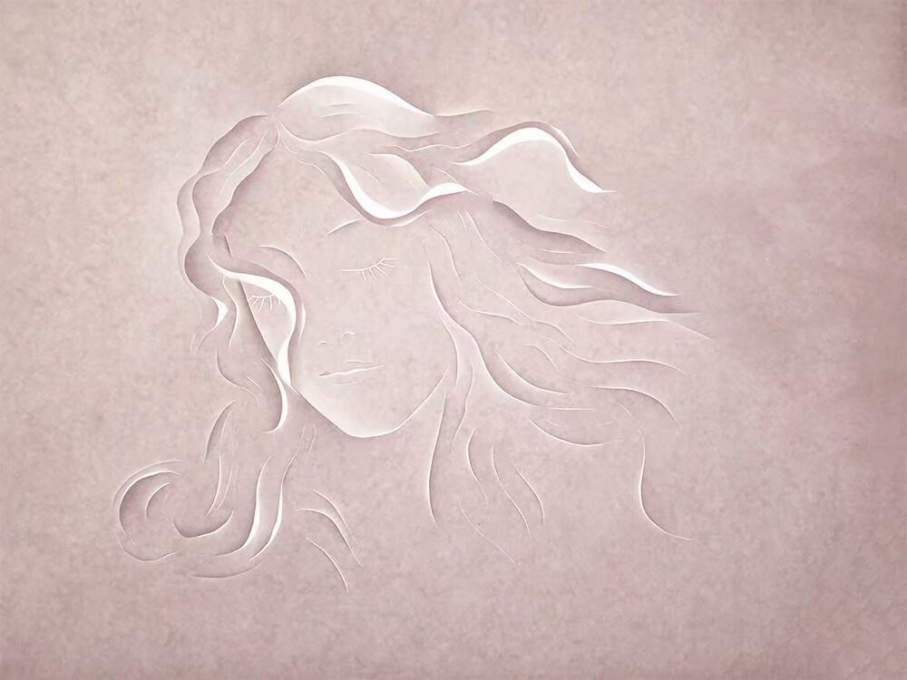
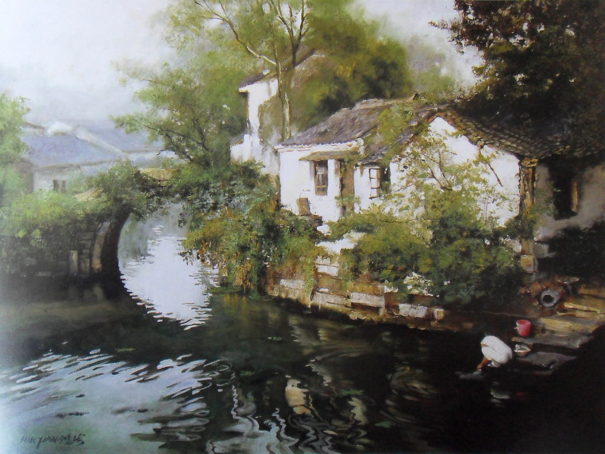

********
诗词曲赋 
********

.. code-block:: none

   临江仙•滚滚长江东逝水  
   
   滚滚长江东逝水，浪花淘尽英雄。是非成败转头空，青山依旧在，几度夕阳红。  
   白发渔樵江渚上，惯看秋月春风。一壶浊酒喜相逢，古今多少事，都付笑谈中。  

.. code-block:: none
   :caption: 悼亡詩詞

   離思•其三
   [唐]   元稹
   山泉散漫繞階流, 萬樹桃花映小樓.
   閒讀道書慵未起, 水晶簾下看梳頭.
   
   離思•其四
   [唐]   元稹
   曾經滄海難為水, 除卻巫山不是雲.
   取次花叢懶回顧, 半緣修道半緣君.
   
   江城子•乙卯正月二十日記夢
   [北宋]  蘇軾
   十年生死兩茫茫, 不思量, 自難忘. 千里孤墳, 無處話淒涼.
   縱使相逢應不識, 塵滿面, 鬢如霜.
   小軒窗, 正梳妝, 相顧無言, 惟有淚千行.
   料得年年腸斷處, 明月夜, 短松岡. 

.. image:: images/wenrensaoke.jpg

.. code-block:: none
   :caption: 念歸

   渡汉江
   [唐] 宋之问
   岭外音书断，经冬复历春。
   近乡情更怯，不敢问来人。

   遊子吟 - 孟郊
   慈母手中線，遊子身上衣。
   臨行密密縫，意恐遲遲歸。
   誰言寸草心，報得三春暉！
   
   九月九日憶山東兄弟 - 王維
   獨在他鄉為異客，每逢佳節倍思親。
   遙知兄弟登高處，遍插茱萸少一人。

   天净沙•秋思 - 马致远
   枯藤老树昏鸦，小桥流水人家，古道西风瘦马。
   夕阳西下，断肠人在天涯。

.. code-block:: none

   春江花月夜
   [唐]   张若虚
   春江潮水连海平，海上明月共潮生。
   滟滟随波千万里，何处春江无月明！
   江流宛转绕芳甸，月照花林皆似霰。
   空里流霜不觉飞，汀上白沙看不见。
   江天一色无纤尘，皎皎空中孤月轮。
   江畔何人初见月，江月何年初照人？
   人生代代无穷已，江月年年望相似。
   不知江月待何人，但见长江送流水。
   白云一片去悠悠，青枫浦上不胜愁。
   谁家今夜扁舟子？何处相思明月楼？
   可怜楼上月徘徊，映照离人妆镜台。
   玉户帘中卷不去，捣衣砧上拂还来。
   此时相望不相闻，愿逐月华流照君。
   鸿雁长飞光不度，鱼龙潜跃水成文。
   昨夜闲潭梦落花，可怜春半不还家。
   江水流春去欲尽，江潭落月复西斜。
   斜月沉沉藏海雾，碣石潇湘无限路。
   不知乘月几人归，落月摇情满江树。

   虞美人·聽雨
   [南宋]  蔣捷
   少年聽雨歌樓上，紅燭昏羅帳。
   壯年聽雨客舟中，江闊雲低，斷雁叫西風。
   而今聽雨僧廬下，鬢已星星也，悲歡離合總無情，一任階前，點滴到天明。

   武陵春·春晚 - 李清照
   风住尘香花已尽，日晚倦梳头。物是人非事事休，欲语泪先流。
   闻说双溪春尚好，也拟泛轻舟，只恐双溪舴艋舟，载不动许多愁。

.. code-block:: none

   雨霖铃·寒蝉凄切
   [北宋]  柳永
   寒蝉凄切，对长亭晚，骤雨初歇。都门帐饮无绪，留恋处，兰舟催发。
   执手相看泪眼，竟无语凝噎。念去去，千里烟波，暮霭沉沉楚天阔。
   多情自古伤离别，更那堪，冷落清秋节！今宵酒醒何处？杨柳岸，晓风残月。
   此去经年，应是良辰好景虚设。便纵有千种风情，更与何人说？

+------------------------------+------------------------------+
| .. image:: images/rain_1.jpg | .. image:: images/rain_3.jpg |
+------------------------------+------------------------------+
|          .. image:: images/rain_2.jpg                       |
+------------------------------+------------------------------+

.. code-block:: none

   题鹤林寺壁
   [唐]   李涉
   终日昏昏醉梦间，忽闻春尽强登山。
   因过竹院逢僧话，偷得浮生半日闲。

.. code-block:: none

   开元乐 - 李煜
   心事数茎白发，生涯一片青山。
   空山有雪相待，野路无人自还。

.. code-block:: none

   赠卫八处士 - 杜甫
   人生不相见，动如参与商。
   今夕复何夕，共此灯烛光。
   访旧半为鬼，惊呼热中肠。
   焉知二十载，重上君子堂。
   昔别君未婚，儿女忽成行。
   怡然敬父执，问我来何方。
   问答乃未已，儿女罗酒浆。
   夜雨剪春韭，新炊间黄粱。
   主称会面难，一举累十觞。
   十觞亦不醉，感子故意长。
   明日隔山岳，世事两茫茫。

.. code-block:: none
   :caption: 苏轼作品

   记承天寺夜游 
   元丰六年十月十二日夜，解衣欲睡，月色入户，欣然起行。
   念无与为乐者，遂至承天寺寻张怀民。怀民亦未寝，相与步于中庭。
   庭下如积水空明，水中藻荇交横，盖竹柏影也。
   何夜无月？何处无竹柏？但少闲人如吾两人者耳。

   浣溪沙
   山下兰芽短浸溪，松间沙路净无泥，潇潇暮雨子规啼。
   谁道人生无再少？门前流水尚能西，休将白发唱黄鸡。

   定风波
   三月七日，沙湖道中遇雨，雨具先去，从者皆狼狈，余独不觉，已而遂晴，故作此。
   莫听穿林打叶声，何妨，吟啸且徐行。竹杖芒鞋轻胜马，谁怕？一说烟雨任平生。
   料峭春风吹酒醒，微冷，山头斜照却相迎。回首向来萧瑟处，归去，也无风雨也无晴。

   卜算子
   缺月挂疏桐，漏断人初静。谁见幽人独往来？缥缈孤鸿影。
   惊起却回头，有恨无人省。拣尽寒枝不肯栖，寂寞沙洲冷。

   水调歌头
   丙辰中秋，欢饮达旦，大醉，作此篇，兼怀子由。
   明月几时有？把酒问青天。不知天上宫阙，今夕是何年。
   我欲乘风归去，又恐琼楼玉宇，高处不胜寒。起舞弄清影，何似在人间。
   转朱阁，低绮户，照无眠。不应有恨，何事长向别时圆？
   人有悲欢离合，月有阴晴圆缺，此事古难全。但愿人长久，千里共婵娟。

.. code-block:: none

   唐多令
   [宋]   刘过
   芦叶满汀洲，寒沙带浅流，二十年重过南楼。
   柳下系船犹未稳，能几日，又中秋。
   黄鹤断矶头，故人今在否？旧江山浑是新愁。
   欲买桂花同载酒，终不似，少年游。

.. code-block:: none

   长干行 - 李白
   郎骑竹马来，绕床弄青梅。
   同居长干里，两小无嫌猜。

   上邪
   [汉]   佚名
   上邪，我欲与君相知，长命无绝衰。
   山无陵，江水为竭。冬雷震震，夏雨雪。
   天地合，乃敢与君绝。

   君生我未生
   [唐]   佚名
   君生我未生，我生君已老。
   君叹妾生迟，妾叹君生早。

   在错误的时间遇见了对的人。