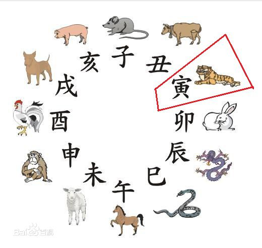

********
增广贤文
********

简介
====

.. sidebar:: 增广贤文

   .. image:: Illustration/zengguangxianwen.jpg

《增广贤文》为中国古代儿童启蒙书目。又名《昔时贤文》、《古今贤文》。
书名最早见之于明代万历年间的戏曲《牡丹亭》，据此可推知此书最迟写成于万历年间。
后来，经过明、清两代文人的不断增补，才改成现在这个模样，称《增广昔时贤文》，
通称《增广贤文》。作者一直未见任何书载，只知道清代同治年间儒生周希陶曾进行过重订，
很可能是民间创作的结晶。

古代中国把一天划分为十二个时辰，每个时辰相等於现今的两小时。
相传是古人根据中国十二生肖中的动物的出没时间来命名各个时辰。
又用十二地支来表示，以夜半二十三点至一点为子时，一至三点为
丑时，三至五点为寅时，依次递推。

上篇
====

.. literalinclude:: zengguangxianwen_vol_1
   :linenos:

下篇
====

.. literalinclude:: zengguangxianwen_vol_2
   :linenos:
