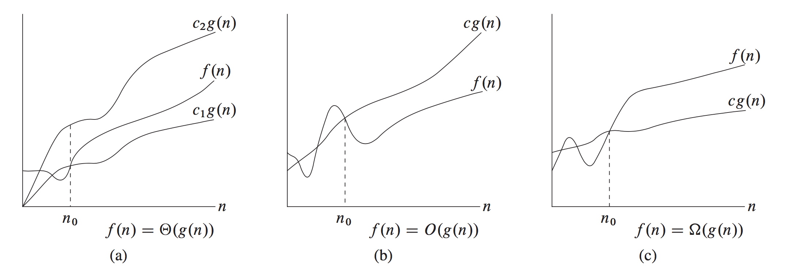

*****************************
Algorithm analysis and design
*****************************

   Taken from *Introduction to algorithms*

#. :math:`\Theta \text{-notation}` - asymptotically tight bound
   
   .. math::

      \Theta(g(n)) = \{0 \le c_1g(n) \le f(n) \le c_2g(n) \}

#. :math:`O \text{-notation}` - asymptotic upper bound

   .. math::

      O(g(n)) = \{0 \le f(n) \le cg(n) \}

   .. note::

      O-notation is often used to bound the worse-case running 
      time of an algorithm.

#. :math:`\Omega \text{-notation}` - asymptotic lower bound
   
   .. math::

      \Omega(g(n)) = \{0 \le cg(n) \le f(n) \}

#. Theorem 3.1
   
   For any two functions f(n) and g(n), we have :math:`f(n)= \Theta(g(n))` 
   if and only if :math:`f(n)=O(g(n))` and :math:`f(n)=\Omega(g(n)).`

#. :math:`o \text{-notation}` - upper bound

   .. math::

      o(g(n)) = \{0 \le f(n) \lt cg(n) \}

   .. note::

      The main difference between O-notation and o-notation is that
      in f(n)=O(g(n)), the bound :math:`0 \le f(n) \le cg(n)` holds
      true for some constant c > 0. but in f(n)=o(g(n)), the bound 
      :math:`0 \le f(n) \lt cg(n)` holds true for all constants c > 0.
      that is, :math:`\lim \limits_{n \to \infty} \frac{f(n)}{g(n)} = 0.`

#. :math:`\omega \text{-notation}` - lower bound

   .. math::

      o(g(n)) = \{0 \lt cg(n) \le f(n) \}

   .. note::

      By analogy, :math:`\omega-notation` is to :math:`\Omega-notation` as
      o-notation is to O-notation, the relation :math:`f(n) = \omega(g(n))`
      implies that :math:`\lim \limits_{n \to \infty} \frac{f(n)}{g(n)} = \infty.`

#. Fibonacci series

   .. code-block:: python
   
      # exponential complexity O(2^n)
      def fibnacci_1(n):
         """return the nth element in fibonacci series."""
         if n < 2:
            return n
         else:
            return fibnacci_1(n-1) + fibnacci_1(n-2) 
   
      # linear complexity O(n)
      def fibonacci_2(n):
         """Return a list containing the Fibonacci series up to n."""
         result = []
         a, b = 0, 1
         while a<n:
            result.append(a)
            a, b = b, b+a
         return result

