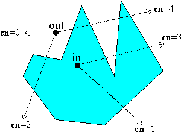
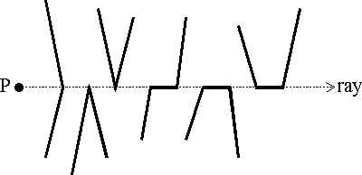

*********************************
Point in Polygon - implementation
*********************************

Overview
========

Determining the inclusion of a point P in a 2D planar polygon is a geometric problem 
that results in interesting algorithms. Two commonly used methods are:

   #. The Crossing Number (cn) method
      
      which counts the number of times a ray starting from the point P 
      crosses the polygon boundary edges. The point is outside when this 
      "crossing number" is even; otherwise, when it is odd, the point is 
      inside. This method is sometimes referred to as the "even-odd" test.
    
   #. The Winding Number (wn) method
      
      which counts the number of times the polygon winds around the point P. 
      The point is outside only when this "winding number" *wn = 0*; 
      otherwise, the point is inside.
   
If a polygon is simple (i.e., it has no self intersections), then both methods give the same 
result for all points. But for non-simple polygons, the two methods can give different answers 
for some points. For example, when a polygon overlaps with itself, then points in the region 
of overlap are found to be outside using the crossing number, but are inside using the winding 
number, as shown in the diagrams:

+--------------------------------------+----------------------------------------+
| Cross Number Method                  | Winding Number Method                  |
+--------------------------------------+----------------------------------------+
| .. image:: images/cross_number_0.gif | .. image:: images/winding_number_0.gif |
+--------------------------------------+----------------------------------------+

Vertices are  numbered: 0 1 2 3 4 5 6 7 8 9.

In this example, points inside the overlap region have **wn = 2**, implying that they are inside 
the polygon twice. Clearly, the winding number gives a better intuitive answer than the crossing 
number does.

The Crossing Number
===================

This method counts the number of times a ray starting from a point P crosses a polygon boundary edge 
separating it's inside and outside. If this number is even, then the point is outside; otherwise, when 
the crossing number is odd, the point is inside. 

In implementing an algorithm for the *cn* method, one must insure that only crossings that change the 
in-out parity are counted. In particular, special cases where the ray passes through a vertex must be 
handled properly. These include the following types of ray crossings:

Further, one must decide whether a point on the polygon's boundary is inside or outside. A standard 
convention is to say that a point on a left or bottom edge is inside, and a point on a right or top edge 
is outside. This way, if two distinct polygons share a common boundary segment, then a point on that 
segment will be in one polygon or the other, but not both at the same time. This avoids a number of 
problems that might occur, especially in computer graphics displays.

A straightforward "crossing number" algorithm selects a horizontal ray extending to the right of P 
and parallel to the positive x-axis. Using this specific ray, it is easy to compute the intersection 
of a polygon edge with it. It is even easier to determine when no such intersection is possible. 
To count the total crossings, *cn*, the algorithm simply loops through all edges of the polygon, tests 
each for a crossing, and increments *cn* when one occurs. Additionally, the crossing tests must handle 
the special cases and points on an edge. This is accomplished by the **Edge Crossing Rules** :

   * an upward edge includes its starting endpoint, and excludes its final endpoint.
   * a downward edge excludes its starting endpoint, and includes its final endpoint.
   * horizontal edges are excluded.
   * the edge-ray intersection point must be strictly right of the point P.

One can apply these rules to the preceding special cases, and see that they correctly 
determine valid crossings. Note that Rule #4 results in points on a right-side boundary 
edge being outside, and ones on a left-side edge being inside.

Pseudo-Code: Crossing Number Inclusion
======================================

Code for this algorithm is well-known, and the edge crossing rules are easily expressed. 
For a polygon represented as an array *V[n+1]* of vertex points with *V[n]=V[0]*, popular 
implementation logic is as follows::

   typedef struct {int x, y;} Point;
   
   int cn_PnPoly( Point P, Point V[], int n )
   {
       int cn = 0;    // the  crossing number counter
   
       // loop through all edges of the polygon
       for (each edge E[i]:V[i]V[i+1] of the polygon) {
           if (E[i] crosses upward ala Rule #1
            || E[i] crosses downward ala  Rule #2) {
               if (P.x <  x_intersect of E[i] with y=P.y)   // Rule #4
                    ++cn;   // a valid crossing to the right of P.x
           }
       }
       return (cn&1);    // 0 if even (out), and 1 if  odd (in)
   }
 
Note that the tests for upward and downward crossing satisfying Rules #1 and #2 also exclude horizontal 
edges (Rule #3). All-in-all, a lot of work is done by just a few tests which makes this an elegant algorithm.

The Winding Number
==================

On the other hand, the winding number accurately determines if a point is inside a nonsimple closed polygon. 
It does this by computing how many times the polygon winds around the point. A point is outside only when the 
polygon doesn't wind around the point at all which is when the winding number **wn = 0**. More generally, one 
can define the winding number **wn(P,C)** of any closed continuous curve **C** around a point **P** in the 2D 
plane. Let the continuous 2D curve *C* be defined by the points **C(u)=(x(u),y(u))**, for :math:`0 \leq u \leq 1` 
with **C(0)=C(1)**. And let **P** be a point not on **C**. Then, define the vector **c(P,u) = C(u) – P** from 
**P** to **C(u)**, and the unit vector **w(P,u) = c(P,u) / |c(P,u)|** which gives a continuous function 
:math:`W(P): C \mapsto S^1` mapping the point **C(u)** on **C** to the point **w(P,u)** on the unit circle 
:math:`S^1 : \{(x,y) | x^2+y^2=1\}`. This map can be represented in polar coordinates as 
:math:`W(P)(u)=(\cos \theta(u), \sin \theta(u))` where :math:\`theta(u)` is a positive counterclockwise angle 
in radians. The winding number **wn(P,C)** is then equal to the integer number of times that **W(P)** wraps **C** 
around :math:`S^1`. This corresponds to a homotopy class of :math:`S^1`, and can be computed by the integral:

.. math::

   wn(P, C) = \frac{1}{2\pi} \underset{W(P)}{\oint} \,d\theta = \frac{1}{2\pi} \int_{u=0}^{1} \theta(u)\,du

When the curve **C** is a polygon with vertices :math:`V_0,V_1,...,V_n = V_0`, this integral reduces to the sum 
of the (signed) angles that each :math:`\angle V_{i}V_{i+1}` subtends with the point **P**. So, if 
:math:`\theta_i = \angle(PV_{i},PV_{i+1})`, we have:

.. math:: 

   \begin{aligned}
   wn(P, C) =& \frac{1}{2\pi} \sum_{i=0}^{n-1} \theta_{i} \\
            =& \frac{1}{2\pi} \sum_{i=0}^{n-1} \arccos 
            \bigg(\frac {(V_{i} - P) \cdot (V_{i+1} - P)}{\|(V_{i} - P)\| \cdot \|(V_{i+1} - P)\|} \bigg)
   \end{aligned}

.. image:: images/winding_number_1.gif

This formula is clearly not very efficient since it uses a computationally expensive *arccos()* trigonometic function. 
But, a simple observation lets us replace this formula by a more efficient one. Pick any point **Q** on :math:`S^1`. 
Then, as the curve **W(P)** wraps around :math:`S^1`, it passes **Q** a certain number of times. If we count (+1) when 
it passes **Q** counterclockwise, and (–1) when it passes clockwise, then the accumulated sum is exactly the total number 
of times that **W(P)** wraps around :math:`S^1`, and is equal to the winding number **wn(P,C)**. Further, if we take an 
infinite ray **R** starting at **P** and extending in the direction of the vector **Q**, then intersections where **R** 
crosses the curve **C** correspond to the points where **W(P)** passes **Q**. To do the math, we have to distinguish 
between positive and negative crossings where **C** crosses **R** from right-to-left or left-to-right. This can be determined 
by the sign of the dot product between a normal vector to **C** and the direction vector **q = Q**, and when the curve **C** 
is a polygon, one just needs to make this determination once for each edge. For a horizontal ray **R** from **P**, testing whether 
an edge's endpoints are above and below the ray suffices. If the edge crosses the ray from below to above, the crossing is positive (+1); 
but if it crosses from above to below, the crossing is negative (–1). One then simply adds all crossing values to get **wn(P,C)**. 
For example:

.. image:: images/winding_number_2.gif

Additionally, one can avoid computing the actual edge-ray intersection point by using the *isLeft()* attribute; 
however, it needs to be applied differently for ascending and descending edges. If an upward edge crosses the ray 
to the right of P, then P is on the left side of the edge since :math:`\triangle V_{i}V_{i+1}P` is 
oriented counterclockwise. On the other hand, a downward edge crossing the ray would have P on the 
right side since :math:`\triangle V_{i}V_{i+1}P` would then be oriented clockwise.

.. image:: images/winding_number_3.gif

Pseudo-Code: Winding Number Inclusion
=====================================

This results in the following wn algorithm which is an adaptation of the *cn* algorithm 
and uses the same edge crossing rules as before to handle special cases.

.. code-block:: none

   typedef struct {int x, y;} Point;
   
   int wn_PnPoly( Point P, Point V[], int n )
   {
       int wn = 0;    // the  winding number counter
   
       // loop through all edges of the polygon
       for (each edge E[i]:V[i]V[i+1] of the polygon) {
           if (E[i] crosses upward ala Rule #1)  {
               if (P is  strictly left of E[i])    // Rule #4
                    ++wn;   // a valid up intersect right of P.x
           }
           else
           if (E[i] crosses downward ala Rule  #2) {
               if (P is  strictly right of E[i])   // Rule #4
                    --wn;   // a valid down intersect right of P.x
           }
       }
       return wn;    // =0 <=> P is outside the polygon
   }

Clearly, this winding number algorithm has the same efficiency as the analogous crossing number algorithm. 
Thus, since it is more accurate in general, the winding number algorithm should always be the preferred method 
to determine inclusion of a point in an arbitrary polygon.

Enhancements
============

There are some enhancements to point in polygon algorithms that software developers should be aware of. 
We mention a few that pertain to ray crossing algorithms. However, there are other techniques that give 
better performance in special cases such as testing inclusion in small convex polygons like triangles. 
These are discussed in [Haines, 1994].

Bounding Box or Ball
--------------------

It is efficient to first test that a point P is inside the bounding box or ball of a large polygon 
before testing all edges for ray crossings. If a point is outside the bounding box or ball, it is 
also outside the polygon, and no further testing is needed. But, one must precompute the bounding 
box (the max and min for vertex x and y coordinates) or the bounding ball (center and minimum radius) 
and store it for future use. This is worth doing if more than a few points are going to be tested for 
inclusion, which is generally the case.

3D Planar Polygons
------------------

In 3D applications, one sometimes wants to test a point and polygon that are in the same plane. 
For example, one may have the intersection point of a ray with the plane of a polyhedron's face, 
and want to test if it is inside the face. Or one may want to know if the base of a 3D perpendicular 
dropped from a point is inside a planar polygon.

**3D inclusion is easily determined by projecting the point and polygon into 2D.** To do this, one 
simply ignores one of the 3D coordinates and uses the other two. To optimally select the coordinate 
to ignore, compute a normal vector to the plane, and select the coordinate with the largest absolute 
value. This gives the projection of the polygon with maximum area, and results in robust computations.

Implementations
===============

.. code-block:: cpp
   :caption: a C++ implementation of the winding number algorithm

   // isLeft(): tests if a point is Left|On|Right of an infinite line.
   //    Input:  three points P0, P1, and P2
   //    Return: >0 for P2 left of the line through P0 and P1
   //            =0 for P2  on the line
   //            <0 for P2  right of the line
   //    See: Algorithm 1 "Area of Triangles and Polygons"
   //    Using vertor product of P0P1 and P0P2,
   //    relative to direction P0 --> P1
   //===================================================================
   
   inline int isLeft( Point P0, Point P1, Point P2 )
   {
       return ( (P1.x - P0.x) * (P2.y - P0.y)
               - (P2.x -  P0.x) * (P1.y - P0.y) );
   }
   
   
   // cn_PnPoly(): crossing number test for a point in a polygon
   //      Input:   P = a point,
   //               V[] = vertex points of a polygon V[n+1] with V[n]=V[0]
   //      Return:  0 = outside, 1 = inside
   // This code is patterned after [Franklin, 2000]
   int cn_PnPoly( Point P, Point* V, int n )
   {
       int cn = 0;    // the  crossing number counter
   
       // loop through all edges of the polygon
       for (int i=0; i<n; i++) {    // edge from V[i]  to V[i+1]
          if (((V[i].y <= P.y) && (V[i+1].y > P.y))     // an upward crossing
           || ((V[i].y > P.y) && (V[i+1].y <=  P.y))) { // a downward crossing
               // compute  the actual edge-ray intersect x-coordinate
               float vt = (float)(P.y  - V[i].y) / (V[i+1].y - V[i].y);
               if (P.x <  V[i].x + vt * (V[i+1].x - V[i].x)) // P.x < intersect
                    ++cn;   // a valid crossing of y=P.y right of P.x
           }
       }
       return (cn&1);    // 0 if even (out), and 1 if  odd (in)
   
   }
   //===================================================================
   
   // wn_PnPoly(): winding number test for a point in a polygon
   //      Input:   P = a point,
   //               V[] = vertex points of a polygon V[n+1] with V[n]=V[0]
   //      Return:  wn = the winding number (=0 only when P is outside)
   int wn_PnPoly( Point P, Point* V, int n )
   {
       int wn = 0;    // the  winding number counter
   
       // loop through all edges of the polygon
       for (int i=0; i<n; i++) {   // edge from V[i] to  V[i+1]
           if (V[i].y <= P.y) {          // start y <= P.y
               if (V[i+1].y  > P.y)      // an upward crossing
                    if (isLeft( V[i], V[i+1], P) > 0)  // P left of  edge
                        ++wn;            // have  a valid up intersect
           }
           else {                        // start y > P.y (no test needed)
               if (V[i+1].y  <= P.y)     // a downward crossing
                    if (isLeft( V[i], V[i+1], P) < 0)  // P right of  edge
                        --wn;            // have  a valid down intersect
           }
       }
       return wn;
   }
   