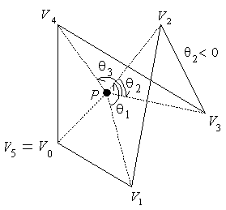
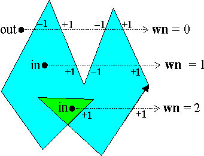
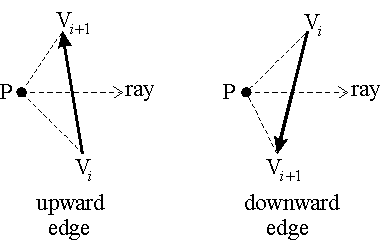

*********************************
Point in Polygon - implementation
*********************************

Overview
========

Determining the inclusion of a point P in a 2D planar polygon is a geometric problem 
that results in interesting algorithms. Two commonly used methods are:

   #. The Crossing Number (cn) method
      
      which counts the number of times a ray starting from the point P 
      crosses the polygon boundary edges. The point is outside when this 
      "crossing number" is even; otherwise, when it is odd, the point is 
      inside. This method is sometimes referred to as the "even-odd" test.
    
   #. The Winding Number (wn) method
      
      which counts the number of times the polygon winds around the point P. 
      The point is outside only when this "winding number" *wn = 0*; 
      otherwise, the point is inside.
   

Edge Crossing Rules
===================

* an upward edge includes its starting endpoint, and excludes its final endpoint;
* a downward edge excludes its starting endpoint, and includes its final endpoint;
* horizontal edges are excluded
* the edge-ray intersection point must be strictly right of the point P.

One can apply these rules to the preceding special cases, and see that they correctly 
determine valid crossings. Note that Rule #4 results in points on a right-side boundary 
edge being outside, and ones on a left-side edge being inside.

The Winding Number
==================

On the other hand, the winding number accurately determines if a point is inside a nonsimple closed polygon. 
It does this by computing how many times the polygon winds around the point. A point is outside only when the 
polygon doesn't wind around the point at all which is when the winding number **wn = 0**. More generally, one 
can define the winding number **wn(P,C)** of any closed continuous curve **C** around a point **P** in the 2D 
plane. Let the continuous 2D curve *C* be defined by the points **C(u)=(x(u),y(u))**, for :math:`0 \leq u \leq 1` 
with **C(0)=C(1)**. And let **P** be a point not on **C**. Then, define the vector **c(P,u) = C(u) – P** from 
**P** to **C(u)**, and the unit vector **w(P,u) = c(P,u) / |c(P,u)|** which gives a continuous function 
:math:`W(P): C \mapsto S^1` mapping the point **C(u)** on **C** to the point **w(P,u)** on the unit circle 
:math:`S^1 : \{(x,y) | x^2+y^2=1\}`. This map can be represented in polar coordinates as 
:math:`W(P)(u)=(\cos \theta(u), \sin \theta(u))` where :math:\`theta(u)` is a positive counterclockwise angle 
in radians. The winding number **wn(P,C)** is then equal to the integer number of times that **W(P)** wraps **C** 
around :math:`S^1`. This corresponds to a homotopy class of :math:`S^1`, and can be computed by the integral:

.. math::

   wn(P, C) = \frac{1}{2\pi} \underset{W(P)}{\oint} \,d\theta = \frac{1}{2\pi} \int_{u=0}^{1} \theta(u)\,du

When the curve **C** is a polygon with vertices :math:`V_0,V_1,...,V_n = V_0`, this integral reduces to the sum 
of the (signed) angles that each :math:`\angle V_{i}V_{i+1}` subtends with the point **P**. So, if 
:math:`\theta_i = \angle(PV_{i},PV_{i+1})`, we have:

.. math:: 

   \begin{aligned}
   wn(P, C) =& \frac{1}{2\pi} \sum_{i=0}^{n-1} \theta_{i} \\
            =& \frac{1}{2\pi} \sum_{i=0}^{n-1} \arccos 
            \bigg(\frac {(V_{i} - P) \cdot (V_{i+1} - P)}{\|(V_{i} - P)\| \cdot \|(V_{i+1} - P)\|} \bigg)
   \end{aligned}

This formula is clearly not very efficient since it uses a computationally expensive *arccos()* trigonometic function. 
But, a simple observation lets us replace this formula by a more efficient one. Pick any point **Q** on :math:`S^1`. 
Then, as the curve **W(P)** wraps around :math:`S^1`, it passes **Q** a certain number of times. If we count (+1) when 
it passes **Q** counterclockwise, and (–1) when it passes clockwise, then the accumulated sum is exactly the total number 
of times that **W(P)** wraps around :math:`S^1`, and is equal to the winding number **wn(P,C)**. Further, if we take an 
infinite ray **R** starting at **P** and extending in the direction of the vector **Q**, then intersections where **R** 
crosses the curve **C** correspond to the points where **W(P)** passes **Q**. To do the math, we have to distinguish 
between positive and negative crossings where **C** crosses **R** from right-to-left or left-to-right. This can be determined 
by the sign of the dot product between a normal vector to **C** and the direction vector **q = Q**, and when the curve **C** 
is a polygon, one just needs to make this determination once for each edge. For a horizontal ray **R** from **P**, testing whether 
an edge's endpoints are above and below the ray suffices. If the edge crosses the ray from below to above, the crossing is positive (+1); 
but if it crosses from above to below, the crossing is negative (–1). One then simply adds all crossing values to get **wn(P,C)**. 
For example:

Additionally, one can avoid computing the actual edge-ray intersection point by using the *isLeft()* attribute; 
however, it needs to be applied differently for ascending and descending edges. If an upward edge crosses the ray 
to the right of P, then P is on the left side of the edge since :math:`\triangle V_{i}V_{i+1}P` is 
oriented counterclockwise. On the other hand, a downward edge crossing the ray would have P on the 
right side since :math:`\triangle V_{i}V_{i+1}P` would then be oriented clockwise.

Pseudo-Code: Winding Number Inclusion
=====================================

This results in the following wn algorithm which is an adaptation of the *cn* algorithm 
and uses the same edge crossing rules as before to handle special cases.

.. code-block:: none

   typedef struct {int x, y;} Point;
   
   wn_PnPoly( Point P, Point V[], int n )
   {
       int    wn = 0;    // the  winding number counter
   
       // loop through all edges of the polygon
       for (each edge E[i]:V[i]V[i+1] of the polygon) {
           if (E[i] crosses upward ala Rule #1)  {
               if (P is  strictly left of E[i])    // Rule #4
                    ++wn;   // a valid up intersect right of P.x
           }
           else
           if (E[i] crosses downward ala Rule  #2) {
               if (P is  strictly right of E[i])   // Rule #4
                    --wn;   // a valid down intersect right of P.x
           }
       }
       return wn;    // =0 <=> P is outside the polygon
   }

Clearly, this winding number algorithm has the same efficiency as the analogous crossing number algorithm. 
Thus, since it is more accurate in general, the winding number algorithm should always be the preferred method 
to determine inclusion of a point in an arbitrary polygon.

Enhancements
============

There are some enhancements to point in polygon algorithms that software developers should be aware of. 
We mention a few that pertain to ray crossing algorithms. However, there are other techniques that give 
better performance in special cases such as testing inclusion in small convex polygons like triangles. 
These are discussed in [Haines, 1994].

Bounding Box or Ball
--------------------

It is efficient to first test that a point P is inside the bounding box or ball of a large polygon 
before testing all edges for ray crossings. If a point is outside the bounding box or ball, it is 
also outside the polygon, and no further testing is needed. But, one must precompute the bounding 
box (the max and min for vertex x and y coordinates) or the bounding ball (center and minimum radius) 
and store it for future use. This is worth doing if more than a few points are going to be tested for 
inclusion, which is generally the case.