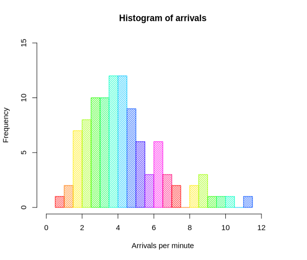

Computer Terminology
====================

| Rat’s nest
| Definition: A situation or condition that is characterized by messiness, disorder, disarray, or confusion. Commonly used in the technology sector to refer to a software design or implementation that is hopelessly convoluted and difficult to understand, analogous to how a rat might construct its nest (haphazardly and hastily thrown together from whatever materials happended to be readily available at the time).
| Usage: I tried to figure out which wire was causing the problem, but there’s a veritable rat’s nest of wires, chords, and cables down there.
| 
| Type coercison and conversion 
| Automatic coercison [强制转换]
| two’s complement [二进制补码]
| backward compatibility [向下兼容]
| regression test [回归测试]
| divide-and-conquer [分而治之]
| compile time
| run-time
| predecessor [前驱]
| successor  [后继]
| spam email [垃圾邮件]
| implementation-dependent
|
| PEP -- python enhancement proposal
| DoS  -- Denial-of-Service
| DDoS -- Distributed Denial-of-Service
| ISA = Instruction Set Architecture
| CISC = Complex Instruction Set Computing
| RISC = Reduced Instruction Set Computing
| SoC = System on Chip
| ALU = Arithmetic Logic Unit
| XML = Extensive Markup Language
| POSIX = Portable Operating System Interface
| UTC = Coordinated Universal Time
|
| concatenate
| concatenation
| Definition: a concatenation of things or events is their occurrence one after another, because they are linked.
| 
| cipher
| Definition: A person or thing of no importance, especially a person who does the bidding of others and seems to have no will of their own.
| Definition: A sceret way of writing, especially six in which a set of letters or symbols is used to represent others.
| Usage: A message in cipher.
| 
| corrupt
| corruption
| Definition: the process by which something, typically a word or expression, is changed from its original use or meaning to one that is regarded as erroneous or debased.
| Usage: The word “holiday” is a corruption of “holy day”.
| Definition: the process of causing errors to appear in a computer program or database.
|
| heuristic
| Definition: enabling a person to discover or learn something for themselves.
| Usage: Heuristic teaching encourages you to learn by discovering things for yourself.
| Definition: (Computing) proceeding to a solution by trial and error or by rules that are loosely defined.
| 
| overhead == cost
| hover
| Definition: (Computing) use a mouse or other device to position the cursor over a particular area of a computer screen so as to cause a program to respond, without clicking a button on the device.
| Usage: You can hover your cursor over any button to see an explanation.
| 
| on the fly
| Definition: (of an addition or modification in computing) Carried out during the running of a program without interruption.
| 
| sync
| synchronize
| synchronization   
| Definition: occur at the same time or rate.
| Definition: (Computing) cause (a set of data or files) to remain identical in more than one location.
| Usage: you can synchronize your calendar with your GPS devices and get alerted when you need to leave for an appointment.
| 
| prefix  VS suffix 
| prepend VS append
| implicit    explicit
| modularity
| data hiding
| data corruption
| polymorphism
| class hierarchy
| inheritance
| public inheritance
| protected inheritance
| private inheritance
| 
| Qualcomm Snapdragon processor 高通骁龙处理器
| Samsung 三星
|
| breadth-first traversal 广度优先遍历
| depth-first traversal 深度优先遍历
|
| archive
| Definition: The archive or archives are a collection of documents and records that contain historical information.
| Usage: zip archive.
| portfolio
| Definition: a large, thin, flat case for loose sheets of paper such as drawing or maps.
| Definition: a portfolio is a set of pictures by someone, or photographs of examples of their work, which they use when entering competitions or applying for work.

**Subscript vs Superscript [上标，下标]**

A subscript or superscript is a number, figure, symbol, or indicator
that is smaller than the normal line of type and is set slightly below
or above it. Subscripts appear at or below the baseline, while
superscripts are above.

**Co-Processor**

A coprocessor is a computer processor used to supplement the functions
of the primary processor (the CPU). Operations performed by the coprocessor
may be floating point arithmetic, graphics, signal processing, string processing,
encryption or I/O Interfacing with peripheral devices. By offloading processor-intensive
tasks from the main processor, coprocessors can accelerate system performance.
Coprocessors allow a line of computers to be customized, so that customers who
do not need the extra performance don't need to pay for it.

**Rate limiting**

In computer networks, rate limiting is used to control the rate
of traffic sent or received by a network interface controller
and is used to prevent :abbr:`DoS (Denial-of-Service)` attacks.

**Octet**

The octet is a unit of digital information in computing and telecommunications
that consists of eight bits. The term is often used when the term **byte** might be
ambiguous, as the byte has historically been used for storage units of a variety of sizes.

**Datapath**

A datapath is a collection of functional units such as :abbr:`ALU (Arithmetic Logic Unit)`
or multipliers, that perform data processing operations, registers, and buses. Along with
the control unit it composes the :abbr:`CPU (Central Processing Unit)`. A larger datapath
can be made by joining more than one number of datapaths using multiplexer.

superset: a set that includes another set or sets.

**Bits, Bytes and Words**

A **bit** is a BInary digiT. So a bit is a zero or a one. Bits can be implemented in computer
hardware using switches. If the switch is on then the bit is one and if the switch is off
then the bit is zero. A bit is limited to representing two values.

Since the alphabet contains more than two letters, a letter cannot be represented by a bit.
A **byte** is a sequence of bits. Since the mid 1960's a byte has been 8 bits in length. 01000001
is an example of a byte. Since there are 8 bits in a byte there are :math:`2^8` different possible
sequences for one byte, ranging from 00000000 to 11111111. This means that a byte can be used to
represent any type of value with no more than 256 possible values. Since the number of things that
you can enter on a computer keyboard is smaller than 256 (including all keystoke pairs, like shift
or control plus another key), **a code for a keystoke is represented with a code within a byte**.

Since characters (letters, decimal digits and special characters such as punctuation marks, etc) can
be represented with bytes, a standard is needed to ensure that the code that's used on your computer
is the same as the code that is used on mine. There are two standard codes that use one byte to represent
a character, **ASCII** and **EBCDIC**. :abbr:`ASCII (American Standard Code for Information Interchange)` is
the code that is most commonly used today. :abbr:`EBCDIC (Extended Binary Coded Decimal Interchange Code)`,
was used by IBM on its large mainframe computers in the past. Wikipedia has more than you want to know
about ASCII and EBCDIC. Since these codes are limited to 256 possible combinations, certain character
sets, such as Chinese, Arabic, Japanese, Klingon and others, cannot be represented using these codes.
This problem is solved by using another code, **Unicode**, which uses 2 bytes for each character. This
extension allows :math:`2^{16}` different symbols to be represented, a total of 65,536. The use of Unicode
gives more flexibility in the representation of data. The drawback of using Unicode is that it takes twice
as much space to store the same number of characters.

A **word** is the number of bits that are manipulated as a unit by the particular CPU of the computer.
Today most CPUs have a word size of 32 or 64 bits. For example, the notebook computer that I bought in
May 2008 contains a core 2 duo 64 bit processor. Data is fetched from memory to the processor in word
size chunks and manipulated by the ALU in word size chunks. All other things being equal, (and they
never are), larger word size implies faster and more flexible processing.

**What is the difference between 32-bit and 64-bit versions of Windows?**

The terms 32-bit and 64-bit refer to the way a computer's processor (also called a CPU), handles information.
The 64-bit version of Windows handles large amounts of :abbr:`RAM (random access memory)` more effectively than
a 32-bit system. 

To install a 64-bit version of Windows, you need a CPU that's capable of running a 64-bit version of Windows.
The benefits of using a 64-bit operating system are most apparent when you have a large amount of RAM
installed on your computer, typically 4 GB of RAM or more. In such cases, because a 64-bit operating system
can handle large amounts of memory more efficiently than a 32-bit operating system, a 64-bit system can be
more responsive when running several programs at the same time and switching between them frequently. 

**Amortized analysis**

In computer science, amortized analysis is a method for analyzing a given algorithm's complexity,
or how much of a resource, especially time or memory, it takes to execute. The motivation for
amortized analysis is that looking at the worst-case run time per operation can be too pessimistic.

While certain operations for a given algorithm may have a significant cost in resources, other operations
may not be as costly. Amortized analysis considers both the costly and less costly operations together over
the whole series of operations of the algorithm. This may include accounting for different types of input,
length of the input, and other factors that affect its performance.

**Asymptotic Computational Complexity**

In computational complexity theory, asymptotic computational complexity is the usage of asymptotic analysis 
for the estimation of computational complexity of algorithms and computational problems, commonly associated 
with the usage of the big **O** notation.

**Concurrence vs Parallelism**

+-----------------------------------+-----------------------------------+
| Concurrence                       | Parallelism                       |
+===================================+===================================+
| .. image:: images/concurrency.jpg | .. image:: images/parallelism.jpg |
+-----------------------------------+-----------------------------------+

**Histogram**

A histogram is an accurate representation of the distribution of numerical data. 
It is an estimate of the probability distribution of a continuous variable 
(quantitative variable) and was first introduced by Karl Pearson. It differs 
from a bar graph, in the sense that a bar graph relates two variables, but 
a histogram relates only one. To construct a histogram, the first step is 
to "bin" the range of values—that is, divide the entire range of values into 
a series of intervals—and then count how many values fall into each interval. 
The bins are usually specified as consecutive, non-overlapping intervals of a 
variable. The bins (intervals) must be adjacent, and are often (but are not 
required to be) of equal size.

**Associative array**

In computer science, an associative array, map, symbol table, or dictionary is 
an abstract data type composed of a collection of *(key, value)* pairs, such 
that each possible key appears at most once in the collection.

Operations associated with this data type allow:

   * the addition of a pair to the collection
   * the removal of a pair from the collection
   * the modification of an existing pair
   * the lookup of a value associated with a particular key
     
The **dictionary problem** is a classic computer science problem: the task of 
designing a data structure that maintains a set of data during 'search', 'delete', 
and 'insert' operations. The two major solutions to the dictionary problem are a 
**hash table** or a **search tree**. In some cases it is also possible to solve 
the problem using directly addressed arrays, binary search trees, or other more 
specialized structures.

Many programming languages include associative arrays as primitive data types, 
and they are available in software libraries for many others. Content-addressable 
memory is a form of direct hardware-level support for associative arrays.

**Dynamic Array**

.. sidebar:: Dynamic Array

   .. image:: images/Dynamic_array.svg

   Several values are inserted at the end of a dynamic array using geometric expansion. 
   Grey cells indicate space reserved for expansion. Most insertions are fast (constant 
   time), while some are slow due to the need for reallocation (Θ(n) time, labelled with 
   turtles). The logical size and capacity of the final array are shown.

In computer science, a dynamic array, growable array, resizable array, dynamic table, 
mutable array, or array list is a random access, variable-size list data structure 
that allows elements to be added or removed. It is supplied with standard libraries 
in many modern mainstream programming languages. Dynamic arrays overcome a limit of 
static arrays, which have a fixed capacity that needs to be specified at allocation.

A dynamic array is not the same thing as a dynamically allocated array, which is an 
array whose size is fixed when the array is allocated, although a dynamic array may 
use such a fixed-size array as a back end.

**Prefix sum**

In computer science, the prefix sum, cumulative sum, inclusive scan, or simply scan 
of a sequence of numbers :math:`x_0, x_1, x_2, ...` is a second sequence of numbers 
:math:`y_0, y_1, y_2, ...`, the sums of prefixes (running totals) of the input 
sequence:

.. math::

   y_0 &= x_0 \\
   y_1 &= x_0 + x_1 \\
   y_2 &= x_0 + x_1 + x_2 \\
   ...

Prefix sums are trivial to compute in sequential models of computation, by using the 
formula :math:`y_i = y_{i − 1} + x_i` to compute each output value in sequence order. 
However, despite their ease of computation, prefix sums are a useful primitive in 
certain algorithms such as counting sort, and they form the basis of the scan 
higher-order function in functional programming languages. Prefix sums have also 
been much studied in parallel algorithms, both as a test problem to be solved 
and as a useful primitive to be used as a subroutine in other parallel algorithms.

**Algorithmic Complexity and Big-O Notation**

Common Big-O notations:

   * Linear -- :math:`O(n)`
   * Quadratic -- :math:`O(n^2)`
   * Cubic -- :math:`O(n^3)`
   * Logarithmic -- :math:`O(\log{n})`
   * Exponential -- :math:`O(2^n)`
   * Square root -- :math:`O(\sqrt{n})`

Also note:

   * The basic shape of a polynomial function is determined by the highest 
     valued exponent in the polynomial (called the **order** of the polynomial).

   * Multiplicative constants do not affect the fundamental shape of a curve.  
     Only the steepness of the curve is affected. 

   * Polynomial curves will always overtake logarithmic curves eventually, 
     when the problem size gets big enough, regardless of the multiplicative 
     constants involved.

   * The superiority of the :math:`O(\log{n})` Fermat prime test over the 
     :math:`O(\sqrt{n})` prime test becomes clear for really big integers.

   
**Seconds Since the Epoch**

A value that approximates the number of seconds that have elapsed since the Epoch. 
A Coordinated Universal Time name (specified in terms of seconds (tm_sec), minutes (tm_min), hours (tm_hour), 
days since January 1 of the year (tm_yday), and calendar year minus 1900 (tm_year)) is related to a time 
represented as seconds since the Epoch, according to the expression below.

If the year is <1970 or the value is negative, the relationship is undefined. If the year is >=1970 and the 
value is non-negative, the value is related to a Coordinated Universal Time name according to the C-language 
expression, where tm_sec, tm_min, tm_hour, tm_yday, and tm_year are all integer types::

   tm_sec + tm_min*60 + tm_hour*3600 + tm_yday*86400 +
       (tm_year-70)*31536000 + ((tm_year-69)/4)*86400 -
       ((tm_year-1)/100)*86400 + ((tm_year+299)/400)*86400

The relationship between the actual time of day and the current value for seconds since the Epoch is unspecified.

How any changes to the value of seconds since the Epoch are made to align to a desired relationship with the current 
actual time is implementation-defined. As represented in seconds since the Epoch, each and every day shall be accounted 
for by exactly 86400 seconds.

.. note::

   The last three terms of the expression add in a day for each year that follows a leap year 
   starting with the first leap year since the Epoch. The first term adds a day every 4 years 
   starting in 1973, the second subtracts a day back out every 100 years starting in 2001, and 
   the third adds a day back in every 400 years starting in 2001. The divisions in the formula 
   are integer divisions; that is, the remainder is discarded leaving only the integer quotient.
