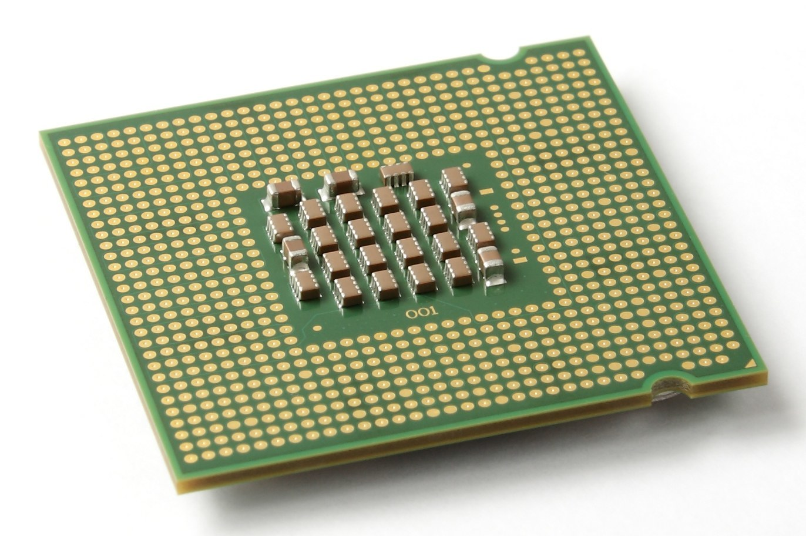
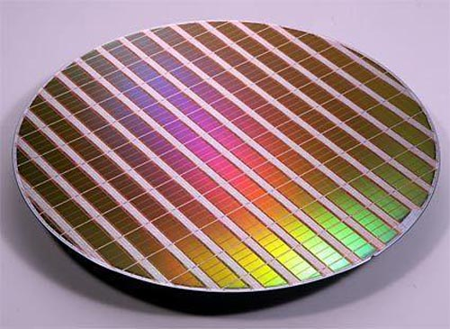
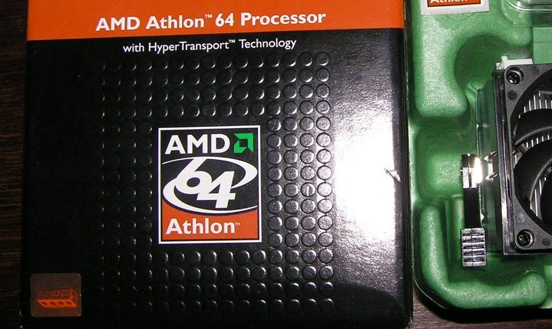
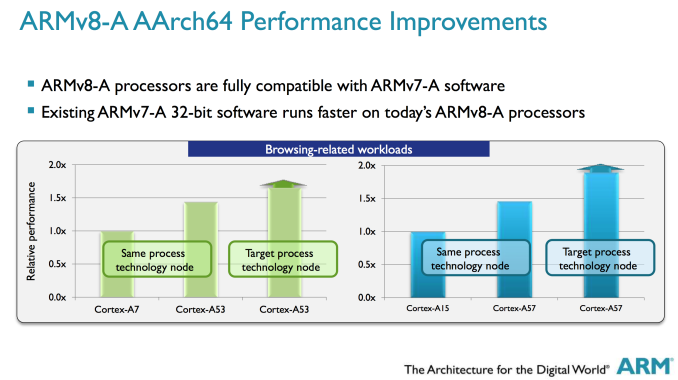
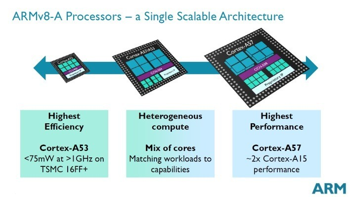

ARM vs X86 – Key differences explained!
=======================================

.. image:: images/android_cpus.jpg

Android supports 3 different processor architectures: **ARM, Intel and MIPS**.
The most popular and ubiquitous of these three is, without a doubt, ARM. Intel
is well known primarily because of its popularity in the desktop and server markets,
however on mobile it has had less of an impact. MIPS has a long heritage, and lots
of success, for both 32-bit and 64-bit solutions in a variety of embedded spaces,
however it is currently the least popular of the three CPU designs for Android.

In short, ARM is the current winner and Intel is its big brand rival. So what is
the difference between an ARM processor and an Intel processor? Why is ARM the more
popular choice? And does it matter what CPU is in your smartphone or tablet?

The CPU
-------

The :abbr:`CPU (Central Processing Unit)` is the “brains” of your device. Its job is
to execute a sequence of instructions to control the hardware on your device (the display,
the touch screen, the cellular modem etc.) to turn it from a lump of plastic and metal into
a vibrant smartphone or tablet. Mobile devices are complex things and these CPUs need to
execute millions of instructions to make them behave as we expect. The **speed and power efficiency**
of these CPUs is critical. The speed affects the user experience, while the efficiency
affects the battery life. The perfect mobile device is one that has high performance and
low power usage.

This is why the choice of CPU is important. A power hungry, hog of a CPU will drain your
battery fast, however an elegant and efficient CPU will give you both performance and
battery life.

**At the highest level, the first difference between an ARM CPU and an Intel CPU is
that the former is RISC and the latter is CISC.** 

In simplified (and I emphasize , “simplified”) layman’s terms, RISC instructions sets
are smaller, more atomic, while CISC instruction sets are larger, more complex. By
atomic, I mean that each instruction roughly translates to a single operation that
the CPU can perform, e.g. add the contents of two registers together. CISC
instructions express a single idea, but the CPU will need to execute 3 or 4 more
simplified instructions to perform it. For example a CISC CPU can be told to add
together two numbers stored in main memory. To do this, the CPU needs to fetch
the number from address-1 (one operation), fetch the number from address-2 (second
operation), add the two numbers (third operation) and so on.

All modern CPUs use a concept known as **microcode**, an internal instruction set
of CPU that describes atomic operations that CPU can perform. It is these 
smaller (micro) operations that the CPU actually executes. On RISC processors,
the instruction set operations and the microcode operations are very close.
On CISC, the complex instructions need to be translated into smaller microcode
operations. This means that the instruction decoder (the bit that works out
what CPU actually needs to do) is much simpler on a RISC processor, and simpler
means less power and greater efficiency.

Fabrication Process
-------------------

The next major difference between an ARM processor and an Intel processor is that
ARM has only ever designed power efficient processors. Its raison d’être （French,
literally ‘reason for being.’） is to design low-power usage processors. That is
its expertise. However Intel’s expertise is to design super high performance desktop
and server processors. And it has done a good job. Intel is the industry leader in
desktops and servers. Every PC, laptop and server I have owned (with the exception
of one) in the last 20 years had an Intel processor in it. However to get into mobile,
Intel is using the same CISC instruction set architecture that it uses on the desktop,
but it is trying to shoehorn it into smaller processors, suitable for mobile devices.

The average Intel i7 processor produces around 45W of heat. The average ARM based
smartphone SoC (including the GPU) has a maximum instantaneous peak power of around 3W,
some 15 times less than an Intel i7. Now Intel is a big company and they have lots of
smart people working there. Its latest Atom processors have similar thermal designs as
ARM based processors, however to do that it has had to use the latest 22m fabrication
process. In general the lower the fabrication nanometer number, the better the energy
efficiency. ARM processors have similar thermal properties at higher nanometer
fabrication processes. For example the Qualcomm Snapdragon 805 uses a 28nm process.

64-bits
-------

When it comes to 64-bit computing, there are also some significant differences between
ARM and Intel. Did you know that Intel didn’t even invent the 64-bit version of its
x86 instruction set. Known as x86-64 (or sometimes just x64), the instruction set was
actually designed by AMD. The story goes like this, Intel wanted to move into 64-bit
computing, but it knew that to take its current 32-bit x86 architecture and make a 64-bit
version would be inefficient. So it started a new 64-bit processor project called IA64.
This eventually produced the Itanium range of processors. In the meantime AMD knew it
wouldn’t be able to produce IA64 compatible processors, so it went ahead and extended
the x86 design to include 64-bit addressing and 64-bit registers. The resulting architecture,
known as AMD64, became the de-facto 64-bit standard for x86 processors.

The IA64 project was never a big success and today is effectively dead. Intel eventually
adopted AMD64. Intel’s current mobile offerings are 64-bit processors using the 64-bit
instruction set designed by AMD (with a few minor differences).

As for ARM, the story is a quite different. Seeing the need for 64-bit computing on mobile,
ARM announced its ARMv8 64-bit architecture in 2011. It was the culmination of several years
of work on the next generation ARM :abbr:`ISA (Instruction Set Architecture)`. To create a
clean 64-bit implementation, but one based on the existing principles and instruction set,
the ARMv8 architecture uses two execution states, AArch32 and AArch64.

As the names imply, one is for running 32-bit code and one for 64-bit. The beauty of the ARM
design is the processor can seamlessly swap from one mode to the other during its normal execution.
The means that the decoder for the 64-bit instructions is a new design that doesn’t need to maintain
compatibility with the 32-bit era, yet the processor as a whole remains backwardly compatible.

Heterogeneous Computing
-----------------------

ARM’s big.LITTLE architecture is an innovation that Intel is nowhere near replicating.
In big.LITTLE the cores in the CPU don’t need to be of the same type. Traditionally a
dual-core or quad-core processor had 2 or 4 cores of the same type. So a dual-core
Atom processor has two identical x86-64 cores, both offering the same performance and
using the same amount of power. But with big.LITTLE ARM has introduced heterogeneous
computing for mobile devices. This means that the cores can be different in terms of
performance and power. When the mobile device is not busy, a low-energy core can be used,
but when you start a complex game, the high performance cores are used.

But here is the magic. When talking about CPU designs there are a bunch of technical design
decision that alter the performance and the energy usage of the processor. When an instruction
is decoded and prepared for execution, the processor (both Intel and ARM) uses a **pipeline**.
That means that each minute aspect of the decoding process is parallelized. So the part to fetch
the next instruction from the memory is stage 1, then the type of instruction needs to be examined
and decoded - stage 2, then the instruction is actually executed – stage 3, and so on. The beauty
of pipelines is that while the first instruction is in stage 2, the next instruction is already in
stage 1. When the first instruction is in the execution step (stage 3), the second instruction is now
in stage 2 and the third instruction is in stage 1, and so on.

To make things even faster these pipelines can be built so that instructions can actually be executed
in a different order than in the program. There is some clever logic to work out if the next instruction
relies on the result of the instruction ahead of it. Both Intel and ARM have out-of-order-execution logic.
But as you can imagine that is some really complex technology. Complex means power hungry. On Intel processors
the designers choose to implement out-of-order-execution or not. But with heterogeneous computing that isn’t a
problem. The ARM Cortex-A53 uses in-order execution, meaning it uses less power. But the Cortex-A57 uses
out-of-order-execution, meaning it is faster but uses more power. In an big.LITTLE processor there can be Cortex-A53
and Cortex-A57 cores, and the cores are used according to the demands being made. You don’t need super fast out-of-order
execution to background sync your emails, but you do when playing complex games. So the right core is used at the right time.

This principle of using more complex logic in the processor for better performance, and less complex logic for high efficiency,
doesn’t only apply to the instruction pipeline. It equally applies to the floating point unit, to the SIMD logic (i.e. NEON
on ARM and SSE/MMX on Intel), and to the way the L1 and L2 caches work. Intel offers one solution per Atom SoC, ARM, through
its silicon partners, offers multiple configurations many of which can be implemented simultaneously in the same silicon.

Compatibility
-------------

ARM is the current leader in terms of mobile processors. ARM’s partners have shipped 50 billion chips based on its designs,
all for mobile and embedded markets. For Android, ARM is the de-facto standard and this leads to a problem for Intel and MIPS.
Although Android uses Java as its principle programming language, it also allows programmers to take their existing code
(in C or C++, for example) and create apps. These “native” apps are generally compiled for ARM processors and not always
for Intel or MIPS. To get around this Intel and MIPS need to use special translation software which converts the ARM
instructions into code for their processors. This of course impacts performance. At the moment MIPS and Intel can claim
about a 90% compatibility with all the apps available in the Play Store. That figure is probably closer to 100% when
dealing with the top 150 apps. On the one-hand that is a good coverage, but on the other hand it shows ARM’s dominance
in that the other processor designers need to offer a compatibility layer.

Wrap up
-------

Building a CPU is a complex business. ARM, Intel and MIPS are all working hard to bring the best technology available to
mobile devices, however ARM is clearly the leader. With its focus on power efficient processors, its clean 64-bit
implementation, its heterogeneous computing, and its role as the de-facto standard for mobile computing, then it
looks like ARM is set to remain at the top.

