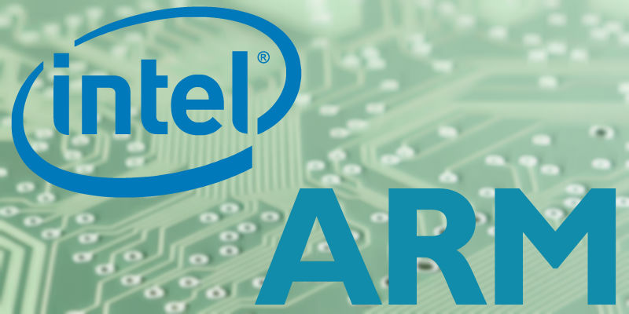

The Differences Between ARM and Intel
=====================================

With the ever-present rumor of ARM MacBooks gaining renewed energy, it’s time to get an understanding of the technical differences between ARM processors and the more common x86 processors made by Intel and AMD.

What Does x86 Mean Anyway?
--------------------------

Intel processors found in desktop and laptop computers are sometimes referred to as “x86” processors. This can be a little confusing if you’ve ever noticed your two Program Files folders on Windows.

Windows 7, 8 and 10 refer to their 32-bit programs with the term “x86” and 64-bit programs (in some contexts) as “x64”. That isn’t strictly accurate. 64-bit-capable processors should be referred to as x86-64, but it’s a lot clunkier.

The “x86” name comes from the original 16-bit Intel processors that used the x86 instruction set, the 8086. Future generations that shared the same instruction set also shared the same suffix, like the 80386. This kept on until the Pentium chips, which broke the naming convention, but we still use “x86” to refer to these kinds of chips.

Instruction Set
---------------

All processors are based around what’s called an “instruction set”. This is a set of rudimentary operations that a chip can perform and instructions for how to perform them. It tells the chip how to do basic math and move data around. The programming language for these instructions is called **assembly language**.

**The core difference between ARM and x86 chips is their instruction set.** x86 chips are `CISC`_. :abbr:`CISC (Complex Instruction Set Computing)` chips attempt to represent a given task in the fewest lines of assembly as possible, abstracting away basic functions. These more complex operations also need to run over the course of multiple clock cycles. ARM chips are `RISC`_. :abbr:`RISC (Reduced Instruction Set Computing)` chips include extremely rudimentary instruction sets, breaking every process down into extremely small, simple steps. Each of these smaller steps can be executed in a single clock cycle.

.. _`CISC`: https://en.wikipedia.org/wiki/Complex_instruction_set_computer
.. _`RISC`: https://en.wikipedia.org/wiki/Reduced_instruction_set_computer

CISC vs. RISC
-------------

If a CISC chip needs to multiply two numbers, it might run a single command: ``MULT 2, 3``. This single command will cover loading numbers from memory, multiply them together, and store the result in the correct memory location. An RISC chip performing the same operation would require many more steps. First, a ``LOAD`` instruction to move the numbers from the registers to the execution unit. Then, a ``PROD`` instruction to multiply the numbers. Finally, a ``STOR`` instruction to place the result in the correct register.

While the CISC chip might seem more efficient because its commands appear simpler, keep in mind a few important differences:
   
   * CISC chips execute commands over multiple clock cycles, while each instruction in a RISC chip is executed over a single clock cycle. Because of this, our hypothetical ``MULT`` command might run in the same amount of cycles as the set of RISC instructions that perform the same task.
   * All of CISC’s instructions and logic need to be stored in transistors. RISC chips can use less transistors because they need to store fewer instructions.
   *  The lower number of transistors required by RISC allows for lower power usage.
      
There are some advantages to CISC. First, the computer doesn’t need to do much work to convert from a human-level programming language like C to processor-level assembly language. In fact, the ``MULT`` command mentioned above is very similar to the C command ``foo = foo * bar``. RISC chips ask the compiler to do a lot more work to get code down into assembly language. CISC chips can also operate directly on main memory while RISC chips can only operate on CPU registers.

Power Consumption
-----------------

The other core difference between the architectures is power usage. Thanks to their reduced instruction sets, RISC chips require less transistors to function. This means that fewer transistors need to be powered, leading to power savings and heat reduction. This has lead to ARM chips powering nearly all mobile devices.

Intel and AMD’s x86 chips are better for desktop machines where power consumption isn’t as much of an issue. They’re also included in laptops which are obviously battery-powered. However, power isn’t at as much of a premium as in smartphones, allowing for more powerful chips.