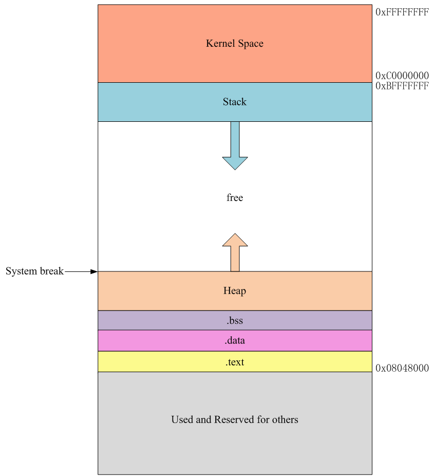

*************
Segment Fault
*************

Linux上开发时最恼火的就是遇到“Segmetation Fault”错误。为什么这么说，
很多人看到这个错误后心里第一反应是程序访问的非法的内存，导致其被操作系统
强行终止。这固然没错，可这里有个比较模糊的概念了：什么叫“非法”的内存？

程序运行时，每个进程都有自己的虚拟地址，理论上说进程应该可以随便使用才对，
为什么还会出现这个错误呢？这里就涉及到程序的装载过程及原理。先澄清几个概念：

   - 程序：一般是一组CPU指令的集合构成的文件，静态存储在诸如硬盘之类的存储设备上。
   - 进程：当一个程序要被计算机运行时，就是在内存中产生该程序的一个运行时实例，我们就把这个实例叫做进程。
   - 装载：上述从硬盘上的静态程序到内存中动态的进程之间的转变过程就叫做装载。往通俗里讲，就是启动一个进程。

本文的主要目的是在简单了解进程的内存布局的情况下，从装载的过程入手，深入了解一下
Segmetation Fault在 OS 层面是如何产生的，以及程序开发过程中应该如何避免这样的错误。

众所周知Linux中可执行文件的格式是ELF，其实编译过程中的中间文件 \*.o，\*.so文件也是ELF格式的。
在 Linker 看来，当它通过 \*.o 或者配合 \*.so 文件来生成可执行文件时，它对ELF格式的文件以 Linking View
进行看待。也就是说 Linker 以 Section 的形式来对待和处理ELF文件，诸如我们常见说的代码段(.text)，数据
段(.data和.bss)等待概念。当程序最终需要被装载成进程时，Loader 就出场了，Loader将可执行文件以
Executive View 进行看待。Loader 将以Segment的形式来处理ELF文件。网上很多教程也是这样说的，
大家可能还是理解的不是很明白，后面我们通过实例的方式将进一步向大家来澄清这两者的区别。

既然\*.o，\*.so和可执行文件都是ELF格式，那么 Linker 和 Loader 是如何区分它们的呢？
看一个简单的例子：

+-----------------------------------------+------------------------------------------+
| libview.o                               | libview.so                               |
+=========================================+==========================================+
| .. image:: images/libview.o.readelf.png | .. image:: images/libview.so.readelf.png |
+-----------------------------------------+------------------------------------------+

+--------------------------------------+------------------------------------+
| main.o                               | main                               |
+======================================+====================================+
| .. image:: images/main.o.readelf.png | .. image:: images/main.readelf.png |
+--------------------------------------+------------------------------------+

通过观察：一个具体的ELF文件，其文件头部中的某些属性值，如 Type 指明了它到底是可执行文件还是可重定
位文件(.o和.so的统称)。 这样，Linker 和 Loader 通过分析ELF文件头部就可以知道它该怎么处理该文件。

那么，Loader 为什么要采取和 Linker 不同的处理策略呢？最主要的原因是为了提高内存的利用率。现代 OS
在装载程序时都充分利用程序的局部性原理，那就是，当进程运行时，并不需要一下子将程序的所有代码和数据都
装载到内存里，而是先装载程序的一部分到内存里运行。当进程将要执行的指令不在内存里的话，CPU便会触发一
个缺页异常，操作系统捕获到这样的异常后便接管进程，然后将需要的指令加载到内存里，再将执行权限还给进程。

进程运行的时候，它虚拟地址空间的布局和它所占用的物理内存到底是什么样子呢？虚拟地址空间我们还比较好理解，
可实际物理地址并不是我们能直接访问到的。一般是通过一个集成在CPU内部的 MMU 完成了从进程虚拟地址到物理地址
之间的映射。对这个映射过程感兴趣的童鞋可以去拜读Bean_lee兄的“Linux 从虚拟地址到物理地址”文章，那是相当之精彩。
既然进程虚拟地址空间的任何地址，在使用前都必须通过MMU将其映射到物理内存上一个实实在在的存储单元上。
那么对于任何没有经过MMU映射过的虚拟空间的地址，不管进程是执行写操作还是读操作，OS 都会捕捉到这个非法访问，
然后输出一个“Segmetation Fault”的错误提示信息并强行终止进程。

换句话说，一个进程虚拟空间里的任何地址，在进程访问它之前必须要经过MMU转换，将它映射到物理内存的某个具体的
存储位置上才是合法有效的，不然操作系统就会用“Segmetation Fault”对你的进程进行宣判，然后将其kill掉。
那么，问题又来了，到底哪些地址才是合法有效的呢？看一个简单的进程虚拟地址空间的布局：

上图是很多资料上说的Linux进程虚拟地址空间的布局结构图，其中 0x0804800 为进程运行时的地址入口。注意，
这里的入口地址是指你的程序的第一条指令的入口地址，但是当进程运行时，进程环境空间的初始化工作，包括建立
程序虚拟地址空间和物理内存的映射，加载动态库等等操作都已经完成了。当所有准备工作就绪之后才会跳到这个
地址执行我们程序里的第一条指令。这个 0x0804800 一般由 Linker 在生成可执行文件时就已经固定了，通常
无需我们来更改。如果你对链接的过程和原理了如指掌，那么你肯定也知道如何修改它了。上图中，当用户的程序
直接访问 0x084800 以前的地址、0xC0000000 以后的地址或者 free 空间里的地址都会触发“Segmetation Fault”。
原因如下：

   #. 0x084800以前的地址，0xC0000000以后的地址：由于权限的问题，不允许进程直接访问，
      操作系统对其进行保护。所以用户进程如何访问它们的话就会触发“Segmetation Fault”的错误。

   #. free 地址段的空间就是前面说的，由于没有经过MMU将其映射到物理内存的实际存储单元上，
      当程序访问 System break (也就是常说的brk)之后的地址就出引发段错误。brk一般是进程
      堆空间结束的地方。那么，我们如何知道当前进程的brk在什么地方呢？答案就是通过一个 C
      库函数 ``sbrk()`` 来获取。另外还有一个系统调用 ``brk()`` 用来设置 System break 
      的位置，其实 ``sbrk()`` 也可以设置，它只不是对 ``brk()`` 系统调用的一个封装而已。

为了不影响我们的测试效果，我们需要将内核的随机地址保护模式关掉。为了方式溢出攻击，现代很多 OS 都做了
这样的随机地址保护。就是，当程序运行时，代码段、堆栈段的装载起始地址并不是固定不变的，而是每次运行进程
时都会加上一个随机的偏移量，这会影响我们的测试效果。关闭它的方法很简单::

   $echo “0” > /proc/sys/kernel/randomize_va_space

如果 :file:`/proc/sys/kernel/randomize_va_space` 为0则表示，进程每次启动运行时，其虚拟地址空间里
的值就是它在ELF文件里所指定的值；如果为1，则每次启动时只有栈的装载地址做随机保护；如果为2，表示进程每次
启动时，进程的装载地址，brk和堆栈地址都会随机变化。看个例子，这是网上流传比较多的一段代码，很具有代表性，
这里我又站在前人的肩膀上了：
