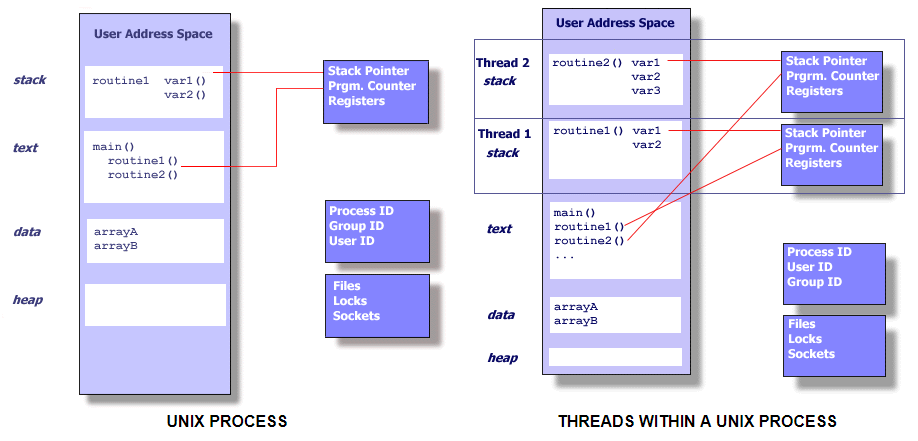
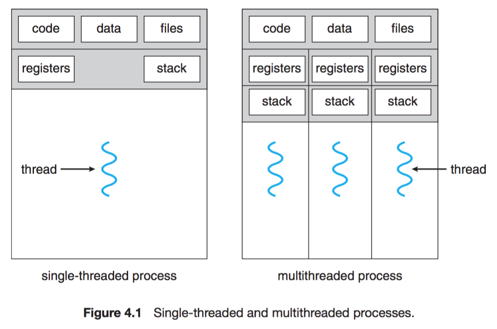

*****************
Thread vs Process
*****************

**Thread vs Process**

The UNIX standards, specifically *IEEE Std 1003.1, 2004 Edition,* defines a process as 
“an address space with one or more threads executing within that address space, and
the required system resources for those threads."

See :doc:`fork man page <../programmer_note/linux_system_call/fork_info>`.

Multiple strands of execution in a single program are called threads.
A more precise definition is that a thread is a sequence of control
within a process.

See :doc:`Pthread API Introduction <../programmer_note/pthread/pthread_api>`.

**fork vs pthread**

Just in case you don’t know about forking or threads, here is a little clarification. Forking
is a UNIX term. When you fork a process, you basically duplicate it, and both resulting processes
keep running from the current point of execution, each with its own copy of the memory (variables and such).
One process (the original one) will be the parent process, while the other (the copy) will be the child.
If you’re a science fiction fan, you might think of parallel universes; the forking operation creates a fork
in the timeline, and you end up with two universes (the two processes) existing independently. Luckily,
the processes are able to determine whether they are the original or the child (by looking at the return
value of the fork function), so they can act differently. (If they couldn’t, what would be the point,
really? Both processes would do the same job, and you would just bog down your computer.)

In a forking server, a child is forked off for every client connection. The parent process keeps
listening for new connections, while the child deals with the client. When the client is satisfied,
the child process simply exits. Because the forked processes run in parallel, the clients don’t need
to wait for each other. However, forking can be a bit resource intensive (each forked process needs its
own memory), an alternative exists: threading. Threads are lightweight processes, or subprocesses, all
of them existing within the same (real) process, sharing the same memory. This reduction in resource
consumption comes with a downside, though. Because threads share memory, you must make sure they don’t
interfere with the variables for each other, or try to modify the same things at the same time, creating
a mess. These issues fall under the heading of **synchronization**.

With modern operating systems (except Microsoft Windows, which doesn’t support forking), forking
is actually quite fast, and modern hardware can deal with the resource consumption much better
than before. If you don’t want to bother with synchronization issues, then forking may be a
good alternative.
