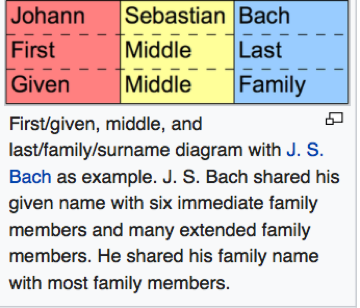
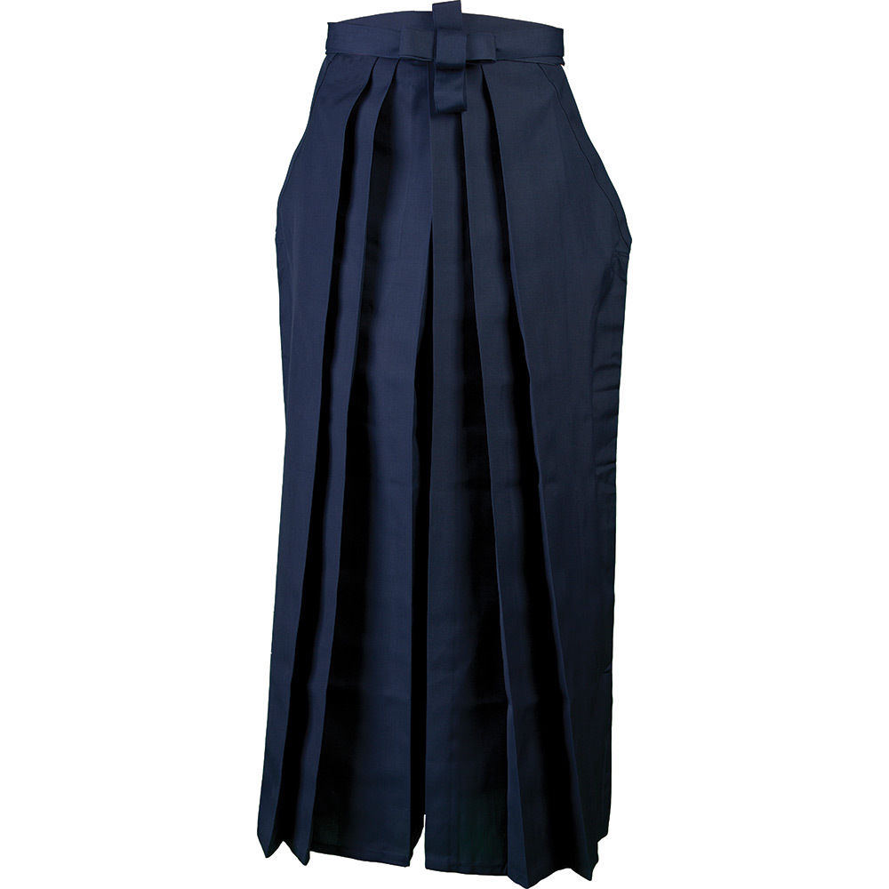
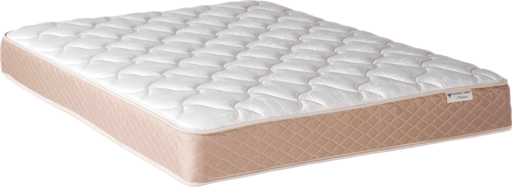
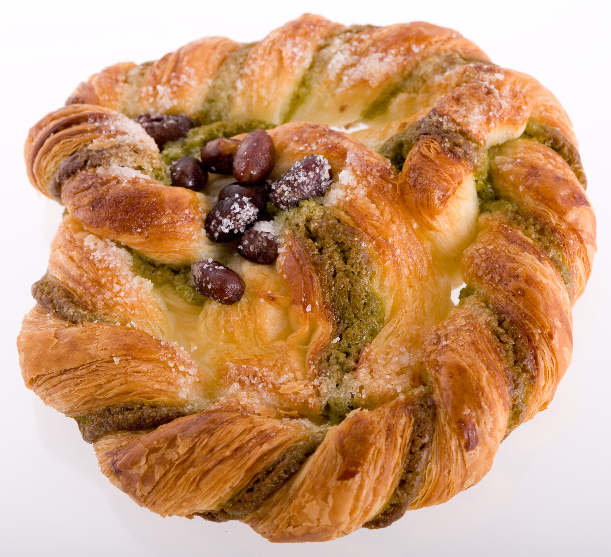
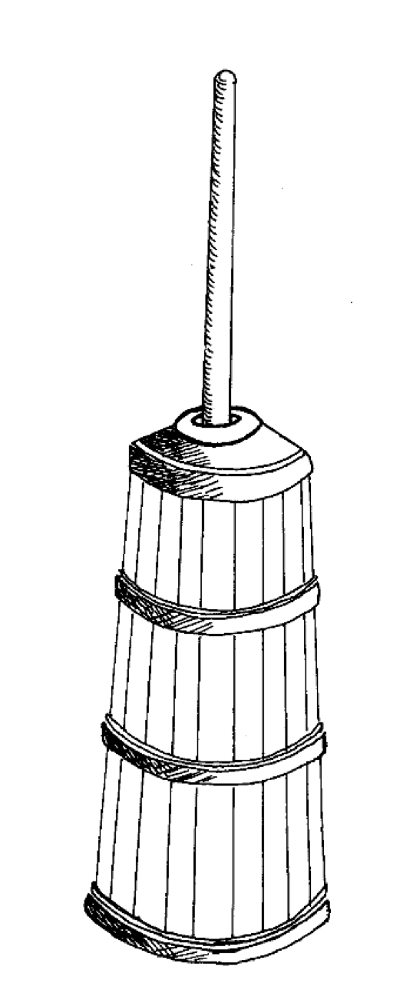
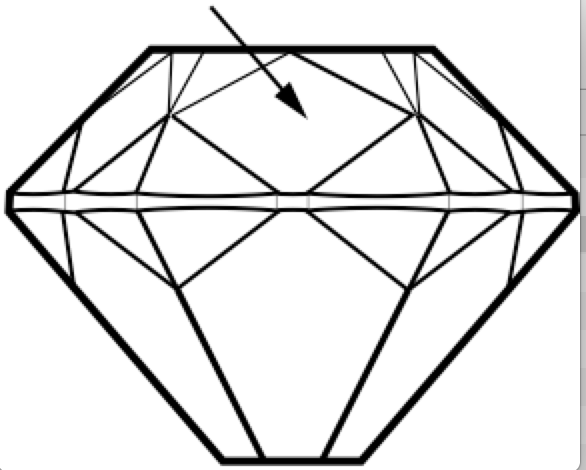
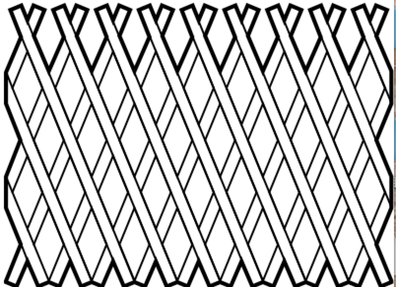
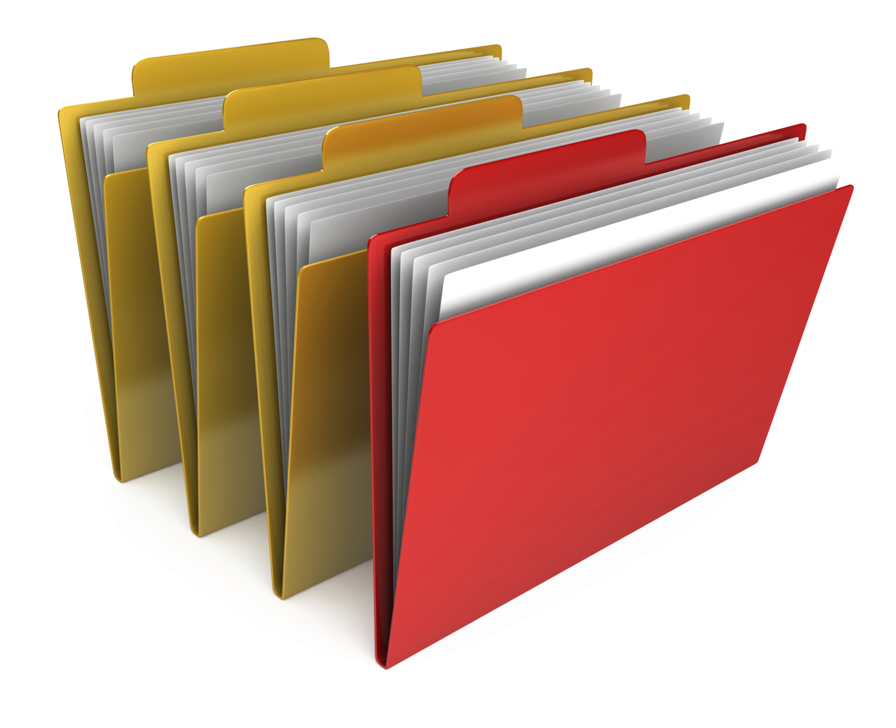

English Note
============

**学而不思则罔，死而不学则殆**

| mass noun
| Definition: a noun denoting something that cannot be counted(e.g., a substance or quality), in English usually a noun that lacks a plural in ordinary usage and is not used with the indefinite article, e.g., luggage, china, happiness.
| Antonyms: count noun
| 
| anagram
| Definition: A word, phrase, or name formed by rearranging the letters of another. such as cinema, formed from the word iceman.
| 
| synonym
| synonymous
| Definition: a word similar in meaning to another
| Usage: Agression is often taken as synonymous with violence.
| 
| antonym
| Definition: a word opposite in meaning to another
| Usage: fast is one of the antonyms of slow
| 
| cardinal, ordinal, nominal number
| A cardinal number says how many of something there are, such as one, two, three;
| An ordinal number tells us the position of something in a list;
| A nominal number is a number used only as a name, or to identify something (not as an actual value or position). 
| 
| vowel
| Definition: A vowel is a sound such as the ones represented in writing by letters ‘a’, ‘i’, ‘u’, ‘e’, and ‘o’,  which  you pronounce with your mouth open, | allowing the air flow through it.
| Antonyms: consonant
| Usage: The vowel in words like ‘my’ and ‘thigh’ is not very difficult.
| 
| Notes:
| Those who know that “the” is pronounced as “thee” before a vowel often struggle to pronounce it correctly before “u”, but the rule is actually very simple: 
| “The” is pronounced as “thee” if and only if the following sound is a vowel. 
| “A” becomes “an” if and only if the following sound is a vowel.
| 
| encyclopedia
| Definition: An encyclopedia is a book or set of books in which facts about many different subjects or about one particular subject are arranged for reference, | usually in alphabetical order.
| 
| glossary
| Definition: A glossary of special, unusual, or technical words or expressions is an alphabatical list of them giving their meanings, for example at the end of | a book on a particular subject.
| 
| nomenclature [命名法]
| Definition: The nomenclature of a particular set of things is the system of naming those things.
| Usage: Mistakes arising from ignorance of the nomenclature of the  woody plants.
| 
| terminology
| Definition: The terminology of a subject is the set of special words and expressions used in connecting with it.
| Usage: Gastritis, which in medical terminology means an inflammation of the stomach.
| 
| parlance
| Definition: a particualr way of speaking or using words, especially a way common to those with a particular job or interest.
| Usage: Dated terms that were once in common parlance.
| Usage: Medical parlance.
| 
| jargon 
| Definition: words or expressions that are used by a particular profession or group of people, and are difficult for others to understand.
| Usage: Try to avoid using too much technical jargon.
| 
| buzzword [(报刊等的)时髦术语,流行行话]
| Definition: a word or phrase, especially one connected with a particular subject that has become fashionable and popular and is used a lot in newspaper, etc.
| 
| abyssal
| Definition: (adjective) Of or relating to the great depths of the oceans.
| Synonyms: abysmal, unfathomable
| Usage: The crew was put on full alert as the submarine reached the abyssal depths of the oceans.
| 
| upronounceable
| Definition: (adjective) Difficult or impossible to pronounce correctly.
| Synonyms: unutterable
| Usage: The foreign dignitary had an unpronounceable last name.
| 
| discretion
| Definition: (noun) The quality of behaving or speaking in such a way to avoid social embarrassment or distress.
| Usage: She knew she could rely on his discretion.
| 
| balk
| Definition: (verb) Hesitate or unwilling to accept an idea or undertaking
| Usage: Every gardener will at first balk at enclosing the garden.
| 
| copious 
| Definition: (adjective) Abundant in supply or quantity
| Usage: She took copious notes. 
| 
| nifty
| Definition: (adjective) Particularly good, skillfull, or effective
| Definition: (adjective) fashionable
| Usage: Nifty footwork.
| Usage:   A nifty black t-shirt.
| 
| daunting
| Definition: (adjective) Seeing difficult to deal with in anticipation
| Synonym: intimidating
| Usage: a daunting task.
| 
| take stock
| Definition: Review or make an overall assessment of a particular situation, typically as prelude to make a decision
| Usage: He needed a period of peace and quiet in order to take stock of his life.
| 
| prelude
| Definition: An action or event serving as an introduction to something more important
| Usage: Education cannot simply be a prelude to a career.
| 
| put stock in
| Definition: [often with negative] have a specific amount of belief or faith in
| Usage: I don’t put much stock in traditional Chinese medicine.
| 
| in (or out of) stock
| Definition: (of goods) available (or unavailable) for immediate sale in store
| Usage: The new Iphone8 is out of stock at the present.
| 
| on the stocks
| Definition: in construction or preparation
| Usage: Also on the stocks is a bill to bring about tax relief for these business. 
| 
| up one’s sleeve
| Definition: (of a strategy, idea, or resource) kept secret and in reserve for use when needed
| Usage: He was new to the game but had a few tricks up his sleeve.
| 
| tried-and-true
| Definition: (adjective) proved good, desirable, or feasible; shown or known to be worthy
| Usage: A tried-and-true sales technique.
| 
| fictitious
| Definition: (adjective) not real or true, being imaginary or having been fabricated
| Usage: She pleased guilty to stealing thousands in taxpayer dollars by having a ficticious employee on her payroll.
| Definition: (adjective) relating to or denoting the imaginary characters and events found in fiction
| Usage: The people in this novel are fictitious; the backgroud of public events is not.
| 
| sloppy [adjective]
| Definition: careless and unsystematic; excessively casual
| Usage: Your speech has always been sloppy.
| Definition: (of a garment) casual and loose-fitting
| Usage: He always wore a sloppy T-shirt and boxing pants.
| Definition: (of semifluid matter) containing too much liquid; watery
| Usage: Don’t make the concrete too sloppy.
| Definition: (of literature or behavior) weakly or foolishly sentimental
| Usage: Lovers of sloppy romance.
| 
| more bang for the buck
| Definition: Having greater value for the amount of money one is spending
| Usage: It’s not one of the most popular brands, but this high-definition TV will give you away more bang for your buck.
| Definition: If you get more bang for your buck or more bang for the buck, you get a bigger quantity or better quality of something for the same amount of | money. You can also say that someone gets a bigger bang for their buck or a bigger bang for the buck. You can also say that someone gets little bang for the | buck, when they get less than they expected for the amount of money they spent.
| Usage: While desktop computers still give you more bang for your buck, today's notebooks are capable of more than just basic office work. 
| Usage: Companies are scrambling to find new ways of delivering more bang for the client's buck. 
| Usage: I think it's very, very important for those governments to do whatever they can to get a bigger bang for the buck. 
| Usage: The company is getting little bang for its buck.
| 
| etiquette [礼仪，职业操守]
| Definition: (noun) The customary of polite behavior in society or among members of a particular profession or group
| Usage: Advice on etiquette.
| Usage: Medical / legal / professional etiquette
| 
| monitory
| Definition: (adjective) Conveying an admonition or a warning
| Synonyms: admonitory, cautionary, exemplary, warning
| Usage: She shot him an monitory glance and he quickly changed the subject to one less controversial.
| 
| monition
| Definition:  A warning or an initimation of something imminent, especially of impending danger.
| 
| caveat
| Definition: a warning that particular things need to be considered before something can be done.
| 
| frisson
| Definition: (noun)  A sudden strong feeling of excitement or fear; a thrill
| Usage: A frisson of excitement.
| 
| colloquial [口语，俚语]
| Definition: (adjective) Characteristic of informal spoken language or conversation
| 
| chunky
| Definition: (adjective) Short and thick; stocky
| Synonyms: low-set, squat, squatty, stumpy, dumpy
| Usage: But There was a trio involved in this remarkable friendship, and the third was short, and fat, and chunky, and lazy, and, loath to say, it was I.
| 
| contrariwise
| Definition: (adverb) In contrast to what has just been stated or mentioned
| Usage: Contrariwise, a registered person may vote, even if not entitled to be registered.
| 
| unlettered
| Definition: (adjective) uneducated in general; lacking knowledge or sophistication
| Synonyms: ignorant, nescient, unlearned
| Usage: On points where the learned have, in purity of heart, been compelled to differ, the unlettered will necessarily be at variance. 
| [君子和而不同， 小人同而不和]
| 
| canvas [帆布，亚麻布]
| Definition: (noun) a strong, coarse unbleached cloth made from hemp, flax, cotton, or a similar yarn, used to make items such as sails and tents and as a | surface for oil painting.
| Idiom: by a canvas
| Definition: (in boat racing) by a small margin
| Idiom: under canvas
| Definition: in a tent or tents
| Usage: the family will be living under canvas.
| Definition: with sails spread [扬帆远航]
| 
| thumb through / leaf through
| Definition: to look through a book, maganize, or newspaper without reading it carefully
| Usage: I have only thumbed through the book, but it looks very interesting.
| Usage: I leafed through a magazine while waiting to see my doctor.
| 
| unprejudiced
| Definition: (adjective) Free from undue bias or preconceived opinions.
| Synonyms: impartial
| Usage: I claim to be an absolutely unprejudiced witness.
| 
| patter
| Definition: (noun / verb) Plausible glib talk (especially useful to a salesperson) 
| Synonyms: line of gab, spiel
| Usage: The automobile salesman spoke about the old car so approvingly and at such length that the customers soon began to grow tired of his patter.
| 
| excavate
| Definition: (verb) to make (a hole, cavity, or tunnel by hollowing or removing the centre of inner part) 
| Usage: The cheapest way of doing this was to excavate a long trench.
| 
| agonistic
| Definition: (adjective) Striving to overcome in argument
| Synonyms: combative
| Usage: The incumbent’s aggressive, agonistic approach to the debate alienated many of his supporters.
| 
| dumbstruck
| Definition: (adjective) So shocked or astonished as to be rendered speechless
| Synonyms: dumbfounded, thunderstruck, flabbergastered, stupefied
| Usage: He stood dumbstruck in the doorway as the partygoers yelled “Surpise!” in the unison.
| 
| rule out
| Definition: If you rule out a course of action, an idea, or a solution, you decide that it is impossible or unsuitable
| Definition: If something rules out a situation, it prevents it from happening or from being possible
| Usage: The prime mimister is believed to have ruled out cuts in child benefit or pensions. 
| Usage: A serious car accident in 1986 ruled out a permanent future for him in football.
| 
| rule of thumb
| Definition: a broadly accurate guide or principle, based on experientce or practice rather than theory.
| 
| make it  a rule to do something
| Definition: have as a habit or general principle to do something.
| Usage: I make it a rule never to mix business with pleasure.
| 
| rule the roost
| Definition: be in complete control.
| 
| as a rule
| Definition: usually, but not always.
| 
| stub
| Definition: The stub of a cigrette or a pencil is the last short piece of it, which remains when the rest has been used. [烟蒂，铅笔头]
| Definition: A cheque stub is the small part that you keep as a record of what you have paid. [凭据]
| Definition: If you stub your toe, you hurt it by accidentally kicking something.
| Definition: A ticket stub is the part that you keep when you go in to watch a performance.
| Usage: He pulled the stub of a pencil from behind his ear.
| Usage: an ashtray of cigarette stubs.
| Usage: Fans who still have their original ticket stubs should contact Sheffield Arena by July 3.
| Usage: I stubbed my toes against a table leg.
| 
| invoice  发票
|
| glitch
| Definition: A glitch is a problem, which stops something from working properly or being successful.
| Usage: Manufacturing glitches have limited the factory’s output, and costs are still far too high.
| 
| Faction
| Definition 1: A faction is an organized group of people within a larger group. Which opposes some of the ideas of the larger group and fights for its own | ideas.
| Definition 2: Faction is also used to describe argument and disagreement within a group of people.
| Usage: A peace agreement will be signed by the leaders of the country’s warring factions.
| Usage: Faction and self-interest appear to be norm.
| 
| Demote
| Definition: Give somebody a lower rank or less senior position, usually as a punishment.
| Usage: The head of the army was demoted to deputy defense secretary.
| 
| sequel
| Definition 1: A published, broadcast, or recorded work that continues the story or develops the theme of an earlier one.
| Definition 2: Something that takes place after  or as a result of an earlier event.
| Usage: This encouragement to grow potatoes had a disastrous sequel some fifty years later.
| 
| shrine 
| Definition: A place regarded as holy because of its associations with a divinity or a sacred person or relic, typically marked by a building or other | construction.
| 
| saga
| Definiton: a long story of heroic achievement, especially a medieval prose narrative in Old Norse or Old Icelandic.
| Definition: a long, involved story, account , or series of incidents.
| Usage: The saga of her engagement.
| Usage: A figure straight out of a viking saga.
| 
| perverse
| Definition: Contrary to the accepted or expected standard or the practice.
| Usage: In two general elections the outcome was quit perverse.
| 
| clench
| Definition: (with reference to the fingers or hand) close into a tight ball, especially when feeling extrement anger.
| Usage: She clenched her fist, struggling to control.
| Usage: He struck the wall with his clenched fist.
| Definition: (with reference to the teeth) press or be pressed tightly together, especially with anger or determination or so as to surpress a strong emotion.
| Usage: Her teeth clenched in anger.
| Definition: (of a muscular part of the body) tighten or contract sharply, especially with strong emotion.
| Usage: Mark felt his stomach clench in alarm.
| Usage: She clenched on her lip so as not to cry out with her failure to pass the interview.
| 
| hapless
| Definition: (especially of s person) unfortunate
| Usage: If you are one of the many hapless car buyers who have been shafted.
| 
| onerous
| Definition: troublesome or oppressive
| Synonyms: burdensome, taxing
| Usage: Preparing income tax returns is an onerous task, and many people resort to hiring professional accountants during tax season.
| 
| ideate
| Definition: To form an idea of; image or conceive
| Usage: The arc whose ideated center is the nodal point in the composition.
| 
| nodal
| Definition: Denoting a point in a network or diagram at which lines or pathways intersect or branch.
| Usage: It’s a nodal point for the railway, connecting all the major cities in Poland.
| 
| Play down
| Definition: If you play down something, you try to make people believe that it is  not particularly important.
| Usage: He plays down rumors that he aims to become a Labour MP.
| 
| Underplay
| Definition: If you underplay something, you make it seem less important than it really is.
| Usage: We often underplay the skills we have.
| Usage: The problem of alcoholism was, and still is, often underplayed. 
| 
| Dwonplay
| Definition: If you downplay a fact or feature, you try to make people believe that it is less important or serious than it really is.
| Usage: The government and the press are trying to downplay the violence which broke out yesterday.
| 
| Play up
| Synonyms: emphasize, accentuate, highlight, stress, underline.
| 
| Underestimate
| Definition: If you underestimate something, you do not realize how large or great it is or will be.
| Usage: Never underestimate what you can learn from a group of like-minded people.
| Definition: If you underestimate someone, you do not realize what they are capable of doing.
| Usage: I think a lot of people still underestimate him.
| 
| Opaque
| Definition: If an object or substance is opaque, you cannot see though it.
| Usage: You can always use opaque glass if you need to block a street view.
| Definition: If you say something is opaque, you mean that it is difficult to understand.
| Synonyms: obscure
| Usage: The opaque language of the inspector’s reports.
| 
| Breach
| Definition: If you breach an agreement, a law, or a promise, you break it.
| Usage: The newspaper breached the code of conduct on privacy.
| Usage: The congressman was accused of a breach of secrecy rules.
| Definition: If someone or something breaches a barrier, they make an opening in it, usually leaving it weakened or destroyed.
| Usage: The limestone is sufficiently fissured for tree roots to have breached the roof of the cave.
| Definition: If you breach someone’s security or their defences, you manage to get through and attack an area that is heavily guarded and protected.
| 
| Definition: If you step into breach, you do a job or task which someone else was supposed to do or has done in the past, because they are suddenly unable to do it.
| Usage: I was persuaded to step into the breach temporarily when they became too ill to continue.
| 
| nocturnal
| Definition: Done, active or occurring at night.
| Usage: Most owls are nocturnal.
|
| frump
| Definition: An unattrative woman who wears dowdy old-fashioned clothes.
| 
| dowdy
| Definition: (of a person or their clothes) unfashionable and without style in appearance (typically used for a woman)
| Usage: She could achieve the kind of casual chic that made every other woman around her look dowdy.
| 
| hoodwink
| Definition: to deceive or swindle by deception.
| Synonyms: trick, fool, cheat, con
| Usage: You don’t understand that what imposes on common folks would never hoodwind an editor.
| 
| aborigine
| Definition: a person, animal, or plant that has been in a country or region from the earliest times.
| Usage: An aboriginal inhabitant of Australia.
| 
| syllabus
| Definitionf : An outline of the subjects in a course of study or teaching.
| Usage: There isn’t time to cover the syllabus.
| 
| wacky
| Definition: funny or amusing in a slightly odd or peculiar way.
| Usage: A wacky chase movie
| 
| tarry
| Defintion: Stay longer than intended, delay leaving a place
| Usage: She could tarry a bit an not get home untill four.
| 
| incognito [匿名，隐姓埋名]
| Definition: (of a person) having one’s true identity concealed[adjective & adverb].
| Usage: In order to observe you have to be incognito.
| Usage: Movie stars often prefer to travel incognito.
| 
| perish
| Definition: to die, especially in a sudden violent way.
| Usage: A family of five perished in the fire.
| Definition: to be lost or destroyed
| Usage: Early buildings were made of wood and have perished.
| 
| perish the thought
| Definition: (informal) used to say that you find a suggestion unacceptable or that you hope that something never happen.
| Usage: Me get married? Perish the thought.
| 
| opine
| Definition: Express one’s opinion openly and without fear.
| Synonyms: speak out, sound off
| Usage: “I dare say it is all for the best. ” opined Mr. Green.
| 
| pliant
| Definition: (of a person or their body) soft and giving way to somebody, especially in a sexual way.
| Usage: She lay pliant in his arms.
| Definition: (sometimes disapproving) willing to accept change; easy to influence or control.
| Usage: He was deposed and replaced by a more pliant succesor.
| 
| naught
| Definition: nothing; the digit 0
| Usage: He is naught bu a worthless fool.
| 
| aught
| Definition: anything at all
| Usage: know you aught of this fellow, young sir?
| 
| archaic
| Definition: very old or old-fashioned
| Usage: Prisons are run on archaic methods.
| Definition: (of a word or a style of language) no longer in everyday use but sometimes used to impart an old-fashion flavor.
| 
| impart
| Definition: to pass information, knowledge, etc. to other people
| Usage: Teachers had a duty to impart strong morals to their students.
| Definition: to give a particular quality to sth
| Usage: The furniture imparts elegance to the room.
| 
| ecstasy
| Definition: a feeling or state of very great happiness.
| Usage: There was a look of ecstasy on his face. 
| 
| Percolate
| Definition: If an idea , feeling, or piece of information percolates through a group of people or a thing, it spreads slowly through the group or thing.
| Usage: New fashions took a long time to percolate down.
| Definition: To percolate somewhere means to pass slowly through something that has very small holes or gaps in it
| Usage: Rain water will only percolate through slowly
| 
| imprimatur
| Definition: Formal and explicit approval
| Usage: The original LP enjoyed the imprimatur of the composer.
| 
| putrefaction
| Definition: moral perversion, impairment of virtue or moral principles.
| Definition: the process of decaying, especially that of a dead body.
| Synonyms: breakdown, decomposition, corruption
| Usage: Clearing the refrigerator of what the previous tenant had left behind was like taking a course in advanced putrefaction of leftovers.
| 
| progency
| Definition: One born of, begotten by, or derived from another
| Synonyms: issue, offspring
| Usage: He was naturally a very nervous, shuddering sort of little fellow, this bread-faced steward; the progency of a bankrupt baker and a hospital nurse.
| 
| airhead
| Definition: a stupid person
| Usage: Okabe is an airhead.
| 
| cram [考前突击]
| Definition: Study intensively, as before an exam.
| Usage: He has been cramming for his exam all week.
| Definition: Completely fill (a place or container) to a point that it appears to be overflowing.
| Usage: Supporters crammed the street.
| 
| careen
| Definition: Move sideways or in an unsteady way.
| Usage: A heavy flood tide caused my vessel to careen dizzily.
| 
| humdrum
| Definition: Lacking variety or excitement; dull
| Synonyms: unglamoros; commonplace; prosiac
| Usage: So here I shall end my days; and I must say, Dorothy, my dear, that you are going back into that stupid, humdrum world again.
| 
| glamour 
| glamorous
| Definition: The attractive or exciting quality that makes certain people or things seem appealing or special.
| Usage: The glamour days of Old Hollywood.
| 
| dilatation
| Definition: The state of being stretched beyonded normal dimension.
| Synonyms: distention
| Usage: He suffered from severe dilatation of the stomach (脹肚), an abdominal swelling that left him writhing in pain.
| 
| Apiece
| Definition: If people have a particular number of things apiece, they have that number each.
| Synonyms: each
| Usage: He and I had two fish apiece.
| Usage: The World Series between the Atlanta Braves and Toronto Blue Jay is tied at one game apiece.
| Definition: If a number of similar things are for sale at a certain price apiece, that is the price for each one of them.
| Usage: Entire roast chickens were 60 cents apiece.
| 
| Predicament
| Definition: If you are in a predicament, you are in an unplesant situation that is difficult to get out of.
| Synonyms: dilemma
| Usage: The decision will leave her in a peculiar predicament.
| 
| clunky
| Definition: If you describe something as clunky, you mean that it is solid, heavy, rather awkward.
| Usage: A clunky piece of architecture.
| 
| Skydiving
| Definition: Skydiving is the sport of jumping out of an aeroplane and falling freely through the air before open your parachute.
| 
| Despise
| Definition: If you despise something or someone, you dislike them and have a very low opinion of them.
| Usage: How I despised myself for my cowardice!
| 
| Vogue
| Definition: If something is in vogue, is very popular and fashionable. If it comes into vogue, it becomes very popular and fashionable.
| Synonyms: in fashion
| 
| Potent
| Definition: Something that is potent is very effective and powerful.
| Synonyms: The drug is exetremely potent, but causes unpleasant side effects.
| 
| hard-won
| Definition: If you describe something that someone has gained or achieved as hard-won, you mean that they worked harded to gain or achieve it.
| Usage: The dispute could destroy Australia’s hard-won reputation for industrial stability.
| 
| reek
| Definition: To be pervaded by something very unpleasant.
| Usage: The speeches reeked of anti-Semitism.
| Definition: Give off somke, steam, or fumes
| Usage: While the temples crash, the tower in ashes reek.
| Usage: The reek of cattle dung.
| 
| atonement
| Definition: Amends or reparation made for an injury or wrong.
| Usage: She wanted to make atonement for her husband’s behavior. [贖罪]
| Definition: (in religious contexts) reparation or expiation for sin
| Usage: An annual ceremony of confession and atonement for sin. [救贖]
| 
| reparation:
| Definition: The making of amends for a wrong one has done, by paying money to or otherwise helping those who have been wronged.
| Usage: The courts require a convicted offender to make financial reparation to his victim.
| Definition: The compensation for war war damage paid by a defeated state.
| 
| prune
| Definition: When you prune a tree or bush, you cut off some of the branches so that it will grow better the next year.
| Usage: There is no best way to prune, apart from making sure tools are sharp and every cut is clean.
| Usage: The company has pruned back its workforce by 20,000 since 1989.
| 
| verily
| Definition: truly and certainly
| Usage: I verily believed myself to be a free woman.
| 
| veritable
| Definition: used as an intensifier, often to qualify a metaphor.
| Usage: The early 1970s witnessed a veritable price explosion.
| Usage: The meal that followed was a veritable banquet.
| 
| intensifier
| Definition: an adverb used to give force or emphasis
| Usage: Really in my feet are really cold.
| 
| loiter
| Definition: stand or wait around idly or without apparent purpose
| Usage: She saw Mary loitering near the cloakrooms.
| Definition: travel indolently and with frequent pause
| Usage: They loitered along in the sunshine, stopping at the last execuse.
| 
| sluggard
| Definition: a lazy, slgguish person.
| 
| consigliere [顾问，军师，智囊]
| Definition: an adviser, especially to a crime boss.
| Plural: consiglieri
| 
| antsy
| Definition: Agitated, impatient, or restless.
| Usage: He was too antsy to stay in one place for long.
| 
| veer 
| Definition: Changed direction suddenly.
| Usage: An oil tanker that had veered off course.
| Usage: The wind veered southwest.
| Definition: Suddenly change an opinion, subject, type of behavior, etc.
| Usage: The conversation eventually veered away from theatrical things.
| Definition: Slacken or let out (a rope or cable) in a controlled way.
| 
| inanimate
| Definition: Not having the qualities associated with active, living organisms.
| 
| wayfarer
| Definition: A person who travels on foot.
| 
| toiler
| Definition: A person who works strenuously.
| 
| strenuous
| Definition: Requiring or using great exertion
| Usage: all your muscles need more oxygen during srenuous exercise.
| 
| enchant
| Definition: fill someone with great delight; charm.
| Usage: Isabel was enchanted with the idea.
| Definition: put sb. or sth. under a spell (as adjective enchanted).
| Usage: An enchanted garden.
| 
| inflame
| Definition: Provoke sb to strong feelings.
| Usage: Her sister was inflamed with jealousy.
| Usage: High fines futher inflamed public feelings.
| Definition: Cause inflammation in a part of the body (as adjective inflamed).
| Usage: The finger joints were inflamed with rheumatoid arthritis.
| Usage: Inflamed eyes and lips.
| 
| hew
| Definition: Make or shape something by cutting or chopping a material such as wood or stones.
| Usage: A seat hewn out of a fallen tree trunk.
| 
| hoof
| Definition: The horny part of the foot of an ungulate animal, especially a horse.
| Usage: There was a clatter of hoofs as a rider came up to them.
| Definition: Go on foot (hoof it)
| Usage: It was hot, but we hoofed it all the way back.
| 
| on the hoof
| Definition: (of livestock) not yet slaughtered.
| Definition: Without great thought or preparation.
| UsageL Police was made on the hoof.
| 
| tenacious
| Definition: Tending to keep a firm hold of something; clinging or adhering closely.
| Usage: A tenacious grip.
| Definition: Not readily relinquishing a position, principle, or course of action; determined.
| Usage: You’re tenacious and you get at the truth.
| 
| durability
| Definition: The ability to withstand wear, pressure, or damage.
| Usage: The reliability and durability of plastics.
| 
| frailty
| Definition: The condition of being weak and delicate.
| Usage: The increasing frailty of old age.
| Definition: Weakness in character or morals.
| Usage: All drama begins with human frailty.
| 
| hasten
| Definition: Be quick to do something.
| Usage: He hastened to refute the assertion.
| Definition: Move or travel hurriedly.
| Usage: We hastened back to Paris.
| Definition: Casuse sth to happen sooner than it otherwise would.
| Usage: A move that could hasten peace talks.
| 
| repose
| Definition: A state of rest, sleep, or tanquility; composure.
| Usage: In repose her face looked relaxed.
| Usage: He had lost none of his grace or his repose.
| Definition: Harmonious arrangement of colors and forms, providing a restful visual effect.
| Definition: lay something to rest in or on something.
| Usage: I’ll go to him, and repose our distresses on his friendly bosom.
| Definition: give rest to.
| Usage: He halted to repose his wayworn soldiers.
| 
| revery
| Definition: The condition of being lost in thought. more common as reverie.
| Usage: A knock on the door broke her reverie.
| Usage: I slipped into reverie.
| 
| drowsiness
| Definition: A feeling of being sleepy and lethargic.
| Usage: This drug can cause drowsiness.
| 
| aloof
| Definition: Not friendly or interested in other people; distant, remote.
| Idioms: keep / hold oneself aloof; remain / stand aloof. [清高，疏远]
| Usage: The Emperor kept himself aloof from the people.
| 
| mooring
| Definition: A place where a boat or ship is moored.
| Usage: The boat had been at its usual moorings immediately prior to the storm.
| 
| dog-ear
| Definition: Fold down the corner of (a book or magazine), typically to mark a place.
| 
| interpolation
| Definition: An interpolation jis an addition to a piece of writing.
| Usage: The interpolation appears to have been inserted very soon after the original text was finished.
| 
| cartography
| Definition: The activity of making map.
| 
| elide
| Definition: If you elide something, especially a distinction, you leave it out or ignore it.
| Usage: These habits of thinking elide the difference between what is common and what is normal.
| Definition: In linguistics, if you elide a word, you do not pronounce or write fully.
| Usage: He complained about BBC announcers eliding their words.
| Synonyms: omit, ignore, contract
| 
| on the fly
| Definition: (of an addition or modification in computing) Carried out during the running of a program without interrupt.
| Definition: If you do something on the fly, you do it quickly, without thinking about it or planning it in advance.
| Usage: These people can make decisions on the fly and don’t have to phone home to their boss. [便宜行事]
| 
| repository
| Definition: A repository is a place where something is kept safely.
| Synonyms: store
| Usage: A church in Moscow became a repository for police files.
| Definition: A repository of information is a person or group of people who know a lot of information about a particular place or subject.
| Usage: The repository of all important knowledge in a small town was the chief barman of the local pub.
| 
| benchmark
| Definition: A benchmark is something whose quality or quantity is known and which can therefore be used as a standard with which other things can be compared.
| Synonyms: yardstick
| Usage: The truck industry  is a benchmark for the economy.
| 
| sulfurous 
| Definition: (chiefly of vapor or smoke) containing or derived from sulfur. [硫磺味]
| Definition: Marked by bad temper, anger, or profanity.
| Usage: A sulfurous glance.
| 
| profanity
| Definition: blasphemous or obscene language.
| Usage: An outburst of profanity.
| 
| blasphemous
| Definition: Sacrilegious against God or sacred things; profane.
| usage: Blasphemous and heretical talk.
| 
| sacrilege
| sacrilegious
| Definition: Violation or misuse of what is regarded as sacred.
| Definition: Involving or committing sacrilege.
| Usage: It seems sacrilegious to say this, but it’s really not that great a movie.
| 
| piety 虔诚
| Definition: the state of having or showing a deep respect for somebody or something, especially for God and religion; the state of being pious.
| Usage: Act of piety and charity.
| 
| begrime
| Definition: make soiled, filthy or dirty.
| Usage: Paint flaking from begrimed walls.
| 
| flake
| Definition: a small, flat, thin piece of something, typically one that has broken away or | been peeled off a larger piece. 
| Usage: Paint peeling off the walls in unsightly flakes.
| 
| violate
| violation
| Definition: If someone violates an agreement, law, or promise, they break it.
| Usage: They violated the ceasefire agreement. [停火协议] 
| Usage: To deprive the boy of his education is a violation of state law.
| Definition: treat (something sacred) with irreverence or disrespect.
| Usage: He was accused of violating a tomb. [亵渎死者]
| Usage: They denied that human rights were being violated.
| 
| invalid
| Definition: a person made weak or disabled by illness or injury. [虚弱]
| Usage: An invalid husband.
| Usage: She had been a delicate child and her parents had treated her as an invalid. [自幼体弱多病]
| Definition: to force somebody to leave the armed forces because of an illness or injury.
| Usage: He was invalided out of the army in 1943. [因伤退役]
| Definition: not legally or offically acceptable.
| Usage: The treaties made by the former government were declared invalid by the new one.
| Definition: of a type that the computer cannot recognize.
| Usage: An error code will be displayed if any invalid information has been entered.
| 
| heretical
| Definition: Holding an opinion at odds with what is generally accepted.
| Usage: I feel a bit heretical saying this, but I think the film has too much action.
| 
| portentous
| Definition: Done in a pompously or overly solemn so as to imporess.
| Usage: The author’s portentous moralizings. [煞有介事，装腔作势]
| 
| pompous
| Definition: Affectedly and irratingly grand, solemn, or self-important.
| Usage: A pompous ass who pretends he knows everything.
| 
| there is no sense in doing sth
| Definition: Use this expression to talk about things you shoudn’t do because it would wasteful.
| Usage: There is no sense in asking him, he knows nothing either.
| Usage: There is no sense in beating yourself up over it.
| 
| push one’s luck
| Definition: Take a risk on the assumption that one will continue to be successful or in favor.
| Usage: There is no sense in pushing your luck.
| 
| outset
| Definition: If something happens at the outset of an event, process, or period of time, it happens at the beginning of it. If something happens from the | outset, it happens from the beginning and continue to happen.
| Usage: Decide at the outset what kind of learning programme you want to follow.
| 
| betwixt
| Definition: archaic term for between.
| 
| ere
| Defition: archaic term for before.
| 
| forebear
| Synonyms: ancestor
| 
| mist
| Definition: A cloud of tiny water droplets suspended in the atmosphere at or near the earth surface limiting visibility, but to a lesser extent than a fog.
| Usage: A mist rose out of the river.
| Usage: The windows were misted up with condensation.
| Definition: used in reference to something that blurs one’s perceptions or memory.
| Usage: Sardinia’s origins are lost in the mist of time. [撒丁岛]
| Definition: (of a person’s eyes) become covered with a film of tears causing blurred vision.
| Usage: Her eyes misted at the image of her parents. 
| 
| flutter
| Definition: (of a bird or other winged creature) fly unsteadily or hover by flapping te wings quickly and lightly.
| Usage: A couple of butterflies fluttered around the garden.
| Definition: (of a person) move restlessly or uncertainly.
| Usage: The hostess fluttered forward to greet her guests.
| Definition: A state or sensation of tremulous excitement.
| Usage: Her inside were in a flutter.
| Usage: Sandra felt a flutter in the pit of her stomach.
| Idiom: flutter one’s eyelashes [暗送秋波]
| Definition: open and close one’s eyes rapidly in a coyly flirtatious manner.
| 
| flirtatious
| Definition: behaving in such a way as to suggest a playful sexual attraction to someone.
| Usag: She was beautiful and very flirtatious.
| 
| hover
| Definition: remain in one place in the air.
| Usage: Arm helicopters hovered overhead.
| Definition: remain at or near  a particular level.
| Usage: Inflation will hover around the 4% mark.
| Definition: [Computing] use a mouse or other device to position the cursor over a particular area of a computer screen so as to cause a program to respond, | without clicking a button on the device.
| Usage: You can hover your cursor over any button to see an explanation.
| 
| wondrous
| Definition: inspiring a feeling of wonder or delight; marvelous; marvelously.
| Usage: She is grown wondrous pretty.
| 
| marvel
| Definition: be filled with wonder or astonishment.
| Usage: “Isn’t this an evening, ” marveled John.
| Definition: A wonderful or astonishing person or thing.
| Usage: Charlie, you’re a marvel.
| 
| riddle
| Definition: A question or statement intentionally phrased so as to require ingenuity in ascertaining its answer or meaning, typically presented as a game.
| Definition: A person, event, or fact that is difficult to understand or explain.
| Usage: The riddle of her death.
| Idiom: talk (or speak) in riddles.
| Definition: express oneself in an ambiguous or puzzling manner.
| 
| 
| meek
| Definition: quiet, gentle, and easily imposed on; submissive.
| Usage: I used to call her Miss Mouse because she was so meek and mild.
| 
| forbear
| Definition: politely or patiently restrain an impulse to do something.
| Usage: The boy forbore from touching anything.
| Definition: refrain from doing or using something.
| Usage: Rebecca could not forbear a smile.
| 
| dumb
| Definition:temporarily unable or unwilling to speak.
| Usage: She stood dumb while he poured out a stream of abuse.
| Usage: They stared in dumb amazement.
| Definition: (of a person) unable to speak, most typically because of congenital deafness.
| Usage: He was born deaf, dumb, and blind.
| Idiom: dumb down
| Definition: simplify or reduce the intellectual content of something so as to make it accessible to a larger number of people.
| Usage: Critics have accused publishers of dumbing down books.
| Usage: The need to dumb down for mass audiences.
| 
| congenital
| Definition: (especially of a disease or physical abnormality) present from birth.
| Usage: A congenital malformation of the heart.
| Definition: (of a person) having a particular trait from birth or by firmly estalished habit.
| Usage: A congenital liar.
| sponge
| Definition: A piece of a soft, light, porous substance originally consisting of the fibrous skeleton of an invertebrate but now usually  made of synthetic | material. 
| Usage: Sponges absorb liquid and are used for washing and cleaning.
| Definition: wipe, rub, or clean with a wet sponge or cloth.
| Usage: She sponged him down in an attempt to cool his fever.
| Definition: a heavy drinker.
| Definition: Obtain or accept money or food from other people without doing or intending to do anything in return.
| Usage: They found they could earn a perfectly good living by sponging off others.
| Usage: He edged closer, clearly intending to sponge money from her.
| 
| edge
| Definition: A quality or factor that gives superiority over close rivals or competitor.
| Usage: The veal had the edge on flavor.
| Definition: move gradually, carefully, or furtively in a particular direction.
| Usage: Nick edged his way through the crowd.
| Usage: Hazel quietly edged himself away from the others.
| Definition: defeat by a small margin.
| Usage: Connecticut avoided an upset and edged Yale 49-48.
| Idiom: on edge - tense, nervous, or irritable.
| Usage: Never had she felt so on edge before an interview.
| Idiom: on the edge of one’s seat
| Definition: very excited and giving ones’ full attention to something.
| Idiom: set someone’s teeth on edge [把某人气得咬牙切齿]
| Definition: (especially of an unpleasantly harsh sound) cause someone to feel intense discomfort or irritation.
| Usage: A grating that set her teeth  on edge.
| Idiom: take the edge off
| Definition: reduce the intensity of effect of (something unpleasant or severe).
| Usage: The tablets will take the edge of the pain.
| Idiom: edge someone out
| Definition: Remove a person from an organization or role by indirect means.
| Usage: She was edged out of the organization by the director.
| 
| veal
| Definition: The flesh of a calf, used as food.
| 
| grieve
| Definition: If you grieve over something, especially someone’s death, you feel very sad about it.
| Usage: He’s griving over his dead wife and son.
| Definition: If you are grieved by something, it make you unhappy or upset.
| Usage: He was deeply grieved by the suffering of the common people.
| 
| intoxicated
| Definition: Someone who is intoxicated is drunk.
| Usage: He appeared intoxicated, police said.
| Definition: If you are intoxicated by something such as a feeling or an event, you are so excited by it that you find it hard to think clearly and sensibly.
| Usage: They seem to have become intoxicated by their success.
| 
| resign
| Definition: (be resigned) accept that something undesirable cannot be avoided.
| Usage: He seems resigned to a shortened career.
| Usage: She resigned herself to a lengthy session.
| Definition: (archaic) surrender oneself to another’s guide.
| Usage: He vows to resign himself to her direction.
| 
| utter
| Definition: complete; absolute.
| Usage: Charles stared at her in utter amazement.
| Definition: make (a sound) with one’s voice
| Usage: He uttered an exasperated snort.
| Definition: They are busily scribbling down every word she utters.
| 
| snort
| Definition: make a sudden sound though one’s nose, especially to express indignation or dersion.
| Usage: She snorted with laughter.
| Usage: “How perfectly ridiculous!” he snorted.
| Definition: (of an animal) make a suddent explosive sound through the nose, especially when excited or frightened.
| Definition: to take drugs by breathing them in through  nose.
| Usage: To snort cocaine. [嗑药]
| 
| pane [橱柜]
| Definition: A single sheet of glass in a window or door.
| 
| mannequin
| Definition: A mannequin is a life-sized model of a person which is used to display clothes, especiall in shop windows.
| Definition: A mannequin is a person who displays clothes, hats, or shoes by wearing them, especially in fashion shows or in fashion photographs.
| Synonyms: model

.. image:: images/mannequin.png

| hakama
| Definition: loose trousers with many pleats in the front, forming part of Japaness formal dress.

| mattress 床垫

| Zen
| Definition: a Japanese form of Buddhism. [禅宗]
|
| veil unveil
| Definition: A piece of fine material worn by women to protect or conceal the face. [面纱]
| Definition: cover with or as thought with a veil.
| Usage: She veiled her face.
| Usage: A fine drizzle (a mild rain) began to veil the hills.
| Idiom: take the veil  
| Definition: become a nun
| Idiom: beyond the veil
| Definition: in a mysterious or hidden place or state, especially the unknown state of after death.
| Idiom: draw a veil over
| Definition: avoid discussing or calling attention to (something), especially because it’s embarrassing or unpleasant.
| 
| dissect
| Definition: methodically cut up (a body, part, or plant) in order to study its internal parts.
| Usage: Anatomical dissection.
| Definition: analyze (something) in minute detail.
| Usage: Your enjoyment of a novel can suffer from too much analysis and dissections.
| 
| autobiography
| Definition: an account of a person’s life written by that person.
| Usage: He gives a vivid description of his childhood in his autobiography.
| 
| crumb
| Definition: a small fragment of bread, cake or cracker.
| Definition: The budget provided few crumbs of comfort.
| Idioms: crumbs from someone’s (or a rich man’s) table.
| Definition: an unfair and inadequate or unsatisfactory share of something.
| 
| savory
| Definition: (of food) belonging to the category that is salt or spicy rather than sweet.
| Definition: Having an appetizing taste or smell.
| Usage: She carried in a pie from the kitchen, steaming and savory.
| Definition: Morally wholesome or aceeptable, usually with negative.
| Usage: Everyone knew it was a front for less savory operations.
| 
| heed
| Definition: pay attention to; take notice of
| Usage: He should have heeded the warnings.
| Definition: careful attention
| Usage: If he heard, he paid no heed.
| Usage: we must take heed of the suggestion.
| 
| thrift
| Definition: The quality of using money and other resources carefully and not wastefully.
| Usage: The value of thrift and self-reliance.
| 
| belittle  be little
| Definition: make (sb or sth) seem unimportant.
| Usage: She felt belittled.
| 
| reproach
| Definition: address (someone) in such a way as to express disapproval or disappointment.
| Usage: Critics of the administration reproached the president for his failure to tackle the deficiency.
| Definition: (reproach someone with) accuse someone of.
| Usage: His wife reproached hime with cowardice.
| 
| hem
| Definition: The edge of a piece of clothing that has been turned under and sewn.
| Idiom: hew and haw
| Definition: hesitate; be indecisive.
| Usage: I waste a lot of time hemming and hawing before going into action.
| 
| vigour
| Definition: physical strength and good health
| Usage: They set about the task with vigor.
| 
| spurn
| Definition: strike, tread, or push away with the foot
| Usage: With one touch of my feet, I spurn the solid Earth.
| Definition: reject with disdain or contempt.
| Synonyms: pooh-pooh
| Usage: He spoke gruffly, as if afraid that his invitation would be spurned. [傲娇]
| 
| pooh-pooh
| Definition: reject with contempt.
| Usage: Oh pooh! Don't be such a spoilsport.
|
| spoilsport [扫兴，扫把星]
| Definition: a person who behaves in a way that spoils others' pleasure, especially by not | joining in an activity.
|
| disdain
| Definition: The felling that someone is unworthy of one’s consideration or respect; contempt
| Usage: Her upper lip curled in disdain.
| Usage: An aristocratic disdain for manual labor.
| 
| haughty
| Definition: Arrogantly superior and disdainful.
| Usage: A haughty aristocrat.
| 
| tempest
| Definition: a violent windy storm.
| Idiom: a tempest in a teapot.
| Definition: great anger or excitement about a trivial matter.
| 
| strife
| Definition: angry or bitter disagreement over fundamental issues; conflict.
| Usage: Strife with community.
| 
| spacious
| Definition: (especially of a room or building) having ample space.
| Usage: White walls can give a feeling of spaciousness.
| 
| exaggerate
| Definition: represent (something) as being larger, greater, better, or worse than it really was.
| Usage: They were apt to exaggerate any aches and pains.
| Usage: I couldn’t sleep for three days -- I ‘m not exaggerating.
| 
| wistful
| Definition: having or showing a feeling of vague or regretful longing.
| Usage: She sighed wistfully.
| Usage: “If only I had known you then,” he said wistfully.
| 
| mediocre
| mediocrity
| Definition: of only moderate quality; not very good.
| Usage: I thought the play was only mediocre.
| Usage: Hero rises above the mediocrity that surrounds him.
| 
| bigot
| Definition: a person who is intolerant toward those holding different opinions.
| Usage: Don’t let a few small-minded bigots destroy the good image of the city.
| 
| all-inclusive
| Definition: All-inclusive is used to indicate that a price, especially the price of a holiday, includes all the charges and all the services offered.
| Usage: An all-inclusive two-week holiday costs around $2880 per person.
| 
| voluminous
| Definition: large in number or quantity (especially of discourse)
| Definition: (of cloth or drapery) loose and ample.
| Definition: (of a writer) producing many books.
| Usage: a voluminous skirt.
| 
| discourse
| Definition: written or spoken communication or debate.
| Usage: The language of political discourse.
| Definition: speak or write authoritatively about a topic.
| Usage: She could discourse at great length on the history of Europe.
| 
| elf [精灵]
| hobgoblin [哥布林]
| Defintion: (in stories) a small ugly creature that likes to trick people or cause trouble.
| 
| stammer [结巴，打颤]
| Definition: speak with sudden involuntary pauses and a tendency to repeat the initial letters of words.
| Usage: “I … I can’t,” Isabel stammered.
| 
| inadvertent
| Definition: An inadvertent action is one that you do without realizing what you are doing.
| Synonyms: unintentional, not deliberate
| Usage: The government has said it was an inadvertent error.
| Usage: You may have inadvertently pressed the wrong button.
| 
| smell a rat [猫腻]
| Definition: suspect trickery or deception.
| 
| smell blood
| Definition: discern weakness or vulnerability in an opponent.
| 
| smell the roses
| Definition: enjoy or appreciate what is often ignored.
| 
| smell something up
| Definition: permeate an area with a bad smell.
| Usage: He smelled up the whole house.
| 
| exceed
| Definition: be greater in number or size than (a quantity, number, or other measureable thing).
| Definition: go beyond what is allowed or stipulated by (a set limit, especially of one’s authority).
| Synonyms: Surpass
| Usage: Production costs have exceeded $60,000.
| Usage: Catalog sales have exceeded expectation.
| Usage: The officers had exceeded their authority.
| 
| fluctutant
| Synonyms: fluctuating; unstable
| 
| versatile
| Definition: able to adapt or be adapted to many diferent functions or activities.
| Synonyms: all-round
| Usage: A versatile fight jet.
| Usage: He’s a very versatile actor who has player a wide variety of parts.
| Definition: (archaic) chageable; inconstant
| 
| volatile
| Definition: A volatile liquid or substance is one that will quickly change into a gas.
| Usage: It’s thought that the blast occurred when volatile chemicals exploded.
| Definition: If someone is volatile, their mood often changes quickly.
| Usage: He had a volatile temper.
| Definition: A situation that is volatile is likely to change suddenly and unexpectedly.
| Usage: Armed soldiers guard the streets in this volatile atmosphere.
| 
| perpetrate
| Definition: If someone perpetrates a crime or any other immoral or harmful act, they do it.
| Synonyms: commit
| Usage: You begin to ask yourself what kind of person perpetrated this crime.
| Usage: It’s time the death penalty was used for perpetrators of terrorist acts.
| 
| blackmail
| Definition: Blackmail is the action of threatening to reveal a secret about someone, unless they do something you tell them to do, such as give you money.
| Usage: Opponents accused him of using blackmail and extortion.
| Usage: The nasty thing about a blackmailer is that his starting point is usually the truth.
| Synonyms: coercion, extortion, intimidation
| Definition: If you describe an action as emotional or moral blackmail, you disapprove of it because someone is using a person’s emotions or moral values to | persuade them to do something against their will.
| Usage: The tactics employed can range from overt bullying to subtle emotional blackmail. [道德绑架]
| 
| high-profile
| Definition: A high-profile person or event attracts a lot of attention or publicity.
| Usage: The high-profile reception being given to Mr Zhou.
| 
| profile
| Definition: Your profile is the outline of your face as it is seen when someone is looking at you from the side.
| Definition: If you see someone in profile, you see him or her from the side.
| Usage: This picture shows the girl in profile.
| Definition: To profile someone means to give an account of that person’s life and character.
| Definition: A profile of someone is a short article or programme in which his or her life and character is described.
| Usage: The BBC journalist profiles the rebel leader.
| Definition: a graphical or other representation of information relating to particular characteristics of something, recorded in quantified form.
| Usage: The blood profiles of cancer patients.
| 
| high profile / low profile
| Definition: If someone has a high profile, people notice him or her and what he or she does. If you keep a low profile, you avoid doing things that will make | people notice you.
| Usage: Football is a high profile business.
| Usage: The famous actor tries to keep a low profile.
| 
| jeer
| Definition: make rude and mocking remarks, typically in a loud voice.
| Usage: Some of the younger men jeered at him.
| Usage: The players were jeered by disappointed fans. [嘘]
| 
| boo
| Definition: If you boo a speaker or performer, you shout ‘boo’ or make other loud sounds to indicate that you don’t like them, their opinion, or their | performace.
| Usage: The fans are entitled to their opinion but booing doesn’t help anyone.
| Usage: Benzema was booed by the home fans after missing a last-minute sitter. [遭嘘]
| 
| trounce
| Definition: to defeat somebody completely.
| Usage: Brazil trounced Italy 5-1 in the final. [狂胜]
| 
| clobber
| Definition: hit somebody hard.
| Definition: defeat heavily.
| Usage:  If he does that I’ll clobber him!
| Usage: The Braves clobbered the Cubs 23-20.
| 
| Barcelona completed one of the greatest comebacks in football history as Paris Saint-Germain choked an incredible night at Camp Nou . [诺坎普]
| 
| tie 
| Definition: restrict or limit (someone) to a particular situation, occupation, or place.
| Usage: She didn’t want to be like her mother, tied to a feckless man.
| Definition: achieve the same score or ranking as another competitor or team.
| Usage: England tied 2-2 with Germany in the first round. [平局]
| Usage: They tied for second place. [并列第二]
| 
| back-to-back
| Definition: consecutively; in a row
| Usage: Zidane’s Real have won back-to-back European titles, but are 19 points adrift of La Liga leaders Barcelona and were knocked out of the Copa del Rey [| 国王杯] by Leganes on Wednesday at the Bernabeu. [伯纳乌]
| 
| The Real, who finished second in the group to Tottenham, face Paris St-Germain in the Champions League last-16 [欧冠 16强] with the first leg [首回合] on 14 | February at Bernabeu.
| 
| The Champions League and Europa league return this week as the knockout stage in each competition gets under way. [欧冠淘汰赛]
| 
| transfer window   转会窗口
| quarter-final  四分之一决赛 
| semi-final  半决赛
| final       决赛
| defending champion   卫冕冠军
| 
| Cristiano Ronaldo scored a hat-trick as Real Madrid thrashed Real Sociedad. [帽子戏法]
| Real became the first team to successfully defend the Champions League last season. [卫冕成功]
| 
| Sevilla reached their second Copa del Rey final in three seasons with a 3-1 aggregate win over La Liga rivals Leganes.
| 
| English players may be “masters” of diving. [假摔]
| Dybala is a phenomenon … sometimes. [现象级球员]
| 
| epic 
| Synonyms: saga
| Definition: a long and difficult job or activity that you think people should admire.
| Usage: Their four-hour match on Centre court was an epic.
| 
| acrobat [杂技演员]
| acrobatics [杂技]
| acrobatically
| Definition: an entertainer who performs gymnatic feats. [杂技演员]
| Definition: a person noted for constant change of mind, allegiance, etc.
| Definition: performing, involving, or adept at spectaculargymnastic feats.
| Usage: An acrobatic dive.
| 
| net profit [净利润]
| Definition: the actual profit after working expenses not included in the calculation of gross profit have been paid.
| Usage: Twitter has posted its first quarter net profit, help by video advert sales growth.
| 
| meager
| Definition: Deficient in amount  or quality or extent.
| Usage: They were forced to supplement their meager earning.
| 
| cannular
| Definition: a thin tube inserted into a vein or body cavity to administer medicine, drain of fluid, or insert a surgical instrument.
| 
| enamor
| Definition: be filled with a feeling of love for
| Usage: It is not difficult to see why Edward is enamored with her.
| Usage: She was truly enamoured of New York.
| 
| raison d’être
| Origin: French, literally ‘reason for being’.
| Definition: The most important reason or purpose for someone or something’s existence.
| Usage: An instituation whose raison d’être is public service broadcasting.
| 
| de facto 
| Synonyms: in fact
| Usage: The general took de facto control of the country.
| 
| shoehorn
| Defiintion: a curved instrument used to ease one’s heel into a shoe.
| Definition: force into an inadequate space.
| Usage: People were shoehorned into cramped corners.
| 
| prehensile
| Definition: (of a part of an animal’s body) able to hold things
| Usage: The monkey’s prehensile tail.
| Definition: immoderately desirous of acquiring e.g. wealth.
| Synonyms: excessive; immorderate; greedy
| 
| yammer
| Definition: make a loud repetitive noise.
| Definition: To complain peevishly or whimperingly.
| Usage: The yammer of their animated conversation.
| 
| peevish
| Definition: easily irritated, especially by unimportant things.
| Usage: All this makes Steve fretful and peevish.
| 
| whimper
| Definition: (of a person or animal) make a series of low, feeble sounds expressive of fear, pain, or discontent.
| Usage: She gave a little whimper of protest.
| Usage: A child in a bed began to whimper.
| 
| penultimate 
| Definition: The penultimate thing in a series of things is the last but one; second last.
| Usage: It is the first time Barcelona have been 19 points above Real since the penultimate day of 1990-91 season.
| 
| comeback
| Definition: If someone such as an entertainer or sports personality makes a comeback, they return to their profession or sport after a period away.
| Usage: Suarez, Messi lead Barcelona to 4-2 comeback win at Sociedad.
| Definition: If something makes a comeback, it becomes fashionable again.
| Usage: Loose fitting pants are making a comeback.
| 
| ballpark
| Definition: (of prices or costs) approximate; rough.
| Usage: The ballpark figure is $400-500.
| 
| retrofit
| Definition: add (a component or accessory) to something that did not having it when manufactured.
| Usage: Bus have been retroffited with easy-access feature.
| Usage:  Voice recorders were retrofitted into planes already in service.
| 
| refrain
| Definition: stop oneself from doing something.
| Usage: She refrained from comment.
| Definition: a repeated line or number of lines in a poem or song, typically at the end of each verse.
| Definition: 
| Usage: Complaints about poor food in schools have become a familiar refrain.
| Usage: “Poor Tom” had become the constant refrain of his friend.
|
| lullaby [摇篮曲]
| Definition: A quiet, gentle song sung to send a child to sleep.
| 
| ballad
| Definition: a poem or song narrating a story in short stanzas. Traditional ballads are typically of unknown authorship, having been passed on orally from one | generation to the next as part of folk culture.
| Usage: A medieval ballad about a knight and a lady. [民谣，叙事诗]
| Definition: a small popular song about love. [情歌]
| Usage: Here latest single is a ballad.
| 
| sidestep
| Definition: avoid (someone or something) by stepping sideways.
| Definition: avoid dealing with or discussing (something problematic or disagreeable).
| Usage: He neatly sidestepped the questions about riots.
| Usage: He cleverly sidestepped the tackle.
| 
| state-of-art
| Definition: State-of-art (sometimes cutting edge) refers to the highest level of general development, as of a device, technique, or scientific field achieved | at a particular time.
| 
| puffery
| Definition: exaggerated or false praise.
| 
| falsework
| Definitin: temporary framework structures used to support a building during its construction.
| 
| immaterial
| Definitin: unimportant under the circumstances; irrelevant.
| Usage: It’s immaterial to me whether he stays or goes.
| Definition: (philosophy) spiritual, rather than physical.
| Usage: We have immaterial soul.
| 
| compromise
| Definition: settle a dispute by mutual concession.
| Definition: cause to become vulnerable or funtion less effectively.
| Usage: Last month’s leak of source code will not compromise your IT security.
| Usage: I should compromise the matter with my parents.
| 
| stifle
| Definition: make (someone) unenable to breathe properly; suffocate.
| Definition: restrain (a reaction) or stop oneself acting on (an emotion).
| Definition: prevent or constrain (an activity or idea)
| Usage: She stifled a desire to turn and flee.
| Usage: She managed to stifle a yawn.
| Usage: I was stifling in the airless room.
| Usage: At 25, I found family life stifling.
| Usage: They hope the new rules will not stifle creativity.
| 
| hitch
| Definition: A knot used for fastening a rope to another rope or something else.
| Definition: A period of service.
| Definition: A temporary interruption or problem.
| Definition: To get a free ride in a person’s car.
| Usage: He returned to where he had hitched his horse.
| Usage: His 12-yeas hitch in the navy.
| Usage: Everything went without a hitch.
| Usage: They hitched a ride in a truck. [搭顺风车]
| Idiom: get hitched 
| Defintion: get married.
| Idiom: hitch one’s wagon to a star
| Definition: try to succeed by forming a relationship with someone who is alreay successful.
| 
| eccentric
| Definition: (of a thing) not placed centrally or not having its axis or other part placed centrally.
| definiton: (of a person or their behavior) unconventional and slightly strange.
| Usage: My favorite aunt is very eccentric.
| 
| bread-and-butter
| Definition: a person’s livelihood or main source of income, typically as earned by routine work.
| Definition: An everyday or ordinary person or thing.
| Usage: Their bread and butter is reporting local events.
| Usage: a good bread-and-butter player.
| 
| workhorse
| Definition: a workhorse is a horse is used to do a job, for example to pull a plough.
| Definition: If you describe a person or machine as a workhorse, you mean that they can be relied upon to do a large amount of work, especiall work that is | dull or routine.
| Usage: My husband nerver even looked at me. I was just a workhorse bring up three children.
| 
| almanac [年鉴]
| Defininiton: a book that is pulished every year giving information for that year about a particular subject or activity. [年鉴]
| 
| anecdote [轶事]
| Definition: a short and amusing or interesting story about a real incident or person.
| Usage: He had a rich store of anecdotes.
| 
| distraught
| Definition: exetremely upset and anxious so that you cannot think clearly.
| 
| spellbinding
| Definition: holding the complete attention of (someone) as though by magic; fascinating.
| Usage: She told the spellbinding story of the legend’s life.
| 
| typist
| Usage: I’m quite a fast typist. [打字员]
| 
| astray
| Definition: away from the correct path or direction.
| Usage: we went astray but a man redirected us.
| Definition: into error or morally questionable behavior.
| Usage: He was led astray by boozy colleague.
| Idiom: go astray
| Definition: (of an object) become lost or mislaid.
| Usage: The money had gone astray.
| 
| screwdriver 
| Definition: 螺丝刀，改锥
| 
| fervent
| fervency
| Definition: having or showing very strong and sincere feeling about something.
| Synonyms: ardent
| Usage: A fervent admirer / believer / supporter.
| 
| stringent
| Definition: (of regulations, requirements, or conditions) strict, precise, and exacting.
| Usage: California’s air pollution guidelines are stringent.
| 
| exert
| Definition: apply or bring to bear (a force, influence, or quality).
| Usage: The Moon exerts a force on the Earth.
| Definition: (exert oneself) make a physical or mental effect.
| Usage: He would have to exert himself in order to be successful. 
| 
| in retrospect  
| Definition: when looking back on a past event or situation; with hindsight
| Usage: perhaps, in retrospect, I shouldn’t have come back.
| 
| bedrock
| Definition: solid rock underlying loose deposits such as soil or alluvium.
| Definition: the fundamental principles on which something is based.
| Usage: Honest is the bedrock of a good relationship.
| 
| conerstone 奠基石
| Definition: a stone that forms the base of a corner of a building, joining two walls.
| Definition: an important quality or feature on which a particular thing depends or is based.
| Usage: A national minimum wage remained the cornerstone of policy.
| 
| rudimentary
| Definition: Rudimentary things are very basic or simple and are therefore unsatisfactory.
| Usage: They are deprived of the ability to exercise the most rudimentary workers’ rights.
| Definition: Rudimentary knowledge includes only the simplest and most basic facts.
| 
| jitter
| Definition: If you have the jitters, you feel extremely nervous, for example because you have to do something important or because you are expecting | important news.
| Usage: I had a case of the jitters during my first two speeches.
| 
| surmise
| Definition: If you surmise that something is true, you guess it from the available evidence, although you do not know for certain.
| Synonyms: infer
| Usage: There’s little to go on, we can only surmise what happened.
| Synonyms: conjecture
| Usage: His surmise proved correct.
| 
| exploit
| Definition: to treat a person or situation as an opportunity to gain an advantage for yourself
| Usage: She realized that her youth and inexperience were being exploited.
| Definition: to treat somebody unfaily by making them work and not giving them much in return
| Usage: What is being done to stop employers from exploiting young people?
| Definition: to use something or somebody well  to gain as much from it as possible
| Usage: She fully exploits the humor of her role in the play.
| Usgae: No minerals have yet been exploited in Antarctia.
| 
| fall in / into line
| Definition: conform with others or with accepted behavior.
| 
| circumvent [绕行]
| Definition: find a way around (an obstacle)
| Usage: They found a way of circumventing the law. [钻空子]
| Definition: to go on travel around something that is blocking your way; detour
| 
| obfuscate
| obfuscation [搪塞]
| Definition: the action making something obscure, unclear, or unintelligible.
| Usage: When confronted with sharp questions they resorted to obfuscation.
| 
| detour
| Definition: an alternative route for use by traffic when the usual road is temporarily closed.
| Usage: I would detour the endless stream of motor home.
| 
| mere
| Definition: used to emphasized how small or insignificant someone or something is.
| Usage: The city is a mere 20 minutes from some stunning conutryside.
| Definition: used to emphasize that the fact of something being present in a situation is enough to influence that situation.
| Usage: His stomach rebelled at the mere thought of food.
| 
| sheer
| Definition: (only before noun) used to emphasized the size, degree or amount of something
| Usage: We were impressed by the sheer size of the cathedral.
| Usage: I only agreed out of sheer deperation.
| 
| spectrum
| Definition: The entire range of wavelengths of electromagnetic radiation.
| Definition: An image or distribution of components of sound, particles, etc., arranged according to such characteristics as frequency, charge and energy.
| Usage: A spectrum is formed by a ray of light passing through a prism.
| Definition: A complete or wide range of related qualities, ideas, etc.
| Usage: Self-help books are covering a broader and broader spectrum.
| 
| Cinderella [灰姑娘]
| Definition: a person or thing of unrecognized or disregarded merit or beauty.
| Definition: a neglected aspect of something
| Usage: For years radio has been the Cinderella of the media world.
| Usage: Is research into breast cancer to remain the Cinderella of medicine?
| 
| knee-jerk [不假思索，下意识]
| Definition: (of a response) automatic and unthinking.
| Usage: It was a knee-jerk action on her part.
| 
| quiz
| Definition: a test of knowledge, especially a brief, informal test given to students.
| Usage: A reading comprehension quiz.
| Usage: You will be quizzed on chapter 6 tomorrow.
| 
| prowess
| Definition: skill or expertise in a particular activity or field.
| Usage: His prowess as a fisherman.
| 
| derate
| Definition: reducing the power rating of (a component or device).
| Usage: The engines were derated to 90 horse power.
| 
| selfie [自拍]
| Definition: a photograph that one has taken of oneself, typically one taken with smartphone or webcam and shared via social media.
| Usage: occasional selfies are acceptable, but posting a new picture of yourself everyday is not necessary.
| 
| liability
| Definition: the state of being responsible for something, especially by law.
| Usage: The partner accept unlimited liability for any risks they undertake.
| Definition: a thing for which someone is responsible, especially a debt or financial obligation.
| Usage: Valuing the company’s liabilities and assets.
| Definition: a person or thing whose presence or behavior is likely to cause embarassment or put one at a disadvantage.
| Usage: He has become a political liability.
| 
| absolve
| Definition: set or declare (someone) free from blame, guilty, or responsibility.
| Usage: The pardon absolved them of any crimes. [赦免令]
| Usage: The court absolved him of all responsibility for the accident. [豁免]
| 
| succinct
| Definition: expressed clearly and in a few words.
| Synonyms: concise
| Usage: Keep your answers as succint as possible.
| 
| courier
| Definition: a person or company  whose job is to take packages or important papers somewhere
| Usage: We sent the document by courier. [快递，快递员]
| Definition: a person who is employed by a travel company to give advice and help to a group of tourist on holiday. [导游]
| 
| tap [水龙头]
| hose [水管]
| Definition: a flexible tue conveying water, used especially for watering plants and in firefighting. 
| 
| privy
| Definition: allowed to know about something secret.
| Usage: He was no longer privy to her innermost thoughts.
| Definition: a toilet, especially an outdoor one.
| 
| gracious
| Definition: courteous, kind, and pleasant.
| Usage: Smilling and gracious in defeat.
| Definition: elegant and tasteful, especially as exhibiting wealth or high social status.
| Usage: A gracious lady.
| Definition: used as a very polite word for royal people or their action.
| Usage: Her gracious Majesty the Queen.
| 
| bug
| Definition: conceal a miniature microphone in a room or telephone in order to monitor or record someone’s conversation.
| Usage: The phones in the presidential palace were bugged.
| Usage: They bugged her hotel room.
| Definition: irritate, annoy or bother someone
| Usage: A persistent reporter was bugging me.
| Definition: an enthusiastic interest in something as a sport or a hobby
| Usage: A travel bug.
| Idiom: bug off
| Definition: leave quickly, go off; a rude way of telling someone to go away.
| Usage: If you see the enemy troop, bug off.
| 
| bug the heck out of
| Definition: heck is a polite way of saying hell, to bug the heck out of is to be so irritating that even hell would complain.
| 
| apiary
| apiarist [养蜂人]
| Definition: a place where bees are kept; a collection of beehives.
| 
| circuit [巡回赛]
| Definition: (in sport) a series of games or matches in which the same players regularly take part.
| Usage: The women’s tennis circuit.
| 
| tour
| Definition: a journey made by performers or an athletic team, in which they perform or play in several different places.
| Definition: (in golf, tennis, and other sports) the annual round of events in which top professionals complete.
| Usage: She joined the Royal Shakespeare Company on tour.
| Usage: The band is currently on a nine-day tour of France.
| Usage: The Prince will visit Boston on the last leg of his American tour.
| 
| hog
| Definition: keep or use all of (something) for oneself in an unfair or selfish way.
| Usage: He never hogged the limelight.
| Idiom: go (the) whole hog
| Definition: do something completely or thoroughly.
| Idiom: live high on (or off) the hog
| Definition: have a luxurious lifestyle.
| 
| the lion’s share
| Definition: the idiomatic expression of the major share of something.
| Synonyms: the main hog
| 
| limelight
| Definition: intense white light obtained by heating a cylinder of lime [石灰], formerly used in theaters.
| Definiton: (the limelight) the focuse of public attention.
| Usage: The work that brought the artists into the limelight.
| Idiom: steal / hog the limelight
| Definition: take attention away from other people.
| 
| the limelight [聚光灯]
| the silver screen [银幕]
| Definition: the movie industry
| Usage: Stars of the silver screen. 
| 
| regress 
| Definition:  return to a former or less developed state.
| Definition: return mentally to a former stage of life or a supposed previous life, especially through hypnosis or mental illness.
| Usage: Art has been regressing toward adolescence for more than a generation now.
| Usage: I regressed Sylvia to early childhood. [催眠]
| Usage: regression test [回归测试]
| 
| hypnosis
| Definition: The induction of a state of consciousness in which a person apparently loses the power of voluntary action and is highly responsive to suggestion | or direction. Its use in therapy, typically to recover supressed memories or to allow modification of behavior by suggestion, has been revived but is still | controversial.
| Usage: She only remembered details of the accident under hypnosis.
| 
| dual
| Definition: having two parts or aspects.
| Usage: She had dual nationality. [双重国籍]
| Usage: dual-core CPU. [双核处理器]
| 
| verbose
| verbosity
| Definition: using or experssed in more words than are needed.
| Usage: Much academic terms are obscure and verbose.
| 
| resort   
| Definition: a strategy or course of action that may be adopted in a difficult situation.
| Usage: German and Italy tried to resolve their economic and social failures by resort to fascism.
| Usage: The president was prepared to resort to force if negotiation failed.
| Idiom: last resort
| Definition: a final course of action, used only when all else has failed.
| Usage: Asking them to leave the school should be a last resort. 
| 
| niche
| Definition: a specialized segment of the market for a particular kind of product or service.
| Definition: denoting or relating to products, services, or interests that appeals to a small, specialized section of the population.
| Usage: The video game industry is no longer niche.
| Usage: Smaller cooperatives must find and develop a nich for their speciality product.
| Idiom: one’s niche
| Definition: a comfortable or suitable position in life or employment.
| Usage: He’s now a partner at a leading law firm and feels he has found his niche.
| 
| duck
| Definition: to push somebody underwater and hold them there for a short time.
| Usage: The kids were ducking each other in the pool.
| Definition: duck (out of) something to avoid a difficult or unpleasant duty or responsibity.
| Usage: It’s his turn to cook dinner, but I bet he’ll try to duck out of it. 
| Idiom: take to something like a duck to water
| Definition:take to something very readily.
| Usage: She has taken to teaching like a duck to water.
| Idiom: get / have one’s ducks in a row
| Defiition: get one’s facts straight; get everything organized.
| Idiom: water off a duck’s back
| Definition: a potentially hurtful or harmful remark or incident that has no apparent effect on the person mentioned.
| Usage: It was like water off a duck’s back to Nick, But I’m sure it upset Paul.
| Usage: quite an odd duck ??
| 
| albeit
| Synonyms: although
| Usage: He finally agreed, albeit rather reluctantly, to help us.
| 
| ditto
| Definition: used in accounts and lists to indicate that an item is repeated (often indicated by a ditto mark under the word or figure to be repeated).
| Usage: The waiters were rude and unhelpful, the manager ditto.
| 
| hitherto
| Definition: untill now.
| Usage: There is a need to replace what has hitherto been a haphazard method of payment.
| 
| whatsoever
| Definition: (with negative) at all (used for emphasis)
| Usage: I have no doubt whatsoever.
| 
| gotcha
| Definition: (non-standard) the written form of the way some people pronounce ‘I’ve got you’, which is not considered to be correct
| Usage: ‘Gotcha!’ the child yelled as he grabbed his mother by the leg.
| 
| vintage
| Definition: a wine of high quality made from the crop of a single identified district in a good year.
| Definition: denoting something of high quality, especially something from the past or characteristic of the best period of a person’s work.
| Usage: The opera is vintage Rossini.
| 
| porcelain [釉，陶瓷]
| Definition: china 
| 
| culmination
| Definition: the highest or climactic point of something, especially as attained after a long time.
| Usage: The product was the culmination of 13 years of research.
| 
| pensive
| Definition: engaged in, involving, or reflecting deep or serious thought.
| Usage: A pensive mood. [沉重，严肃]
| 
| solace
| Definition: to give comfort or cheer to (a person) in time of sorrow or distress.
| Usage: His grandchildren were a solace in his old age. [安慰，慰藉]
| Usage: He sought solace in the whisky bottle. [借酒浇愁]
| 
| predecessor
| Definition: a person who held a job or office before the current holder. 
| Usage: The new president’s foreign policy is very similar to that of his predecessor.
| Definition: the predecessor of an object or machine is the object or machine that came before it in a sequence or process of development.
| Synonyms: forerrunner
| Usage: Although the car is 40mm shorter than its predecessor, its boot is 20 per cent larger.
| 
| risible
| Definition: such as to provoke laughter.
| 
| ludicrous
| Definition: so foolish, unreasonable, or out of place as to be amusing.
| Usage: It’s ludicrous that I have been fined for riding bicycle on the lane.
| Synonyms: ridiculous
| 
| checkmate
| Definition: a position in which one player cannot prevent his or her king being captured and therefore loses the game. [将军]
| Definition: a situation in which somebody has been completely defeated.
| Usage: She hoped the plan would checkmate her opponents. 
| 
| endgame
| Definition: the final stage of a game such as chess or bridge, when few pieces or cards remain.
| Usage: The knight was trapped in the endgame.
| Definition: the final stage of a political process.
| Usage: The retaliatory endgame of nuclear warfare.
| 
| proximity
| Definition: nearness in space, time, or relationship.
| Usage: A house in the proximity of the highway.
| 
| bootstrap
| Definition: a technique of loading a program into a computer by means of a few initial instructions that enable  the introduction of the rest of the program | from an input device.
| Idiom: pull oneself up by one’s (own) bootstraps [自力更生]
| Definition: If you have pulled yourself up by your bootstraps, you have achieved success by your own efforts, starting from very difficult circumstances and | without help from anyone.
| 
| fiasco
| Definition: If you describe an event or attempt to do something as a fiasco, you are emphasizing that it fails completely.
| Usage: His plans turned into a fiasco.
| 
| cumbersome
| Definition: large and heavy; difficult to carry.
| Definition: slow and complicated and therefore inefficient.
| Usage: Cumbersome diving suits.
| Usage: Cumbersome legal procedures.
| Usage: Organizations with cumbersome hierachical structures.
| 
| cum
| Definition: combined with; also used as (used to describe things with a dual nature or function).
| Usage: a bedroom-cum-study. [卧室兼做书房]
| 
| impromptu
| Definition: done without preparation or planning.
| Synonyms: improvised
| Usage: an impromptu speech. [即兴演讲]
| Definition: a short piece of instrumental music, especially a solo, that is reminiscent of an improvisation.
| 
| improvisation
| Definition: the action of imporvising.
| Definition: something that is improvised, especially a piece of music, drama, etc., created without preparation.
| Usage: She specialzes in improvisation on the piano.
| 
| reminisce
| reminiscent
| Definition: indulge in enjoyable recollection of past event.
| Usage: We spent a happy evening reminiscing about the past. [秉烛夜谈]
| 
| forswear
| Definition: to make a promise that you will stop doing or using something.
| Synonyms: renounce
| Usage: The country has not forsworn the use of chemical weapons.
| 
| emacitated
| Definition: abnormally thin or weak, especially because of illness or a lack of food.
| Usage: She was so emaciated that she could hardly stand.
| 
| telltale
| Definition: a person, especially a child, who report others’ wrongdoings or reveals their secrets. [告密者，打小报告，小麻雀]
| Definition: a device or object that automatically gives a visual indication of the state or presence of something.
| Usage: Earlier this winter though, an image of an emaciated polar bear went viral, with many asking if this was the telltale image of climate change.
| 
| cloud
| Definition: spoil or mar (something).
| Usage: The general election was clouded by violence. [蒙上一层阴影]
| Definition: (of someone’s face or eyes) show worry, sorrow, or anger.
| Usage: Suspicion clouded her face.
| Usage: His expression clouded over. [脸变得阴沉]
| Idiom: every cloud has a silver lining
| Definition: every difficult or sad situation has a comforting or more hopeful aspect even though this may not be immediately apparent. [塞翁失马，焉知非福]
| Idiom: under a cloud
| Definition: under suspicion
| Usage: Apple has been under a cloud after revealing that it deliberately slowed batteries in old phones.
| Idiom: in the clouds / have one’s head in the clouds
| Definition: out of touch with reality; daydream
| Usage: This clergyman was in the clouds.
| Idiom: on cloud nine
| Definition: extremely happy. [with reference to a ten-part classification of clouds in which “nine” was next to the highest]
| 
| be born with a silver spoon in one’s mouth
| Definition: be born into a weathy family of high social standing.
| 
| spoon-feed
| Definition: feed someone by using a spoon.
| Definition: provide someone with so much help or information that they do not need to think | for themselves.
| 
| misbehave
| Definition: behave badly.
| 
| bobbin [绕线筒，线轴]
| Definition: a winder around which thread or tape or film or other flexible material can be wounded.
| 
| infringe
| infringement
| Definition: actively break the terms of (a law, agreement, etc.).
| Usage: Making an unauthorized copy would infringe copyright. [盗版必究？]
| Definition: infringe on / upon something
| Usage: I wouldn’t infinge on his privacy.
| Usage: An infringement of liberty.
| 
| encroach
| encroachment
| Definition: intrude on ( a person’s territory or a thing considered to be a right).
| Usage: Rather than encroach on his privacy, she might have kept to her room.
| Definition: (disapproving) to begin to affect or use up too much of someone’s time, rights, personal life, etc.
| Usage: I won’t encroach on your time any longer.
| Usage: He never allows work to encroach upon his family life.
| Definition: advance gradually beyone usual or acceptable limits.
| Usage: The sea has encroached all around the coast.
| 
| in decline / on the decline
| go / fall into decline
| Definition: If something is in decline or on the decline, it is gradually decreasing in importance, quality, or power.
| Usage: He is still one of the world’s most popular football players, but his game is in decline.
| 
| break off
| Definition: If part of something breaks off or if you break it off, it come off or is removed by force.
| Usage: Grace broke off a large piece of the clay.
| Definition: If you break off when you doing or saying something, you suddenly stop doing it or saying it.
| Usage: Luias broke off in mid-sentence.
| 
| maiden flight [处女航]
| Definition: The maiden voyage or flight of a ship or aircraft is the first offical journey that it makes.
| Usage: In 1912, the Titanic sank on her maiden voyage.
| 
| debut
| Definition: The debut of a performer or sports player is their first public performance, appearance, or recording.
| Usage: Her debut album “Sugar time”. [出道作品]
| Usage: Lionel Messi made his debut for Barcelona 12 years ago this weekend. 
| Usage: Barca brought on the 23-year-old Columbia defender Yerry Mina for his debut.
| 
| 成名作 
| 
| ferocious
| Definition: A ferocious animal, person, or action is very fierce and violent.
| Synonyms: fierce
| Usage: By its nature a lion is ferocious.
| Definition: A ferocious war, argument, or other form of conflict involves a great deal of anger, bitterness, and determination.
| Usage: Fighting has been ferocious.
| 
| gigantic
| Definition: If you describe something as gigantic, you are emphasizing that it is extremely large in size, amount, or degree.
| Usage: A gigantic task of national reconstruction awaits us.
| 
| another nail in the coffin
| the final nail in the coffin
| Definition: If an event is another nail in the coffin of something or someone, it is the latest in a series of events which are seriously harming that thing | or person.
| Usage: The President took the blame for the crisis and it became another nail in the coffin of his leadership.
| Note: If you say that an event is the last nail or the final nail in the coffin of something or someone, you mean that it finally destroys something or | causes someone to fail.
| Usage: The marriage was already in trouble and his affair proved to be the last nail in the coffin.
| 
| whimsical
| Definition: a whimsical person or idea is unusual, playful, and unpredictable, rather than serious and pratical.
| Synonyms: quirky
| Usage: His graphic art became slighter and more whimsical.
|
| arbitrary   
| Definition: based on random choice or personal whim, rather than any reason of system.
| Usage: His mealtimes were entirely arbitrary. 
|
| slight
| Definition: something that is slight is very small in degree or quantity.
| Synonyms: small; slim
| Definition: If you are slighted, someone does or says something that insults you by treating you as if your views or feelings are not important.
| Usage: They felt silghted by not being adequately consulted.
| Definition: you use in the slightest to emphasize a negative statement.
| Usage: That doesn’t interest me in the slightest.
| 
| oddity
| Definition: a strange or peculiar person, thing , or trait.
| Usage: She was regarded as a bit of an oddity.
| Usage: She suddenly realized the oddity of her remark and blushed.
| 
| entrepreneur [创业者，企业家]
| Definition: a person who organizes and operates a business or businesses, taking on greater than normal financial risks in order to do so. 
| 
| game-changer
| game-changing
| Definition: an event, idea, or procedure that effects a significant shift in the current manner of doing or thinking about something.
| Usage: A potential game changer that could revitalize the entire US aerospace industry.
| 
| game-over
| Definition: said when a situation is regarded as hopeless or irreversible.
| Usage: It’ll be game-over for all other heavy-lift rockets.
| 
| reserve
| Definition: In sports, a reserve is someone who is available to play as part of a team if one of the members is ill or cannot play. (mainly BRIT; in AM us | substitude) [替补]
| Usage: He ended up as a reserve, but still qualified for a team gold medal.
| Definition: If someone shows reserve, they keep their feeling hidden.
| Usage: I do hope you’ll overcome your reserve and let me know.
| Definition: If you have something in reserve, you have it available for use when it is needed.
| Usage: He poked around the top of his cupboard for the bottle of whisky that he kept in reserve.
| [我有斗酒，藏之久矣，以待子不时之需]
| 
| die hard
| Definition: disappear or change very slowly.
| Usage: old habits die hard.
| Usage: old soldiers never die, they just fade away.
| 
| die on the vine
| Definition: be unsuccessful at an early stage.
| 
| never say die
| Definition: used to encourage someone in a difficult situation.
| 
| to die for
| Definition: extremely good or desirable.
| Usage: The ice cream is to die for.
| 
| punctuation
| Definition: punctuation is the use of symbols such as full stops or periods, commas, or question marks to divide written words into sentences and clauses.
| Usage: He was known for his poor grammer and punctuation.
| Usage: Punctuation marks. [标点符号]
| 
| relent
| Definition: to finally agree to something after refusing.
| Synonyms: yield; soften
| Usage: ‘Well just for a little while then,’ she said, finally relenting.
| 
| relentless
| Definition: not stopping or getting less strong.
| Usage: The sun was relentless.
| Usage: Her relentless pursuit of perfection. [处女座]
| Definition: refusing to give up or be less strict or severe.
| Usage: A relentless enemy.
| 
| wake
| Definition: a trail of disturbed water or air left by the passage of a ship or aircraft.
| Definition: used to refer to the aftermath or consequences of something.
| Usage: The committee was set up in the wake of inquiry.
| Idiom: wake up and smell the coffee
| Definition: become aware of the realities of situation, however unpleasant.
| 
| dietary
| Usage: Animal research showed that breast tumours struggled without the dietary nutrient asparagine.
| 
| culinary
| Definition: culinary means concerned with cooking.
| Usage: She was keen to acquire more advanced culinary skills.
| 
| concoct
| Definition: make (a dish or meal) by combining various ingredients.
| Usage: They concocted relish from corn that is so naturally sweet no extra sugar is needed.
| 
| poach
| Definition: cook (an egg), without its shell, in or over boiling water.
| Definition: to cook food, especially fish, gently in a small amount of liquid. [煎，炖]
| Definition: illegally hunt or catch (game or fish) on land that is not one’s own, or in contravention of offical protection. [盗猎，偷猎]
| Usage: The elephants are poached for their tusks.
| Idiom: poach on someone’s territory [私闯民宅]
| 
| char
| Definiton: partially burn (an object) so as to blacken its surface.
| Usage: Their bodies were badly charred in the fire.
| 
| Profiterole 泡芙
| Definition: a small hollow pastry typically filled with cream and covered with chocolate sauce.
| choux  高麗萊
| Definition: very light pastry made with egg, typically used for eclairs and profiteroles.
| pastry [油酥麪团，油酥麪皮]
| Definition: a dough of flour, and water, used as a base and covering in baked dishes such as pies.

| bland
| Definition: lacking strong features or characteristics and therefore uninteresting.
| Usage: Rebelling against the bland uniformity.
| Definition: (of food or drink) mild or insipid.
| Usage: bland beers of mediocre quality.
| 
| insipid
| Definition: lacking flavor.
| Definition: lacking vigor or interest.
| Usgae: a cup of insipid coffee.
| Usge: many artists continued to churn out insipid, shallow works.
| 
| churn
| Definition: a machine or container in which butter is made by agitating mild or cream.

| 
| churn something out
| Definition: produce something routinely or mechanically, especially in large quantities.
| 
| brag
| Definition: say in a boastful manner.
| Synonyms: boast
| Usage: They were bragging about how easy it had been.
| 
| lewd
| Definition: crude and offensive in a sexual way. [いやらしい]
| Usage: She began to gyrate to the music and sing a lewd song.
| 
| gyrate
| Definition: dance in a wild or suggestive manner.
| Usage: Strippers gyrated to rock music on a low stage. [脱衣舞者]
| 
| strppergram
| Definition: a novelty greetings message dilivered by a person who accompanies it with a striptease act.
| 
| striptease [脱衣舞]
| Definition: a form of entertainment in which a performer gradually undress to music in a way intended to be sexually exciting.
| 
| convulse
| convulsive
| convulsion
| Definition: (of a person) suffer violent involutary contraction of the muscles, producing contortion of the body or lims.
| Synonyms: spasm
| Usage: She convulsed, collapsing to the floor with the pain.
| 
| amortize
| amortization
| Definition: gradually write off the initial cost of (an asset).
| Usage: They want to amortize the tooling costs quickly.
| Definition: redece or extinguish (a debt) by money regularly put aside.
| Usage: Loan fees can be amortized over the life of the mortage.
| 
| stride
| Definition: walk with long, decisive steps in a specific direction.
| Usage: Striding confidently toward the future.
| Idiom: break (one’s) stride
| Definition: slow or interrupt the pace at which one walks or moves.
| Idiom: match someone stride for stride
| Definition: manage to keep up a competitor. [望其项背]
| Idiom: take something in (one’s) stride
| Definition: deal with something difficult or unpleasant in a calm and accepting way.
| Usage: We took each new disease in stride.
| 
| winter camp   冬营？？
| winter break 冬歇
| A Winter Break For English Football: whats All the Fuss About?
| Over a year ago, England were extraordinarily knocked out of Euro 2016 at the | hands of Iceland. To highlight the sheer weight of the upset Iceland caused, | over 10% of their population were at the champions, in the form of fans, players | and staff.
| 
| make someone's hair stand on end
| make (one's) / the hair stand up on the back of (one's) neck
| Definition: to scare or horrify someone. [毛骨悚然]
| Usage: Walking past the cemetery alone at night made Mary's hair stand up on the | back of her neck.
| Usage: Just the thought of going into that abandoned building makes the hair | stand up on the back of my neck.
| Usage: The hairs stand up on the back of your neck when you realise you have | discovered something as astonishing as these boxing gloves.
| 
| hair of the dog
| Definition: (informal) an alcoholic drink taken to cure a hangover [宿醉].
| Origin: from hair of the dog that bit you, formerly recommended as a remedy for | the bit of a mad dog.
| 
| put hair on one's chest
| Definition: (of an alcoholic drink) be very strong.
| 
| in (or out of) one's hair
| Definition: annoying (or ceasing to annoy someone).
| Usage: I'm glad he's out of my hair.
| 
| let one's hair down
| Definition: (informal) behave in an uninhibited or relaxed manner.
| Usage: Let you hair down and just have some fun.
| 
| not a hair out of place
| Definition: used to convey that a person is extremely neat and tidy in | appearance.
| 
| not turn a hair
| Definition: remain apparently unmoved or unaffected.
| Usage: The old womal didn't turn a hair; she just sat quietly rocking.
| 
| split hair
| Definition: If you say that someone is splitting hairs, you mean that they are | making unnecessary distinctions between things when the differences are almost | negligible.
| Synonyms: find fault.
| Usage: Don't split hairs. You know what I'm getting at.
| 
| hair
| Usage: A woman with shoulder-length fair hair. [披肩发] 
| Defintion: (a hair) a very small quantity or extent.
| Usage: His magic takes hime a hair above the competition.
| 
| verdant
| verdancy
| Definition: (of countryside) green with grass or other rich vegetation.
| 
| inhale
| Definition: breathe in (air, gas, smoke, etc.)
| Usage: She inhaled deeply on another cigarette.
| Definition: eat (food) greedily or rapidly.
| Usage: Later on I inhaled a box of chocolate cookies while watching TV.
| 
| exorcism
| exorcist
| exorcise
| Definition: drive out or attempt to drive out (an evil | spirit) from a person or place.
| Usage: blue exorcist (青のエクソシスト).
| Usage: Infants were exorcised prior to baptism.
| 
| long pig
| Definition: obsolete human flesh eaten by cannibals.
|
| cannibal
| cannibalize
| cannibalism
| Definition: an animal that eats the flesh of other animals of the same kind.
| Definition: a person who eats human flesh.
| Usage: Cannibal tributes.
|
| home-brew 
| Definition: beer that sb made at home
| 
| unsavory
| unsavoriness
| Definition: disagreeable to taste, smell, or look at.
| Definition: disagreeable and unpleasant because morally disreputable.
| Usage: an unsavory reputation.
|
| notorious
| Definition: famous or well known, typically for some bad quality or deed.
| Usage: Los Angeles is notorious for its smog.
| Usage: He was a notorious drinker and womanizer.
| 
| womanizer [滥交者]
| Definition: a man who engages in numerous casual sexual affairs with women.
| 
| playboy
| Definition: a wealthy man who spends his time enjoying himself, especially | one who behaves irresponsibly or is sexually promiscuous.
| 
| promiscuity
| promiscuous
| Definition: having or characterized by many transient sexual relationships.
| Usage: They ran wild, indulging in promiscuous sex and experimenting with | drugs. 
| 
| rigmarole
| Definition: a lengthy and complicated procedure.
| Usage: I cannot face the whole rigmarole of get a work permit again.
| Usage: He went through the rigmarole of securing the front door
| 
| flush
| Definition: (of a person's skin or face) become red and hot, typically as the | result of illness or strong emotion.
| Usage: she flushed with anger.
| Definition: cleanse (something, especially a toilet) by causing large | quantities of water to pass through it.
| 
| spurious
| Definition: not being what it purports to be true; false or fake.
| Usage: He had  managed to make the entirely spurious impression that the | company is thriving.
| 
| superfluous
| Definition: more than you need or want; unnecessary.
| Usage: She gave him a look that made words superfluous.
| 
| imbue
| Definition: (often be imbued with) inspire or permeate with a strong feeling or quality.
| Usage: Her voice was imbued with an unusual seriousness.
| 
| facet
| Definition: one side of something many-sided, especially of a cut gem.
| Definition: a particular aspect or feature of something.
| Usage: Let’s look at another facet of the problem.

| stale
| Definition: (of food) no longer fresh and plesant to eat.
| Definition: no longer new and interesting.
| Usage: Their marriage has gone stale
| 
| pedant [学究]
| pedantic
| Definition: too worried about small details or rules. 
| Usage: Many of the essays are long, dense, and too pedantic to hold great appeal.
| 
| bellwether [领头羊]
| Definition: the leading sheep of a flock, with a bell on its neck.
| Definition: an indicator or predicator of something.
| eg: University campuses are often the bellwether of change.
| 
| continue
| continuation
| Usage: Continuation of discussions about a permanent peace.
| 
| trauma [心灵创伤，后遗症]
| Definition: emotional shock following a stressful event or physical injure, which may be associated with | physical shock and sometimes leads to long-term neurosis. 
| Usage: She felt exhausted after the traumas of recent weeks.
| 
| exhort
| exhortative
| exhortation
| Definition: an address or communication emphatically urging someone to do | something.
| Usage: No amount of exhortation had any effect.
| Usge: The media have been exhorting people to turn out for the demonstration. | [游行]
| 
| glutton
| Definition: a person who eats too much. [饕餮]
| Definition: a person who is excessively fond of or always eager for somthing.
| Synonyms: mania
| Usage: A glutton of adventure.
| 
| malediction [咒语，诅咒]
| Definition: a magical word or phrase uttered with the intention of bring | about evil or destruction.
| Synonyms: curse 
| 
| workaround [应变方法，变通]
| Definition: a way in which you can solve or avoid a problem when the most | obvious solution is not possible.
| 
| makeshift
| Definition: serving as a temporary substitute; sufficient for the time being.
| Usage: A few cushions formed a makeshift bed.
| 
| confer
| Definition: have discussions; exchange opinions.
| Usage: The officials  were conferring with allies.
| 
| ubiquitous
| Definition: present. appearing, or found everywhere.
| Usage: His ubiquitous influence was felt by all the family.
| 
| sanity
| Definition: the ability to think and behave in a normal and rational manner.
| Usage: His behavior was so strange that I began to doubt his sanity.
| 
| yankee American [美国佬]
| 
| phony
| Definition: not genuine; fradulent.
| Usage: I thought your accent was a bit phony.
| 
| hassle
| Definition: irritating inconvenience.
| Usage: Traveling can be a hassle.
| Definition: deliberate harassment.
| 
| hierarchy
| hierarchical
| Definition: an arrangement or classification of things according to relative | importance or inclusiveness.
| Usage: She is quite high up in the management hierarchy.
| 
| hierarch
| Definition: a chief priest, archbishop, or other leader.
| 
| intricate   
| intricacy
| Definition: very complicated or detailed.
| Usage: The exquisite intricacy of Indian silver-work.
| 
| intrinsic
| Definition: belonging naturally; essential.
| Usage: Access to the arts is intrinsic to a high quality of life.
| Usage: There is nothing intrinsically wrong with the idea.
| [这种想法本身并没有错]
| 
| illustrate
| illustration [插图]
| Definition: a picture illustrating a book, newspaper.
| Usage: A collection of pieces that illustrate the Bach’s technology.
| 
| anomaly
| anomalous
| Definition: something that deviates from what is standard, normal, or | expected.
| Usage: There are a number of anomalies in the present system.
| 
| novice
| Synonyms: beginner
| Usage: He was a complete novice in foreign affairs.
| 
| thrice
| Definition: three times.
| Usage: A dose of 25mg thrice daily.
| Definition: extremely, very.
| Usage: I was thrice blessed.
| 
| metronome 节拍器
| Guinness world records 吉尼斯世界纪录
| 
| seven sin: gluttony, greed, sloth, wrath, pride, lust, envy
| the eight year itch [七年之痒]
| Definition: the desire for new sexual experience that is thought to be felt after eight years of marriage.
| 
| Dante 但丁
| Purgatory
| Definition: (in Roman Catholic doctrine) a place or state of suffering inhabited by the souls of sinners who are expiating their sins before going to heaven. [| 炼狱]
| Usage: Getting up at five o’clock every morning is sheer purgatory. [活受罪]
| 
| coupon [优惠券]
| Definition: a voucher entitling the holder to a discount for a particular product.
| voucher
| Definition: a small printed piece of paper that entitles the holer to a discount or that may be exchanged for goods or services.
| 
| permute
| permutable
| permutation
| Definition: submit to a process of alteration, rearrangement or permutation.
| Usage: We wish to permute the order of bytes,
| 
| entropy
| Definiiton: (physics) a thermodynamic quantity representing the unavailability of a system’s thermal energy for conversion into mechinical work, often interpreted | as the degree of disorder or randomness in the system. [熵]
| Usage: In the business world, Entropy rules.
| 
| fabrication
| Definition: the action or process of manufacturing or inventing something.
| Usage: The assembly and fabrication of electronic products.
| Definition: an invention; a lie.
| Usage: The story was a complete fabrication. [本故事纯属虚构]
|  
| ulterior
| Definition: existing beyond what is obvious or admitted; internally hidden.
| Usage: Could there be an ulterior motive behind his request?
| 
| steer
| Definition: (of a person) guide or control the movement of (a vehicle, vessel, or aircraft), for example by turning a wheel or operating a rudder.
| Usage: He steered the boat slowly toward the busy quay.
| Idiom: steer clear of
| Definition: take care to avoid or keep away from.
| Usage: His program steers clear of prickly local issues.
| Idiom: steer a middle course
| Definition: adopt a policy that avoid extremes. [中庸]
| 
| excel 
| excellent 
| excellence
| Usage: You cannot excel at everything, so just stick to what you like and what you want to change for.
| 
| resurgence
| Definition: an increase or revival after a period of little activity, popularity, or occurrence.
| Usage:  A resurgence of inch to read classical Chinese.
| 
| distract
| distraction
| Definition: to take someone’s attention away from what they are trying to do.
| Usage: I find it hard to work at home because of so many distractions.
| 
| stipulate
| stipulation
| Definition: demand or specify (a requirement), typically as part of bargain or agreement.
| Usage: They donated their collection of prints with the stipulations that they will never be publicly exhibited.
| 
| elude
| Definition: evade or escape from (a danger, enemy, or pursuer), typically in a skillful or cunning way.
| Usage: He managed to elude his pursuers by escaping into an ally.
| 
| jiggle
| Definition: shake something lightly up and down or from side to side.
| Usage: He jiggled his head up and down when he spoke.
| 
| tacit
| Definition: understood or implied without being stated. [默许]
| Usage:  Your silence may be taken to mean tacit agreement.
| 
| jar
| Definition: send a painful or damaging shock through (something, especially a part of body).
| Usage: Do you fancy a jar after work?
| Usage: The jolt seemed to jar every bone in her body.
|  
| luminary [权威]
| Definition: a person who inspires or influences others, especially oen prominent in a particular sphere.
| Definition: expert
| Usage: One of the luminaries of child psychiatry.
| 
| acronym [首字母缩略词]
| Definition: an abbreviation formed from the initial letters of others words and pronounced as a word (e.g., ASCII, NASA) 
| 
| CV [简历]
| Full: curriculum vitae
| Plural: curricula vitae
| Definition: a brief account of a person’s education, qualifications, and previous experience, typically send with a job application.
| 
| Epiphany 主显节
| Definition: a Christian festival, held on the 6 January, in memory of the time when Magi came to see the baby jesus at Bethlehem.
| Usage: The festival commemorating the Epiphany is on January 6.
| 
| unobtrusive
| Definition: not attracting unnecessary attention.
| Usage: Correction should be neat and unobtrusive.
| Usage: High-powered satellites can reach smaller and less obtrusive antenna.
| 
| rant
| Definition: speak or shout at length in a wild, impassioned way.
| Usage: She was still ranting on about the unfairness of it all.
| 
| vocation
| Definition: a strong feeling of suitability for a particular career or occupation.
| Usage: Not all of us have a vocation to be nurses or doctors.
| 
| rationale
| Definition: a set of reasons or logical basis for a course of action or a particualr belief.
| Usage: He explained the rationale behind the change.
| 
| windsurfing 帆板運動, 也是水上運動
| Usage: Go windsurfing.
| 
| bicentennial
| Definition: the two hundredth anniversay of a significant event.
| Usage: Last year saw the bicentennial of Mozart’s birth.
| 
| 
| overhead
| Definition: above the level of the head; in the sky.
| Definition: (of a cost or expense) incurred in the general upkeep or running of a plant, premises, or business, and not attributable to specific products or items.
| 
| upkeep
| Definition: the process of keep something in good condition.
| Usage: We will be responsible for the upkeep of the access road.
| 
| derive
| derivation
| Definition: obtain something from a specific source.
| Usage: They derived great comfort from this assurance.
| Usage: the derivation of scientific laws from observation.
| Definition: (of a word) have (a specified word, usually of another language) as a root or origin.
| Usage: The word “man” is derived from the Sanskrit “manu”. [梵语]
| 
| critique
| Definition: a detailed analysis and assessment of something, especially a literary, philosophical, or political theory.
| Definition: to write or give your opinion of, or reaction to, a set of idea, a work of art, etc.
| Usage: A feminist critique of Freud’s theories.
| 
| lattice

| slice
| Definition: a thin, broad piece of food, such as bread, meat, or cake, cut from a larger portion.
| Usage: Four slices of bread.
| 
| straw man
| Definiton: a person regraded as having no substance or integrity.
| Definition: an intentionally misrepresented proposition that is set up because it is easier to defeat than an opponent’s real argument.
| Usage: her familiar procedure of creating a straw man by exaggerating their approach.
| 
| faint-hearted
| faint-heartedness
| Definition: lacking courage; timid.
| Usage: Litigation(訴訟) is not for fainthearted.
| 
| traverse
| Definition: travel across or through.
| Usage: A moving catwalk that traversed a vast cavernous space.
| 
| interleave [留白]
| Definition: insert pages, typically blank ones, between the pages of (a book),
| Usage: Books of maps interleaved with tracing paper.
| 
| partition
| Definition: the action or state of dividing or being divided into parts.
| Usage: The country’s partition into separate states.
| 
| sync
| synchronize
| synchronization   
| Definition: occur at the same time or rate.
| Definition: (computing) cause (a set of data or files) to remain identical in more than one location.
| Usage: you can synchronize your calendar with your GPS devices and get alerted when you need to leave for an appointment.
| 
| necessary
| necessitate
| Definition: make something necessary as a result or consequence.
| Definition: force someone to do something. 
| Usage: The late arrival has necessitated her getting out of bed.
| 
| middleman [中間商，经销商，掮客]
| Definition: a person who buys goods from producers and sells them to retailers or consumers.
| Usage: We aim to maintain value for money by cutting out the middleman and selling direct.
| 
| journeyman 技工
| Definition: a person who has training and experience in a job but who is only average at it.
| Definition: a worker or sports player who is reliable but not outstanding.
| Usage: a solid journeyman professional.
| 
| menial
| Definition: (of work) not requiring much skill and lacking prestige.
| Usage: menial factory job.
| 
| piecemeal
| Definition: characterized by unsystematic partial measures taken over a period of time.
| Usage: The village is slowly being killed off by piecemeal development.
| 
| grungy
| Definition: (informal) dirty in an unpleasant way.
| Usage: a grungy task.
|
| imbibe
| imbiber
| imbibition
| Definition: drink (alcohol).
| Usage: Having imbibed too freely, he fell over.
| 
| practitioner (especially for medicine)
| Definition: a person actively engaged in an art, discipline, or profession, especially medicine.
| Usage: Patients are treated by skilled practitioners.
| 
| hoard
| Definition: an ancient store of coins or other valuable artifacts. [宝藏]
| Definition: a stock or store of money or valued objects, typically one that is secret or carefully guarded.
| Usage: He came back to rescue his little hoard of gold.
| 
| distil
| distillation [蒸馏]
| Definition: the action of purifying a liquid by a process of heating and cooling.
| Usage: The petroleum distillation process.
| Definition: the extraction of the essential meaning or most important aspects of something.
| Usage: The file is a distillation of personal experience.
| 
| attune
| Definition: make receptive or aware.
| Usage: A society more attuned to consumerism than to ideology.
| Definition: accustom or acclimatize.
| Usage: Students are not attuned to making decision.
| 
| audacious
| Definition: showing a willingness to take surprising bold risks.
| Usage: A series of audacious takeover.
| 
| stature
| Definition: a person’s natural height.
| Usage: He is small in stature.
| Definition: importance or reputation gained by ability or achievement.
| Usage: An architect of international stature.
| 
| overt
| Definition: (formal) done in an open way and not secretly.
| Usage: An overt act of aggression.
| 
| atrophy
| Definition: (of body tissue or an organ) waste away, typically due to the degeneration of cells, or become vestigial during evolution.
| Usage: In some beetles, the hind wings are atrophied.
| Definition: gradually decline in effectiveness or vigor due to underuse or neglect.
| Usage: Her artistic skills atrophied from lack of use.
| 
| vestigial
| Definition: remaining as the last small part of something that used to exist.
| Usage: It is often possible to see the vestigial remains of rear limbs on some snakes.
| 
| conform
| conformity
| Definition: (conform to / with something) (formal) behavior or actions that follow the accepted rules of society.
| Usage: Regulations that are in conformity with European law.
| 
| confront
| Definition: meet (someone) face to face with hostile or argumentative intent.
| Usage: 300 policemen confronted equal number of union supporters.
| Definition: face up and deal with (a problem or difficult situation).
| Usage: The government found itself confronted by massive oppsition.
| 
| hone
| Definition: sharpen a blade. [打磨]
| Usage: He was carefully honing the curved blade.
| Definition: refine or perfect something over a period of time.
| Usage: She has taken numerous workshops to hone her skills over the years.
| 
| portfolio 
| Definition: a large, thin, flat case for loose sheets of paper such as drawing or maps.

| plateau
| Definition: an area of relatively level high ground.
| Definition: a time of little or no change after a period of growth or progress.
| Usage: Inflation has reached a plateau. [稳定期,停滞期]
| 
| rut
| Definition: a long deep track made by the repeated passage of the wheels of vehicles.
| Definition: a habit or pattern of behavior that has become dull and unproductive but is hard to change.
| Usage: The administration was stuck in a rut and losing the direction.
| 
| subsume
| Definition: include or absorb (something) in something else.
| Usage: Most of these phenomena can be subsumed into two categories.
| 
| orthodox
| Definition: (especially of beliefs or behavior) generally accepted or approved of; following generally accepted beliefs.
| Usage: orthodox medicine. [传统医学] 
| Usage: Orthodox Church. [东正教]
| 

