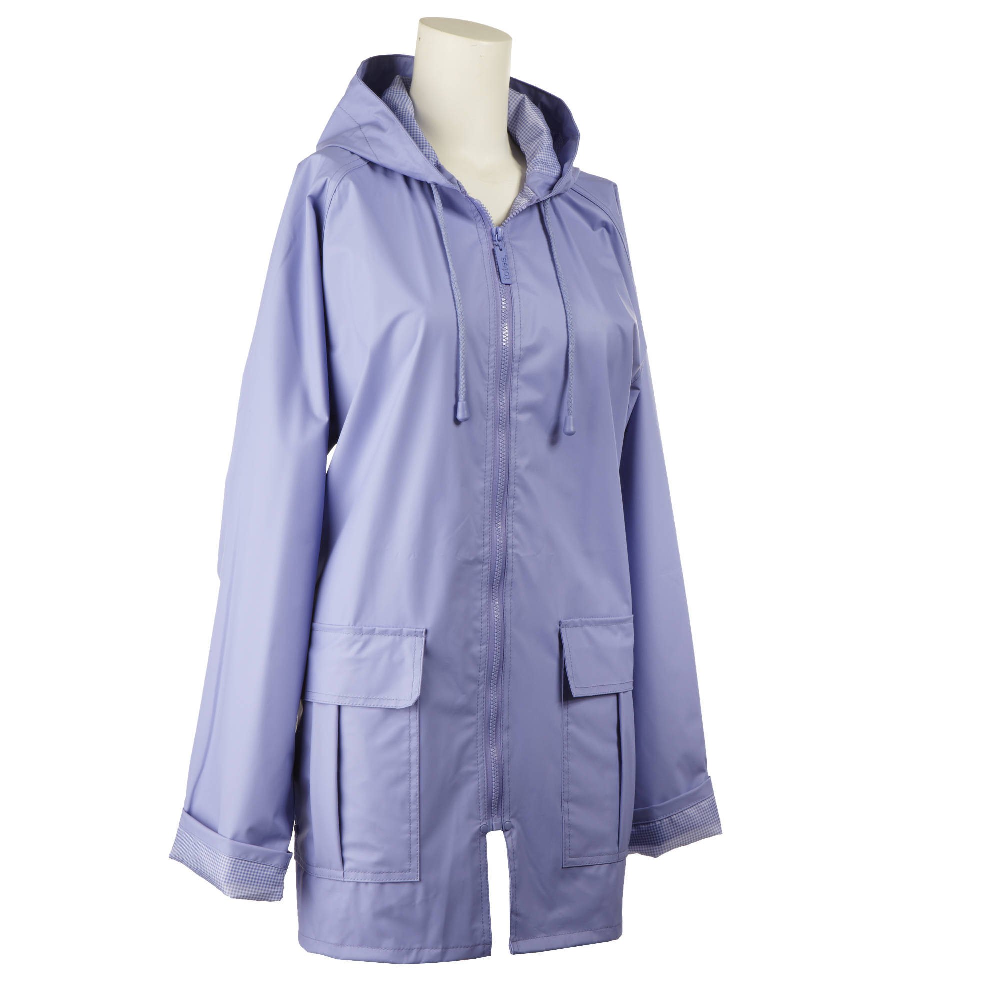
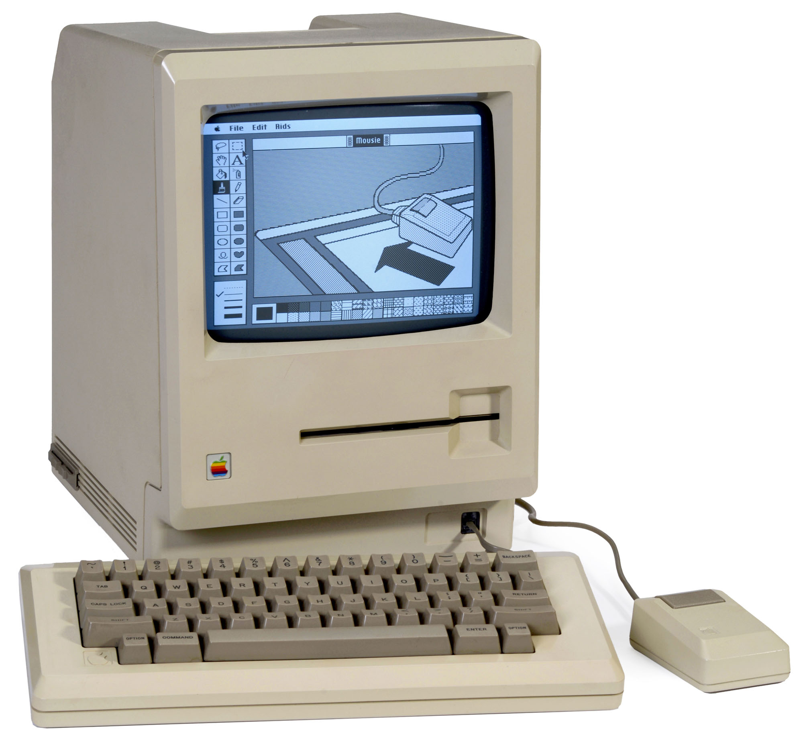
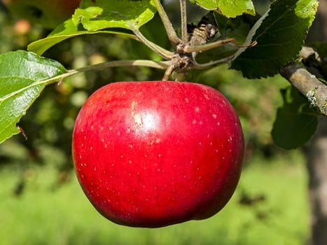

***************
English Notes 2
***************

| headroom
| Definition: the space above a driver's head in a vehicle.
| Definition: the space or clearance between the top of a vehicle and the underside of a bridge.
| Usage: There's a lot of headroom for such a small car.
| 
| subsume
| subsumable
| subsumption
| Definition: include or absorb something in something else.
| Usage: Most of these phenomenan can be subsumed under two broad catagories.
|
| superset
| Definition: a set that includes another set or sets.
|
| by/in virtual of
| Synonyms: because of; as a result of.
| Usage: older 32-bit software may be supported by virtue of the 64-bit instruction set being a superset of the 32-bit one.
|
| abound
| Definition: exists in large number or amount.
| Usage: Rumors of a further scandal abound.
| Phrase: abound in/with
| Usage: This land abounds with wildlife.
| 
| doppelganger
| Definition: a person's doppelganger is another person who looks exactly like them.
| Usage: He has a doppelganger named Donald, his invented twin brother.
| 
| invent
| Definition: make up (an idea, name, story, etc.), especially so as to deceive.
| Usage: I didn't have to invent any tales about my past.
| 
| imposter
| Definition: a person who pretends to be someone else so as to deceive others, especially for fraudulent gain.
| 
| margin
| marginal
| Definition: relating to or suited at the edge or margin of something.
| Usage: Margin notes.
| Definition: of secondary or minor importance; not central.
| Usage: It seems to make only a marginal difference.
| 
| avalanche
| Definition: a mass of snow, ice, or rocks falling rapidly down a mountainside.
| Usage: An avalanche of mud. [泥石流]
| Definition: a sudden arrival or occurrence of something in overwhelming quantities.
| Usage: We received an avalanche of letters to replay our advertisement.
| 
| jersey [ジャージー服]
| Definition: a knitted garment with long sleeves worn over the upper body.

| coffer
| Definition: a strongbox used to store money or valuable things. [保险柜，金库]
| Definition: the funds or the finacial reserves of an institution or organization.
| Usage: The ferderal government's empty coffer.
| 
| strongbox
| Definition: a small lockable box, typically made of metal, in which valuables are kept.
| 
| crimson
| Definition: something is crimson is deep red in color.
| Definition: if someone goes crimson, their face becomes red because they are angry or embarrassed.
| Usage: I used to refuse invitations to parties because I knew I'd go crimson every time someone talked to me.
| 
| slicker
| Definition: a raincoat made of smooth material.
| Definition: a person who is smooth and persuasive but untrustworthy.
| Usage: A permatanned slicker who involves her in embezzlement and fraud.

| macintosh
| mackintosh
| Definition: a full-length waterproof coat.
| Origin: named after Charles Macintosh (1766–1843), the Scottish inventor who originally patented the cloth.
| Definition: from Macintosh, the brand name of a range of computers manufactured by Apple Inc.

| permatanned
| perma-tanned
| Definition: permanently suntanned.
| 
| suntan
| suntanned
| Definition: a browning of skin caused by exposure to the sun. [古铜色肤色]
| Usage: He had acquired quite a suntan.
| Usage: A suntanned face.

| McIntosh
| McIntosh red
| Definition: a dessert apple of a variety native to North America, with deep red skin.
| Origin: named after John McIntosh (1777–1845), the American-born Canadian farmer on whose farm the apple was discovered as a wild variety.

| clarify
| clarification
| Definition: to explain something in detail.
| Usage: A bank spokeman was unable to clarify the situation.
| Usage: The union has written to the minister asking for clarification of the government's controversial decision.
| 
| bog
| Definition: a bog is an area of land which is very wet and muddy.
| Definition: toilet.
| Phrase: bog down
| Definition: if a plan or process is bogged down or something bogs it down, it is delayed and no progress is made.
| Usage: The talk has been bogged down over the issue os military reform.
| 