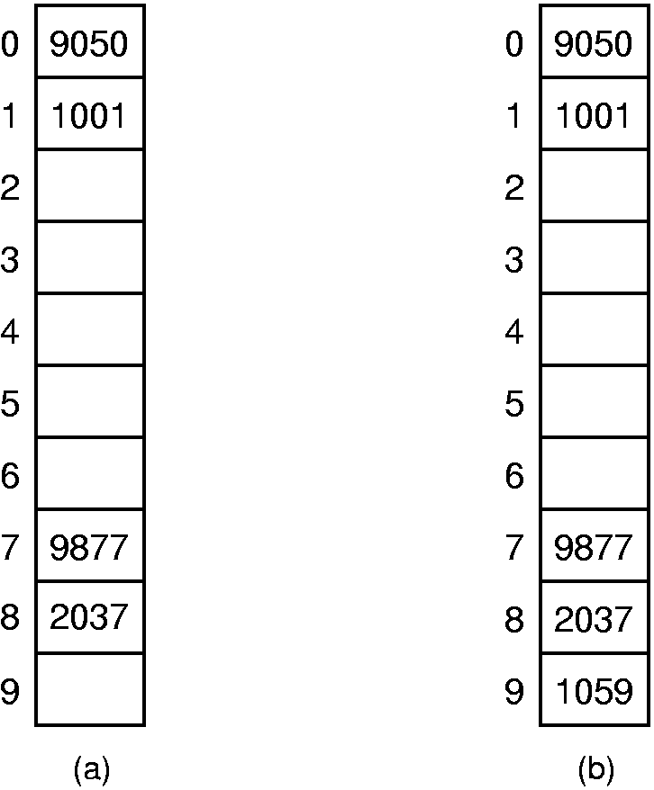

******************************************
Section 5 Closed Hashing without bucketing
******************************************

We now turn to the most commonly used form of hashing: closed hashing without bucketing,
and a collision resolution policy that can potentially use any slot in the hash table.

During insertion, the goal of collision resolution is to find a free slot in the hash table
when the home position for the record is already occupied. **We can view any collision resolution
method as generating a sequence of hash table slots that can potentially hold the record.**
The first slot in the sequence will be the home position for the key. If the home position is occupied,
then the collision resolution policy goes to the next slot in the sequence. If this is occupied as well,
then another slot must be found, and so on. This sequence of slots is known as the **probe sequence**,
and it is generated by some probe function that we will call **probe**. Insertion works as follows:

    .. code-block:: cpp

        bool HashTable::insert(const Key& k, const Element& e)
        {
            int home = hash(k);
            int pos = home;
            for(int i=1; m_table[pos].key() != EMPTYKEY; i++)
            {
                pos = (home + probe(k, i)) % m_tableSize;
                if(k == m_table[pos].key())
                {
                    cout << "Duplicates not allowed!\n";
                    return false;
                }
            }

            m_table[pos].value = e;
            return true;
        }

Method ``insert`` first checks to see if the home slot for the key is empty. If the home slot is occupied,
then we use the probe function ``probe(k, i)`` to locate a free slot in the table. Function ``probe`` has two parameters,
the key ``k`` and a count *i* of where in the probe sequence we wish to be. **Note that the probe function returns an offset
from the original home position, rather than a slot in the hash table**.

``search(k)`` uses the same probe sequence as in in a hash table follows the same probe sequence that was followed when ``insert(k).``

.. code-block:: cpp

    bool search(const Key& k, Element& e) const
    {
        int home = hash(k);
        int pos = home;
        for(int i=1; m_table[pos].key() != EMPTYKEY && m_table[pos].key() != k; i++)
        {
            pos = (home + probe(k, i)) % m_tableSize;
        }

        if(m_table[pos].key() == k)
        {
            e = m_table[pos].value;
        }
        return m_table[pos].key() == k;
    }

Both the insert and the search routines assume that at least one slot on the probe sequence of every key will be empty.
Otherwise they will continue in an infinite loop on unsuccessful searches. Thus, the hash system should keep a count
of the number of records stored, and refuse to insert into a table that has only one free slot.

The discussion on bucket hashing presented a simple method of collision resolution.
If the home position for the record is occupied, then move down the bucket until a free slot is found.
This is an example of a technique for collision resolution known as **linear probing**.
The probe function for simple linear probing is ``probe(K, i) = i``. Once the bottom of the table is reached,
the probe sequence wraps around to the beginning of the table. *Linear probing has the virtue that all slots
in the table will be candidates for inserting a new record before the probe sequence returns to the home position.*

While linear probing is probably the first idea that comes to mind when considering collision resolution policies,
it is not the only one possible. Probe function ``probe`` allows us many options for how to do collision resolution.
In fact, linear probing is one of the worst collision resolution methods. The main problem is illustrated by the figure below.
Here, we see a hash table of ten slots used to store four-digit numbers. The hash function used is ``hash(K) = K % 10``.
The four values 1001, 9050, 9877, and 2037 are inserted into the table. Then the value 1059 is added to the hash table.

The ideal behavior for a collision resolution mechanism is that each empty slot in the table will have equal probability of
receiving the next record inserted (assuming that every slot in the table has equal probability of being hashed to initially). I
n this example, assume that the hash function gives each slot (roughly) equal probability of being the home position for the next key.
However, consider what happens to the next record if its key has its home position at slot 0. Linear probing will send the record to slot 2.
The same will happen to records whose home position is at slot 1. A record with home position at slot 0~2, 7~9 will remain in slot 2.
Thus, the probability is :math:`\frac{6}{10}` that the next record inserted will end up in slot 2. However, only records hashing to slot 3
will be stored in slot 3, yielding one chance in ten of this happening. Likewise, there is only one chance in ten that the next record will
be stored in slot 4, 5, 6, Thus, the resulting probabilities are not equal.

To make matters worse, if the next record ends up in slot 9 (which already has a higher than normal chance of happening),
then the following record will end up in slot 2 with probability :math:`\frac{6}{10}`. This is illustrated in the right side of the figure.
This tendency of linear probing to cluster items together is known as **primary clustering**. Small clusters tend to merge into big clusters,
making the problem worse. The objection to primary clustering is that it leads to long probe sequences.
