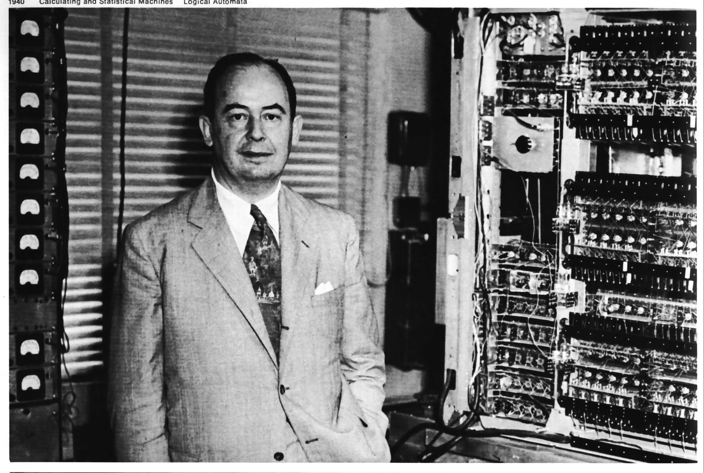

**************
English Note 7
**************

**The tragedy of old age is not that one is old, but that one is young.**

| ascent
| Definition: the act of climbing or moving up; an upward journey.
| Usage: the first ascent of Mount Everest. [珠穆朗玛峰]
| Usage: the first balloon ascent was in 1783.
| Usage: man's ascent to civilization.
| Definition: a rise to an important position or a higher level.
| Usage: his ascent to power.
| Phrase: ascend the throne
| Definition: become king or queen.
| Phrase: in the ascendant
| Definition: rising in power or influence. [上升时期，崛起]
| Usage: the reformers are in the ascendant.
|
| CV [简历]
| Full: curriculum vitae
| Plural: curricula vitae
| Definition: a brief account of a person’s education, qualifications, and previous experience, typically send with a job application.
|
| curriculum [课程]
| Definition: the subjects comprising a course of study in a school or college.
|
| superfluous
| Definition: more than you need or want; unnecessary.
| Usage: She gave him a look that made words superfluous.
|
| mitigate
| mitigation
| Definition: make less severe, serious, or painful.
| Usage: he wanted to mitigate misery in the world.
|
| shoestring
| Definition: a shoelace. [鞋带]
| Definition: a small or inadequate budget.
| Usage: they proved capable of producing high-quality material on a shoestring budget.
|
| cinematography
| cinematographer
| cinematographic
| Definition: the art of making motion pictures. [电影摄制]
|
| eulogy [葬礼致辞]
| Definition: a speech or piece of writing that praises someone or something highly, typically someone who has just died.
| Usage: his good friend delivered a brief eulogy.
|
| reclusive
| reclusiveness
| Definition: avoiding the company of other people; solitary. [孤僻，与世隔绝]
| Usage: a reclusive life in rural Ireland.
| Usage: I live a pretty solitary life.
|
| ostracize
| ostracism
| Definition: exclusion from a society or group.
| Usage: the family suffered social ostracism.
|
| recluse [隐士]
| Synonyms: hermit.
| Definition: a person who lives a solitary life and tends to avoid other people.
|
| eccentric
| esscetricity
| Definition: (of a thing) not placed centrally or not having its axis or other part placed centrally.
| definiton: (of a person or their behavior) unconventional and slightly strange.
| Usage: My favorite aunt is very eccentric.
|
| shun
| Definition: to avoid sb / sth
| Usage: She was shunned by her family when she remarried.
|
| repute
| Synonyms: reputation
| Usage: She is a writer of international repute.
| Definition: be generally said or believed to do something or to have particular characteristics.
| Usage: He was reputed to have a fabulous house.
|
| heavyset
| Definition: having a stocky or stout build. [漢，壮汉，猛男]
| Usage: a heavyset, bull-necked man wearing a T-shirt that revealed his powerful musculature.
|
| birthmark [胎记，胎痣]
|
| scrumptious
| Definition: (of food) extremely appetizing or delicious. [美味]
| Definition: (of a person) very attractive.
| Usage: He is simply the most scrumptious thing on two legs.
|
| straight out (or off)
| Definition: informal without hesitation or deliberation.
| Usage: If you're not going to help me, just say so straight out.
|
| saltpeter [硝酸钾]
| Definition: another term for potassium nitrate (:math:`KNO_3`), used expecially as a fertillizer or explosive.
|
| exhilarating
| Definition: making one feel very happy, animated, or elated; thrilling.
| Usage: It was exhilarating to be on the road again and his spirits rose.
|
| exuberant, exuberance
| Definition: filled with or characterized by a lively energy and excitement.
| Usage: exuberant guests dancing on the terrace.
|
| drunkard [醉汉]
|
| typo: a typographical error. [笔误]
| typography
| typographical
| Definition: the art or procedure of arranging type or processing data and printing from it. [印刷工艺]
| Usage: the bibliography contains many typographical errors.
|
| typeset
| Definition: arrange the type or process the data for (text that is to be printed).
| Usage: the magazine is now typeset in New York.
| Usage: professional-looking typeset material.
| Usage: I’m quite a fast typist. [打字员]
|
| crux
| Plural: cruces [关键，症结]
| Definition: the decisive or most important point at issue.
| Usage: He said the crux of the matter is enconomic policy.
|
| renowned
| Definition: known or talked about by many people; famous.
| Usage: a restaurant renowned for its Southwestern-style food.
|
| notorious
| Definition: famous or well known, typically for some bad quality or deed.
| Usage: Los Angeles is notorious for its smog.
| Usage: He was a notorious drinker and womanizer.
|
| womanizer: a man who engages in numerous casual sexual affairs with women. [滥交者]
|
| playboy: a wealthy man who spends his time enjoying himself, especially one who behaves irresponsibly or is sexually promiscuous. [花花公子]
|
| promiscuity
| promiscuous
| Definition: having or characterized by many transient sexual relationships.
| Usage: they ran wild, indulging in promiscuous sex and experimenting with drugs.
| Definition: demonstrating or implying an undiscriminating or unselective approach; indiscriminate or casual.
| Usage: the city fathers were promiscuous with their honors.
| Usage: Americans are free to pick and choose from a promiscuous array of values and behavior.
|
| derogatory
| showing a critical or disrespectful attitude.
| Usage: she tells me I'm fat and is always making derogatory remarks.
|
| abrogate
| Definition: repeal or do away with (a law, right, or formal agreement).
| Usage: a proposal to abrogate temporarily the right to strike.
| Definition: evade (a responsibility or duty).
| Usage: we believe the board is abrogating its responsibilities to its shareholders.
|
| reentrant
| Definition: (of an angle) pointing inward.The opposite of salient.
| Definition: a re-entrant angle.
| Usage: a sharp re-entrant in a material causes a local increase in stress.
| Definition: an indentation or depression in terrain.
| Usage: they edged up a deep re-entrant to the top of the ridge.
| Definition: a person who has re-entered something, especially the labor force.
| Usage: re-entrants who left to raise a family and are now seeking to get back in.
|
| salient
| Definition: most noticeable or important.
| Usage: it succinctly covered all the salient points of the case.
| Usage: it was always the salient object in my view.
| Definition: (of an angle) pointing outward.The opposite of re-entrant.
| Definition: (of an animal) standing on its hind legs with the forepaws raised, as if leaping.
|
| allot
| Definition: give or apportion (something) to someone as a share or task.
| Synonyms: allocate; grant.
| Usage: I was allotted a little room in the servants' block.
|
| incarnate
| incarnation
| Definition: (especially of a deity or spirit) embodied in flesh; in human form. [附身，凭依，化身]
| Usage: God incarnate.
| Definition: represented in the ultimate or most extreme form.
| Usage: here is capitalism incarnate.
| Definition: (of a person) be the living embodiment of (a quality). [真实写照]
| Usage: the man who incarnates the suffering which has affected every single Mozambican. [莫桑比克人]
| Definition: (with reference to reincarnation) one of a series of lifetimes that a person spends on earth.
| Usage: in my next incarnation, I'd like to be the Secretary of Fun. [来生]
| Usage: He believed he had been a prince in a previous incarnation. [前生]
|
| reincarnate
| reincarnation
| Definition: cause (someone) to undergo rebirth in another body. [投胎，转世]
| Usage: a man may be reincarnated in animal form.
| Usage: they were afraid she would reincarnate as a vampire.
|
| exemplar
| Definition: a person or thing serving as a typical example or excellent model.
| Usage: he became the leading exemplar of conservative philosophy.
|
| traction
| Definition: the action of drawing or pulling something over a surface, especially a road or track.
| Usage: a primitive vehicle used in animal traction.
| Definition: motive power provided for movement, especially on a railroad. [动力，牵引]
| Usage: the changeover to diesel and electric traction.
| Definition: the grip of a tire on a road or a wheel on a rail.
| Usage: his car hit a patch of ice and lost traction.
| Definition: analysts predicted that the technology would rapidly gain traction in the corporate market.
| Definition: the application of a sustained pull on a limb or muscle, especially in order to maintain the position of a fractured bone or to correct a deformity.
| Usage: his leg is in traction.
|
| as yet
| Definition: until now or a particular time in the past.
| Synonyms: so far.
| Usage: the damage is as yet undetermined.
|
| sponge [海绵]
| spongy [膨软疏松]
| Usage: Sponges absorb liquid and are used for washing and cleaning.
| Usage: I like nothing better than butter on a slice of freshly baked, spongy white bread.
| Usage: She sponged him down in an attempt to cool his fever. [用抹布擦拭身体]
| Definition: Obtain or accept money or food from other people without doing or intending to do anything in return. [揩油？乞讨？]
| Usage: They found they could earn a perfectly good living by sponging off others.
| Usage: He edged closer, clearly intending to sponge money from her.
| Definition: a drunkard.
| Phrase: throw in the sponge
| Definition: (informal) to concede defeat; yield; give up:
| Usage: The early election returns were heavily against him, but he wasn't ready to throw in the sponge.
|
| transliterate
| transliteration
| Definition: write or print (a letter or word) using the closest corresponding letters of a different alphabet or language.
| Usage: names from one language are often transliterated into another. [音译]
|
| disburse
| disbursement [拨款，支出]
| Definition: pay out (money from a fund).
| Usage: $67 million of the pledged aid had already been disbursed.
|
| elicit
| elicitation
| Definition: evoke or draw out (a response, answer, or fact) from someone in reaction to one's own actions or questions.
| Usage: I could elicit no response from him. [打探，套话]
| Usage: Her tears elicited great sympathy from her audience. [博取]
|
| espouse
| Definition: adopt or support (a cause, belief, or way of life).
| Usage: he turned his back on the modernism he had espoused in his youth.
| Definition: (be espoused to) (of a woman) be engaged to (a particular man).
|
| dexteriy
| Definition: skill in performing tasks, especially with the hands.
| Usage: her dexterity with chopsticks·
| Usage: his record testifies to a certain dexterity in politics. [政治手腕]
|
| motif
| Definition: a design or a pattern used as a decoration [装饰图案]
| Usage: wallpaper with a flower motif.
| Definition: a subject, an idea or a phrase that is repeated and developed in a work of literature or a piece of music.
| Synonyms: theme. [主题, 主旨]
| Usage: The nautical motif of the poetry during the late East Han Dynasty. [厌世]
|
| self-abasement
| Definition: Degradation or humiliation of oneself, especially because of feelings of guilt or inferiority.
| Usage: "Let them break my heart if they like," she had thought to herself, in the self-abasement of that bitter moment; "it will be no more than I have deserved."
|
| effulgent
| effulgence
| Definition: shining brightly.
| Definition: (of a person or their expression) emanating joy or goodness.
| Usage: standing there was my father with the most effulgent smile on his face.
|
| reflexive
| relexivity
| Definition:(Grammar) denoting a pronoun that refers back to the subject of the clause in which it is used, e.g., myself, themselves.
| Definition: (of a verb or clause) having a reflexive pronoun as its object, e.g., wash oneself.
| Definition: (Logic) (of a relation) always holding between a term and itself.
| Definition: (of an action) performed as a reflex, without conscious thought.
| Usage: at concerts like this one, standing ovations have become reflexive.
|
| ovation
| Definition: a sustained and enthusiastic show of appreciation from an audience, especially by means of applause.
| Usage: the performance received a thundering ovation. [掌声雷动]
|
| clog
| Definition: a shoe with a thick wooden sole [鞋底]. [木底鞋，不是木屐]
| Definition: an encumbrance or impediment.
| Usage: a clog in the system. [系统冗余]
| Definition: block or become blocked with an accumulation of thick, wet matter.
| Usage: the gutters were clogged up with leaves. [下水道]
| Usage: too much fatty food makes your arteries clog up.
| Definition: fill up or crowd (something) so as to obstruct passage.
| Usage: tourists clog the roads in summer.
|
| naive
| Definition: (of a person or action) showing a lack of experience, wisdom, or judgment.
| Usage: the rather naive young man had been totally misled.
| Definition: (of a person) natural and unaffected; innocent.
| Usage: Andy had a sweet, naive look when he smiled.
| Definition: of or denoting art produced in a straightforward style that deliberately rejects sophisticated artistic techniques and has a bold directness resembling a child's work, typically in bright colors with little or no perspective.
|
| obviate
| Definition: remove (a need or difficulty).
| Synonyms: get rid of; avoid; prevent.
| Usage: the Venetian blinds obviated the need for curtains.
|
| blemish
| Definition: a small mark or flaw which spoils the appearance of something.
| Usage: the merest blemish on a Rolls Royce might render it unsalable.
| Definition:spoil the appearance of (something) that is otherwise aesthetically perfect.
| Usage: thousands of Web pages are blemished with embarrassing typos.
| Definition: a moral defect or fault. [污点，瑕疵]
| Usage: local government is not without blemish.
|
| obsolete
| obsolescent
| Synonyms: out-dated
|
| bare-bones
| Definition: reduced to or comprising only the basic or essential elements of something.
| Usage: a bare-bones version of the story. [主干，基础]
|
| hoodwink
| Definition: to deceive or swindle by deception.
| Synonyms: trick, fool, cheat, con
| Usage: You don’t understand that what imposes on common folks would never hoodwind an editor.
|
| swindle
| swindler [骗子]
| Definition: use deception to deprive (someone) of money or possessions.
| Usage: a businessman swindled investors out of millions of dollars.
| Usage: he was said to have swindled $62.5 million from the pension fund.
|
| disbelieve
| Definition: reject as false; refuse to accept.
| Definition: be unable to believe (someone or something).
| Usage: he seemed to disbelieve her.
| Definition: have no faith in God, spiritual beings, or a religious system.
| Usage: to disbelieve is as much an act of faith as belief.
|
| subtitle
| Definition: captions displayed at the bottom of a movie or television screen that translate or transcribe the dialogue or narrative.
| Definition: a subordinate title of a published work or article giving additional information about its content.
| Usage: much of the film is subtitled. [字幕，旁白]
|
| transcribe
| Definition: put (thoughts, speech, or data) into written or printed form.
| Usage: each interview was taped and transcribed.
| Usage: How many official documents have been transcribed into Braille for blind people?
| Definition:  arrange (a piece of music) for a different instrument, voice, or group of these.
| Usage: a piano piece transcribed for the guitar.
|
| dictate
| dictation
| Definition: to say words for sb else to write down.
| Usage: He dictated a letter to his secretary.
| Definition: to tell sb what to do, especially in an annoying way.
| Usage: that doesn't give you the right to dictate to me.
| Usage: They are in no position to dictate terms.
|
| remunerate
| remunerative
| Definition: financially rewarding; lucrative.
| Usage: highly remunerative activities.
| Definition: earning a salary; paid.
| Usage: since June 2003 he has not had any remunerative employment.
|
| mislay
| Definition: unintentionally put (an object) where it cannot readily be found and so lose it temporarily.
| Usage: I seem to have mislaid my car keys.
|
| misapply
| Definition: use (something) for the wrong purpose or in the wrong way.
| Usage: once new technology is adopted, it is often underused or misapplied.
|
| iridescent
| Definition: showing many bright colours that seem to change in different lights [色彩斑斓]
| Usage: a bird with iridescent blue feathers.
|
| sprain
| Definition: to injure a joint in your body, especially your wrist or ankle, by suddenly twisting it. [崴脚，扭伤]
| Usage: I stumbled and sprained my ankle.
| Usage: a bad ankle sprain
|
| recapitulate
| Definition: summarize and state again the main points of.
| Usage: he began to recapitulate his argument with care.
| Definition: (biology) repeat (an evolutionary or other process) during development and growth.
|
| superimpose
| superimposable
| superimposition
| Definition: place or lay (one thing) over another, typically so that both are still evident.
| Usage: the number will appear on the screen, superimposed on a flashing button.
| Usage: different stone tools were found in superimposed layers.
| Usage: She has tried to superimpose her own attitudes onto this ancient story. [重叠，附加于]
|
| gist
| Definition: the substance or essence of a speech or text.
| Usage: she noted the gist of each message. [关键，要点]
| Definition: (law) the real point of an action.
| Usage: damage is the gist of the action and without it the plaintiff must fail.
|
| plaintiff [原告]
| Definition: a person who brings a case against another in a court of law. Compare with defendant.
| Usage: the plaintiff commenced an action for damages.
|
| defendant [被告]
| Definition: an individual, company, or institution sued or accused in a court of law.
| Usage: the defendant tried to claim that it was self-defense.
|
| grasp
| Definition: a firm hold or grip.
| Usage: the child slipped from her grasp.
| Definition: a person's power or capacity to attain something.
| Usage: he knew success was within his grasp. [近在咫尺，唾手可得]
| Definition: a person's understanding.
| Usage: meanings that are beyond my grasp.
|
| karma
| Definition: (in Hinduism and Buddhism) the sum of a person's actions in this and previous states of existence, viewed as deciding their fate in future existences. [业]
| Definition: destiny or fate, following as effect from cause. [因果报应]
| Usage: That guy has good karma, so the girls just like to spend time with him.
|
| apocryphal
| Definition: (of a story or statement) of doubtful authenticity, although widely circulated as being true. [杜撰，轶事]
| Usage: an apocryphal story about a former president
|
| apocrypha
| Definition: biblical or related writings not forming part of the accepted canon of Scripture. [稗官野史]
| Definition: (apocrypha) writings or reports not considered genuine.
|
| apocalypse
| Definition: the complete final destruction of the world, as described in the biblical book of Revelation.
| Usage: the Apocalypse [世界末日，审判日，天变地异]
| Definition: (especially in the Vulgate Bible) the book of Revelation. [天启，启示录]
| Definition: an event involving destruction or damage on an awesome or catastrophic scale.
| Usage: a stock market apocalypse.
| Usage: an era of ecological apocalypse.
|
| apostle [使徒]
| Definition: each of the twelve chief disciples of Jesus Christ.
| Definition: the first successful Christian missionary in a country or to a people.
| Definition: a vigorous and pioneering advocate or supporter of a particular policy, idea, or cause.
| Usage: Leo Buscaglia, leading apostle of love and okayness.
|
| purgatory [炼狱]
| Definition: a place or state of suffering inhabited by the souls of sinners who are expiating their sins before going to heaven.
| Usage: Getting up at five o’clock every morning is sheer purgatory. [活受罪]
|
| armageddon
| Definition: (in the New Testament) the last battle between good and evil before the Day of Judgment.
| Definition: a dramatic and catastrophic conflict, typically seen as likely to destroy the world or the human race.
| Usage: nuclear Armageddon.
|
| Jerusalem 耶路撒冷
|
| Well-versed
| Definition: highly experienced, practiced, or skilled; very knowledgeable; learned.
| Usage: He is a well-versed scholar on the subject of biblical literature.
|
| erudition
| Definition: great academic knowledge.
|
| whiz
| Definition: move quickly through the air with a whistling or whooshing sound.
| Usage: missiles whizzed past.
| Usage: the weeks whizzed by.
| Definition: (whiz through) do or deal with quickly.
| Usage: Audrey would whiz through a few chores in the shop.
| Definition: (also wiz) informal a person who is extremely clever at something.
| Synonyms: prodigy.
| Usage: a computer whiz.
| Usage: a Russian pianist who was a child prodigy in his day.
| Usage: Germany seemed a prodigy of industrial discipline.
|
| polymath
| polymathic
| Definition: a person of wide-ranging knowledge or learning.

   John Von Neumann
