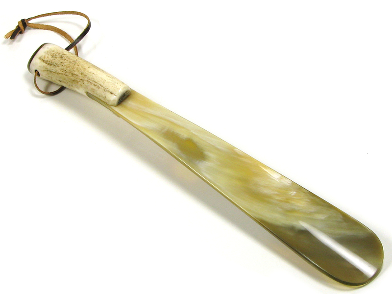
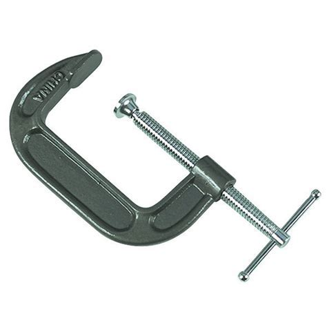
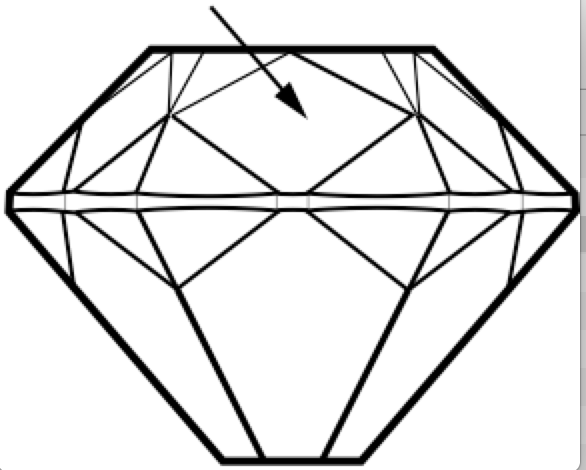
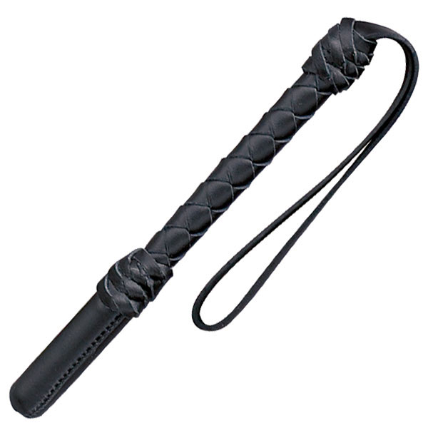
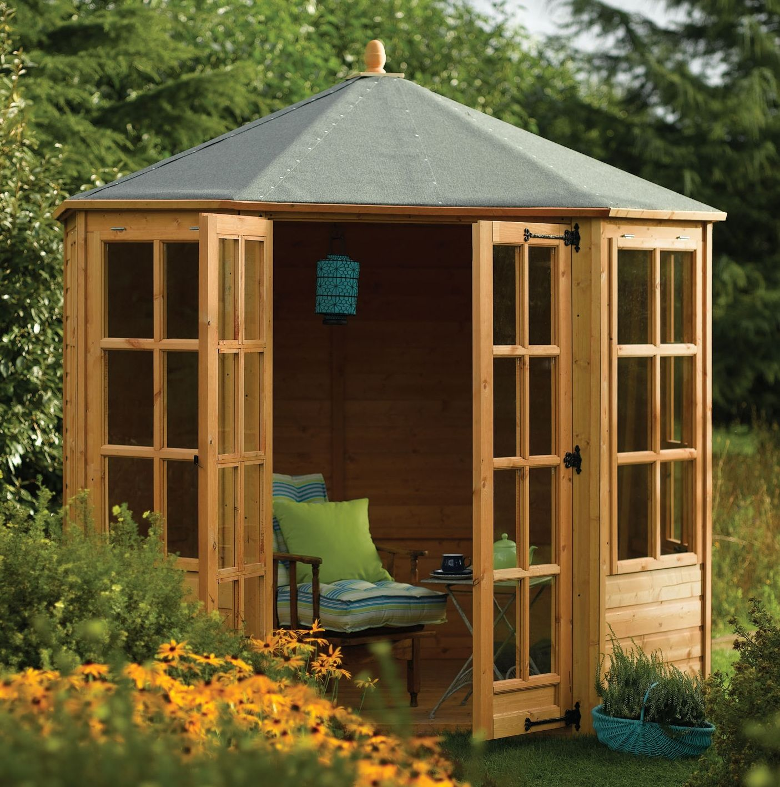

**************
English Note 1
**************

学而不思则罔， 思而不学则殆。

-- 《论语》

+-------------+-------------+-------------+
| Johann      | Sebastian   | Bach        |
+-------------+-------------+-------------+
| First name  | Middle name | Last name   |
+-------------+-------------+-------------+
| Given  name | Middle name | Family name |
+-------------+-------------+-------------+

J. S. Bach shares his given name with six immediate family
members and many extended family members. He shares his family
name, also known as surname, with most family members.

| fiance [未婚夫] fiancee [未婚妻] suitor [求婚者]
|
| lexicon
| Definition: the vocabulary of a person, language, or branch of knowledge.
| Usage: the size of the English lexicon.
| Definition: a dictionary, especially of Greek, Hebrew, Syriac, or Arabic.
| Usage: a Greek-Latin lexicon.
| 
| past tense 过去式
| past participle 过去分词
| present participle 现在进行时
| third person present 第三人称单数
| 
| singular
| Definition: (of a word or form) denoting or referring to just one person or thing. [单数形式]
| Antonyms: plural
| Definition: mathematics (of a square matrix) having a zero determinant. [行列式]
| Definition: exceptionally good or great; remarkable.
| Usage: The singular beauty of the desert.
| 
| positive
| Definition: (of an adjective or adverb) expressing a quality in its basic, primary degree. [一般形式]
| Definition: (of the results of a test or experiment) indicating that a certain substance or condition is present or exists.
| Usage: the positive results of a pregnancy test. [阳性]
| Usage: a positive test for Down's syndrome. [21 三体综合症]
| 
| negative
| Definition: a result of a test or experiment indicating that a certain substance is not present or a certain condition does not exist.
| Usage: the percentage of false negatives generated by a cancer test was of great concern.
| 
| comparative
| Definition: (of an adjective or adverb) expressing a higher degree of a quality, but not the highest possible. [比较级]
| Definition: perceptible by comparison; relative.
| Usage: he returned to the comparative comfort of his own home.
| Definition: of or involving comparison between two or more branches of science or subjects of study.
| Usage: comparative religion.
| 
| superlative
| Definition: (of an adjective or adverb) expressing the highest or a very high degree of a quality. [最高级]
| Contrasted with positive and comparative.
| Definition: of the highest quality or degree.
| Usage: a superlative piece of skill.
| 
| mass noun
| Definition: a noun denoting something that cannot be counted(e.g., a substance or quality), in English usually a noun that lacks a plural in ordinary usage and is not used with the indefinite article, e.g., luggage, china, happiness.
| Antonyms: count noun
| 
| anagram
| Definition: A word, phrase, or name formed by rearranging the letters of another. such as cinema, formed from the word iceman.
| 
| synonym
| synonymous
| Definition: a word similar in meaning to another
| Usage: Agression is often taken as synonymous with violence.
| 
| antonym
| Definition: a word opposite in meaning to another
| Usage: fast is one of the antonyms of slow.
| 
| acronym [首字母缩略词]
| Definition: an abbreviation formed from the initial letters of others words and pronounced as a word (e.g., ASCII, NASA) 
|
| bacronym
| backronym 
| Definiton: an acronym deliberately formed from a phrase whose initial letters spell out a particular word or words, either to create a memorable name.
| Usage: Biodiversity Serving Our Nation, or BISON (a backronym if ever there was one).
|
| vowel [元音]
| Definition: A vowel is a sound such as the ones represented in writing by letters ‘a’, ‘i’, ‘u’, ‘e’, and ‘o’, which  you pronounce with your mouth open, allowing the air flow through it.
| Antonyms: consonant [浊音]
| Usage: The vowel in words like ‘my’ and ‘thigh’ is not very difficult.
| 
| Notes:
| Those who know that “the” is pronounced as “thee” before a vowel often struggle to pronounce it correctly before “u”, but the rule is actually very simple: 
| “The” is pronounced as “thee” if and only if the following sound is a vowel. 
| “A” becomes “an” if and only if the following sound is a vowel.
| 
| encyclopedia
| Definition: An encyclopedia is a book or set of books in which facts about many different subjects or about one particular subject are arranged for reference, usually in alphabetical order.
| 
| glossary
| Definition: A glossary of special, unusual, or technical words or expressions is an alphabatical list of them giving their meanings, for example at the end of a book on a particular subject.
| 
| terminology
| Definition: The terminology of a subject is the set of special words and expressions used in connecting with it.
| Usage: Gastritis, which in medical terminology means an inflammation of the stomach.
| 
| parlance
| Definition: a particualr way of speaking or using words, especially a way common to those with a particular job or interest.
| Usage: Dated terms that were once in common parlance.
| Usage: Medical parlance.
| 
| jargon 
| Definition: words or expressions that are used by a particular profession or group of people, and are difficult for others to understand.
| Usage: Try to avoid using too much technical jargon.
| 
| abyssal
| Definition: (adjective) Of or relating to the great depths of the oceans.
| Synonyms: abysmal, unfathomable
| Usage: The crew was put on full alert as the submarine reached the abyssal depths of the oceans.
| 
| upronounceable
| Definition: (adjective) Difficult or impossible to pronounce correctly.
| Synonyms: unutterable
| Usage: The foreign dignitary had an unpronounceable last name.
| 
| discretion
| Definition: (noun) The quality of behaving or speaking in such a way to avoid social embarrassment or distress.
| Usage: She knew she could rely on his discretion.
| 
| balk
| Definition: (verb) Hesitate or unwilling to accept an idea or undertaking
| Usage: Every gardener will at first balk at enclosing the garden.
| 
| copious 
| Definition: Abundant in supply or quantity.
| Usage: She took copious notes. 
| 
| nifty
| Definition: Particularly good, skillfull, or effective.
| Definition: fashionable
| Usage: Nifty footwork.
| Usage: A nifty black t-shirt.
| 
| fictitious
| Definition: (adjective) not real or true, being imaginary or having been fabricated
| Usage: She pleased guilty to stealing thousands in taxpayer dollars by having a ficticious employee on her payroll.
| Definition: (adjective) relating to or denoting the imaginary characters and events found in fiction
| Usage: The people in this novel are fictitious; the backgroud of public events is not.
| 
| sloppy [adjective]
| Definition: careless and unsystematic; excessively casual
| Usage: Your speech has always been sloppy.
| Definition: (of a garment) casual and loose-fitting
| Usage: He always wore a sloppy T-shirt and boxing pants.
| Definition: (of semifluid matter) containing too much liquid; watery
| Usage: Don’t make the concrete too sloppy.
| Definition: (of literature or behavior) weakly or foolishly sentimental
| Usage: Lovers of sloppy romance.
| 
| gentility
| Definition: social superiority as demonstrated by genteel manners, behavior, or appearance.
| Usage: He took her hand with discreet gentility.
| Definition: the fact of being quiet and old-fashioned.
| Usage: The faded gentility of the town.
| 
| genteel
| gneteelly
| Definition: (of people and their way of life) quiet and polite, often in an exaggerate way; from, or pretending to be from , a high | social class.
| Usage: He lived in genteel poverty.
| Usage: (of a place) quiet and old-fashioned and perhaps slightly boring.
| 
| aristocracy
| aristocratic
| Definition: The highest class in certain societies, especially those holding hereditary titles or offices.
| Usage: The ancient Polish aristocracy had hereditary right to elect the king.
| Definition: A group regared as privileged or superior in a particular sphere.
| Usage: High-level technocrats make up a large part of this "technical aristocracy."
| 
| hereditary
| Definition: (of a title, office, or right) conferred by or based on inheritance.
| 
| monitory
| Definition: (adjective) Conveying an admonition or a warning
| Synonyms: admonitory, cautionary, exemplary, warning
| Usage: She shot him an monitory glance and he quickly changed the subject to one less controversial.
| 
| monition
| Definition:  A warning or an initimation of something imminent, especially of impending danger.
| 
| frisson
| Definition: (noun)  A sudden strong feeling of excitement or fear; a thrill
| Usage: A frisson of excitement.
| 
| chunky
| Definition: (adjective) Short and thick; stocky
| Synonyms: low-set, squat, squatty, stumpy, dumpy
| Usage: But There was a trio involved in this remarkable friendship, and the third was short, and fat, and chunky, and lazy, and, loath to say, it was I.
| 
| contrariwise
| Definition: (adverb) In contrast to what has just been stated or mentioned
| Usage: Contrariwise, a registered person may vote, even if not entitled to be registered.
| 
| unlettered
| Definition: (adjective) uneducated in general; lacking knowledge or sophistication
| Synonyms: ignorant, nescient, unlearned
| Usage: On points where the learned have, in purity of heart, been compelled to differ, the unlettered will necessarily be at variance. 
| [君子和而不同， 小人同而不和]
| 
| canvas [帆布，亚麻布]
| Definition: (noun) a strong, coarse unbleached cloth made from hemp, flax, cotton, or a similar yarn, used to make items such as sails and tents and as a | surface for oil painting.
| Idiom: by a canvas
| Definition: (in boat racing) by a small margin
| Idiom: under canvas
| Definition: in a tent or tents
| Usage: the family will be living under canvas.
| Definition: with sails spread [扬帆远航]
| 
| unprejudiced
| Definition: (adjective) Free from undue bias or preconceived opinions.
| Synonyms: impartial
| Usage: I claim to be an absolutely unprejudiced witness.
| 
| patter
| Definition: (noun / verb) Plausible glib talk (especially useful to a salesperson) 
| Synonyms: line of gab, spiel
| Usage: The automobile salesman spoke about the old car so approvingly and at such length that the customers soon began to grow tired of his patter.
| 
| excavate
| Definition: (verb) to make (a hole, cavity, or tunnel by hollowing or removing the centre of inner part) 
| Usage: The cheapest way of doing this was to excavate a long trench.
| 
| dumbstruck
| Definition: (adjective) So shocked or astonished as to be rendered speechless
| Synonyms: dumbfounded, thunderstruck, flabbergastered, stupefied
| Usage: He stood dumbstruck in the doorway as the partygoers yelled “Surpise!” in the unison.
| 
| Demote
| Definition: Give somebody a lower rank or less senior position, usually as a punishment.
| Usage: The head of the army was demoted to deputy defense secretary.
| 
| shrine 
| Definition: A place regarded as holy because of its associations with a divinity or a sacred person or relic, typically marked by a building or other | construction.
| 
| perverse
| Definition: Contrary to the accepted or expected standard or the practice.
| Usage: In two general elections the outcome was quit perverse.
| 
| clench
| Definition: (with reference to the fingers or hand) close into a tight ball, especially when feeling extrement anger.
| Usage: She clenched her fist, struggling to control.
| Usage: He struck the wall with his clenched fist.
| Definition: (with reference to the teeth) press or be pressed tightly together, especially with anger or determination or so as to surpress a strong emotion.
| Usage: Her teeth clenched in anger.
| Definition: (of a muscular part of the body) tighten or contract sharply, especially with strong emotion.
| Usage: Mark felt his stomach clench in alarm.
| Usage: She clenched on her lip so as not to cry out with her failure to pass the interview.
| 
| hapless
| Definition: (especially of s person) unfortunate.
| Usage: If you are one of the many hapless car buyers who have been shafted.
| 
| ideate
| Definition: To form an idea of; image or conceive
| Usage: The arc whose ideated center is the nodal point in the composition.
| 
| nodal
| Definition: Denoting a point in a network or diagram at which lines or pathways intersect or branch.
| Usage: It’s a nodal point for the railway, connecting all the major cities in Poland.
| 
| Breach
| Definition: If you breach an agreement, a law, or a promise, you break it.
| Usage: The newspaper breached the code of conduct on privacy.
| Usage: The congressman was accused of a breach of secrecy rules.
| Definition: If someone or something breaches a barrier, they make an opening in it, usually leaving it weakened or destroyed.
| Usage: The limestone is sufficiently fissured for tree roots to have breached the roof of the cave.
| Definition: If you breach someone’s security or their defences, you manage to get through and attack an area that is heavily guarded and protected.
| 
| Definition: If you step into breach, you do a job or task which someone else was supposed to do or has done in the past, because they are suddenly unable to do it.
| Usage: I was persuaded to step into the breach temporarily when they became too ill to continue.
|
| frump
| Definition: An unattrative woman who wears dowdy old-fashioned clothes.
| 
| dowdy
| Definition: (of a person or their clothes) unfashionable and without style in appearance (typically used for a woman)
| Usage: She could achieve the kind of casual chic that made every other woman around her look dowdy.
| 
| aborigine
| Definition: a person, animal, or plant that has been in a country or region from the earliest times.
| Usage: An aboriginal inhabitant of Australia.
| 
| syllabus
| Definitionf : An outline of the subjects in a course of study or teaching.
| Usage: There isn’t time to cover the syllabus.
| 
| wacky
| Definition: funny or amusing in a slightly odd or peculiar way.
| Usage: A wacky chase movie
| 
| tarry
| Defintion: Stay longer than intended, delay leaving a place
| Usage: She could tarry a bit an not get home untill four.
| 
| incognito [匿名，隐姓埋名]
| Definition: (of a person) having one’s true identity concealed[adjective & adverb].
| Usage: In order to observe you have to be incognito.
| Usage: Movie stars often prefer to travel incognito.
| 
| perish
| Definition: to die, especially in a sudden violent way.
| Usage: A family of five perished in the fire.
| Definition: to be lost or destroyed
| Usage: Early buildings were made of wood and have perished.
| 
| perish the thought
| Definition: (informal) used to say that you find a suggestion unacceptable or that you hope that something never happen.
| Usage: Me get married? Perish the thought.
| 
| opine
| Definition: Express one’s opinion openly and without fear.
| Synonyms: speak out, sound off
| Usage: “I dare say it is all for the best. ” opined Mr. Green.
| 
| pliant
| Definition: (of a person or their body) soft and giving way to somebody, especially in a sexual way.
| Usage: She lay pliant in his arms.
| Definition: (sometimes disapproving) willing to accept change; easy to influence or control.
| Usage: He was deposed and replaced by a more pliant succesor.
| 
| naught
| Definition: nothing; the digit 0.
| Usage: He is naught bu a worthless fool.
| 
| aught
| Definition: anything at all.
| Usage: know you aught of this fellow, young sir?
| 
| archaic
| Definition: very old or old-fashioned
| Usage: Prisons are run on archaic methods.
| Definition: (of a word or a style of language) no longer in everyday use but sometimes used to impart an old-fashion flavor.
| 
| impart
| Definition: to pass information, knowledge, etc. to other people
| Usage: Teachers had a duty to impart strong morals to their students.
| Definition: to give a particular quality to sth
| Usage: The furniture imparts elegance to the room.
| 
| ecstasy
| Definition: a feeling or state of very great happiness.
| Usage: There was a look of ecstasy on his face. 
| 
| imprimatur
| Definition: Formal and explicit approval
| Usage: The original LP enjoyed the imprimatur of the composer.
| 
| putrefaction
| Definition: moral perversion, impairment of virtue or moral principles.
| Definition: the process of decaying, especially that of a dead body.
| Synonyms: breakdown, decomposition, corruption
| Usage: Clearing the refrigerator of what the previous tenant had left behind was like taking a course in advanced putrefaction of leftovers.
| 
| progency
| Definition: One born of, begotten by, or derived from another
| Synonyms: issue, offspring
| Usage: He was naturally a very nervous, shuddering sort of little fellow, this bread-faced steward; the progency of a bankrupt baker and a hospital nurse.
| 
| airhead
| Definition: a stupid person
| Usage: Okabe is an airhead.
| 
| cram [考前突击]
| Definition: Study intensively, as before an exam.
| Usage: He has been cramming for his exam all week.
| Definition: Completely fill (a place or container) to a point that it appears to be overflowing.
| Usage: Supporters crammed the street.
| 
| careen
| Definition: Move sideways or in an unsteady way.
| Usage: A heavy flood tide caused my vessel to careen dizzily.
| 
| humdrum
| Definition: Lacking variety or excitement; dull
| Synonyms: unglamoros; commonplace; prosiac
| Usage: So here I shall end my days; and I must say, Dorothy, my dear, that you are going back into that stupid, humdrum world again.
| 
| glamour 
| glamorous
| Definition: The attractive or exciting quality that makes certain people or things seem appealing or special.
| Usage: The glamour days of Old Hollywood.
| 
| dilatation
| Definition: The state of being stretched beyonded normal dimension.
| Synonyms: distention
| Usage: He suffered from severe dilatation of the stomach (脹肚), an abdominal swelling that left him writhing in pain.
| 
| Apiece
| Definition: If people have a particular number of things apiece, they have that number each.
| Synonyms: each
| Usage: He and I had two fish apiece.
| Usage: The World Series between the Atlanta Braves and Toronto Blue Jay is tied at one game apiece.
| Definition: If a number of similar things are for sale at a certain price apiece, that is the price for each one of them.
| Usage: Entire roast chickens were 60 cents apiece.
| 
| clunky
| Definition: If you describe something as clunky, you mean that it is solid, heavy, rather awkward.
| Usage: A clunky piece of architecture.
| 
| Skydiving
| Definition: Skydiving is the sport of jumping out of an aeroplane and falling freely through the air before open your parachute.
| 
| Despise
| Definition: If you despise something or someone, you dislike them and have a very low opinion of them.
| Usage: How I despised myself for my cowardice!
| 
| Vogue
| Definition: If something is in vogue, is very popular and fashionable. If it comes into vogue, it becomes very popular and fashionable.
| Synonyms: in fashion
| 
| Potent
| Definition: Something that is potent is very effective and powerful.
| Synonyms: The drug is exetremely potent, but causes unpleasant side effects.
| 
| hard-won
| Definition: If you describe something that someone has gained or achieved as hard-won, you mean that they worked harded to gain or achieve it.
| Usage: The dispute could destroy Australia’s hard-won reputation for industrial stability.
| 
| reek
| Definition: To be pervaded by something very unpleasant.
| Usage: The speeches reeked of anti-Semitism.
| Definition: Give off somke, steam, or fumes
| Usage: While the temples crash, the tower in ashes reek.
| Usage: The reek of cattle dung.
| 
| atonement
| Definition: Amends or reparation made for an injury or wrong.
| Usage: She wanted to make atonement for her husband’s behavior. [贖罪]
| Definition: (in religious contexts) reparation or expiation for sin
| Usage: An annual ceremony of confession and atonement for sin. [救贖]
| 
| reparation:
| Definition: The making of amends for a wrong one has done, by paying money to or otherwise helping those who have been wronged.
| Usage: The courts require a convicted offender to make financial reparation to his victim.
| Definition: The compensation for war war damage paid by a defeated state.
| 
| prune
| Definition: When you prune a tree or bush, you cut off some of the branches so that it will grow better the next year.
| Usage: There is no best way to prune, apart from making sure tools are sharp and every cut is clean.
| Usage: The company has pruned back its workforce by 20,000 since 1989.
| 
| verily
| Definition: truly and certainly
| Usage: I verily believed myself to be a free woman.
| 
| veritable
| Definition: used as an intensifier, often to qualify a metaphor.
| Usage: The early 1970s witnessed a veritable price explosion.
| Usage: The meal that followed was a veritable banquet.
| 
| intensifier
| Definition: an adverb used to give force or emphasis
| Usage: Really in my feet are really cold.
| 
| loiter
| Definition: stand or wait around idly or without apparent purpose
| Usage: She saw Mary loitering near the cloakrooms.
| Definition: travel indolently and with frequent pause
| Usage: They loitered along in the sunshine, stopping at the last execuse.
| 
| sluggard
| Definition: a lazy, slgguish person.
| 
| antsy
| Definition: Agitated, impatient, or restless.
| Usage: He was too antsy to stay in one place for long.
| 
| veer 
| Definition: Changed direction suddenly.
| Usage: An oil tanker that had veered off course.
| Usage: The wind veered southwest.
| Definition: Suddenly change an opinion, subject, type of behavior, etc.
| Usage: The conversation eventually veered away from theatrical things.
| Definition: Slacken or let out (a rope or cable) in a controlled way.
| 
| inanimate
| Definition: Not having the qualities associated with active, living organisms.
| 
| wayfarer
| Definition: A person who travels on foot.
| 
| toiler
| Definition: A person who works strenuously.
| 
| strenuous
| Definition: Requiring or using great exertion
| Usage: all your muscles need more oxygen during strenuous exercise.
| 
| enchant
| Definition: fill someone with great delight; charm.
| Usage: Isabel was enchanted with the idea.
| Definition: put sb. or sth. under a spell (as adjective enchanted).
| Usage: An enchanted garden.
| 
| inflame
| Definition: Provoke sb to strong feelings.
| Usage: Her sister was inflamed with jealousy.
| Usage: High fines futher inflamed public feelings.
| Definition: Cause inflammation in a part of the body (as adjective inflamed).
| Usage: The finger joints were inflamed with rheumatoid arthritis.
| Usage: Inflamed eyes and lips.
| 
| hew
| Definition: Make or shape something by cutting or chopping a material such as wood or stones.
| Usage: A seat hewn out of a fallen tree trunk.
| 
| hoof
| Definition: The horny part of the foot of an ungulate animal, especially a horse.
| Usage: There was a clatter of hoofs as a rider came up to them.
| Definition: Go on foot (hoof it)
| Usage: It was hot, but we hoofed it all the way back.
| 
| on the hoof
| Definition: (of livestock) not yet slaughtered.
| Definition: Without great thought or preparation.
| UsageL Police was made on the hoof.
| 
| tenacious
| Definition: Tending to keep a firm hold of something; clinging or adhering closely.
| Usage: A tenacious grip.
| Definition: Not readily relinquishing a position, principle, or course of action; determined.
| Usage: You’re tenacious and you get at the truth.
| 
| durability
| Definition: The ability to withstand wear, pressure, or damage.
| Usage: The reliability and durability of plastics.
| 
| frailty
| Definition: The condition of being weak and delicate.
| Usage: The increasing frailty of old age.
| Definition: Weakness in character or morals.
| Usage: All drama begins with human frailty.
| 
| hasten
| Definition: Be quick to do something.
| Usage: He hastened to refute the assertion.
| Definition: Move or travel hurriedly.
| Usage: We hastened back to Paris.
| Definition: Casuse sth to happen sooner than it otherwise would.
| Usage: A move that could hasten peace talks.
| 
| repose
| Definition: A state of rest, sleep, or tanquility; composure.
| Usage: In repose her face looked relaxed.
| Usage: He had lost none of his grace or his repose.
| Definition: Harmonious arrangement of colors and forms, providing a restful visual effect.
| Definition: lay something to rest in or on something.
| Usage: I’ll go to him, and repose our distresses on his friendly bosom.
| Definition: give rest to.
| Usage: He halted to repose his wayworn soldiers.
| 
| revery
| Definition: The condition of being lost in thought. more common as reverie.
| Usage: A knock on the door broke her reverie.
| Usage: I slipped into reverie.
| 
| drowsiness
| Definition: A feeling of being sleepy and lethargic.
| Usage: This drug can cause drowsiness.
| 
| aloof
| Definition: Not friendly or interested in other people; distant, remote.
| Idioms: keep / hold oneself aloof; remain / stand aloof. [清高，疏远]
| Usage: The Emperor kept himself aloof from the people.
|
| repository
| Definition: A repository is a place where something is kept safely.
| Usage: A church in Moscow became a repository for police files.
| Definition: A repository of information is a person or group of people who know a lot of information about a particular place or subject. [情报屋]
| Usage: The repository of all important knowledge in a small town was the chief barman [酒吧男侍] of the local pub.
|  
| heretical
| Definition: Holding an opinion at odds with what is generally accepted.
| Usage: I feel a bit heretical saying this, but I think the film has too much action.
| 
| portentous
| Definition: Done in a pompously or overly solemn so as to imporess.
| Usage: The author’s portentous moralizings. [煞有介事，装腔作势]
| 
| pompous
| Definition: Affectedly and irratingly grand, solemn, or self-important.
| Usage: A pompous ass who pretends he knows everything.
| 
| there is no sense in doing sth
| Definition: Use this expression to talk about things you shoudn’t do because it would wasteful.
| Usage: There is no sense in asking him, he knows nothing either.
| Usage: There is no sense in beating yourself up over it.
| 
| push one’s luck
| Definition: Take a risk on the assumption that one will continue to be successful or in favor.
| Usage: There is no sense in pushing your luck.
| 
| betwixt
| Definition: archaic term for between.
| 
| ere
| Defition: archaic term for before.
| 
| forebear
| Synonyms: ancestor
| 
| mist
| Definition: A cloud of tiny water droplets suspended in the atmosphere at or near the earth surface limiting visibility, but to a lesser extent than a fog.
| Usage: A mist rose out of the river.
| Usage: The windows were misted up with condensation.
| Definition: used in reference to something that blurs one’s perceptions or memory.
| Usage: Sardinia’s origins are lost in the mist of time. [撒丁岛]
| Definition: (of a person’s eyes) become covered with a film of tears causing blurred vision.
| Usage: Her eyes misted at the image of her parents. 
| 
| flutter
| Definition: (of a bird or other winged creature) fly unsteadily or hover by flapping te wings quickly and lightly.
| Usage: A couple of butterflies fluttered around the garden.
| Definition: (of a person) move restlessly or uncertainly.
| Usage: The hostess fluttered forward to greet her guests.
| Definition: A state or sensation of tremulous excitement.
| Usage: Her inside were in a flutter.
| Usage: Sandra felt a flutter in the pit of her stomach.
| Idiom: flutter one’s eyelashes [暗送秋波]
| Definition: open and close one’s eyes rapidly in a coyly flirtatious manner.
| 
| flirtatious
| Definition: behaving in such a way as to suggest a playful sexual attraction to someone.
| Usag: She was beautiful and very flirtatious.
| 
| hover
| Definition: remain in one place in the air.
| Usage: Arm helicopters hovered overhead.
| Definition: remain at or near  a particular level.
| Usage: Inflation will hover around the 4% mark.
| Definition: [Computing] use a mouse or other device to position the cursor over a particular area of a computer screen so as to cause a program to respond, without clicking a button on the device.
| Usage: You can hover your cursor over any button to see an explanation.
| 
| wondrous
| Definition: inspiring a feeling of wonder or delight; marvelous; marvelously.
| Usage: She is grown wondrous pretty.
| 
| marvel
| Definition: be filled with wonder or astonishment.
| Usage: “Isn’t this an evening, ” marveled John.
| Definition: A wonderful or astonishing person or thing.
| Usage: Charlie, you’re a marvel.
| 
| riddle
| Definition: A question or statement intentionally phrased so as to require ingenuity in ascertaining its answer or meaning, typically presented as a game.
| Definition: A person, event, or fact that is difficult to understand or explain.
| Usage: The riddle of her death.
| Idiom: talk (or speak) in riddles.
| Definition: express oneself in an ambiguous or puzzling manner.
| 
| meek
| Definition: quiet, gentle, and easily imposed on; submissive.
| Usage: I used to call her Miss Mouse because she was so meek and mild.
| 
| dumb
| Definition:temporarily unable or unwilling to speak.
| Usage: She stood dumb while he poured out a stream of abuse.
| Usage: They stared in dumb amazement.
| Definition: (of a person) unable to speak, most typically because of congenital deafness.
| Usage: He was born deaf, dumb, and blind.
| Idiom: dumb down
| Definition: simplify or reduce the intellectual content of something so as to make it accessible to a larger number of people.
| Usage: Critics have accused publishers of dumbing down books.
| Usage: The need to dumb down for mass audiences.
| 
| congenital
| Definition: (especially of a disease or physical abnormality) present from birth.
| Usage: A congenital malformation of the heart.
| Definition: (of a person) having a particular trait from birth or by firmly estalished habit.
| Usage: A congenital liar. [天生的骗子]
| 
| edge
| Definition: A quality or factor that gives superiority over close rivals or competitor.
| Usage: The veal had the edge on flavor.
| Definition: move gradually, carefully, or furtively in a particular direction.
| Usage: Nick edged his way through the crowd.
| Usage: Hazel quietly edged himself away from the others.
| Definition: defeat by a small margin.
| Usage: Connecticut avoided an upset and edged Yale 49-48.
| Idiom: on edge - tense, nervous, or irritable.
| Usage: Never had she felt so on edge before an interview.
| Idiom: on the edge of one’s seat
| Definition: very excited and giving ones’ full attention to something.
| Idiom: set someone’s teeth on edge [把某人气得咬牙切齿]
| Definition: (especially of an unpleasantly harsh sound) cause someone to feel intense discomfort or irritation.
| Usage: A grating that set her teeth  on edge.
| Idiom: take the edge off
| Definition: reduce the intensity of effect of (something unpleasant or severe).
| Usage: The tablets will take the edge of the pain.
| Idiom: edge someone out
| Definition: Remove a person from an organization or role by indirect means.
| Usage: She was edged out of the organization by the director.
| 
| veal
| Definition: The flesh of a calf, used as food.
| 
| grieve
| Definition: If you grieve over something, especially someone’s death, you feel very sad about it.
| Usage: He’s griving over his dead wife and son.
| Definition: If you are grieved by something, it make you unhappy or upset.
| Usage: He was deeply grieved by the suffering of the common people.
| 
| intoxicated
| Definition: Someone who is intoxicated is drunk.
| Usage: He appeared intoxicated, police said.
| Definition: If you are intoxicated by something such as a feeling or an event, you are so excited by it that you find it hard to think clearly and sensibly.
| Usage: They seem to have become intoxicated by their success.
| 
| resign
| Definition: (be resigned) accept that something undesirable cannot be avoided.
| Usage: He seems resigned to a shortened career.
| Usage: She resigned herself to a lengthy session.
| Definition: (archaic) surrender oneself to another’s guide.
| Usage: He vows to resign himself to her direction.
| 
| utter
| Definition: complete; absolute.
| Usage: Charles stared at her in utter amazement.
| Definition: make (a sound) with one’s voice
| Usage: He uttered an exasperated snort.
| Definition: They are busily scribbling down every word she utters.
| 
| snort
| Definition: make a sudden sound though one’s nose, especially to express indignation or dersion.
| Usage: She snorted with laughter.
| Usage: “How perfectly ridiculous!” he snorted.
| Definition: (of an animal) make a suddent explosive sound through the nose, especially when excited or frightened.
| Definition: to take drugs by breathing them in through  nose.
| Usage: To snort cocaine. [嗑药]
| 
| Zen
| Definition: a Japanese form of Buddhism. [禅宗]
|
| veil unveil
| Definition: A piece of fine material worn by women to protect or conceal the face. [面纱]
| Definition: cover with or as thought with a veil.
| Usage: She veiled her face.
| Usage: A fine drizzle (a mild rain) began to veil the hills.
| Idiom: take the veil  
| Definition: become a nun
| Idiom: beyond the veil
| Definition: in a mysterious or hidden place or state, especially the unknown state of after death.
| Idiom: draw a veil over
| Definition: avoid discussing or calling attention to (something), especially because it’s embarrassing or unpleasant.
| 
| dissect
| Definition: methodically cut up (a body, part, or plant) in order to study its internal parts.
| Usage: Anatomical dissection.
| Definition: analyze (something) in minute detail.
| Usage: Your enjoyment of a novel can suffer from too much analysis and dissections.
| 
| autobiography
| Definition: an account of a person’s life written by that person.
| Usage: He gives a vivid description of his childhood in his autobiography.
| 
| crumb
| Definition: a small fragment of bread, cake or cracker.
| Definition: The budget provided few crumbs of comfort.
| Idioms: crumbs from someone’s (or a rich man’s) table.
| Definition: an unfair and inadequate or unsatisfactory share of something.
| 
| savory
| Definition: (of food) belonging to the category that is salt or spicy rather than sweet.
| Definition: Having an appetizing taste or smell.
| Usage: She carried in a pie from the kitchen, steaming and savory.
| Definition: Morally wholesome or aceeptable, usually with negative.
| Usage: Everyone knew it was a front for less savory operations.
| 
| heed
| Definition: pay attention to; take notice of
| Usage: He should have heeded the warnings.
| Definition: careful attention
| Usage: If he heard, he paid no heed.
| Usage: we must take heed of the suggestion.
| 
| thrift
| Definition: The quality of using money and other resources carefully and not wastefully.
| Usage: The value of thrift and self-reliance.
| 
| hem
| Definition: The edge of a piece of clothing that has been turned under and sewn.
| Idiom: hew and haw
| Definition: hesitate; be indecisive.
| Usage: I waste a lot of time hemming and hawing before going into action.
| 
| vigour
| Definition: physical strength and good health
| Usage: They set about the task with vigor.
| 
| strife
| Definition: angry or bitter disagreement over fundamental issues; conflict.
| Usage: Strife with community.
| 
| spacious
| Definition: (especially of a room or building) having ample space.
| Usage: White walls can give a feeling of spaciousness.
| 
| exaggerate
| Definition: represent (something) as being larger, greater, better, or worse than it really was.
| Usage: They were apt to exaggerate any aches and pains.
| Usage: I couldn’t sleep for three days -- I ‘m not exaggerating.
| 
| bigot
| Definition: a person who is intolerant towards those holding different opinions.
| Usage: Don’t let a few small-minded bigots destroy the good image of the city.
| 
| all-inclusive
| Definition: All-inclusive is used to indicate that a price, especially the price of a holiday, includes all the charges and all the services offered.
| Usage: An all-inclusive two-week holiday costs around $2880 per person.
| 
| voluminous
| Definition: large in number or quantity (especially of discourse)
| Definition: (of cloth or drapery) loose and ample.
| Definition: (of a writer) producing many books.
| Usage: a voluminous skirt.
| 
| discourse
| Definition: written or spoken communication or debate.
| Usage: The language of political discourse.
| Definition: speak or write authoritatively about a topic.
| Usage: She could discourse at great length on the history of Europe.
| 
| exceed
| Definition: be greater in number or size than (a quantity, number, or other measureable thing).
| Definition: go beyond what is allowed or stipulated by (a set limit, especially of one’s authority).
| Synonyms: Surpass
| Usage: Production costs have exceeded $60,000.
| Usage: Catalog sales have exceeded expectation.
| Usage: The officers had exceeded their authority.
| 
| fluctutant
| fluctuation
| Synonyms: fluctuating; unstable
| Definition: an irregular rising and falling in number or amount; a variation.
| Usage: fluctuations in the yearly values could be caused by a variety of factors"
|
| versatile
| Definition: able to adapt or be adapted to many diferent functions or activities.
| Usage: A versatile fighter.
| Usage: He’s a very versatile actor who has played a wide variety of parts.
| 
| volatile
| Definition: A volatile liquid or substance is one that will quickly change into a gas.
| Usage: It’s thought that the blast occurred when volatile chemicals exploded.
| Definition: If someone is volatile, their mood often changes quickly.
| Usage: He had a volatile temper.
| Definition: A situation that is volatile is likely to change suddenly and unexpectedly.
| Usage: Armed soldiers guard the streets in this volatile atmosphere.
| 
| perpetrate
| Definition: If someone perpetrates a crime or any other immoral or harmful act, they do it.
| Synonyms: commit
| Usage: You begin to ask yourself what kind of person perpetrated this crime.
| Usage: It’s time the death penalty was used for perpetrators of terrorist acts.
| 
| blackmail
| Definition: Blackmail is the action of threatening to reveal a secret about someone, unless they do something you tell them to do, such as give you money.
| Usage: Opponents accused him of using blackmail and extortion.
| Usage: The nasty thing about a blackmailer is that his starting point is usually the truth.
| Synonyms: coercion, extortion, intimidation
| Definition: If you describe an action as emotional or moral blackmail, you disapprove of it because someone is using a person’s emotions or moral values to | persuade them to do something against their will.
| Usage: The tactics employed can range from overt bullying to subtle emotional blackmail. [道德绑架]
| 
| high-profile
| Definition: A high-profile person or event attracts a lot of attention or publicity.
| Usage: The high-profile reception being given to Mr Zhou.
| 
| profile
| Definition: Your profile is the outline of your face as it is seen when someone is looking at you from the side.
| Definition: If you see someone in profile, you see him or her from the side.
| Usage: This picture shows the girl in profile.
| Definition: To profile someone means to give an account of that person’s life and character.
| Definition: A profile of someone is a short article or programme in which his or her life and character is described.
| Usage: The BBC journalist profiles the rebel leader.
| Definition: a graphical or other representation of information relating to particular characteristics of something, recorded in quantified form.
| Usage: The blood profiles of cancer patients.
| 
| high profile / low profile
| Definition: If someone has a high profile, people notice him or her and what he or she does. If you keep a low profile, you avoid doing things that will make | people notice you.
| Usage: Football is a high profile business.
| Usage: The famous actor tries to keep a low profile.
| 
| jeer
| Definition: make rude and mocking remarks, typically in a loud voice.
| Usage: Some of the younger men jeered at him.
| Usage: The players were jeered by disappointed fans. [嘘]
| 
| boo
| Definition: If you boo a speaker or performer, you shout ‘boo’ or make other loud sounds to indicate that you don’t like them, their opinion, or their | performace.
| Usage: The fans are entitled to their opinion but booing doesn’t help anyone.
| Usage: Benzema was booed by the home fans after missing a last-minute sitter. [遭嘘]
| 
| trounce
| Definition: to defeat somebody completely.
| Usage: Brazil trounced Italy 5-1 in the final. [狂胜]
| 
| thrash
| Definition: if one player or team thrashes another in a game or match, they defeat them easily or by a large score.
| Usage: Cristiano Ronaldo scored a hat-trick as Real Madrid thrashed Real Sociedad. [帽子戏法] 
| 
| clobber
| Definition: hit somebody hard.
| Definition: defeat heavily.
| Usage:  If he does that I’ll clobber him!
| Usage: The Braves clobbered the Cubs 23-20.
|
| runaway
| Definition: a person who has run away, especially from their family or an institution.
| Usage: A teenage runaway. [离家出走]
| Definition: an animal or vehicle that is running out of control.
| Usage: A runaway train.
| Definition: denoting something happening or done very quickly, easily, or uncontrollably.
| Usage: The runaway success of the book.
|

Lionel Messi scored a hat-trick as runaway leaders Barcelona equalled the La Liga record
of 38 games unbeaten with victory over Leganes.

Barcelona v Chelsea: Lionel Messi joins the Champions League 100 club.[百球俱乐部]

Some of Messi's close control and dribbling was breathtaking, drawing gasps of delight from the home crowd,
and with three goals and that wondrous assist over the course of the two legs of the Chelsea tie it's very easy
to conclude he was the difference between the teams.

Messi is an arch-competitor and is gunning for his fifth league title after seeing bitter rivals Real Madrid take
the crown for the past two seasons.

Though Messi will rightly claim the lion's share of the headlines, perhaps the most significant moment in the game
from the home team's perspective was Dembele's thumping finish from Messi's assist - his first goal in Barca colors.

His selection in the starting XI was a surprise after he was left on the bench for the first leg, but the flamboyant
manner in which he took his goal, firing a fierce rising drive into the root of the net, showed exactly how important he could 
become to the team.

Germany and Spain played out an entertaining friendly draw in a meeting
of the past two world champions.

Spain, the 2010 World Cup winners, led within six minutes as Rodrigo
smashed home from Andres Iniesta's pass.

But reigning world champions Germany levelled from Thomas Muller's
25-yard curling effort in a lively first half.

Elsewhere, France threw away a 2-0 lead to lose 3-2 to Colombia at
the Stade de France. [法兰西大球场]

Barcelona completed one of the greatest comebacks in football history
as Paris Saint-Germain choked an incredible night at Camp Nou . [诺坎普]

Rakitic was almost impeccable on Wednesday. He completed 74 passes, more than any other player, at a conversion rate of 94.6%, 
with his controlled and sensible passing keepping his team ticking over in the way Busquets has done for so many years.

Luis Suarez's header set Barca on their way before Philippe Coutinho's sublime backheel doubled the lead. [脚后跟妙传]

| 
| impeccable
| Definition: in accordance with the highest standards; faultless.
|
| sublime
| Definition: of very great excellence or beauty,
| Usage: Experiences that ranged from the sublime to the ridiculous.
| Definition: (of a person's attitude or behavior) extreme or unparalleled.
| Usage: He had the sublime confidence of youth.
| Defintion: (chemistry) (of a solid substance) change directly into vapor when heated, typically forming a solid deposit again once cooling.
| Usage: The ice sublimed away, leaving the books dry and undamaged. [升华]
| Definition: elevate to a high degree of moral or spiritual purity or excellence.
| Usage: Let your thoughts be sublimed by the spirit of God.
| 
| tie 
| Definition: restrict or limit (someone) to a particular situation, occupation, or place.
| Usage: She didn’t want to be like her mother, tied to a feckless man.
| Definition: achieve the same score or ranking as another competitor or team.
| Usage: England tied 2-2 with Germany in the first round. [平局]
| Usage: They tied for second place. [并列第二]
| 
| flick
| Definition: a sudden sharp movement.
| Definition: the suddent release of a bent finger or thumb, especially to propel a small object.
| Usage: He sent his cigarette spinning away with a flick of his fingers. [掸烟灰]
| Usage: Emily flicked some ash off her sleeve.
| 
| capitalize
| Definition: (capitalize on) take the chance to gain advantage from.
| Usage: An attempt by the opposition to capitalize on the government's embarrassment.
| Definition: provide (a company or industry) with capital (as adjective capitalized).
| Usage: A highly capitalized industry.
| Definition: realize (the present value of an income); convert into capital.
|

Tottenham appeared to be in control until Gonzalo Higuain turned in Sami Khedira's flick to 
give Juventus a 64th-minute lifeline - which they capitalised on ruthlessly and Paulo Dybala 
raced clear for the decisive goal three minutes later.

|
| back-to-back
| Definition: consecutively; in a row
|

Zidane’s Real have won back-to-back European titles, but are 19 points
adrift of La Liga leaders Barcelona and were knocked out of
the Copa del Rey [国王杯] by Leganes on Wednesday at the Bernabeu. [伯纳乌]

The Real, who finished second in the group to Tottenham, face Paris St-Germain
in the Champions League last-16 [欧冠 16强] with the first leg [首回合] on 14
February at Bernabeu.

Cristiano Ronaldo scored in a 10th straight game for Real Madrid but
they were held to a derby [德比] draw by Atletico Madrid. 

Italy and  Argentina observed a minute's silence as a mark
of respect to David Astori before kick-off. [默哀一分钟]

Italy paid tribute to the late David Astori as they lost 2-0 to Argentina on an emotional night in Machester. [已故的]

Messi took on three defenders to score, then rolled a free-kick under the wall for the second. [任意球贴地斩]

Real became the first team to successfully defend the Champions League last season. [卫冕成功] 

Sevilla reached their second Copa del Rey final in three seasons with a 3-1 aggregate win over La Liga rivals Leganes.

Spurs showed maturity as well as excellence to come from two goals down to earn a draw in Turin in the first leg, 
putting themselves in a favourable position to finish the job and secure a place in the quarter-finals.

And yet from a position of strength bolstered even further
by Son's goal just before the interval [中场休息], Spurs once again came up short.

There is no doubting the quality in this Tottenham side
and they were excellent in spells at Wembley, but with two
Premier League title  campaigns promising much but unable to deliver
and an FA Cup semi-final loss to Chelsea last season, the requirement
for tangible success is intensifying.

English players may be “masters” of diving. [假摔]

Dybala is a phenomenon … sometimes. [现象级球员]

Son was inches off target late on as Spurs pressed - his performance
mirroring that of his team on a night when they got plenty right
but could not make the crucial moment count.

Pochettino is a dreamer, but this turned into a nightmare.
They've been put out by a side who were cuter, more street-wise,
and took their chance. 

|
| street-wise
| Definition: having the experience and knowledge necessary to deal with the potential difficulties or dangers of life in urban.
| Definition: reflective of modern life, especially that of urban youth. [市侩]
|
| adroit
| Definition: clever or skillful in using the hands or mind.
| Usage: he was adroit at tax avoidance.
| Usage: an adroit negotiator.
| 
| tangible
| tangibly
| tangibility
| Definition: perceptible by touch.
| Usage: The atmosphere of neglect and abandonment was almost tangible.
| Definition: clear and definite; real.
| Usage: The emphasis is now on tangible results.
| 
| mixed
| Definition: consisting of different qualities or elements.
| Definition: (of an assessment of, reaction to, or feeling about something) containing a mixture of both favorable and negative elements.
| Usage: Son's mixed night. [悲喜交加]
| Usage: I had mixed feelings about seeing Laura again.
| Usage: The play was given a mixed reception by the critics. [毁誉参半]

Isco scored a hat-trick as Spain warmed up for the 2018 World Cup by crushing 2014 finalists Argentina in Madrid.

Cristiano Ronaldo scored one of the Champions League's greatest goals as his incredible bicycle kick
helped Real Madrid demolish Juventus in the quarter-final first leg. [自行车射门]

| demolish
| Definition: overwhelmingly defeat (a player or team).
| Usage: They demolished the Denver Broncos, 55-10.
| 
| epic 
| Synonyms: saga
| Definition: a long and difficult job or activity that you think people should admire.
| Usage: Their four-hour match on Centre court was an epic.
| 
| acrobat [杂技演员]
| acrobatics [杂技]
| acrobatically
| Definition: an entertainer who performs gymnatic feats. [杂技演员]
| Definition: a person noted for constant change of mind, allegiance, etc.
| Definition: performing, involving, or adept at spectaculargymnastic feats.
| Usage: An acrobatic dive.
| 
| meager
| Definition: Deficient in amount  or quality or extent.
| Usage: They were forced to supplement their meager earning.
| 
| cannular
| Definition: a thin tube inserted into a vein or body cavity to administer medicine, drain of fluid, or insert a surgical instrument.
| 
| enamor
| Definition: be filled with a feeling of love for
| Usage: It is not difficult to see why Edward is enamored with her.
| Usage: She was truly enamoured of New York.
| 
| shoehorn
| Defiintion: a curved instrument used to ease one’s heel into a shoe.
| Definition: force into an inadequate space.
| Usage: People were shoehorned into cramped corners.

| 
| prehensile
| Definition: (of a part of an animal’s body) able to hold things
| Usage: The monkey’s prehensile tail.
| Definition: immoderately desirous of acquiring e.g. wealth.
| Synonyms: excessive; immorderate; greedy
| 
| yammer
| Definition: make a loud repetitive noise.
| Definition: To complain peevishly or whimperingly.
| Usage: The yammer of their animated conversation.
| 
| peevish
| Definition: easily irritated, especially by unimportant things.
| Usage: All this makes Steve fretful and peevish.
| 
| whimper
| Definition: (of a person or animal) make a series of low, feeble sounds expressive of fear, pain, or discontent.
| Usage: She gave a little whimper of protest.
| Usage: A child in a bed began to whimper.
| 
| penultimate 
| Definition: The penultimate thing in a series of things is the last but one; second last.
| Usage: It is the first time Barcelona have been 19 points above Real since the penultimate day of 1990-91 season.
| 
| refrain
| Definition: stop oneself from doing something.
| Usage: She refrained from comment.
| Definition: a repeated line or number of lines in a poem or song, typically at the end of each verse.
| Definition: 
| Usage: Complaints about poor food in schools have become a familiar refrain.
| Usage: “Poor Tom” had become the constant refrain of his friend.
| 
| falsework
| Definitin: temporary framework structures used to support a building during its construction.
| 
| immaterial
| Definitin: unimportant under the circumstances; irrelevant.
| Usage: It’s immaterial to me whether he stays or goes.
| Definition: (philosophy) spiritual, rather than physical.
| Usage: We have immaterial soul.
| 
| compromise
| Definition: settle a dispute by mutual concession.
| Definition: cause to become vulnerable or funtion less effectively.
| Usage: Last month’s leak of source code will not compromise your IT security.
| Usage: I should compromise the matter with my parents.
| 
| stifle
| Definition: make (someone) unenable to breathe properly; suffocate.
| Definition: restrain (a reaction) or stop oneself acting on (an emotion).
| Definition: prevent or constrain (an activity or idea)
| Usage: She stifled a desire to turn and flee.
| Usage: She managed to stifle a yawn.
| Usage: I was stifling in the airless room.
| Usage: At 25, I found family life stifling.
| Usage: They hope the new rules will not stifle creativity.
| 
| almanac [年鉴]
| Defininiton: a book that is pulished every year giving information for that year about a particular subject or activity. [年鉴]
| 
| anecdote [轶事]
| Definition: a short and amusing or interesting story about a real incident or person.
| Usage: He had a rich store of anecdotes.
| 
| distraught
| Definition: exetremely upset and anxious so that you cannot think clearly.
| 
| spellbinding
| Definition: holding the complete attention of (someone) as though by magic; fascinating.
| Usage: She told the spellbinding story of the legend’s life.
| 
| astray
| Definition: away from the correct path or direction.
| Usage: we went astray but a man redirected us.
| Definition: into error or morally questionable behavior.
| Usage: He was led astray by boozy colleague.
| Idiom: go astray
| Definition: (of an object) become lost or mislaid.
| Usage: The money had gone astray.
| 
| screwdriver 
| Definition: 螺丝刀，改锥
| clamp
| Definition: 夹钳，车轮夹锁（用于锁住违章停放的车辆）

   clamp

| 
| fervent
| fervency
| Definition: having or showing very strong and sincere feeling about something.
| Synonyms: ardent
| Usage: A fervent admirer / believer / supporter.
| 
| stringent
| Definition: (of regulations, requirements, or conditions) strict, precise, and exacting.
| Usage: California’s air pollution guidelines are stringent.
| 
| exert
| Definition: apply or bring to bear (a force, influence, or quality).
| Usage: The Moon exerts a force on the Earth.
| Definition: (exert oneself) make a physical or mental effect.
| Usage: He would have to exert himself in order to be successful. 
| 
| in retrospect  
| Definition: when looking back on a past event or situation; with hindsight
| Usage: perhaps, in retrospect, I shouldn’t have come back.
| 
| bedrock
| Definition: solid rock underlying loose deposits such as soil or alluvium.
| Definition: the fundamental principles on which something is based.
| Usage: Honest is the bedrock of a good relationship.
| 
| conerstone [奠基石]
| Definition: a stone that forms the base of a corner of a building, joining two walls.
| Definition: an important quality or feature on which a particular thing depends or is based.
| Usage: A national minimum wage remained the cornerstone of policy.
| 
| rudimentary
| Definition: Rudimentary things are very basic or simple and are therefore unsatisfactory.
| Usage: They are deprived of the ability to exercise the most rudimentary workers’ rights.
| Definition: Rudimentary knowledge includes only the simplest and most basic facts.
| 
| jitter
| Definition: If you have the jitters, you feel extremely nervous, for example because you have to do something important or because you are expecting | important news.
| Usage: I had a case of the jitters during my first two speeches.
| 
| surmise
| Definition: If you surmise that something is true, you guess it from the available evidence, although you do not know for certain.
| Synonyms: infer; conjecture. [推断]
| Usage: There’s little to go on, we can only surmise what happened.
| Usage: His surmise proved correct.
| 
| mere
| Definition: used to emphasized how small or insignificant someone or something is.
| Usage: The city is a mere 20 minutes from some stunning conutryside.
| Definition: used to emphasize that the fact of something being present in a situation is enough to influence that situation.
| Usage: His stomach rebelled at the mere thought of food.
| 
| sheer
| Definition: (only before noun) used to emphasized the size, degree or amount of something
| Usage: We were impressed by the sheer size of the cathedral.
| Usage: I only agreed out of sheer deperation.
| 
| spectrum
| Definition: The entire range of wavelengths of electromagnetic radiation.
| Definition: An image or distribution of components of sound, particles, etc., arranged according to such characteristics as frequency, charge and energy.
| Usage: A spectrum is formed by a ray of light passing through a prism. [光谱]
| Definition: A complete or wide range of related qualities, ideas, etc.
| Usage: Self-help books are covering a broader and broader spectrum.
| 
| Cinderella [灰姑娘]
| Definition: a person or thing of unrecognized or disregarded merit or beauty.
| Definition: a neglected aspect of something
| Usage: For years radio has been the Cinderella of the media world.
| Usage: Is research into breast cancer to remain the Cinderella of medicine?
| 
| quiz
| Definition: a test of knowledge, especially a brief, informal test given to students.
| Usage: A reading comprehension quiz.
| Usage: You will be quizzed on chapter 6 tomorrow.
| 
| prowess
| Definition: skill or expertise in a particular activity or field.
| Usage: His prowess as a fisherman.
| 
| derate
| Definition: reducing the power rating of (a component or device).
| Usage: The engines were derated to 90 horse power.
| 
| liability
| Definition: the state of being responsible for something, especially by law.
| Usage: The partner accept unlimited liability for any risks they undertake.
| Definition: a thing for which someone is responsible, especially a debt or financial obligation.
| Usage: Valuing the company’s liabilities and assets.
| Definition: a person or thing whose presence or behavior is likely to cause embarassment or put one at a disadvantage.
| Usage: He has become a political liability.
| 
| succinct
| Definition: expressed clearly and in a few words.
| Synonyms: concise
| Usage: Keep your answers as succint as possible.
| 
| tap [水龙头]
| hose [水管]
| Definition: a flexible tue conveying water, used especially for watering plants and in firefighting. 
| 
| privy
| Definition: allowed to know about something secret.
| Usage: He was no longer privy to her innermost thoughts.
| Definition: a toilet, especially an outdoor one.
| 
| gracious
| Definition: courteous, kind, and pleasant.
| Usage: Smilling and gracious in defeat.
| Definition: elegant and tasteful, especially as exhibiting wealth or high social status.
| Usage: A gracious lady.
| Definition: used as a very polite word for royal people or their action.
| Usage: Her gracious Majesty the Queen.
| 
| apiary
| apiarist [养蜂人]
| Definition: a place where bees are kept; a collection of beehives.
| 
| dual
| Definition: having two parts or aspects.
| Usage: She had dual nationality. [双重国籍]
| Usage: dual-core CPU. [双核处理器]
| 
| resort   
| Definition: a strategy or course of action that may be adopted in a difficult situation.
| Usage: German and Italy tried to resolve their economic and social failures by resort to fascism.
| Usage: The president was prepared to resort to force if negotiation failed.
| Idiom: last resort
| Definition: a final course of action, used only when all else has failed.
| Usage: Asking them to leave the school should be a last resort. 
| 
| niche
| Definition: a specialized segment of the market for a particular kind of product or service.
| Definition: denoting or relating to products, services, or interests that appeals to a small, specialized section of the population.
| Usage: The video game industry is no longer niche.
| Usage: Smaller cooperatives must find and develop a nich for their speciality product.
| Idiom: one’s niche
| Definition: a comfortable or suitable position in life or employment.
| Usage: He’s now a partner at a leading law firm and feels he has found his niche.
| 
| duck
| Definition: to push somebody underwater and hold them there for a short time.
| Usage: The kids were ducking each other in the pool.
| Definition: duck (out of) something to avoid a difficult or unpleasant duty or responsibity.
| Usage: It’s his turn to cook dinner, but I bet he’ll try to duck out of it. 
| Idiom: take to something like a duck to water
| Definition:take to something very readily.
| Usage: She has taken to teaching like a duck to water.
| Idiom: get / have one’s ducks in a row
| Defiition: get one’s facts straight; get everything organized.
| Idiom: water off a duck’s back
| Definition: a potentially hurtful or harmful remark or incident that has no apparent effect on the person mentioned.
| Usage: It was like water off a duck’s back to Nick, But I’m sure it upset Paul.
| Usage: quite an odd duck ??
| 
| vintage
| Definition: a wine of high quality made from the crop of a single identified district in a good year.
| Definition: denoting something of high quality, especially something from the past or characteristic of the best period of a person’s work.
| Usage: The opera is vintage Rossini.
| 
| porcelain [釉，陶瓷] : china 
| 
| culmination [结晶，高潮，巅峰]
| Definition: the highest or climactic point of something, especially as attained after a long time.
| Usage: The product was the culmination of 13 years of research.
| 
| climactic
| Definition: (of an action, event or scene) exciting or thrilling and acting as a climax to a series of events.
| 
| climax
| Definition: the most intense, exciting or important point of something; a culmination or apex.
| Usage: A thrilling climax to the game.
| Definition: an orgasm. [性高潮]
| 
| predecessor
| Definition: a person who held a job or office before the current holder. 
| Usage: The new president’s foreign policy is very similar to that of his predecessor.
| Definition: the predecessor of an object or machine is the object or machine that came before it in a sequence or process of development.
| Synonyms: forerrunner
| Usage: Although the car is 40mm shorter than its predecessor, its boot is 20 per cent larger.
| 
| proximity
| Definition: nearness in space, time, or relationship.
| Usage: A house in the proximity of the highway.
| 
| cumbersome
| Definition: large and heavy; difficult to carry.
| Definition: slow and complicated and therefore inefficient.
| Usage: Cumbersome diving suits.
| Usage: Cumbersome legal procedures.
| Usage: Organizations with cumbersome hierachical structures.
| 
| cum
| Definition: combined with; also used as (used to describe things with a dual nature or function).
| Usage: a bedroom-cum-study. [卧室兼做书房]
| 
| impromptu
| Definition: done without preparation or planning.
| Synonyms: improvised
| Usage: an impromptu speech. [即兴演讲]
| Definition: a short piece of instrumental music, especially a solo, that is reminiscent of an improvisation.
| 
| improvisation
| Definition: the action of imporvising.
| Definition: something that is improvised, especially a piece of music, drama, etc., created without preparation.
| Usage: She specialzes in improvisation on the piano.
| 
| reminisce
| reminiscent
| Definition: indulge in enjoyable recollection of past event.
| Usage: We spent a happy evening reminiscing about the past. [秉烛夜谈]
| 
| forswear
| Definition: to make a promise that you will stop doing or using something.
| Synonyms: renounce
| Usage: The country has not forsworn the use of chemical weapons.
| 
| emacitated
| Definition: abnormally thin or weak, especially because of illness or a lack of food.
| Usage: She was so emaciated that she could hardly stand.
| 
| telltale
| Definition: a person, especially a child, who report others’ wrongdoings or reveals their secrets. [告密者，打小报告，小麻雀]
| Definition: a device or object that automatically gives a visual indication of the state or presence of something.
| Usage: Earlier this winter though, an image of an emaciated polar bear went viral, with many asking if this was the telltale image of climate change.
| 
| cloud
| Definition: spoil or mar (something).
| Usage: The general election was clouded by violence. [蒙上一层阴影]
| Definition: (of someone’s face or eyes) show worry, sorrow, or anger.
| Usage: Suspicion clouded her face.
| Usage: His expression clouded over. [脸变得阴沉]
| Idiom: every cloud has a silver lining
| Definition: every difficult or sad situation has a comforting or more hopeful aspect even though this may not be immediately apparent. [塞翁失马，焉知非福]
| Idiom: under a cloud
| Definition: under suspicion
| Usage: Apple has been under a cloud after revealing that it deliberately slowed batteries in old phones.
| Idiom: in the clouds / have one’s head in the clouds
| Definition: out of touch with reality; daydream
| Usage: This clergyman was in the clouds.
| Idiom: on cloud nine
| Definition: extremely happy. [with reference to a ten-part classification of clouds in which “nine” was next to the highest]
| 
| be born with a silver spoon in one’s mouth
| Definition: be born into a weathy family of high social standing.
| 
| spoon-feed
| Definition: feed someone by using a spoon.
| Definition: provide someone with so much help or information that they do not need to think | for themselves.
| 
| misbehave
| Definition: behave badly.
| 
| bobbin [绕线筒，线轴]
| Definition: a winder around which thread or tape or film or other flexible material can be wounded.
|
| encroach
| encroachment
| Definition: intrude on ( a person’s territory or a thing considered to be a right).
| Usage: Rather than encroach on his privacy, she might have kept to her room.
| Definition: (disapproving) to begin to affect or use up too much of someone’s time, rights, personal life, etc.
| Usage: I won’t encroach on your time any longer.
| Usage: He never allows work to encroach upon his family life.
| Definition: advance gradually beyone usual or acceptable limits.
| Usage: The sea has encroached all around the coast.
| 
| in decline / on the decline
| go / fall into decline
| Definition: If something is in decline or on the decline, it is gradually decreasing in importance, quality, or power.
| Usage: He is still one of the world’s most popular football players, but his game is in decline.
| 
| ferocious
| Definition: A ferocious animal, person, or action is very fierce and violent.
| Synonyms: fierce
| Usage: By its nature a lion is ferocious.
| Definition: A ferocious war, argument, or other form of conflict involves a great deal of anger, bitterness, and determination.
| Usage: Fighting has been ferocious.
| 
| gigantic
| Definition: If you describe something as gigantic, you are emphasizing that it is extremely large in size, amount, or degree.
| Usage: A gigantic task of national reconstruction awaits us.
| 
| another nail in the coffin
| the final nail in the coffin
| Definition: If an event is another nail in the coffin of something or someone, it is the latest in a series of events which are seriously harming that thing | or person.
| Usage: The President took the blame for the crisis and it became another nail in the coffin of his leadership.
| Note: If you say that an event is the last nail or the final nail in the coffin of something or someone, you mean that it finally destroys something or | causes someone to fail.
| Usage: The marriage was already in trouble and his affair proved to be the last nail in the coffin.
| 
| whimsical
| Definition: a whimsical person or idea is unusual, playful, and unpredictable, rather than serious and pratical.
| Synonyms: quirky
| Usage: His graphic art became slighter and more whimsical.
|
| arbitrary   
| Definition: based on random choice or personal whim, rather than any reason of system.
| Usage: His mealtimes were entirely arbitrary. 
|
| slight
| Definition: something that is slight is very small in degree or quantity.
| Synonyms: small; slim
| Definition: If you are slighted, someone does or says something that insults you by treating you as if your views or feelings are not important.
| Usage: They felt silghted by not being adequately consulted.
| Definition: you use in the slightest to emphasize a negative statement.
| Usage: That doesn’t interest me in the slightest.
| 
| oddity
| Definition: a strange or peculiar person, thing , or trait.
| Usage: She was regarded as a bit of an oddity.
| Usage: She suddenly realized the oddity of her remark and blushed.
| 
| punctuation
| Definition: punctuation is the use of symbols such as full stops or periods, commas, or question marks to divide written words into sentences and clauses.
| Usage: He was known for his poor grammer and punctuation.
| Usage: Punctuation marks. [标点符号]
| 
| relent
| Definition: to finally agree to something after refusing.
| Synonyms: yield; soften
| Usage: ‘Well just for a little while then,’ she said, finally relenting.
| 
| relentless
| Definition: not stopping or getting less strong.
| Usage: The sun was relentless.
| Usage: Her relentless pursuit of perfection. [处女座]
| Definition: refusing to give up or be less strict or severe.
| Usage: A relentless enemy.
| 
| wake
| Definition: a trail of disturbed water or air left by the passage of a ship or aircraft. [航迹云]
| Definition: used to refer to the aftermath or consequences of something.
| Usage: The committee was set up in the wake of inquiry.
| Idiom: wake up and smell the coffee
| Definition: become aware of the realities of situation, however unpleasant.
| 
| discrepant
| discrepancy
| Definition: a lack of compatibility or similarity between two or more facts.
| Usage: There's a discrepancy between your account and his.
| 
| brag
| Definition: say in a boastful manner.
| Synonyms: boast
| Usage: They were bragging about how easy it had been.
| 
| amortize
| amortization
| Definition: gradually write off the initial cost of (an asset).
| Usage: They want to amortize the tooling costs quickly.
| Definition: redece or extinguish (a debt) by money regularly put aside.
| Usage: Loan fees can be amortized over the life of the mortage. [分期付款]
| 
| stride
| Definition: walk with long, decisive steps in a specific direction.
| Usage: Striding confidently toward the future.
| Idiom: break (one’s) stride
| Definition: slow or interrupt the pace at which one walks or moves.
| Idiom: match someone stride for stride
| Definition: manage to keep up a competitor. [望其项背]
| Idiom: take something in (one’s) stride
| Definition: deal with something difficult or unpleasant in a calm and accepting way.
| Usage: We took each new disease in stride.
| 
| winter camp   冬营？？
| winter break 冬歇
| A Winter Break For English Football: whats All the Fuss About?
| Over a year ago, England were extraordinarily knocked out of Euro 2016 at the | hands of Iceland. To highlight the sheer weight of the upset Iceland caused, | over 10% of their population were at the champions, in the form of fans, players | and staff.
| 
| verdant
| verdancy
| Definition: (of countryside) green with grass or other rich vegetation.
| 
| inhale
| Definition: breathe in (air, gas, smoke, etc.)
| Usage: She inhaled deeply on another cigarette.
| Definition: eat (food) greedily or rapidly.
| Usage: Later on I inhaled a box of chocolate cookies while watching TV.
|
| home-brew 
| Definition: beer that sb made at home
| 
| unsavory
| unsavoriness
| Definition: disagreeable to taste, smell, or look at.
| Definition: disagreeable and unpleasant because morally disreputable.
| Usage: an unsavory reputation.
| 
| rigmarole
| Definition: a lengthy and complicated procedure.
| Usage: I cannot face the whole rigmarole of get a work permit again.
| Usage: He went through the rigmarole of securing the front door
| 
| flush
| Definition: (of a person's skin or face) become red and hot, typically as the | result of illness or strong emotion.
| Usage: she flushed with anger.
| Definition: cleanse (something, especially a toilet) by causing large | quantities of water to pass through it.
| 
| imbue
| Definition: (often be imbued with) inspire or permeate with a strong feeling or quality.
| Usage: Her voice was imbued with an unusual seriousness.
| 
| facet
| Definition: one side of something many-sided, especially of a cut gem.
| Definition: a particular aspect or feature of something.
| Usage: Let’s look at another facet of the problem.

| 
| pedant [学究]
| pedantic
| Definition: too worried about small details or rules. 
| Usage: Many of the essays are long, dense, and too pedantic to hold great appeal.
| 
| continue
| continuation
| Usage: Continuation of discussions about a permanent peace.
| 
| trauma [心灵创伤，后遗症]
| Definition: emotional shock following a stressful event or physical injure, which may be associated with | physical shock and sometimes leads to long-term neurosis. 
| Usage: She felt exhausted after the traumas of recent weeks.
| 
| exhort
| exhortative
| exhortation
| Definition: an address or communication emphatically urging someone to do | something.
| Usage: No amount of exhortation had any effect.
| Usge: The media have been exhorting people to turn out for the demonstration. | [游行]
| 
| malediction [咒语，诅咒]
| Definition: a magical word or phrase uttered with the intention of bring | about evil or destruction.
| Synonyms: curse 
| 
| workaround [应变方法，变通]
| Definition: a way in which you can solve or avoid a problem when the most | obvious solution is not possible.
| 
| confer
| Definition: have discussions; exchange opinions.
| Usage: The officials  were conferring with allies.
| 
| sanity
| Definition: the ability to think and behave in a normal and rational manner.
| Usage: His behavior was so strange that I began to doubt his sanity.
| 
| yankee American [美国佬]
| 
| phony
| Definition: not genuine; fradulent.
| Usage: I thought your accent was a bit phony.
| 
| hassle
| Definition: irritating inconvenience.
| Usage: Traveling can be a hassle.
| Definition: deliberate harassment.
| 
| hierarchy
| hierarchical
| Definition: an arrangement or classification of things according to relative | importance or inclusiveness.
| Usage: She is quite high up in the management hierarchy.
| 
| hierarch
| Definition: a chief priest, archbishop, or other leader.
| 
| intricate   
| intricacy
| Definition: very complicated or detailed.
| Usage: The exquisite intricacy of Indian silver-work.
| 
| intrinsic
| Definition: belonging naturally; essential.
| Usage: Access to the arts is intrinsic to a high quality of life.
| Usage: There is nothing intrinsically wrong with the idea.
| [这种想法本身并没有错]
| 
| illustrate
| illustration [插图]
| Definition: a picture illustrating a book, newspaper.
| Usage: A collection of pieces that illustrate the Bach’s technology.
| 
| anomaly
| anomalous
| Definition: something that deviates from what is standard, normal, or expected.
| Usage: There are a number of anomalies in the present system.
|
| thrice
| Definition: three times.
| Usage: A dose of 25mg thrice daily.
| Definition: extremely, very.
| Usage: I was thrice blessed.
| 
| Guinness world records 吉尼斯世界纪录
| Dante 但丁
| 
| permute
| permutable
| permutation
| Definition: submit to a process of alteration, rearrangement or permutation.
| Usage: We wish to permute the order of bytes,
| 
| entropy
| Definiiton: (physics) a thermodynamic quantity representing the unavailability of a system’s thermal energy for conversion into mechinical work, often interpreted | as the degree of disorder or randomness in the system. [熵]
| Usage: In the business world, Entropy rules.
|  
| ulterior
| Definition: existing beyond what is obvious or admitted; internally hidden.
| Usage: Could there be an ulterior motive behind his request?
| 
| steer
| Definition: (of a person) guide or control the movement of (a vehicle, vessel, or aircraft), for example by turning a wheel or operating a rudder.
| Usage: He steered the boat slowly toward the busy quay.
| Idiom: steer clear of
| Definition: take care to avoid or keep away from.
| Usage: His program steers clear of prickly local issues.
| Idiom: steer a middle course
| Definition: adopt a policy that avoid extremes. [中庸]
| 
| excel 
| excellent 
| excellence
| Usage: You cannot excel at everything, so just stick to what you like and what you want to change for.
| 
| resurgence
| Definition: an increase or revival after a period of little activity, popularity, or occurrence.
| Usage:  A resurgence of inch to read classical Chinese.
| 
| distract
| distraction
| Definition: to take someone’s attention away from what they are trying to do.
| Usage: I find it hard to work at home because of so many distractions.
| 
| stipulate
| stipulation
| Definition: demand or specify (a requirement), typically as part of bargain or agreement.
| Usage: They donated their collection of prints with the stipulations that they will never be publicly exhibited.
| 
| jiggle
| Definition: shake something lightly up and down or from side to side.
| Usage: He jiggled his head up and down when he spoke.
| 
| tacit
| Definition: understood or implied without being stated. [默许]
| Usage: Your silence may be taken to mean tacit agreement.
| 
| jar
| Definition: send a painful or damaging shock through (something, especially a part of body).
| Usage: Do you fancy a jar after work?
| Usage: The jolt seemed to jar every bone in her body.
|  
| luminary [权威]
| Definition: a person who inspires or influences others, especially oen prominent in a particular sphere.
| Definition: expert
| Usage: One of the luminaries of child psychiatry.
| 
| Epiphany [主显节]
| Definition: a Christian festival, held on the 6 January, in memory of the time when Magi came to see the baby jesus at Bethlehem.
| Usage: The festival commemorating the Epiphany is on January 6.
| 
| unobtrusive
| Definition: not attracting unnecessary attention.
| Usage: Correction should be neat and unobtrusive.
| Usage: High-powered satellites can reach smaller and less obtrusive antenna.
| 
| rant
| Definition: speak or shout at length in a wild, impassioned way.
| Usage: She was still ranting on about the unfairness of it all.
| 
| vocation
| Definition: a strong feeling of suitability for a particular career or occupation.
| Usage: Not all of us have a vocation to be nurses or doctors.
| 
| bicentennial
| Definition: the two hundredth anniversay of a significant event.
| Usage: Last year saw the bicentennial of Mozart’s birth.
| 
| overhead
| Definition: above the level of the head; in the sky.
| Definition: (of a cost or expense) incurred in the general upkeep or running of a plant, premises, or business, and not attributable to specific products or items.
| 
| upkeep
| Definition: the process of keep something in good condition.
| Usage: We will be responsible for the upkeep of the access road.
| 
| derive
| derivation
| Definition: obtain something from a specific source.
| Usage: They derived great comfort from this assurance.
| Usage: the derivation of scientific laws from observation.
| Definition: (of a word) have (a specified word, usually of another language) as a root or origin.
| Usage: The word “man” is derived from the Sanskrit “manu”. [梵语]
| 
| critique
| Definition: a detailed analysis and assessment of something, especially a literary, philosophical, or political theory.
| Definition: to write or give your opinion of, or reaction to, a set of idea, a work of art, etc.
| Usage: A feminist critique of Freud’s theories.
|
| slice
| Definition: a thin, broad piece of food, such as bread, meat, or cake, cut from a larger portion.
| Usage: Four slices of bread.
| 
| straw man
| Definiton: a person regraded as having no substance or integrity.
| Definition: an intentionally misrepresented proposition that is set up because it is easier to defeat than an opponent’s real argument.
| Usage: her familiar procedure of creating a straw man by exaggerating their approach.
| 
| faint-hearted
| faint-heartedness
| Definition: lacking courage; timid.
| Usage: Litigation(訴訟) is not for fainthearted.
| 
| traverse
| Definition: travel across or through.
| Usage: A moving catwalk that traversed a vast cavernous space.
| 
| partition
| Definition: the action or state of dividing or being divided into parts.
| Usage: The country’s partition into separate states.
|
| necessary
| necessitate
| Definition: make something necessary as a result or consequence.
| Definition: force someone to do something. 
| Usage: The late arrival has necessitated her getting out of bed.
| 
| middleman [中間商，经销商，掮客]
| Definition: a person who buys goods from producers and sells them to retailers or consumers.
| Usage: We aim to maintain value for money by cutting out the middleman and selling direct.
| 
| journeyman 技工
| Definition: a person who has training and experience in a job but who is only average at it.
| Definition: a worker or sports player who is reliable but not outstanding.
| Usage: a solid journeyman professional.
| 
| menial
| Definition: (of work) not requiring much skill and lacking prestige.
| Usage: menial factory job.
| 
| piecemeal
| Definition: characterized by unsystematic partial measures taken over a period of time.
| Usage: The village is slowly being killed off by piecemeal development.
| 
| grungy
| Definition: (informal) dirty in an unpleasant way.
| Usage: a grungy task.
|
| imbibe
| imbiber
| imbibition
| Definition: drink (alcohol).
| Usage: Having imbibed too freely, he fell over.
| 
| practitioner (especially for medicine)
| Definition: a person actively engaged in an art, discipline, or profession, especially medicine.
| Usage: Patients are treated by skilled practitioners.
| 
| hoard
| Definition: an ancient store of coins or other valuable artifacts. [宝藏]
| Definition: a stock or store of money or valued objects, typically one that is secret or carefully guarded.
| Usage: He came back to rescue his little hoard of gold.
| 
| distil
| distillation [蒸馏]
| Definition: the action of purifying a liquid by a process of heating and cooling.
| Usage: The petroleum distillation process.
| Definition: the extraction of the essential meaning or most important aspects of something.
| Usage: The file is a distillation of personal experience.
| 
| attune
| Definition: make receptive or aware.
| Usage: A society more attuned to consumerism than to ideology.
| Definition: accustom or acclimatize.
| Usage: Students are not attuned to making decision.
| 
| audacious
| Definition: showing a willingness to take surprising bold risks.
| Usage: A series of audacious takeover.
| 
| stature
| Definition: a person’s natural height.
| Usage: Napoleon is small in stature.
| Definition: importance or reputation gained by ability or achievement.
| Usage: An architect of international stature.
| 
| overt
| Definition: (formal) done in an open way and not secretly.
| Usage: An overt act of aggression.
| 
| atrophy
| Definition: (of body tissue or an organ) waste away, typically due to the degeneration of cells, or become vestigial during evolution.
| Usage: In some beetles, the hind wings are atrophied.
| Definition: gradually decline in effectiveness or vigor due to underuse or neglect.
| Usage: Her artistic skills atrophied from lack of use.
| 
| vestigial
| Definition: remaining as the last small part of something that used to exist.
| Usage: It is often possible to see the vestigial remains of rear limbs on some snakes.
| 
| conform
| conformity
| Definition: (conform to / with something) (formal) behavior or actions that follow the accepted rules of society.
| Usage: Regulations that are in conformity with European law.
| 
| confront
| Definition: meet (someone) face to face with hostile or argumentative intent.
| Usage: 300 policemen confronted equal number of union supporters.
| Definition: face up and deal with (a problem or difficult situation).
| Usage: The government found itself confronted by massive oppsition.
| 
| hone
| Definition: sharpen a blade. [打磨]
| Usage: He was carefully honing the curved blade.
| Definition: refine or perfect something over a period of time.
| Usage: She has taken numerous workshops to hone her skills over the years.
|
| plateau
| Definition: an area of relatively level high ground.
| Definition: a time of little or no change after a period of growth or progress.
| Usage: Inflation has reached a plateau. [稳定期,停滞期]
| 
| rut
| Definition: a long deep track made by the repeated passage of the wheels of vehicles.
| Definition: a habit or pattern of behavior that has become dull and unproductive but is hard to change.
| Usage: The administration was stuck in a rut and losing the direction.
| 
| orthodox
| Definition: (especially of beliefs or behavior) generally accepted or approved of; following generally accepted beliefs.
| Usage: orthodox medicine. [传统医学] 
| Usage: Orthodox Church. [东正教]
| 
| annihilate
| annihilation
| Definition: complete destruction or obliteration.
| Usage: The threat of global annihilation.
| Definition: total defeat.
| Usage: A show of independence is its only hope of avoiding annihilation in the next year's elections.
| 
| catastrophe
| catastrophic
| Definition: an event causing great and often sudden damage or suffering; a disaster.
| Usage: A national economic catastrophe.
| 
|  gentlemen's agreement 君子协定
|
| proctor [监考老师]
| Definition: a person who monitor students during an examination.
| 
| embezzle
| embezzler
| embezzlement
| Definition: steal or misappropriate (money placed in one's trust or belonging to the organization for which one works).
| Usage: She had embezzled $5,600,000 in company funds.
| 
| launder
| Definition: When you launder clothes, sheets, and towels, you wash and iron them.[洗涤，熨烫]
| Usage: She wore a freshly laundered and starched white shirt.
| Definition: To launder money that has obtained illegally means to process it through a legitimate business or send it abroad to a foreign bank, so that when it comes back nobody knows that it was illegally obtained.
| Usage: Money laundering. [洗钱]
| 
| undertow
| Definition: a current in the sea that moves in the opposite direction to the water near the surface.
| Usage: The children were dragged into sea by the strong undertow.
| Definition: (undertow of something) a feeling or quality that influences people in a particular situation even though they may not really be aware of it.
| Usage: THere's a dark undertow of loss that links the novel with earlier works.
| 
| outstrip
| Definition: move faster than or overtake (someone else).
| Synonyms: exceed
| Usage: Supply far outstripped demand.
| 
| anonym [匿名]
| anonymous
| Definition: (of a person) not identified by name; of unknown name.
| Usage: an anonymous phone call.
| Usage: anonumous source.
| 
| pseudonym [笔名，化名]
| Definition: a fictious name, especially one used by an authour.
| Usage: She writes under a pseudonym.
| 
| pseudo
| Definition: not genuine; false or pretended.
| Usage: pseudocode.
| Usage: pseudo-science.
| 
| beaucoup 
| Definition: many; a lot.
| Usage: You can spent beaucoup bucks on software.
| Usage: beaucoup fraud.
|
| verisimilar
| verisimilitude
| Definition: The appearance of being true or real.
| Usage: The detail gives the novel some verisimilitude.
| 
| amigo
| bravo
| Definition: Some people say 'bravo' to express appreciation when someone has done something well.
| Synonyms: well done
| Usage: 'Bravo, Rena! You're right,' the student said.
| 
| adieu
| Definition: Adieu means the same as goodbye.
| Usage: 'Gents, I bid you adieu.'
|
| vigilant
| vigilance
| Definition: Someone who is vigilant gives careful attention to a particular problem or situation and concentrates on noticing any danger or trouble that there might be.
| Usage: Drugs are a problem that requires contant vigilance.
| 
| lethargy
| lethargic 无精打采
| Definition: a lack of energy and enthusiasm.
| Usage: There was an air of lethargy around him.
| 
| be nuts about
| Definition: like very much.
| Usage: He's absolutely nuts about her.
| 

A cenotaph is a lovely rememberance, it's an honor to be invited.

We all loved her, we have common ground, just not enough to bridge the gap.

We have to maintain relationships or they disappear.

she is having a rough day.

On behalf of The United states Government, I'm commandeering your churro cart and all its cooking oil.

casanova 情圣

con woman 女骗子

knockoff 山寨货

Tobby: two rolls of pennies? you shouldn't have.

Cave: Shut up, it's a Scottish tradition, Townsfork used to cllect pennies to pay for weddings in old country.

   Blackjack

   A leather-covered bludgeon with short, 
   flexible shaft or strip, used as a hand weapon.

| 
| habit-forming [上瘾]
| Definition: capable of leading to physilogical or psychological dependence.
| 
| ethnic
| Definition: Denoting or deriving from or distinctive of the ways of living build up by a | group of people.
| 
| distinct
| distinctness
| distinguish
| Definition: recognizably different in nature from something else of a similar type.
| Definition: so clearly apparent as to be unmistakable; definite.
| 
| distinctive
| Definition: characteristic of one person or thing, and so serving to distinguish it from | others.
| Usage: clothes with a distinctive style.
| 
| off-license [外卖酒店，便利店]
| Definition: a store that sells alcoholic beverage for consumption elsewhere.
| Definition: a shop that sells alcoholic drinks in bottles and cans to take away.
| 
| beverage
| Defintion: a drink, especially one other than water.
| 
| moonshine
| Definition: Whiskey illegally distilled from corn mash. [私酒]
| Definition: foolish talk or ideas. [醉话，胡话]
| Usage: Whatever I said, it was moonshine. 
| 
| raillery
| Definition: light teasing repartee.
| Definition: friendly joke about a person.
| 
| repartee
| Definition: conversation or speech characterized by quick, witty comments or replies.
| 
| hook
| Definition: a hook is a bent piece of metal or plastic, used to catch or hold things, or to hang things up.
| Definition: a short swing punch made with the elbow bent, especially in boxing. 
| Usage: a perfectly timed right hook to the chin. [右钩拳]
| Idioms: on the hook
| Definition: caught in a difficult or dangerous situation.
| Usage: There I was back on the hook.
| 
| Now meat's back on the menu.
| Tom, can you give me off the hook? for old time's sake. [求情]  
| Can't do it, Sally.
|
| under the hood
| Definition: a metaphorical area that contains the underlying implementation of something - e.g. a piece of hardware, a piece of software, an idea, etc.
| Usage: Let's now look under the hood to see how the software goes about transmitting data so quickly.
| Usage: To understand how it really works we need to look under the hood.
| Definition: inside the chassis of a piece of equipment, such as a computer.
| Usage: Under the hood, this baby has quad-core AND Phenom!
| 
| chassis
| Definition: the base frame of a car, carriage, or other wheeled vehicle.
| Definition: the outer structural framework of a piece of audio, radio, or computer equipment.
| 
| temporal
| Definition: relating to wordly as opposed to spiritual affrairs; secular.
| Usage: The Church did not imitated the secular rulers who thought only of temporal gain.
| Definition: relating to time.
| Definition: The spatial and temporal dimensions of human interference in complex systems.
|
| layman
| Definition: a nonordained member of a church.
| Definition: a person without professional or specialized knowledge in a particular subject.
| Usage: The book seems well suited to the interested laymen.
| 
| miscellaneous
| miscellaneousness
| Definition: of various types or from different source.
| Usage: He picked up the miscellaneous papers.
| 
| erratic
| Definition: not even or regular in pattern or movement; unpredictable.
| Usage: Her breathing was erratic.

Italy captain Gianluigi Buffon, making his 176th appearance, a European record, 
said that the death of his friend was partly responsible for his decision to
reverse his international retirement. [收回前言，食言]

Italy will wear the same inscription on their kit when they face England on Tuesday.

| inscription
| inscriptional
| inscriptive
| Definition: words inscribed, as on a monument or in a book.
| Usage: The inscription on her headstone. [铭文]
| 
| headstone
| Definition: a slab of stone set up at the head of a grave, typically inscribed with the name of the dead person.
| Synonyms: tombstone; gravestone.
| 
| 
| obituary 讣告
| Definition: a notice of a death, especially in a newspaper, typically including a brief biography or the deceased person.
|

He often paid tribute to his wife, who had looked after him for more than 20 years.
and friends and relatives were shocked when he left her for one of his nurses.

|
| tribute
| Definition: an act, statement, or gift that is intend to show gratitude, respect, or admiration.
| Definition: (especiallu in the past) money given by one country or ruler to another, especially in return for protection or for not being attcked. [贡品，贡金]
|

Police questioned several people about allegations that he had been 
subjected to verbal and physical abuse over a period of years.

|
| verbal
| Definition: relating to or in the form of words.
| Usage: verbal abuse.
|
| light-hearted
| Synonyms: cheerful; happy
| Usage: They were lighted and prepared to enjoy life.
|
| gauge
| Definition: an instrument device for measuring the magnitude, amount, or the contents of something, typically with a visual display of such information.
| Definition: a tool to check whether something conforms to a desired dimension.
| Definition: a means of estimating something, or a criterion or test.
| Usage: Emigration is pherhaps the best gauge of public unease.
| 
| in hock
| Definition: if someone is in hock, they are in debt.
| Definition: if you are in hock to somebody, you feel you have to do somethings for them because they have given you money or support.
| Usage: Even company directors on $100,000 a year can be deeply in hock to the banks.
| Usage: It is almost impossible for the prime minister to stand above the factions. He always seems in hock to one or another.
| 
| tether
| Definition: a rope or chain with which an animal is tied to restrict its movement.
| Definition: tie an animal with a rope or chain so as to restrict its movement.
| Usage: The horse had been tied to a post.
| Idioms: the end of one's tether
| Definition: To be completely worn out, exasperated, or exhausted; to have no more patience, endurance, or energy left.
| Usage: Joshua started throwing a tantrum this afternoon, and with all the other things I have to get done, I'm at the end of my tether!
| 
| authoritative
| Definition: able to be trusted as being accurate or true; reliable.
| Usage: An authoritative sorce.
| 
| be nothing to write home about
| Definition: be very mediocre or unexceptional.
| 
| be (or have something) written all over one (or one's face)
| Definition: used to convey that the presence of a particular quality or feeling is clearly revealed by a person's expression.
| Usgae: guilit was written all over his face.
| 
| (and) that's all she wrote
| Definition: used to convey that there is or was nothing to be said about a matter.
| Usage: we were arguing about who should pay the bill, but he pulled out a couple of hundreds and that's all she wrote.
| 
| cold-blooded
| Definition: (of a kind of animal) having a body temperature varing that of the environment.
| Synonyms: poikilothermic [冷血动物]
| Definition: without compunction or human feeling.
| Usage: a cold-blooded killer.
| 
| outwit
| Definition: to get the better of by cunning or ingenuity.
| Synonyms: outsmart.
| Usage: Ray had outwitted many an opponent.
| 
| ingenuity
| Definition: the ability to invent things or solve problems in a clever way. 
| 

A :abbr:`PCC (police and crime commissioner)` had backed a proposal to
make attacking service animals a criminal offence.

Nottinghamshire PCC Paddy Tipping has written to the government 
asking ministers to support Finn's Law, which would give police dogs
and horses the same status as injured officers.

Police dog Quantum suffered stab wounds on 15 March in Nottingham.
He had nine stitches and will need specialist trainning before
his is able to return to duty. [缝了九针]

| malformed
| Definition: If people or parts of their body are malformed, they do not have the shape or form that they are supposed to, especially when they have been like this since birth.   
| Usage: More rarely, the tubes have been malformed from birth.
| Synonyms: deformed
| 
| equivalent
| Definition: If one amount or value is the equivalent of another, they are the same.
| Usage: Even the cheapest car costs the equivalent of 70 years' salary for a government worker.
|
| drain
| Definition: If you drain a liquid from a place or object, you remove the liquid by causing it to flow somewhere else. If a liquid drains somewhere, it flows there.
| Definition: If you drain a place or object, you dry it by causing water to flow out of it. If a place or object drains, water flows out of it until it is dry.
| Usage: Springs and rivers that drain into lakes carry dissolved nitrates and phosphates.
| Usage: Minners built the tunnel to drain water out of the mines.
| 
| quarry
| Definition: a quarry is an area that is dug out from a piece of land or the side of a mountain in order to get stone or minerals.
| Usage: An old limestone quarry. [采石场]
| Definition: A person's or animal's quarry is the person or animal that they are hunting.
| 
| limestone [石灰石]
| Definition: limestone is a whitish-colored rock which is used for building and for making cement.
| 
| sensitive data 敏感数据
| 
| nonfactor
| non-factor
| Definition: Something which is not a factor, or does not play a significant role.
| Usage: The far-right is closely watched, controlled and a nonfactor.
| 
| hold/stand sb. in good stead
| Definition: If an experience stands a person in good stead, it is or will be of great use to him.
| Usage: Getting some work experience now will stand you in good stead when you apply for a permanent job.
|
| stoicism
| Definition: An indifference to pleasure or pain.
| Usage: She endured her long illness with stoicism.
|

an ancient Greek school of philosophy founded at Athens by Zeno of Citium.
The school taught that virtue, the highest good, is based on knowledge,
and that the wise live in harmony with the divine Reason (also identified
with Fate and Providence) that governs nature, and are indifferent to
the vicissitudes of fortune and to pleasure and pain. [禁欲主义]

| wordless
| Definition: expressed without speech.
| Usage: The wordless language of the heart.
| 
| summerhouse [凉亭]
| Definition: a small, roofed structure in a park or garden affording shade and rest.

| panorama [俯瞰]
| Definition: A panorama is a view in which you can see a long way over a wide area of land, usually because you are on a high ground.
| Synonyms: vista.
| Usage: Horton looked out over a panorama of fertiile valleys and gentle hills.
| Definition: A panorama is a broad view of a state of affairs or of a constantly changing series of events.
| Usage: The play presents a panorama of the history of communism.
| 
| vista
| Definition: A vista is a view from a particular place, especially a beautiful view from a high place.
| Usage: From the window I looked out on a crowded vista of hills and rooftops.
| Definition: A vista is a version of situation or of a range or possibilities.
| Usage: These uprisings come from desperation and a vista of a future without hope.
| 
| ingest
| ingestion
| ingestive
| Definition: take (food, drink, or another substance) itno the body by swallowing or absorbing it.
| Usage: The drug is more easily ingested in pill form.
| Definition: absorb (information).
| Usage: He spent his days ingesting the content of the library.
| 
| galvanize
| galvanization
| Phrase: galvanize sb into (doing) sth
| Definition: to make sb take action by shocking them or by making them excited.
| Usage: The urgency of his voice galvanized them into action.
| Definition: (often as adjective galvanized) coat (iron or steel) with a protective layer of zince. [镀锌]
| Usage: An old galvanized bucket.
|
| fitful
| Definition: something that is fitful happens for irregular periods of time or occurs at irregular times, rather than being continous.
| Usage: The government is making slow and fitful progress in these negotiations.
|

It was three weeks ago that Facebook suspended Cambridge Analytica
just hours before a whistleblower's revelations to the Observer
newspaper triggered the current scandal over improper use of data.

The death toll on Scottish sheep farms has seen a sharp increase
following spells of heavy snow this winter, according to official
figures.

| whistleblower
| whistle-blower [告密者，揭发者]
| Definition: a whistleblower is someone who finds out that the organization they are working for is doing something immoral or illegal and tells the authorities or the public about it.
| 
| corollary
| Definition: a corollary of something is an idea, argument, or fact that results directly from it.
| Synonyms: consequence; result.
| Usage: The number of prisoners increased as a corollary of the government's determination to combat violent crime.
|
| take (quite) a toll / tolls on (somebody or something)
| Definition: to cause damage by hard living.
| Usage: Drug abuse takes quite a toll on the lives of people.
| Usage: Heavy snow takes toll on Scotland's lambs.
| 
| attrition
| Definition: The process of reducing something's strength or effectiveness through sustained attack or pressure.
| Usage: The squadron suffered severe attrition of its bomers.
| Definition: The gradual reduction of a workforce by employees leaving and not being repalced rather than by redundancy.
| Usage: The company said that it will reduce its worldwide employment by about 10% through attrition. [裁员]
| Definition: wearing away by friction; abrasion.
| Usage: The skull shows attrition of the edges of the teeth.
| 
| abrasion [擦伤]
| Definition: An abrasion is an area on a person's body where the skin has been scraped.
| Usage: He had severe abrasions to his right cheek.
| 
| demoralize
| demoralization
| demoralizing
| demoralizingly
| Definition: cause someone to lose confidence or hope.
| Usage: The General Strike had demoralized the trade union. [大罢工]
| Definition: corrupt the morals of (someone).
| Usage: She hastened her daughter's steps, lest she be demoralized by beholding the free manners of thes 'mad English'.
| 
| silage [干草，饲料]
| Definiton: Silage is food for cattle that is made by cutting a crop such as grass or corn when it is green and then keeping it covered.
|
| Transit 
| Definition: a transit system is a system for moving people or goods from one place to another.
| Usage: rapid transit.
| Phrase: in transit
| Definition: If people or things are in transit, they are travelling or being taken from one place to another. 
| Usage: a painting was damaged in transit.
