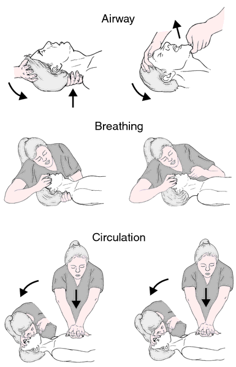
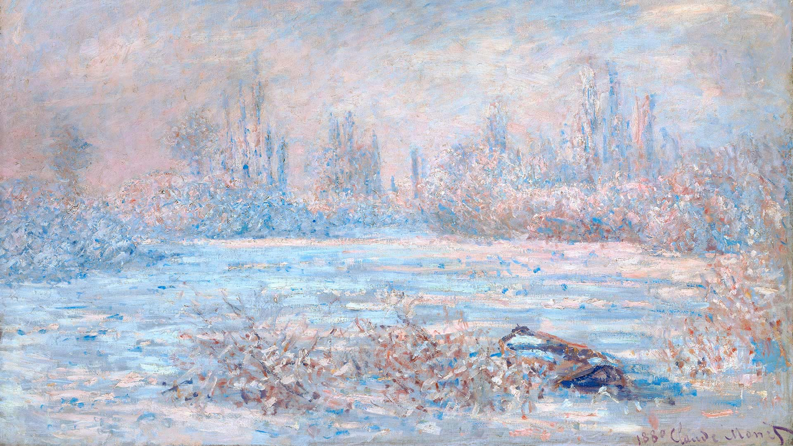

***************
English Note 10
***************

:math:`\pi` seconds is one nanocentuary.

| streak
| Definition: a long, thin line or mark of a different substance or color from its surroundings.
| Usage: a streak of oil. [油迹线]
| Definition: an element of a specified kind in someone's character.
| Usage: there's a streak of insanity in the family.
| Definition: cover (a surface) with streaks.
| Usage: tears streaking her face, Cynthia looked up.
| Definition: move very fast in a specified direction.
| Usage: the cat leaped free and streaked across the street.
| 
| tabulate
| tabulation
| tabular [表格]
| Definition: arrange (data) in tabular form.
| Usage: the system is designed to enable users to extract, analyze, and tabulate data.
| 
| bells and whistles
| Definition: attractive additional features or trimmings. [美化 / 削减]
| Usage: an advocate of more bells and whistles on the income tax code. 
| 
| fathom
| Definition: understand (a difficult problem or an enigmatic person) after much thought.
| Usage: he couldn't fathom why she was being so anxious.
| Definition: measure the depth of (water).
| Usage: an attempt to fathom the ocean.
| Usage: sonar says that we're in eighteen fathoms. [a unit of depth]
| 
| wrap up
| Definition: to complete work on something; to bring something to an end. 
| Usage: I will wrap the job up this morning. I'll call you when I finish.
| 
| wrap-up
| Definition: a summary or review of an activity, sporting event, etc.
| Usage: the post-game wrap-up [赛后集锦]
| 
| quarantine [检疫]
| Definition: impose isolation on (a person, animal, or place); put in quarantine.
| Usage: many animals die in quarantine.
| 
| curate
| Definition: select, organize, and look after the items in a collection or exhibition.
| Usage: both exhibitions are curated by the museum's director.
| Usage: nearly every major news organization is using Twitter’s new lists feature to curate tweets about the earthquake.
| 
| mottle
| Definition: mark with spots or smears of color.
| Usage: the cow's coat was light red mottled with white.
| Definition: an irregular arrangement of spots or patches of color.
| Usage: the ship was a mottle of khaki and black.
| Usage: white marble with mottlings of black and gray. [斑驳]
| 
| khaki [卡其色，尤其用于军装]
| Definition: a strong greenish or yellowish brown cloth, used especially for making military uniforms.
| 
| camouflage
| Definition: the disguising of military personnel, equipment, and installations by painting or covering them to make them blend in with their surroundings.
| Usage: the war area had to be camouflaged with mud.
| Usage: on the trenches were pieces of turf which served for camouflage. [迷彩]
| Definition: the clothing or materials used for disguise.
| Usage: figures dressed in army camouflage.
| Definition: an animal's natural coloring or form that enables it to blend in with its surroundings.
| Usage: the whiteness of polar bears provides camouflage.
| Usage: much of my apparent indifference was merely protective camouflage.
| Definition: conceal the existence of (something undesirable).
| Usage: grievances should be discussed, not camouflaged.
| 
| sultry
| Definition: (of the air or weather) hot and humid. [闷热]
| Usage: the sultry late summer weather had brought swarms of insects.
| Definition: (of a person, especially a woman) attractive in a way that suggests a passionate nature. [热情]
| Usage: a sultry French au pair.
| 
| au pair [保姆，月嫂？？]
| Definition: a young foreign person, typically a woman, who helps with housework or child care in exchange for room and board.
| Synonyms: babysitter
| Usage: he couldn't find a babysitter 
| 
| bread and butter
| Definition: a person’s livelihood or main source of income, typically as earned by routine work.
| Definition: An everyday or ordinary person or thing.
| Usage: Their bread and butter is reporting local events.
| Usage: a good bread-and-butter player.
| 
| meat and potatoes
| Definition: ordinary but fundamental things; basic ingredients.
| Usage: the club's meat and potatoes remains blues performers.
| 
| workhorse
| Definition: a workhorse is a horse is used to do a job, for example to pull a plough.
| Definition: a person or machine that you can rely on to do hard or boring work.
| Usage: My husband nerver even looked at me. I was just a workhorse bring up three children.
| Usage: Falcon 9, the workhorse of SpaceX. [主力]
| 
| Versailles 凡尔赛宫
| 
| the eight year itch [七年之痒]
| Definition: the desire for new sexual experience that is thought to be felt after eight years of marriage.
| 
| vex
| Definition: make (someone) feel annoyed, frustrated, or worried, especially with trivial matters.
| Usage: the memory of the conversation still vexed him.
| 
| out of question
| Synonyms: no doubt; unquestionably.
| 
| out of the question
| Definition: too impracticable or unlikely to merit discussion.
| Synonyms: impossible.
| 
| merit
| Definition: the quality of being particularly good or worthy, especially so as to deserve praise or reward.
| Usage: composers of outstanding merit.
| Usage: the relative merits of both approaches have to be considered.
| Definition: a pass grade in an examination denoting above-average performance. Compare with distinction.
| Usage: if you expect to pass, why not go for a merit or a distinction?
| 
| distinction
| Definition: recognition of outstanding achievement, such as on an examination.
| Usage: I made a distinction in Greek.
| 
| incumbent
| Definition: (incumbent on/upon) necessary for (someone) as a duty or responsibility.
| Usage: it is incumbent on all decent people to concentrate on destroying this evil.
| Definition: (of an official or regime) currently holding office. [现任]
| Usage: the incumbent president had been defeated.
| 
| agonistic
| Definition: (adjective) Striving to overcome in argument
| Synonyms: combative
| Usage: The incumbent’s aggressive, agonistic approach to the debate alienated many of his supporters.
| 
| drab
| Definition: lacking brightness or interest; drearily dull.
| Usage: the landscape was drab and gray.
| Definition: of a dull light brown color.
| Usage: drab camouflage uniforms. [昏黄]
| 
| intangible
| Definition: unable to be touched or grasped; not having physical presence.
| Usage: my companions do not care about cyberspace or anything else so intangible.
| Definition: difficult or impossible to define or understand; vague and abstract.
| Usage: the rose symbolized something intangible about their relationship.
| Definition: (of an asset or benefit) not constituting or represented by a physical object and of a value not precisely measurable.
| Usage: intangible business property like trademarks and patents.
| 
| predate
| Definition: exist or occur at a date earlier than (something).
| Usage: this letter predates her illness.
| Definition: (of an animal) act as a predator of; catch and eat (prey).
|
| rummage
| Definition: search unsystematically and untidily through a mass or receptacle.
| Usage: he rummaged in his pocket for a handkerchief.
| 
| receptacle
| Definition: an object or space used to contain something.
| Usage: trash receptacles.
| Definition: an electrical outlet into which the plug of an electrical device may be inserted. [插排]
| 
| kludge
| Definition: an ill-assorted collection of parts assembled to fulfill a particular purpose.
| Definition: [Computing] a machine, system, or program that has been badly put together.
| Usage: Hugh had to kludge something together.
| 
| ill-assorted
| Definition: not well matched.
| Usage: ill-assorted furniture.
| Usage: an ill-assorted pair. [夫妻不和]
| 
| standstill
| Definition: a situation or condition in which there is no movement or activity at all.
| Usage: the traffic came to a standstill.
| 
| creep
| Definition: move slowly and carefully, especially in order to avoid being heard or noticed.
| Usage: I crept up the stairs, trying not to wake my parents. [蹑手蹑脚]
| Usage: A slight feeling of suspicion crept over me. 
| Usage: errors crept into his game.
|
| skin-deep
| Definition: not deep or lasting; superficial.
| Usage: their left-wing attitudes were only skin-deep.
| 
| hard-core
| Definition: highly committed in one's support for or dedication to something.
| Usage: the party still has a hard core of supporters that will always vote for them. [铁杆支持者]
| Usage: hardcore gamers. [硬核玩家, 多代指愣头青]
| 
| hard-code
| Definition: fix (data or parameters) in a program in such a way that they cannot be altered without modifying the program.
| Usage: the rate at which the supply of bitcoins grows is hardwired into the system
| Definition: make (a pattern of behavior or belief) standard or instinctive.
| Usage: it takes about three weeks for a new habit to be hardwired in your brain.
| 
| hardwire
| Definition: involving or achieved by permanently connected circuits.
| Definition: informal genetically determined or compelled.
| Usage: fear is hardwired in our brain.
| 
| junkie
| Definition: a drug addict. [瘾君子]
| Definition: a person with a compulsive habit or obsessive dependency on something.
| Usage: a hard-core code junkie.
| 
| glutton
| gluttony
| Definition: a person who eats too much. [饕餮]
| Definition: a person who is excessively fond of or always eager for somthing.
| Synonyms: mania.
| Usage: A glutton of adventure. [冒险狂]
| **Seven sin**: gluttony, greed, sloth, wrath, pride, lust, envy [七宗罪]
| 
| bug
| Definition: conceal a miniature microphone in a room or telephone in order to monitor or record someone’s conversation.
| Usage: The phones in the presidential palace were bugged. [监听]
| Usage: They bugged her hotel room.
| Definition: irritate, annoy or bother someone
| Usage: A persistent reporter was bugging me.
| Definition: an enthusiastic interest in something as a sport or a hobby.
| Usage: A travel bug. [驴友]
| Idiom: bug off
| Definition: leave quickly, go off; a rude way of telling someone to go away.
| Usage: If you see the enemy troop, bug off.
| Idiom: bug the heck out of
| Definition: heck is a polite way of saying hell, to bug the heck out of is to be so irritating that even hell would complain.
| 
| garish
| Definition: very brightly coloured in an unpleasant way.
| Usage: garish clothes. [衣服花里胡哨]
| 
| novice
| Synonyms: beginner
| Usage: He was a complete novice in foreign affairs.
| 
| neophyte
| Definition: a person who is new to a subject, skill, or belief.
| Usage: four-day cooking classes are offered to neophytes and experts.
| 
| ransom
| Definition: a sum of money or other payment demanded or paid for the release of a prisoner.
| Definition: obtain the release of (a prisoner) by making a payment demanded.
| Usage: the lord was captured in war and had to be ransomed. [赎金]
| 
| pet peeve
| Definition: something that a particular person finds especially annoying.
| Usage: one of my biggest pet peeves is poor customer service.
| 
| nevertheless
| Definition: in spite of that; notwithstanding; all the same.
| Synonyms: nonetheless.
| Usage: statements which, although literally true, are nevertheless misleading.
| Usage: it was the barest of welcomes, but it was a welcome nonetheless.
| Usage: Notwithstanding that Sir Henry had sold much land, his debts were still on the increase.
| Usage: I didn't like it. Notwithstanding, I remained calm.
| 
| highbrow
| Definition: scholarly or rarefied in taste. [曲高和寡]
| Usage: innovatory art had a small, mostly highbrow following.
| 
| annotate
| annotation
| Definition: add notes to (a text or diagram) giving explanation or comment.
| Usage: documentation should be annotated with explanatory notes.
| 
| entail
| Definition: involve (something) as a necessary or inevitable part or consequence.
| Usage: a situation that entails considerable risks.
| 
| vendor
| Definition: a person or company offering something for sale, especially a trader in the street. [商贩，路边摊]
| Usage: an Italian ice cream vendor.
| 
| alchemy [炼金术]
| alchemist
| Definition: a person who practices alchemy.
| Usage: phosphorus [磷] was discovered by German alchemist Hennig Brand in 1669.
| Definition:  a person who transforms or creates something through a seemingly magical process.
| Usage: some highly imaginative tax shelters [避税天堂] dreamed up by the accounting alchemists.
| 
| dispense
| Definition: distribute or provide (a service or information) to a number of people.
| Usage: he dispensed a gentle pat on Claude's back.
| Definition: (of a machine) supply (a product or cash).
| Usage: the machines dispense a range of drinks and snacks.
| Definition: (of a pharmacist) make up and give out (medicine) according to a doctor's prescription. [按处方配药]
| Definition: (dispense with) manage without; get rid of.
| Usage: let's dispense with the formalities, shall we? [免去客套]
| Phrase: dispense with someone's services
| Definition: dismiss someone from a job.
| 
| acyclic
| Definition: not displaying or forming part of a cycle.
| Definition: (of a woman) not having a menstrual cycle. [月经]
| Definition: (chemistry) (of a compound or molecule) containing no rings of atoms.
| 
| descendant
| Definition: a person, plant, or animal that is descended from a particular ancestor.
| Usage: Shakespeare's last direct descendant. [直系，嫡系]
| Antonyms: ancestor
| Definition: a machine, artifact, system, etc., that has developed from an earlier, more rudimentary version. [次世代]
| 
| deadpan
| deliberately impassive or expressionless.
| Definition: answers his phone in a deadpan tone. [面无表情]
| 
| supernumerary
| Definition: present in excess of the normal or requisite number.
| Definition: not wanted or needed; redundant.
| Usage: books were obviously supernumerary, and he began jettisoning them.
| 
| jettison
| Definition: abandon or discard (someone or something that is no longer wanted).
| Usage: individuals are often forced to jettison certain attitudes and behaviors.
| 
| open-eyed
| Definition: carefully obervant or attensive, on the lookout for possible danger.
| Usage: an open-eyed approach to political manipulation.
| 
| constrict
| Definition: make narrower, especially by encircling pressure..
| Usage: chemicals that constrict the blood vessels.
| Usage: he felt his throat constrict.
| Definition: inhibit or restrict.
| Usage: the fear and the reality of crime constrict many people's lives.
| 
| overextend
| Definition: impose on (someone) an excessive burden of work or commitments.
| Usage: he should not overextend himself on the mortgage.
| 
| resuscitate
| resuscitation
| Definition: revive (someone) from unconsciousness or apparent death.
| Usage: an ambulance crew tried to resuscitate him.
| Definition: make (something such as an idea or enterprise) active or vigorous again.
| Usage: measures to resuscitate the ailing Japanese economy. [复苏]

   Artificial respiration/ventilation [人工呼吸]

   artificial respiration. the stimulation of natural respiratory functions 
   in persons whose breathing has failed or in newborn infants by artificially 
   forcing air into and out of the lungs.

   Monet still makes an impression
   
   Was there frost in your neighborhood this morning? More than 100 years ago, 
   impressionist painter **Claude Monet** painted this wintry scene, called **The Frost,** 
   in the French commune of Vétheuil, where he lived from 1878 to 1881. We’re showing 
   it today in honor of his birthday. Monet is considered a father of **impressionism,** 
   the artistic movement characterized by thin brushstrokes and depicting the visual 
   impression of the moment–especially in terms of light and color. The term impressionism 
   derives from a review of Monet’s painting ‘Impression, Sunrise,’ which he exhibited in 1874. 
   Happy birthday, Claude! 