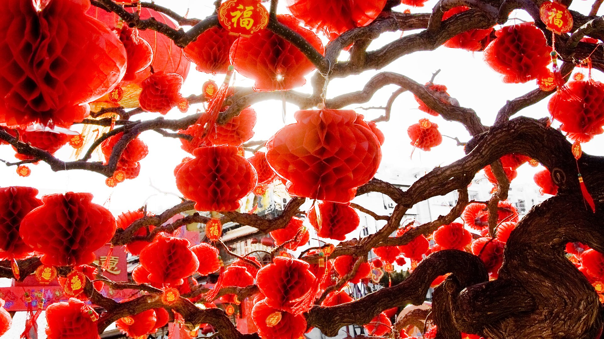

***************
English Note 12
***************

**累累若丧家之犬**

| uber
| Definition: denoting an outstanding or supreme example of a particular kind of person or thing.
| Usage: an uberbabe. [this describes a girl who’s ultra hot, beautiful and discerning]
| Usage: the uberregulator.
| 
| ingot
| Definition: a solid piece of metal, especially gold or silver, usually shaped like a brick.
| Usage: gold ingot. [金块] (gold dust [金砂])
| 
| underpin
| Definition:  to support a wall by putting metal, concrete, etc. under it [加固]
| Definition: to support or form the basis of an argument, a claim, etc.
| Usage: the theme of honor underpinning the two books.
| 
| pun [双关语]
| Definition: a joke exploiting the different possible meanings of a word or the fact that there are words which sound alike but have different meanings.
| Usage: the pigs were a squeal (if you'll forgive the pun) [not got it]
|
| wont
| Definition: (of a person) in the habit of doing something; accustomed.
| Usage: he was wont to arise at 5:30 every morning.
| 
| heretofore
| Definition: before now.
| Usage: diseases that heretofore were usually confined to rural areas.
| 
| hereafter
| Definition: from now on, in the future.
| Usage: Nothing I say hereafter is intended to offend.
| Definition: life after death.
| Usage: suffering is part of our preparation for the hereafter.
| 
| fable
| Definition:  a story, typically a supernatural one incorporating elements of myth and legend.
| Usage: *Aesops Fables*. [伊索寓言]
| 
| vignette
| bignettist
| Definition: a brief evocative description, account, or episode.
| Definition: a small illustration or portrait photograph that fades into its background without a definite border.
| 
| evocative
| Definition: bringing strong images, memories, or feelings to mind.
| Usage: Her new book is wonderfully evocative of village life. 
| 
| secretion
| Definition: the process by which liquid substances are produced by parts of the body or plants. [分泌过程]
| Usage: the secretion of bile by the liver. [肝脏分泌胆汁的过程]
| Definition: a liquid substance produced by parts of the body or plants [分泌物]
| 
| secret
| Definition: something that is kept or meant to be kept unknown or unseen by others.
| Usage: a state secret. [国家机密]
| Usage: at first I tried to keep it a secret from my wife.
| Usage: the resupply effort was probably kept secret from Congress.
| Usage: Details of the proposals remain secret.
| Phrase: in secret
| Definition: without others knowing.
| Usage: The meeting was held in secret. 
| Phrase: make no secret of something
| Definition: make something perfectly clear.
| Usage: He made no secret of his ambition.
| 
| dark
| Idiom: the darkest hour is just before the dawn
| Definition: when things seem to be at their worst, they are about to start improving.
| Idiom: a dark horse [黑马，深藏不露的人]
| Definition: a person taking part in a race, etc. who surprises everyone by winning.
| Definition: a person who does not tell other people much about their life, and who surprises other people by having interesting qualities.
| Phrase: in the dark
| Definition: in a state of ignorance about something.
| Usage: we're clearly being kept in the dark about what's happening.
| Phrase: keep something dark
| Usage: keep something secret from other people.
| Usage: I asked Ann to keep my identity dark.
| Phrase: a shot (or stab) in the dark. [快刀斩乱麻，病急乱投医]
| Definition: an act whose outcome cannot be foreseen; a mere guess.
| 
| behind one's back
| Definition: without someone's knowledge : in secret.
| Usage: You shouldn't gossip about people behind their backs.
| Usage: She went behind his back and spoke directly to his supervisor.
| 
| lunch
| Usage: public relations people lunch their clients there.
| Phrase: do lunch
| Definition: informal, chiefly North American meet for lunch.
| Phrase: out to lunch
| Definition: unaware of or inattentive to present conditions.
| Phrase: there's no such thing as a free lunch / there is no free lunch.
| 
| par
| Defintion: (Golf) the number of strkes a first-class player should normally require for a hole or course.
| 
| shadow [影子]
| Usage: trees cast long shadows.
| Usage: the shadow of war fell across Europe.
| Definition: an inseparable attendant or companion.
| Usage: her faithful shadow, a Yorkshire terrier [一种猎犬] called Heathcliffe.
| Definition: follow and observe (someone) closely and secretly.
| Usage: he had been up all night shadowing a team of poachers.
| 
| reflection [倒影]
| Usage: Marianne surveyed her reflection in the mirror.
| Usage: he doesn't get much time for reflection. [consideration]
|
| silhouette [轮廓，侧影，背影]
| Definition: the dark outline or shape of a person or an object that you see against a light background.
| Usage: The mountains stood out in silhouette.
| Usage: A figure stood in the doorway, silhouetted against the light. 
| 
| golden
| Usage: curls of glossy golden hair.
| Usage: bake until golden.
| Definition: (of a period) very happy and prosperous.
| Usage: those golden days before World War I. [黄金时期]
| Definition: (of an opportunity) very favorable.
| Usage: a golden opportunity to boost foreign trade.
| Definition: denoting the fiftieth year of something.
| Usage: golden wedding anniversary. [金婚]
| Usage: A silver wedding is known to be 25 years of marriage anniversary. [银婚]
| 
| compromise
| Definition: settle a dispute by mutual concession.
| Definition: cause to become vulnerable or funtion less effectively.
| Usage: Last month’s leak of source code will not compromise your IT security.
| Usage: I should compromise the matter with my parents.
| 
| trade-off
| Definition: a balance achieved between two desirable but incompatible features; a compromise.
| Usage: a fundamental trade-off between capitalist prosperity and economic security
| 
| illustrious
| Definition: well known, respected, and admired for past achievements.
| Usage: His illustrious predecessor.
| 
| defame
| Definition: damage the good reputation of (someone); slander or libel.
| Usage: He claimed that the article defamed his family.
| 
| slander [诽谤]
| Definition: The action or crime of making a false spoken statement damaging to a person’s reputation.
| Usage: He is suing the TV network for slander.
| Usage: He angrily accused the investigators of slandering both him and his family. 
| Usage: I've had just about all I can stomach of your slanders.
|  
| libel [恶意中伤]
| Definition: A pulished false statement that is damaging to a person’s reputation; a written defamation.
| Usage: The councilor who sued two national newspaper for libel.
| 
| discredit
| Definition: harm the good reputation of (someone or something).
| Usage: his remarks were taken out of context in an effort to discredit him.
| Usage: they committed crimes that brought discredit upon the administration.
| 
| obstinacy
| obstinate
| Definition: stubbornly refusing to change one's opinion, despite attempts to persuade one to do so.
| Usage: He can be very obstinate when he wants to be! [顽固，执拗]
| Definition: difficult to get rid of or deal with.
| Usage: the obstinate problem of unemployment.
| 
| pastor
| parson
| Synonyms: priest
| 
| parsonage
| Definition: a parson's house.
|
| pulpit [布道席]
| Defintion: a raised platform or lectern in a church or chapel from which the preacher delivers a sermon.
| 
| sermon [布道，说教]
| Definition: a talk on a moral or religious subject, usually given by a religious leader during a service.
| Definition: a long or tedious piece of admonition or reproof; a lecture.
| 
| preach
| Definition: to give a religious talk in a public place, especially in a church during a service.
| Usage: The minister preached a sermon on the parable of the lost sheep. 
| Definition: to give sb advice on moral standards, behaviour, etc., especially in a way that they find annoying or boring.
| Usage: I'm sorry, but I didn't mean to preach.
| Idiom: preach to the converted/choir
| Definition: To argue in favor of a viewpoint already held by one's audience.
| Usage: You're preaching to the converted here—we all have kids and understand how busy life can get.
| 
| podium
| Definition: a small platform on which a person may stand to be seen by an audience, as when making a speech or conducting an orchestra.
| Synonyms: lectern [讲台]
| Definition: (sports) a structure consisting of three adjacent platforms of different heights, on which the competitors finishing in first, second, and third places receive their awards.
| Usage: it was more than I could imagine to be up on the podium and singing the national anthem. [颁奖台]
| 
| elude
| Definition: evade or escape from (a danger, enemy, or pursuer), typically in a skillful or cunning way.
| Usage: The two men managed to elude the police for six weeks.
| Definition: (of an idea or fact) fail to be grasped or remembered by (someone).
| Usage: Finally he remembered the tiny detail that had eluded him the night before. 
| Definition: (of an achievement, or something desired or pursued) fail to be attained.
| Usage: He was extremely tired but sleep eluded him. 
| 
| blight
| Definition: a plant disease, especially one caused by fungi such as mildews, rusts, and smuts. [枯萎]
| Usage: potato blight.
| Definition: to spoil or damage sth, especially by causing a lot of problems.
| Usage: His career has been blighted by injuries. 
| 
| candor
| Definition: the quality of being open and honest in expression; frankness.
| Usage: a man of refreshing candor.
| 
| miserly
| miser [吝啬鬼，守财奴]
| Definition: a person who hoards wealth and spend as little money as possible.
| Usage: His miserly great-uncle proved to be worth nearly $1 million.
| 
| close-fisted: unwilling to spend money.
| 
| parsimony
| Definition: extreme unwillingness to spend money or use resources:.
| Usage: a great tradition of public design has been shattered by government parsimony.
| 
| deprave
| depravity
| depravation
| Definition: make sb immoral or wicked.
| Usage: this book would deprave and corrupt young children.
| Usage: a life of depravity.
| 
| divine
| Definition: coming from or connected with God.
| Usage: divine will.
| Definition: to find out sth by guessing.
| Usage: She could divine what he was thinking just by looking at him.
| Definition: to search for underground water using a stick in the shape of a Y, called a divining rod.
|
| complacent
| complacency [自鸣得意，满不在乎]
| Definition: too satisfied with oneself or one's achievements.
| Usage: You can't afford to be complacent about security.
| 
| vulgar [下流，粗俗]
| Definition: lacking sophistication or good taste.
| Usage: She found their laughter and noisy games coarse and rather vulgar. 
| Definition: making explicit and offensive reference to sex or bodily functions.
| Usage: a vulgar joke. 
| 
| flaunt
| Definition: to show sth you are proud of to other people, in order to impress them.
| Usage: She openly flaunted her affair with the senator. 
| Idiom: if you've got it, flaunt it [是骡子是马，拉出来溜溜]
| Definition: used to tell sb that they should not be afraid of allowing other people to see their qualities and abilities.
| 
| reticent
| reticence
| Definition: not revealing one's thoughts or feelings readily.
| Usage: she was extremely reticent about her personal affairs.
| 
| meticulous
| Definition: showing great attention to detail; very careful and precise.
| Usage: he had always been so meticulous about his appearance.
| Usage: Their room had been prepared with meticulous care. 
| 
| Stone Age --> Bronze Age --> Iron Age
| 
| congenial [意气相投]
| Definition: pleasant to spend time with because their interests and character are similar to your own.
| Usage: everyone crave for congenial companies.
| Usage: he went back to a climate more congenial to his cold stony soul.
| 不如意事常八九，可与言者无二三
| 
| compassion
| compassionate
| Definition: feeling or showing sympathy for people who are suffering.
| Usage: He was allowed to go home on compassionate grounds.
| 
| melancholy
| melancholia
| Definition: a deep feeling of sadness that lasts for a long time and often cannot be explained.
| Usage: A mood of melancholy descended on us. 
| Usage: rain slithered down the windows, encouraging a creeping melancholia.
| 
| reprove [责备，非难]
| Definition: to tell sb that you do not approve of sth that they have done.
| Usage: He reproved her for rushing away. 
| 
| delude [deceive]
| delusive
| delusion 
| Definition: a false belief or opinion about yourself or your situation
| Usage: the delusions of the mentally ill.
| Usage: too many theorists have deluded the public.
| Idiom: delusions of grandeur
| Definition: a false impression of one's own importance.
| Usage: Don't go getting delusions of grandeur
| 
| posthumour
| Definition: occurring, awarded, or appearing after the death of the originator.
| Usage: he was awarded a posthumous Military Cross.
| Usage: a posthumous collection of his articles.
| Definition: (of a child) born after the death of its father. 
| Usage: a posthumous child. [遗腹子]
| Usage: a posthumous work. [遗作]
| 
| reproach
| Definition: address sb in such a way as to express disapproval or disappointment; accuse.
| Usage: Critics of the administration reproached the president for his failure to tackle the deficiency.
| Usage: His wife reproached hime with cowardice.
| 
| censure
| Definition: to criticize sb severely, and often publicly, because of sth they have done.
| Usage: a judge was censured in 1983 for a variety of types of injudicious conduct.
|
| deplore [谴责]
| Definition: Feel or express strong disapproval of something.
| Usage: We deplored this act of violence.
| 
| pensive
| Definition: engaged in, involving, or reflecting deep or serious thought.
| Usage: A pensive mood. [沉重，严肃]
| 
| risible [滑稽可笑]
| Definition: deserving to be laughed at rather than taken seriously.
| Usage: a risible scene of lovemaking in a tent.
| 
| squander
| Definition: to waste money, time, etc. in a stupid or careless way.
| Usage: He squandered all his money on gambling.
| 
| anathema
| Definition: something or someone that one vehemently dislikes.
| Usage: racial hatred was anathema to her.
| 
| vehement
| vehemence
| Definition: the display of strong feeling; passion.
| Usage: they speak with starry vehemence about their project.
| Usage: her voice was low but vehement.
| 
| star
| starry
| Usage: a beautiful starry night. [繁星满天的夜晚]
| 
| antipathy
| antipathic 
| Definition: a deep-seated feeling of dislike; aversion.
| Usage: antipathy to change.
| 
| averse
| aversion
| Definition: a strong dislike or disinclination.
| Usage: he had a deep-seated aversion to most forms of exercise.
| Usage: I mentioned it to Kate and she wasn't averse to the idea. 
| 
| indispose
| Definition: make sb unfit for or unable to do something.
| 
| precarious
| Definition: not securely held or in position; dangerously likely to fall or collapse.
| Usage: a precarious ladder.
| Usage: He balanced the glass precariously on the arm of his chair. 
| Usage: He earned a precarious living as an artist. [朝不保夕]
| 
| soliloquy [独白]
| soliloquize
| Definition: an act of speaking one's thoughts aloud when by oneself or regardless of any hearers, especially by a character in a play.
| Usage: Hamlet's famous soliloquy, 'To be or not to be...'
| 
| altercate
| altercation
| Definition: a noisy argument or disagreement, especially in public.
| Usage: I had an altercation with the conductor.
| 
| calamity
| Definition: an event that causes great damage to people's lives, property, etc.
| Usage: the fire was the latest calamity to strike the area.
| 
| daemon [神祇]
| demigod [半神]
| Definition: some Roman emperors claimed descent from demigods such as Hercules.
| 

#. principle (or law) of parsimony
   
    The scientific principle that things are usually connected or behave in the simplest 
    or most economical way, especially with reference to alternative evolutionary pathways. 

#. Occam's razor 

    The principle (attributed to *William of Occam*) that in explaining a thing, 
    no more assumptions should be made than are necessary. The principle is often 
    invoked to defend reductionism or nominalism. 

#. reductionism [还原论]
   
    The practice of analyzing and describing a complex phenomenon in terms of phenomena 
    that are held to represent a simpler or more fundamental level, especially when this 
    is said to provide a sufficient explanation.    

#. nominalism [唯名论]
   
    The doctrine that universals or general ideas are mere names without any corresponding reality,
    and that only particular objects exist; properties, numbers, and sets are thought of as merely 
    features of the way of considering the things that exist. Important in medieval scholastic thought, 
    nominalism is associated particularly with *William of Occam*. Often contrasted with realism. 

    Argus

    (Greek Mythology) a monster with a hundred eyes, used by Hera to watch over lo.
    He was killed by Hermes, and Hera then used his eyes to deck the peacock's tail.

.. figure:: images/gladiator.jpg

   Gladiator [角斗士]

    Water witching Dowsing Rods

    Taproom [酒吧间]

    A room where alcoholic drinks, especially beer, are available on tap; 
    a bar in a hotel or inn.

    居酒屋「いざかや」

.. image:: images/mist_on_moors.jpg

   Lanterns [灯笼]

    Pingxi Sky Lantern Festival in Taipei, China [孔明灯]

   Hot air balloon [热气球]

    Cabriolet [敞篷车]

    Marrionette [牵线人偶]

    Nosegay

    Misha, the bear—the official mascot of the 1980 Moscow Olympics 
