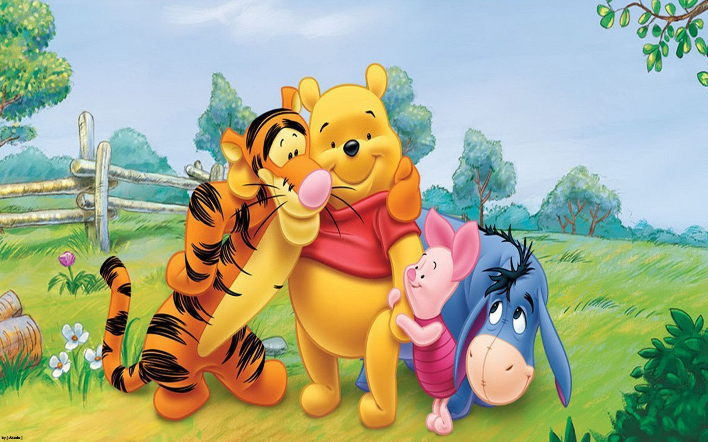
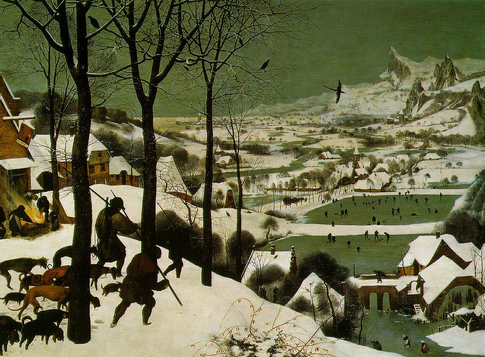

***************
English Note 14
***************

| spurn
| Definition: strike, tread, or push away with the foot
| Usage: With one touch of my feet, I spurn the solid Earth.
| Definition: reject with disdain or contempt.
| Synonyms: pooh
| Usage: He spoke gruffly, as if afraid that his invitation would be spurned. [傲娇　ツンデレ]
|
| pooh
| Definition: reject with contempt.
| Usage: Oh pooh! Don't be such a spoilsport.
|
| spoilsport [扫兴，扫把星，大煞风景]
| Definition: a person who behaves in a way that spoils others' pleasure, especially by not joining in an activity.
| Synonyms: killjoy
|
| haughty
| Definition: Arrogantly superior and disdainful.
| Usage: A haughty aristocrat.
|
| disdain [轻蔑]
| Definition: The felling that someone is unworthy of one’s consideration or respect; contempt.
| Usage: Her upper lip curled in disdain.
| Usage: An aristocratic disdain for manual labor.
|
| tempest
| Definition: a violent windy storm.
| Idiom: a tempest in a teapot.
| Definition: great anger or excitement about a trivial matter.
|
| contentious
| Definition: causing or likely to cause an argument; controversial.
| Usage: a contentious issue.
| Usage: the socioeconomic plan had been the subject of contentious debate.
|
| pitfall
| Definition: a covered pit used as a trap.
| Definition: a hidden or unsuspected danger or difficulty.
| Usage: buying a house can be full of pitfalls for the unwary.
|
| unwary
| Definition: not cautious; not aware of possible dangers or problems.
| Usage: accidents can happen to the unwary traveler.
| Usage: The stock market is full of traps for the unwary.
|
| arcane
| Definition: understood by few; mysterious or secret.
| Usage: modern math and its arcane notation.
|
| rung
| Definition: a horizontal support on a ladder for a person's foot.
| Definition: a strengthening crosspiece in the structure of a chair.
| Usage:  the top rung of society.
|
| wind
| Phrase: get one's second wind [缓过神来]
| Definition: find energy, strength or enthusiasm after feeling tired or after a period when you produce little.
| Usage: After midnight the dancers seemed to get their second wind and went on till dawn.
| Phrase: get wind of something [听到xx风声，传到xx耳朵里]
| Definition: become aware of something, especially something being kept secret, through indirect means.
| Usage: If Mom gets wind of this prank we're planning, we'll be grounded for the rest of the summer.
| Usage: If the press gets wind of this, the campaign will be over.
|
| prank
| Definition: a practical joke or mischievous act.
| Usage: April Fool's Day is celebrated here but the pranking continues on May 1st.
|
| head
| Usage: he is a head taller than his sister.
| Usage: It costs about $12 a head to eat here.
| Phrase: have a head for
| Usage: Steve has a good head for mathematics.
| Usage: I have no head for business.
| Phrase: have a head on one's shoulder
| Usage: She has a head on her shoulder. [有头脑，有见解]
| Phrase: head and shoulders above
| Usage: as far as she was concerned, her husband stood head and shoulders above any other.
| Phrase: above one's head
| Usage: All that sort of thing is well above my head.
| Phrase: head above heels
| Usage: she is head above heels in love. [坠入爱河]
| swain: a young man who is in love. [情郎]
| Phrase: go to one's head
| Usage: The drinks went to his head. [上头]
| Usage: You mustn't let this success go to your head. [被胜利冲昏头脑]
| Phrase: turn sb's head
| Usage: She has not allowed success to turn her head.
| Phrase: put out of one's head
| Usage: you'd better put the idea of marriage out of your head.
| Phrase: bite one's head off
| Usage: my mother bit my head off because i came home late last night.
|
| comeback [复出]
| Definition: If someone such as an entertainer or sports personality makes a comeback, they return to their profession or sport after a period away.
| Usage: Suarez, Messi lead Barcelona to 4-2 comeback win at Sociedad. [逆转]
| Definition: If something makes a comeback, it becomes fashionable again.
| Usage: Loose fitting pants are making a comeback.
|
| retrofit
| Definition: add (a component or accessory) to something that did not having it when manufactured.
| Usage: Bus have been retroffited with easy-access feature. [改装]
| Usage:  Voice recorders were retrofitted into planes already in service.
|
| sport
| Definition: wear or display (a distinctive or noticeable item).
| Usage: he was sporting a huge handlebar mustache.
| Definition: amuse oneself or play in a lively, energetic way.
| Usage: the children sported in the water.
|
| wallflower
| Definition: a person who has no one to dance with or who feels shy, awkward, or excluded at a party.
| Usage: I felt like a miserable wallflower at a boisterous party. [局外人]
|
| prom king [交际花]
| Definition: In colleges and high schools, a young man, chosen by his peers, to "reign" over the school's prom and related activities.
|
| prom
| Definition: A formal dance held for a high-school or college class typically at or near the end of the academic year.
|
| Byzantin [拜占庭]
| Definition: relating to Byzantium (now Istanbul), the Byzantine Empire, or the Eastern Orthodox Church.
| Definition: (of a system or situation) excessively complicated, and typically involving a great deal of administrative detail.
| Usage: Byzantine insurance regulations.
|
| enmasse
| Definition: in a group; all together. [集体，全员]
| Usage: the board of directors resigned en masse.
| Usage: The Cabinet immediately resigned en masse.
|
| lurcher [混种狗]
| Definition: a dog that is a mixture of two different breeds of dog, one of which is usually a greyhound.
|
| peerless [无双的]
| Definition: better than all others of its kind.
| Usage: a peerless performance.
|
| eminent
| Definition: famous and respected, especially in a particular profession.
| Usage:  one of the world's most eminent statisticians.
| Definition: used to emphasize the presence of a positive quality.
| Usage: the guitar's eminent suitability for recording studio work.
|
| nudge
| Definition: prod (someone) gently, typically with one's elbow, in order to draw their attention to something.
| Usage: people were nudging each other and pointing at me.
| Definition: coax or gently encourage (someone) to do something.
| Usage: we have to nudge the politicians in the right direction
|
| poke
| Definition: jab or prod (someone or something), especially with one's finger. [捅，戳，顶]
| Usage: She poked her elbow into his ribs.
| Usage: I'm sick of being poked and prodded by doctors.
| Phrase: poke about/around
| Definition: look around a place, typically in search of something.
| Usage: The police spent the day poking around in his office but found nothing.
| Usage: We've had journalists poking around and asking a lot of questions.
| Idiom: better than a poke in the eye (with a sharp stick) [有总比没有强]
| Definition: welcome or pleasing, even if other circumstances might be better.
| Usage: I got a tax rebate—not a huge amount but better than a poke in the eye with a sharp stick. [退税]
|
| rebate
| rebatable
| Definition: a partial refund to someone who has paid too much money for tax, rent, or a utility.
| Usage: Buyers are offered a cash rebate.
|
| surcharge
| Definition: an extra payment of money in addition to the usual payment for something.
| Usage: Fuel oil surcharge. [燃油附加税]
| Usage: The government introduced a 15% surcharge on imports.
|
| invoice  [发票]
| coupon [优惠券]
| Definition: a small printed piece of paper that entitles the holer to a discount or that may be exchanged for goods or services.
| Synonyms: voucher
|
| voucher [代金券]
| Definition: a voucher is a piece of paper that can be used instead of money to pay for something.
| Usage: The winner will each receive a voucher for a pair of cinema tickets.
|
| stub
| Definition: The stub of a cigrette or a pencil is the last short piece of it, which remains when the rest has been used. [烟蒂，铅笔头]
| Usage: He pulled the stub of a pencil from behind his ear.
| Usage: an ashtray of cigarette stubs.
| Definition: A cheque stub is the small part that you keep as a record of what you have paid. [凭据]
| Definition: A ticket stub is the part that you keep when you go in to watch a performance. [票据]
| Usage: Fans who still have their original ticket stubs should contact Sheffield Arena by July 3.
| Definition: If you stub your toe, you hurt it by accidentally kicking something.
| Usage: I stubbed my toes against a table leg.
| Phrase: stub out [在烟灰缸上摁灭香烟的动作]
| Usage: He stubbed out the cigarette and got up to leave.
| Usage: I'm so sorry, I didn't realize the smoke was bothering you. Let me stub this out.
|
| discount
| Definition: regard (a possibility, fact, or person) as being unworthy of consideration because it lacks credibility.
| Usage: I'd heard rumors, but discounted them.
| Phrase: at a discount
| Antonyms: at a premium
| Definition: below the nominal or usual price
| Usage: a plan that allows tenants to buy their homes at a discount.
| Usage: books with pristine dust jackets are less common and sell at a premium.
| Usage: space was at a premium. [scarce and in demand,  稀缺]
|
| undersell
| Definition: sell something at a lower price than (a competitor).
| Usage: we can equal or undersell mail order.
| Definition: promote or rate (something) insufficiently; undervalue.
| Usage: don't undersell yourself. [妄自菲薄]
|
| faction
| Definition: a state of conflict within an organization; dissension.
| Definition: a small, organized, dissenting group within a larger one, especially in politics.
| Usage: the left-wing faction of the party.
| Usage: A peace agreement will be signed by the leaders of the country’s warring factions.
|
| leverage
| Definition: the act of using a lever to open or lift sth. [杠杆原理]
| Definition: the power to influence a person or situation to achieve a particular outcome.
| Usage: the right wing had lost much of its political leverage in the Assembly.
| Definition: the ratio of a company's loan capital (debt) to the value of its common stock (equity).
|
| make out like a bandit
| Definition: profit greatly from an activity.
|
| metamorphosis [变态发育，蜕变]
| Definition: (in an insect or amphibian) the process of transformation from an immature form to an adult form in two or more distinct stages.
| Usage: the metamorphosis of a caterpillar into a butterfly
| Usage: She had undergone an amazing metamorphosis from awkward schoolgirl to beautiful woman.
|
| incantation
| incantatory
| Definition: a series of words said as a magic spell or charm.
| Usage: an incantation to raise the dead.
| Usage: there was no magic in such incantation.
|
| cross one's fingers (or keep one's fingers crossed)
| Definition: put one finger across another as a sign of hoping for good luck.
| Definition: hope that someone or something will be successful.
| Usage: In general this worked, but one still had to cross one's fingers and murmur an incantation when porting cfront to each new platform.
|
| cross my heart (and hope to die) [我发誓(否则不得好死)]
| Definition: used to emphasize that you are telling the truth or will do what you promise
| Usage: I saw him do it—cross my heart.
|
| cross one's mind
| Definition: (of a thought) occur to one, especially transiently.
| Usage: it never crossed my mind to leave the tent and live in a house.
|
| have a (heavy) cross to bear
| Definition: to have a difficult problem that makes you worried or unhappy but that you have to deal with
| Usage: We all have our crosses to bear. [家家有本难念的经]
|
| munch
| Definition: eat (something) with a continuous and often audible action of the jaws.
| Usage: I munched my way through a huge bowl of cereal.
| Usage: popcorn to munch on while watching the movie. [爆米花]
|
| whereas [然而，鉴于]
| Definition: in contrast or comparison with the fact that.
| Usage: you treat the matter lightly, whereas I myself was never more serious.
| Definition: (in law) used at the beginning of a sentence in an official document to mean 'because of the fact that...'.
|
| albeit
| Synonyms: although
| Usage: He finally agreed, albeit rather reluctantly, to help us.
|
| ditto
| Definition: used in accounts and lists to indicate that an item is repeated (often indicated by a ditto mark under the word or figure to be repeated).
| Usage: The waiters were rude and unhelpful, the manager dittoed.
|
| hitherto
| Definition: untill now.
| Usage: There is a need to replace what has hitherto been a haphazard method of payment.
|
| whatsoever
| Definition: (with negative) at all (used for emphasis)
| Usage: I have no doubt whatsoever.
|
| cusp
| Definition: a pointed end where two curves meet
| Usage: the cusp of a leaf
| Definition: the time when one sign of the zodiac ends and the next begins
| Usage: I was born on the cusp between Virgo and Libra.
| Definition: He was on the cusp between small acting roles and moderate fame. [小荷初露尖尖角，初见端倪]
|
| factor in/out
| Definition: include (or exclude) something as a relevant element when making a calculation or decision.
| Usage: Remember to factor in staffing costs when you are planning the project.
|
| froth
| Definition: rise or overflow in a soft, light mass.
| Definition: She wore an ivory silk blouse, frothing at nect and cuffs.
| Definition: form or contain a rising or overflowing mass of small bubbles; foam [啤酒沫]
| Usage: He took a quick quick sip of beer as it frothed out of the can.
|
| ravage
| Definition: casue severe and extensive damage to.
| Usage: Fears that a war could ravage their country. [蹂躏，摧残]
| Definition: the severely damaging or destructive effects of something.
| Usage: His face had withstood the ravages of time.
|
| blatant
| Definition: (of bad behavior) done openly and unashamedly
| Usage: He just blatantly lied about it. [睁眼说瞎话]
|
| reserve
| Definition: In sports, a reserve is someone who is available to play as part of a team if one of the members is ill or cannot play.
| Synonyms: substitude [替补]
| Usage: He ended up as a reserve, but still qualified for a team gold medal.
| Definition: If someone shows reserve, they keep their feeling hidden.
| Usage: I do hope you’ll overcome your reserve and let me know. [矜持]
| Definition: If you have something in reserve, you have it available for use when it is needed.
| Usage: He poked around the top of his cupboard for the bottle of whisky that he kept in reserve.
| [我有斗酒，藏之久矣，以待子不时之需]
| Definition: refrain from delivering (a judgment or decision) immediately or without due consideration or evidence.
| Usage: I'll reserve my views on his ability until he's played again. [对 xx 持保留意见]
| Definition: If you reserver the charges you make a phone call, the person you are phoning pay the cost.
|
| up one’s sleeve
| Definition: (of a strategy, idea, or resource) kept secret and in reserve for use when needed.
| Usage: He was new to the game but had a few tricks up his sleeve.
|
| hand
| Phrase: in hand
| Definition: ready for use if required; in reserve.
| Usage: he had $1,000 of borrowed cash in hand.
| Definition: receiving or requiring immediate attention.
| Usage: he threw himself into the work in hand.
| Definition: in progress.
| Usage: negotiations are now well in hand.
| Definition: under one's control.
| Usage: the police had the situation well in hand.
| Definition: in safe hands [藏之名山，传之其人]
| Usage: protected by someone trustworthy from harm or damage.
| Usage: the future of the cathedral is in safe hands.
| Phrase: keep one's hand in
| Usage: become (or remain) practiced in something. [宝刀未老]
| Phrase: out of hand
| Definition: not under control
| Definition: without taking time to think.
| Usage: She's so stubborn that she just rejected my suggestion out of hand.
| Phrase: throw up one's hand
| Definition: raise both hands in the air as an indication of one's exasperation.
|
| knee-jerk [不假思索，下意识]
| Definition: (of a response) automatic and unthinking.
| Usage: It was a knee-jerk action on her part.
|
| throwaway
| Definition: (of a remark) you say quickly without careful thought, sometimes in order to be funny.
| Usage: She was very upset at what to him was just a throwaway remark. [开玩笑的，随口说的]
| Definition: (of goods, etc.) produced cheaply and intended to be thrown away after use. [一次性的]
|
| exasperation
| Definition: a feeling of intense irritation or annoyance.
| Usage: she rolled her eyes in exasperation.
|
| outset
| Definition: the start or beginning of something.
| Usage: Decide at the outset what kind of learning programme you want to follow.
|
| come into play
| Definition: To become a factor in a particular situation; begin to operate or be active; have an effect or influence.
| Usage: It’s time for the first part of our plan to come into play.
| Usage: A lot of different factors came into play in making this decision.
| Usage: Once personal insults come into play, it's very hard to resolve a situation calmly.

    Winnie the Pooh [小熊维尼]

.. image:: images/Vasco_da_Gama_Bridge.jpg

