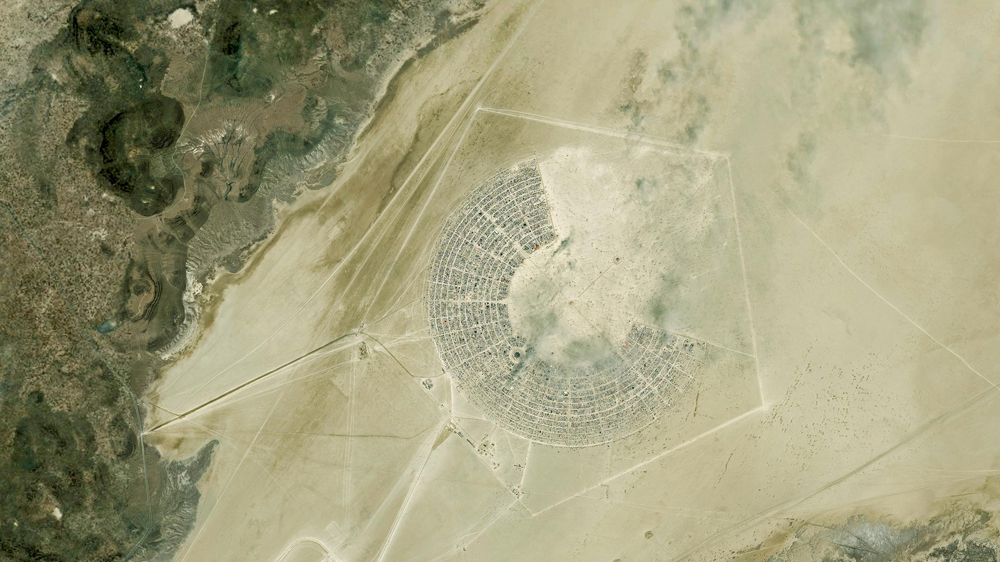
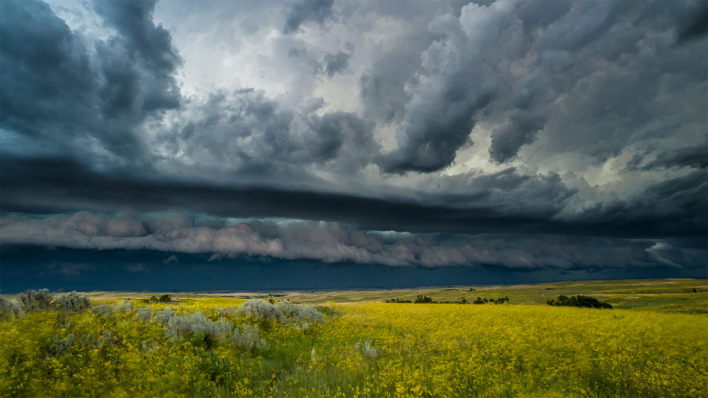

***************
English Note 16
***************

| Inspirational story [励志故事]
| Spiritual home [精神家园]
|
| garage
| Definition: a building or shed for housing a motor vehicle or vehicles.
| Usage: a building or shed for housing a motor vehicle or vehicles. [车库]
|
| fan
| Definition: increase the strength of (a fire) by blowing on it or stirring up the air near it.
| Usage: gusty wind fanned fires in Yellowstone Park.
| Definition: radiate from a central point to cover a wide area.
| Usage: the arriving passengers began to fan out through the town in search of lodgings.
| Usage: a dress made of tiny pleats that fanned out as she walked.
| Usage: a wind fanned her hair out behind her.
|
| logistics
| Definition: the detailed coordination of a complex operation involving many people, facilities, or supplies. [组织工作]
| Usage: the logistics and costs of a vaccination campaign.
| Usage: Organizing famine relief presents huge logistical problems.
| Definition: Military the organization of moving, housing, and supplying troops and equipment. [后勤保障]
|
| courier
| Definition: a person or company  whose job is to take packages or important papers somewhere.
| Usage: We sent the document by courier. [快递，快递员]
| Definition: a person who is employed by a travel company to give advice and help to a group of tourist on holiday. [导游]
|
| manifold
| Definition: many and various.
| Usage: the implications of this decision were manifold.
| Usage: the appeal of the crusade was manifold. [十字军东征]
|
| isotroic
| Definition: (of an object or substance) having a physical property which has the same value when measured in different directions.
| Antonyms: anisotropic.
|
| aerial
| Definition: existing, happening, or operating in the air.
| Usage: an aerial battle.
|
| imputate
| imputation
| Definition: a charge or claim that someone has done something undesirable; an accusation.
| Usage: there are grounds for inquiring into the imputations of misconduct against him.
|
| orthogonal
| Definition: of or involving right angles; at right angles.
| Definition: (of variates) statistically independent.
| Definition: (of an experiment) having variates which can be treated as statistically independent.
|
| eigen
| Definition: proper, characteristic.
| Usage: eigendecomposition, eigenvector, eigenvalue.
|
| didactic [说教]
| Definition: designed to teach people sth, especially a moral lesson.
| Usage: a didactic novel that set out to expose social injustice.
|
| astronomy
| astronomical
| Definition: relating to astronomy.
| Usage: astronomical observations. [天文观测]
| Definition: informal (of an amount) extremely large.
| Usage: The figures are astronomical. [天文数字]
|
| shim
| Definition: a washer or thin strip of material used to align parts, make them fit, or reduce wear. [楔子，填充物]
| Synonyms: wedge
|
| drive a wedge between
| Definition: separate.
| Usage: the general aimed to drive a wedge between the city and its northern defenses.
| Definition: cause disagreement or hostility between.
| Usage: his parents drove a wedge between us. [离间，分离]
|
| thin end of the wedge
| Definition: an action or procedure of little importance in itself, but likely to lead to more serious developments.
|
| sound the alarm
| Definition: Literally, to activate an alarm.
| Usage: I think I see smoke coming from the warehouse. Someone run upstairs and sound the alarm!
| Definition: To alert other people about something dangerous, risky, or troublesome.
| Usage: A number of top economic advisors tried to sound the alarm before the economic crash, but no policy makers seemed to heed their warnings.
| Usage: Legal experts and civil rights advocates are sounding the alarm on researchers' use of photos of ordinary people.
|
| cutthroat
| Definition: (of a competitive situation or activity) fierce and intense; involving the use of ruthless measures.
| Usage: cutthroat competition led to a lot of bankruptcies
| Synonyms: ruthless; merciless.
|
| best
| Definition: outwit or get the better of (someone).
| Usage: she refused to allow herself to be bested.
| Phrase: at (or in) the best of times
| Definition: even in the most favorable circumstances.
| Usage: his memory is poor at the best of times.
|
| mesh
| Definition: material made of threads of plastic rope or wire that are twisted together like a net.
| Definition: make or become entangled or entwined.
| Usage: their fingers meshed.
| Usage: I don't want to get meshed in the weeds.
| Usage: Our ideas just do not mesh.
| Definition: a representation of a given shape or form, consisting of an arrangement of a finite set of geometric components.
| Phrase: in mesh
| Definition: (of the teeth of gearwheels) engaged.
|
| wring
| wringer
| Definition: a device for wringing water from wet clothes, mops, or other objects.
| Phrase: put someone through the wringer [or the mangle]
| Definition: subject someone to a very stressful experience, especially a severe interrogation.
| Phrase: go through the wringer
| Definition: to have a difficult or unpleasant experience, or a series of them.
| Usage: Jack wasn't a great fit for the military, and he was constantly going through the wringer for disobedience.
| Usage: Those interviewers really put me through the wringer!
| Usage: He’s been through the wringer lately, what with his divorce, and then losing his job.
|
| imperfect
| Definition: not perfect; faulty or incomplete.
| Usage: an imperfect grasp of English.
| Definition: (of a tense) denoting a past action in progress but not completed at the time in question.
|
| brittle
| Definition: hard but easily broken.
| Usage: her bones became fragile and brittle.
| Definition: (of a sound, especially a person's voice) unpleasantly hard and sharp and showing signs of instability or nervousness.
| Usage: a brittle laugh.
| Definition: (of a person or behavior) appearing aggressive or hard but unstable or nervous within.
| Usage: her manner was artificially bright and brittle.
|
| ravel
| Definition: confuse or complicate (a question or situation).
| Usage: sleep raveled out the tangles of his mind.
| Usage: He was trying to ravel out the complicated series of events that had led to this situation.
|
| knot
| knotty
| Definition: full of knots.
| Definition: (of a problem or matter) extremely difficult or intricate.
| Usage: The new management team faces some knotty problems.
|
| interpose
| Definition: place or insert between one thing and another.
| Usage: he interposed himself between her and the stairs.
| Usage: she interposed herself between the newcomers.
| Definition: say (words) as an interruption.
| Usage: if I might interpose a personal remark here.
| Usage: at this point it is necessary to interpose a note of caution.
| Definition: intervene between parties.
| Usage: the legislature interposed to suppress these amusements.
|
| outsource
| Definition: obtain (goods or a service) from an outside or foreign supplier, especially in place of an internal source。
| Usage: outsourcing can dramatically lower total costs.
| Definition: contract (work) out or abroad. [外包]
| Usage: you may choose to outsource this function to another company or do it yourself.
|
| per se
| Definition: by or in itself or themselves.
| Usage: The drug is not harmful per se, but is dangerous when taken with alcohol.
| Usage: possessing a knief was not per se an unlawful act.
|
| cranky
| Definition: ill-tempered; irritable.
| Usage: he was bored and cranky after eight hours of working.
| Definition: eccentric or strange, typically because highly unorthodox.
| Usage: a cranky scheme to pipe ground-level ozone into the stratosphere.
| Definition: (of a machine) working badly; shaky.
| Usage: the cranky elevator breaks down periodically.
|
| harness [马具]
| Definition: a set of straps and fittings by which a horse or other draft animal is fastened to a cart, plow, etc., and is controlled by its driver.
| Usage: the horse was harnessed to two long shafts.
| Definition: control and make use of (natural resources), especially to produce energy.
| Usage: attempts to harness solar energy.
| Usage: projects that harness the creativity of those living in the ghetto.
| Phrase: in harness
| Definition: (of a horse or other animal) used for driving or draft work.
| Definition: in the routine of daily work.
| Usage: a man who died in harness far beyond the normal age of retirement. [过劳死]
| Usage: working closely with someone to achieve something.
| Usage: local and central government should work in harness.
|
| ghetto [少数民族居住区]
| Definition: a part of a city, especially a slum area, occupied by a minority group or groups.
| Usage: The south coast of Spain has become something of a tourist ghetto.
|
| run-of-the-mill
| Definition: lacking unusual or special aspects; ordinary.
| Usage: Michael is no run-of-the-mill kind of guy.
| Usage: It was a run-of-the-mill dish you could find in any fine dining restaurant.
|
| stale
| Definition: (of food) no longer fresh and plesant to eat.
| Definition: no longer new and interesting.
| Usage: Their marriage has gone stale.
| Definition: (of a person) no longer able to perform well or creatively because of having done something for too long.
| Usage: a top executive tends to get stale.
|
| intermittent
| Definition: occurring at irregular intervals; not continuous or steady.
| Usage: intermittent rain. [阵雨]
|
| smell
| Usage: a bunch of sweet-smelling flowers.
| Usage: Dinner smells good.
| Usage: His breath smelt of garlic.
| Phrase: smell out
| Definition: detect or discover something by the faculty of smell.
| Usage: his nose can smell out an animal from ten miles away.
| Definition: detect or suspect (something) by means of instinct or intuition.
| Usage: he can smell trouble long before it gets serious.
| Phrase: smell a rat [猫腻]
| Definition: suspect trickery or deception.
| Phrase: smell blood
| Definition: discern weakness or vulnerability in an opponent.
| Phrase: smell the roses
| Definition: enjoy or appreciate what is often ignored.
| Phrase: smell something up
| Definition: permeate an area with a bad smell.
| Usage: He smelled up the whole house.
|
| depth
| Phrase: hidden depths
| Definition: usually admirable but previously unnoticed qualities of a person.
| Usage: hidden depths and insights within children.
| Phrase: in depth
| Definition: in great detail; comprehensively and thoroughly.
| Usage: an in-depth study. [深入研究]
| Phrase: out of one's depth
| Definition: to be in water that is too deep to stand in with your head above water.
| Definition: beyond one's knowledge or ability to cope.
| Usage: He felt totally out of his depth in his new job.
|
| break
| Phrase: break ground
| Definition: do preparatory digging or other work prior to building or planting something.
| Usage: The president of the company came to break ground for the new building.
| Phrase: break new (or fresh) ground
| Definition: do something innovative that is considered an advance or positive benefit.
| Usage: Apple's really broken new ground with their latest product—I've never seen anything like it.
| Phrase: break off
| Definition: If part of something breaks off or if you break it off, it come off or is removed by force.
| Usage: Grace broke off a large piece of the clay.
| Definition: interrupt.
| Usage: Luias broke off in mid-sentence.
|
| beenline
| Definition: a straight line between two places.
| Phrase: make a beeline for
| Definition: hurry directly to.
| Usage: Billy came into the kitchen and made a beeline for the cookies.
|
| maiden flight/voyage [处女航]
| Definition: The maiden voyage or flight of a ship or aircraft is the first offical journey that it makes.
| Usage: In 1912, the Titanic sank on her maiden voyage.
|
| debut
| Definition: The debut of a performer or sports player is their first public performance, appearance, or recording.
| Usage: Her debut album “Sugar time”. [出道作品]
| Usage: Lionel Messi made his debut for Barcelona 12 years ago this weekend.
| Usage: Barca brought on the 23-year-old Columbia defender Yerry Mina for his debut.
| :abbr:`IPO (initial public offering)`
| startup company [创业公司]
| entrepreneur [创业者，企业家]
|
| bellwether [领头羊]
| Definition: the leading sheep of a flock, with a bell on its neck.
| Definition: an indicator or predicator of something.
| Usage: University campuses are often the bellwether of change.
|
| game-changer
| game-changing
| Definition: an event, idea, or procedure that effects a significant shift in the current manner of doing or thinking about something.
| Usage: A potential game changer that could revitalize the entire US aerospace industry.
|
| game-over
| Definition: said when a situation is regarded as hopeless or irreversible.
| Usage: It’ll be game-over for all other heavy-lift rockets.
|
| checkmate
| Definition: a position in which one player cannot prevent his or her king being captured and therefore loses the game. [将军]
| Definition: a situation in which somebody has been completely defeated.
| Usage: She hoped the plan would checkmate her opponents.
|
| endgame
| Definition: the final stage of a game such as chess or bridge, when few pieces or cards remain.
| Usage: The knight was trapped in the endgame.
| Definition: the final stage of a political process.
| Usage: The retaliatory endgame of nuclear warfare.
|
| fair and square
| Definition: honestly and straightforwardly.
| Usage: Well I appreciate it, but I prefer to win fair and square.
|
| pay
| Phrase: pay one's way
| Definition: to pay for oneself or another person; to contribute one's or someone else's portion of the cost.
| Usage: I appreciate the offer, but I can pay my way!
|
| buzzword [(报刊等的)时髦术语,流行行话]
| Definition: a word or phrase, often an item of jargon, that is fashionable at a particular time or in a particular context.
|
| red herring
| Definition: something, especially a clue, that is or is intended to be misleading or distracting.
| Usage: the book is fast-paced, exciting, and full of red herrings.

.. image:: images/harvest_time_1566782396.jpg

    Crop Circle [麦田怪圈]

    Swing [秋千]

    Water wheel [水车]

#. Pointy-haired boss

    The Pointy-haired Boss is Dilbert's boss in the Dilbert comic strip.
    He is notable for his micromanagement, gross incompetence, obliviousness
    to his surroundings, and unhelpful buzzword usage; yet somehow retains
    power in the workplace.

    .. image:: images/Pointy-Haired_Boss.jpg

.. image:: images/bieyoudongtian_1566473048.jpg
