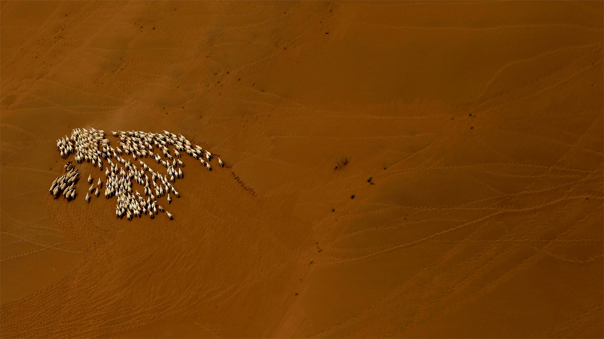

***************
English Note 17
***************

| recur
| Definition: occur again, periodically, or repeatedly.
| Usage: when the symptoms recurred, the doctor diagnosed something different.
| Usage: Steve's words kept recurring to him.
| Definition: (recur to) go back to (something) in thought or speech.
| Usage: the book remained a favorite and she constantly recurred to it.
|
| foolhardy
| Definition: (disapproving)taking unnecessary risks. [鲁莽，莽撞，有勇无谋]
| Synonym: reckless
| Usage: It would be foolhardy to sail in weather like this.
| Usage: She was a good rider, but reckless.
|
| surmount
| Synonyms: overcome
| Usage: She was well aware of the difficulties that had to be surmounted.
| Definition: (usually be surmounted) stand or be placed on top of.
| Usage: the tomb was surmounted by a sculptured angel.
|
| embark
| Definition: go on board a ship, aircraft, or other vehicle.
| Usage: he embarked for India in 1817.
| Definition: (embark on/upon) start to do sth new or difficult.
| Usage: She is about to embark on a diplomatic career.
|
| larval [幼虫]
| Definition: relating to or denoting the active immature form of an insect.
| Usage: the larval stage of a fly.
| Usage: a larval salamander. [蝾螈]
|
| inconclusive
| Definition: not leading to a firm conclusion; not ending doubt or dispute.
| Usage: The last meeting had ended inconclusively.
| Usage: the medical evidence is inconclusive.
|
| grovel
| Definition: lie or crawl abjectly on the ground with one's face downward.
| Usage: she was groveling on the floor in fear.
| Definition: act in an obsequious way in order to obtain someone's forgiveness or favor.
| Usage: everyone expected me to grovel with gratitude. [卑躬屈膝]
| Usage: I don't grovel to anybody.
|
| laundry detergent [洗衣液]
|
| wiggle
| Definition: move or cause to move up and down or from side to side with small rapid movements.
| Usage: He removed his shoes and wiggled his toes.
| Definition:  (wiggle out of) avoid (something), especially by devious means.
| Usage: they're trying to wiggle out of their agreement.
| Phrase: get a wiggle on
| Definition: get moving; hurry.
|
| devious
| Definition: showing a skillful use of underhanded tactics to achieve goals.
| Usage: he's as devious as a politician needs to be.
| Usage: they have devious ways of making money.
|
| underhanded [阴险，下作]
| Definition: acting or done in a secret or dishonest way.
| Usage: an underhanded method of snatching clients from rivals.
|
| blunder
| Definition: make a stupid or careless mistake; act or speak clumsily.
| Usage: the mayor and the City Council have blundered in an ill-advised campaign.
| Usage: we were blundering around in the darkness.
|
| beneficiay [受益人]
| Definition: a person who derives advantage from something, especially a trust, will, or life insurance policy.
|
| malign
| Definition: speak unfavorably about. [中伤，诽谤，说坏话]
| Usage: Don't you dare malign her in my presence.
| Definition: evil in nature or effect; malevolent.
| Usage: She had a strong and malign influence.
|
| malignant
| Definition: (of a disease) very virulent or infectious.
| Definition: (of a tumor) tending to invade normal tissue or recur after removal; cancerous.
| Antonyms: benign.
| Usage: A malignant tumor. [恶性肿瘤]
|
| malevolent
| Definition: having or showing a wish to do evil to others.
| Synonyms: malicious.
| Usage: The glint of dark, malevolent eye. [眼神邪魅]
|
| takeaway
| Definition: a takeout restaurant.
| Usage: a fast-food takeaway.
| Usage: takeout meals.
| Definition: a key fact, point, or idea to be remembered, typically one emerging from a discussion or meeting.
| Usage: the main takeaway for me is that we need to continue to communicate all the things we're doing for our customers.
|
| practitioner
| Definition: a person actively engaged in an art, discipline, or profession, especially medicine.
| Usage: patients are treated by skilled practitioners.
|
| onerous
| Definition: troublesome or oppressive
| Synonyms: burdensome, taxing.
| Usage: Preparing income tax returns is an onerous task, and many people resort to hiring professional accountants during tax season.
| Usage: This shouldn't be too taxing for you.
|
| ensemble
| Definition: a group of musicians, actors, or dancers who perform together.
| Usage: a Bulgarian folk ensemble. [乐团]
| Definition: a group of items viewed as a whole rather than individually.
| Usage: the buildings in the square present a charming provincial ensemble.
|
| bootstrap
| Definition: a loop at the back of a boot, used to pull it on.
| Definition: a technique of loading a program into a computer by means of a few initial instructions that enable the introduction of the rest of the program from an input device.
| Definition: get (oneself or something) into or out of a situation using existing resources.
| Usage: the company is bootstrapping itself out of a marred financial past.
| Definition: start up (an enterprise), especially one based on the Internet, with minimal resources.
| Usage: they are bootstrapping their stations themselves, not with lots of dot-com venture capital.
| Idiom: pull oneself up by one’s (own) bootstraps [自力更生]
| Definition: improve one's position by one's own efforts.
|
| stratify
| Definition: form or arrange into strata.
| Usage: the residues have begun to stratify.
|
| stratum
| Plural: strata.
| Definition: a layer or a series of layers of rock in the ground.
| Definition: a level or class to which people are assigned according to their social status, education, or income.
| Usage: members of other social strata.
|
| quartile
| Definition: each of four equal groups into which a population can be divided according to the distribution of values of a particular variable.
| Definition: each of the three values of the random variable that divide a population into four groups.
|
| underlie
| Definition: (especially of a layer of rock or soil) lie or be situated under (something).
| Usage: the fundamental issue that underlies the conflict.
| Usage: It is a principle that underlies all the party's policies.
| Usage: the underlying causes of poverty and drug addiction.
|
| wholesale
| Definition: on a large scale.
| Definition: sell (goods) in large quantities at low prices to be retailed by others.
| Usage: the safety clauses seem to have been taken wholesale from union documents.
| Usage: the wholesale destruction of the natural order.
| Usage: wholesale prices. [批发价]
|
| dog food
| Definition:
| Phrase: eat one's own dog food
| Definition: use a product or service developed by that company so as to test it before it is made available to customers. [内部试用]
| Usage: we had to eat our own dog food—we had to make sure the tools worked.
| Usage: it was a great opportunity to dogfood the phones.
| Usage: If you're writing software intended for other developers then dogfooding makes perfect sense.
|
| henchman [心腹，亲信]
| Definition: a faithful follower or political supporter, especially one prepared to engage in crime or dishonest practices by way of service.
|
| wacko or whacko
| Definition: mad; insane.
| Usage: his willingness to pursue every wacko idea that enters his mind.
|
| continuum
| Plural: continua.
| Definition: a continuous sequence in which adjacent elements are not perceptibly different from each other, although the extremes are quite distinct.
| Usage: a space-time continuum. [四次元]
| Usage: It is impossible to say at what point along the continuum a dialect becomes a separate language.
|
| gibberish
| Definition: unintelligible or meaningless speech or writing; nonsense.
| Usage: he talks gibberish.
| Usage: You were talking gibberish in your sleep. [梦呓，说梦话]
|
| entrench
| Definition: establish (an attitude, habit, or belief) so firmly that change is very difficult or unlikely.
| Usage: ageism is entrenched in our society.
| Usage: establish (a person or their authority) in a position of great strength or security.
| Usage: by 1947 de Gaulle's political opponents were firmly entrenched in power.
|
| ageism
| ageist
| Definition: prejudice or discrimination on the basis of a person's age.
| Usage: a lot of ageist jokes about not being able to use technology.
|
| discriminator
| Definition: a characteristic that enables things, people, or classes to be distinguished from one another.
| Usage: age should not be used as a primary discriminator in recruitment.
|
| recipient
| Definition: a person or thing that receives or is awarded something.
| Usage: the recipient of the Nobel Peace Prize.
|
| credulous [轻信]
| Definition: having or showing too great a readiness to believe things.
| Usage: a ceremony staged for credulous tourists.
|
| gall
| Definition: bold and impudent behavior.
| Usage: the bank had the gall to demand a fee.
| Definition: the contents of the gallbladder; bile (proverbial for its bitterness). [胆汁]
| Definition: used to refer to something bitter or cruel.
| Usage: accept life's gall without blaming somebody else.
|
| backdrop
| Definition: a painted cloth hung at the back of a theater stage as part of the scenery.
| Usage: the conference took place against a backdrop of increasing diplomatic activity.
| Usage: an ornate fountain, and at its center, backdropped with golden spray, a statue of a young girl.
|
| glyph
| glyphic
| Definition: a symbol carved out of stone, especially six from an ancient writing system. [象形文字]
| Definition: (Computing) a small graphic symbol.
|
| typeface
| Definition: a set of letters, numbers, etc. of a particular design, used in printing.
| Usage: I'd like the heading to be in a different typeface from the text.
|
| gratify
| gratification
| Usage: a thirst for sexual gratification.
| Usage: not all the sexual impulses can be gratified.
|
| have a nose for (something)
| Definition: To have an intuitive ability to detect or excel at something.
| Usage: He has a nose for determining which way the stock market is going to shift.
|
| short order
| Definition: an order or dish of food that can be quickly prepared and served.
| Usage: a short order of souvlaki.
| Usage: I'm a short-order cook.
|
| in short order
| Definition: immediately; rapidly.
|
| replenish
| Definition: fill (something) up again.
| Usage: He replenish Tom's class with spirits. [倒酒]
| Usage: all creatures need sleep to replenish their energies.
|
| arcn [青少年时期的粉刺]
| Definition: she used to suffer from acne.
|
| ergonomic
| ergonomics
| Definition: the study of people's efficiency in their working environment.
| Usage: ergonomic keyboard design. [人体工程学键盘]

.. image:: images/path_in_trees.jpg

.. image:: images/cypress_tunnel.jpg

