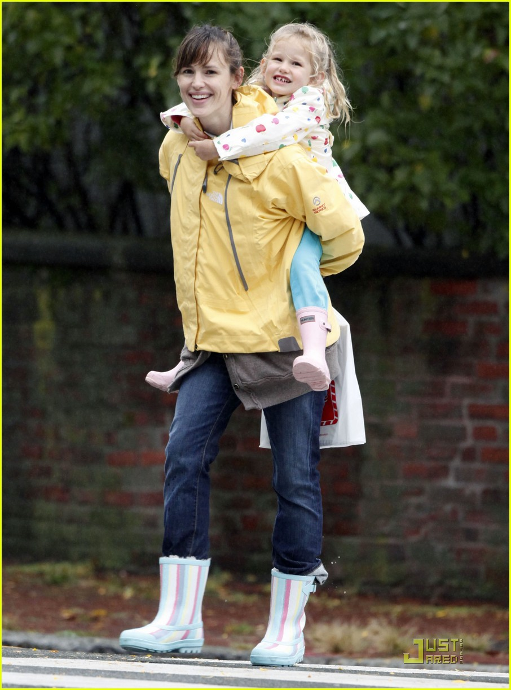

***************
English Note 20
***************

幸福不会主动走来，我必须要全力去争取。

守株待兔

| loon
| Definition: act in a foolish or desultory way.
| Usage: he decided to loon around London.
| Definition: a silly or foolish person.
| Usage: if only she weren't such a lovesick loon.
|
| rebuff
| Definition: reject (someone or something) in an abrupt or ungracious manner.
| Usage: I asked her to be my wife, and was rebuffed in no uncertain terms.
| Usage: any attempt to win her friendship was met with rebuffs.
|
| adversarial
| Definition: involving or characterized by conflict or opposition.
| Usage: industry and government had an adversarial relationship.
| Usage: the reviewer’s presumed adversarial relationship to his subject.
| Usage: the adversarial nature of the two-party system
|
| aggravate
| Definition: make (a problem, injury, or offense) worse or more serious.
| Usage: military action would only aggravate the situation.
| Usage: The drug may cause an aggravation of the condition.
| Usage: I don't need all this aggravation at work.
|
| have a bone to pick with somebody
| Definition: (informal) have something that you want to complain to somebody about.
| Usage: Here, I’ve got a bone to pick with you: why did you tell David I wasn’t at home when he phoned?
|
| let the cat out of the bag
| Definition: to tell a secret carelessly or by mistake
| Usage: I wanted it to be a surprise, but my sister let the cat out of the bag.
| like a cat on hot bricks [局促不安；如坐针毡；像热锅上的蚂蚁]
| Definition: very nervous
| Usage: She was like a cat on hot bricks before her driving test.
| like the cat that got the cream [踌躇满志]
| Definition: very pleased with yourself
| Synonyms: like the cat that got / ate / swallowed the canary
| Usage: After her promotion, Janet spent the rest of the day looking like the cat that got the cream.
|
| canary [金丝雀]
| canary in the (or a) coal mine
| Definition: an early indicator of potential danger or failure.
| Usage: native brook trout are very much the canary in the coal mine for the health of a stream.
| Origin: with reference to the former practice of taking live canaries into coal mines to test
| for the presence of toxic gases; death of the canary would serve as an indication that such gases were present.
|
| expedite
| Definition: make (an action or process) happen sooner or be accomplished more quickly.
| Usage: he promised to expedite economic reforms.
|
| emulate
| Definition: match or surpass (a person or achievement), typically by imitation.
| Usage: lesser men trying to emulate his greatness.
| Usage: hers is not a hairstyle I wish to emulate.
| Definition: reproduce the function or action of (a different computer, software system, etc.).
| Usage: the adaptor is factory set to emulate a Hercules graphics board.
|
| artifact
| Definition: an object made by a human being, typically an item of cultural or historical interest.
| Usage: gold and silver artifacts. [工艺品]
| Usage: widespread tissue infection may be a technical artifact. [人为因素]
|
| connotation
| Definition: an idea or feeling that a word invokes in addition to its literal or primary meaning.
| Usage: the word “discipline” has unhappy connotations of punishment and repression.
| Usage: The word 'professional' has connotations of skill and excellence.
|
| piggyback
| Definition: a ride on someone's back and shoulders. [背]
| Usage: Give me a piggyback, Daddy!
| Usage: a piggyback ride.
| Definition: attached to or riding on a larger object.
| Usage: a telescope with fittings for piggyback cameras.
| Usage: providers of information have piggybacked their own networks onto the system.
| Usage: we were piggybacking on their training program.
|
| tenacious
| Definition: Tending to keep a firm hold of something; clinging or adhering closely.
| Usage: A tenacious grip.
| Definition: Not readily relinquishing a position, principle, or course of action; determined.
| Usage: You’re tenacious and you get at the truth.
|
| relinquish
| Definition: voluntarily cease to keep or claim; give up.
| Usage: he relinquished his managerial role to become chief executive.
| Usage: They had relinquished all hope that she was alive.
|
| teleport
| teleportation
| Definition: (especially in science fiction) transport or be transported across space and distance instantly.
|
| trek
| Definition: a long arduous journey, especially one made on foot.
| Usage: a trek to the South Pole.
| Usage: we trekked through the jungle.
|
| plthera
| Definition: an amount that is greater than is needed or can be used.
| Synonyms: excess
| Usage:  a plethora of committees and subcommittees.
|
| atlas
| Definition: a book of maps or charts.
| Usage: I looked in the atlas to find a map of Italy.
| Definition: a book of illustrations or diagrams on any subject.
| Usage: Atlas of Surgical Operations.
|
| miniature
| Definition： (especially of a replica of something) of a much smaller size than normal; very small.
| Usage: children dressed as miniature adults.
| Definition: a thing that is much smaller than normal, especially a small replica or model.
| Usage: seven full-size car bodies and three miniatures were used.
|
| hygiene
| Definition: conditions or practices conducive to maintaining health and preventing disease, especially through cleanliness.
| Usage: poor standards of food hygiene.
| Usage: personal hygiene.
|
| conducive
| Definition: making a certain situation or outcome likely or possible.
| Usage: the harsh lights and cameras were hardly conducive to a relaxed atmosphere.
|
| snap
| Definition: break or cause to break suddenly and completely, typically with a sharp cracking sound.
| Usage: guitar strings kept snapping.
| Definition: (of an animal) make a sudden audible bite.
| Usage: a dog was snapping at his heels.
| Definition: suddenly lose one's self-control.
| Usage: she claims she snapped after years of violence.
| Definition: take a snapshot of.
| Usage: he planned to spend the time snapping rare wildlife.
| Definition: a hurried, irritable tone or manner.
| Usage: "I'm still waiting,” he said with a snap.
|
| heavy lifting
| Definition: the lifting of heavy objects.
| Definition: hard or difficult work.
| Usage: the heavy lifting in this business is in designing external distribution systems.
|
| mind game
| Definition: a psychological tactic used to manipulate or intimidate.
| Usage: I have been playing mind games to get him to invite us.
| Usage: The particularities of Logan’s mind games are telling.
|
| clique
| Definition: a small group of people, with shared interests or other features in common, who spend time together and do not readily allow others to join them.
| Usage: The country is run by a small clique of wealthy families.
| Usage: Anna Ford recently hits out at some male clique which she believe holds back women in TV.
|
| dormant
| Definition: (of an animal) having normal physical functions suspended or slowed down for a period of time; in or as if in a deep sleep.
| Usage: dormant butterflies. [休眠, 蛰伏]
| Definition: (of a volcano) temporarily inactive. [休眠火山]
| Definition: (of a disease) causing no symptoms but not cured and liable to recur.
| Usage: the disease may remain dormant and undetected until transmitted to other fish.
| Definition: temporarily inactive or inoperative.
| Usage: the event evoked memories that she would rather had lain dormant.
|
| bootcamp
| Definition: a military training camp for new recruits, with strict discipline.
| Definition: a prison for youthful offenders, run on military lines. [禁闭室]
| Definition: a short, intensive, and rigorous course of training. [训练营]
| Usage: a grueling, late-summer boot camp for would-be football players.
|
| landmark [地标]
| Definition: an object or feature of a landscape or town that is easily seen and recognized from a distance, especially one that enables someone to establish their location.
| Usage: The ambassador is a Los Angeles landmark.
| Definition: an event, discovery, or change marking an important stage or turning point in something.
| Usage: the birth of a child is an important landmark in the lives of all concerned
| Definition: the boundary of an area of land, or an object marking this.
|
| lousy
| Definition: very poor or bad; disgusting.
| Usage: the service is usually lousy
| Definition: ill; in poor physical condition.
| Usage: she felt lousy.
|
| hedgehog [刺猬]
| Usage: An irritable man is like a hedgehog rolled up the wrong way, tormenting himself with his own prickles
|
| repast
| Definition: a sumptuous meal
|
| sumptuous
| Definition: splendid and expensive-looking.
| Usage: the banquet was a sumptuous, luxurious meal.
|
| repose
| Definition: a state of rest, sleep, or tranquility.
| Usage: in repose her face looked relaxed.
| Definition: composure.
| Usage: he had lost none of his grace or his repose.

    Piggyback

.. image:: images/abiqua_fall.jpg
