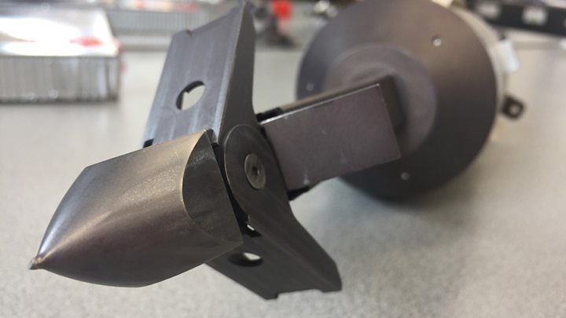
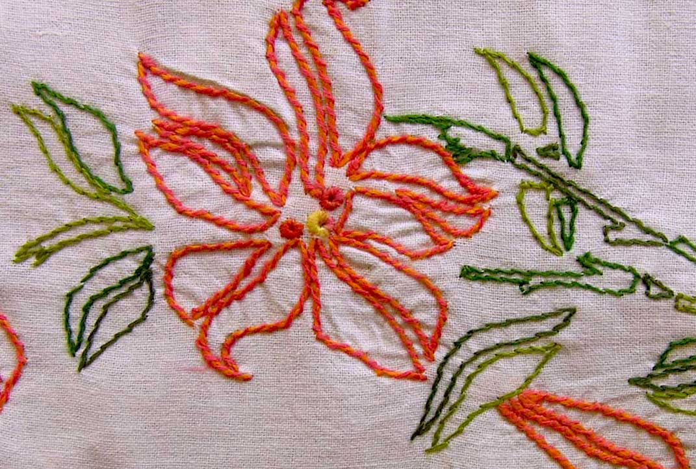
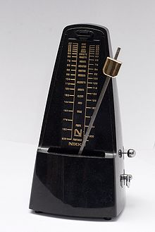
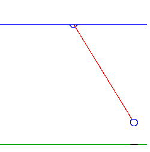
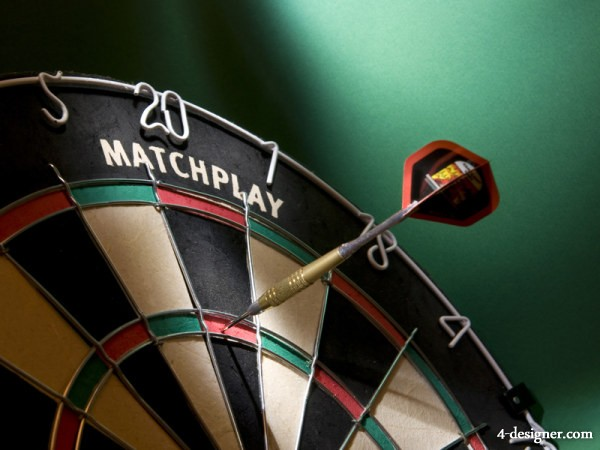
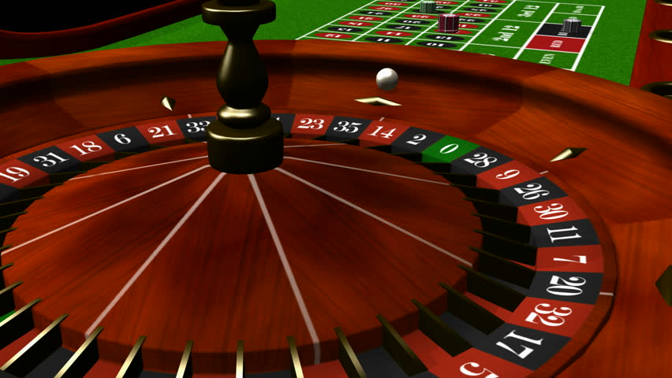

**************
English Note 9
**************

纸上得来终觉浅，绝知此事要躬行。

-- 陆游《冬夜读书示子聿》

| ancillary
| Definition: providing necessary support to the primary activities or operation of an organization, institution, industry, or system.
| Synonyms: auxillary.
| Usage: the development of ancillary services to support its products.
| Definition: additional; subsidiary.
| Usage: paragraph 19 was merely ancillary to paragraph 16.
| 
| bumpkin
| bumpkinish
| Definition: an unsophisticated or socially awkward person from the countryside.
| Usage: she thought Tom a bit of a country bumpkin. [多贬义]
| 
| unsophisticated
| Definition: not complicated or highly developed; basic.
| Definition: not artificial.
| Usage: the village has remained unspoiled and unsophisticated.
| Definition: lacking refined worldly knowledge or tastes. [单纯的；阅历浅的；涉世不深的；不谙世故的]
| 
| pristine
| Definition: in its original condition; unspoiled.
| Usage: pristine copies of an early magazine.
| Definition: clean and fresh as if new; spotless.
| Usage: a pristine white shirt.
| 
| quaint
| Definition: attractively unusual or old-fashioned.
| Usage: quaint country cottages.
|
| wail
| wailful
| Definition: a prolonged high-pitched cry of pain, grief, or anger.
| Usage: Christopher let out a wail.
| Usgae: the wail of an air-raid siren. [咆哮]
| Usage: the wind wailed and buffeted the timber structure. [呼啸]
| 
| whittle
| Definition: carve (wood) into an object by repeatedly cutting small slices from it.
| Usage: He whittled a simple toy from the piece of wood. 
| Defnition: (whittle something away/down) reduce something in size, amount, or extent by a gradual series of steps.
| Usage: the short list of fifteen was whittled down to five.
| 
| caboodle
| Definition: (the whole caboodle or the whole kit and caboodle) whole.
| Usage: I had new clothes, a new hairstyle—the whole caboodle. [焕然一新]
|
| pest
| Definition: an insect or animal that destroys plants, food, etc.
| Definition: an annoying person or thing.
| Usage: That child is being a real pest. 
| 
| antagonistic
| Definition: showing or feeling active opposition or hostility toward someone or something.
| Usage: he was antagonistic to the government's reforms.
| 
| the silver screen [银幕]
| Definition: the movie industry
| Usage: Stars of the silver screen. 
| 
| limelight
| Definition: intense white light obtained by heating a cylinder of lime [石灰], formerly used in theaters.
| Definiton: (the limelight) the focuse of public attention. [荧光灯，大众焦点]
| Usage: The work that brought the artists into the limelight.
| Phrase: steal / hog the limelight
| Definition: take attention away from other people.
| 
| hog
| Definition: keep or use all of (something) for oneself in an unfair or selfish way.
| Usage: He never hogged the limelight.
| Idiom: go (the) whole hog
| Definition: do something completely or thoroughly.
| Idiom: live high on (or off) the hog
| Definition: have a luxurious lifestyle.
| 
| the lion’s share
| Definition: the idiomatic expression of the major share of something.
| Synonyms: the main hog
| 
| all-embracing
| Definition: including or covering everything or everyone; comprehensive. [包罗万象]
| usage: the goal is not one all-embracing religion.
| 
| obstruct
| obstruction
| Definition: block (an opening, path, road, etc.); be or get in the way of.
| Usage: she was obstructing the entrance.
| Definition: prevent or hinder (movement or someone or something in motion).
| Usage: they had to alter the course of the stream and obstruct the natural flow of the water.
| Definition: deliberately make (something) difficult.
| Usage: fears that the regime would obstruct the distribution of food.
| Definition: commit the offense of intentionally hindering (a legal process).
| Definition: (in various sports) impede (a player in the opposing team) in a manner which constitutes an offense.
| 
| folklore
| Definition: the traditional beliefs, customs, and stories of a community, passed through the generations by word of mouth.
| Usage: Indian folklore. [民俗风情]
| Usage: The story rapidly became part of family folklore. [家族传说]
| Definition: a body of popular myth and beliefs relating to a particular place, activity, or group of people.
| Usage: programming folklore.
|
| tractable
| Definition: (of a person or animal) easy to control or influence. [驯服，温顺]
| Usage: tractable dogs that have had some obedience training. 
| Definition: (of a situation or problem) easy to deal with. [容易驾驭]
| Usage: trying to make the mathematics tractable.
| Antonyms: intractable.
| 
| advertise
| Definition: draw attention to (a product, service, or event) in a public medium in order to promote sales or attendance.
| Definition: make (a quality or fact) known.
| Usage: Meryl coughed briefly to advertise her presence.
| Usage: some prisoners advertised the French of this terrible danger.
| Usage: I wouldn't advertise the fact that you don't have a work permit. [声张]
| 
| thrash
| Definition: beat (a person or animal) repeatedly and violently with a stick or whip.
| Usage: she thrashed him across the head and shoulders.
| Usage: what he needs is a good thrashing.
| Definition: move in a violent and convulsive way.
| Usage: he lay on the ground thrashing around in pain. [痛得直打滚儿]
| Phrase: thrash around 
| Definition: struggle in a wild or desperate way to do something.
| Usage: two months of thrashing around on my own have produced nothing.
| 
| wily
| wilily
| wiliness
| Definition: skilled at gaining an advantage, especially deceitfully.
| Synonyms: cunning.
| Usage: The boss is a wily old fox. 
| 
| hoop
| Definition: a circular band of metal, wood, or similar material, especially one used for binding the staves of barrels or forming part of a framework. [箍]
| Definition: the round metal rim from which a basketball net is suspended. [球筐]
| Usage: hula hoop. [呼啦圈]
| 
| demarcate
| Definition: set the boundaries or limits of.
| Usage: plots of land demarcated by barbed wire.
| Definition: separate or distinguish from.
| Usage: art was being demarcated from the more objective science.
| 
| culprit
| Definition: a person who is responsible for a crime or other misdeed. [元凶]
| Definition: the cause of a problem or defect.
| Usage: viruses could turn out to be the culprit.
|
| ornament
| unornamented
| Definition: lacking embellishment or ornamentation.
| 
| embellish
| embellishment
| Definition: make (something) more attractive by the addition of decorative details or features.
| Usage: blue silk embellished with golden embroidery.
| Definition: make (a statement or story) more interesting or entertaining by adding extra details, especially ones that are not true.
| Usage: she had real difficulty telling the truth because she liked to embellish things.
| 
| guise
| Definition: an external form, appearance, or manner of presentation, typically concealing the true nature of something.
| Usage: he visited in the guise of an inspector.
| Usage: telemarketing and selling under the guise of market research.
| 
| belittle  (also be little)
| Definition: make (sb or sth) seem unimportant.
| Synonyms: disparage
| Usage: She felt belittled.
| Usage: he never missed an opportunity to disparage his competitors.
| Usage: I don't mean to disparage your achievements. 
| 
| play down
| Definition: If you play down something, you try to make people believe that it is  not particularly important.
| Antonyms: downplay; underpaly.
| Antonyms: play up; highlight; stress.
| Usage: He plays down rumors that he aims to become a Labour MP.
| Usage: We often underplay the skills we have.
| Usage: The problem of alcoholism was, and still is, often underplayed. 
| Usage: The government and the press are trying to downplay the violence which broke out yesterday.
| 
| understatement
| Definition: the presentation of something as being smaller, worse, or less important than it actually is.
| Antonyms: overstatement; exaggeration.
| Usage: to say I am delighted is an understatement. 
| 
| underestimate
| Definition: If you underestimate something, you do not realize how large or great it is or will be.
| Usage: Never underestimate what you can learn from a group of like-minded people.
| Definition: If you underestimate someone, you do not realize what they are capable of doing.
| Usage: I think a lot of people still underestimate him.
| 
| memorize
| Definition: learn by heart.
| Usage: He studied the map, trying to memorize the way to Rose's street.
| 
| monument
| monumental
| Definition: great in importance, extent, or size.
| Synonyms: historic.
| Usage: it's been a monumental effort.
| Definition: of or serving as a monument.
| Usage: additional details are found in monumental inscriptions.
| 
| lax
| Definition: not sufficiently strict, severe, or careful.
| Usage: he'd been a bit lax about discipline in school lately.
| 
| wellspring
| Definition: an original and bountiful source of something.
| Usage: sadness is the wellspring of creativity.
| 
| inadvertent
| Definition: An inadvertent action is one that you do without realizing what you are doing.
| Synonyms: unintentional, not deliberate
| Usage: The government has said it was an inadvertent error.
| Usage: You may have inadvertently pressed the wrong button.
|
| sprinkle
| Definition: scatter or pour small drops or particles of a substance over (an object or surface).
| Usage: I sprinkled the floor with water.
| Definition: rain very lightly.
| Usage: it began to sprinkle. 
| 
| hem and haw
| Definition: hesitate; be indecisive.
| Usage: I waste a lot of time hemming and hawing before going into action.
| 
| ridicule
| ridiculous
| Definition: the subjection of someone or something to contemptuous and dismissive language or behavior.
| Usage: he is held up as an object of ridicule.
| Usage: his theory was ridiculed and dismissed.
| 
| glee
| Definition: great delight.
| Usage: his face lit up with impish glee.
| 
| cruncher
| Defintion: a critical or vital point; a crucial or difficult question.
| Defintion: a computer, system, or person able to perform operations of great complexity or to process large amounts of information.
| Usage: a global information cruncher.
| 
| Gordian knot
| Definition: an extremely difficult or involved problem. associated with Alexandar the Creat.
| 
| Achilles heels 
| Definition: a weakness or vulnerable point.
| Usage: the Achilles heel of the case for nuclear power remains the issue of the disposal of waste.
| Usage: My ignorance is always my achilles hells.
| 
| classify
| classified
| Definition: arranged in classes or categories.
| Usage: a classified catalog of books.
| Definition: (of information or documents) designated as officially secret and to which only authorized people may have access.
| Usage: classified information on nuclear experiments.
| Usage: government officials classified 6.3 million documents in 1992.
| 
| self-describing VS self-explanatory
| 
| ironclad
| Definition: covered or protected with iron.
| Definition: a 19th-century warship with armor plating.
| Definition: impossible to contradict, weaken, or change.
| Usage: an ironclad guarantee.
| 
| ostensible
| Definition: stated or appearing to be true, but not necessarily so.
| Usage: the delay may have a deeper cause than the ostensible reason.
| 
| bumper sticker
| Definition: a label carrying a slogan or advertisement fixed to a vehicle's bumper [保险杠]. 
| 
| prelude
| Definition: An action or event serving as an introduction to something more important.
| Usage: Education cannot simply be a prelude to a career.
| 
| stock
| Phrase: take stock
| Definition: Review or make an overall assessment of a particular situation, typically as prelude to make a decision.
| Usage: He needed a period of peace and quiet in order to take stock of his life.
| Phrase: put stock in
| Definition: [often with negative] have a specific amount of belief or faith in.
| Usage: I don’t put much stock in traditional Chinese medicine.
| Phrase: in (or out of) stock
| Definition: (of goods) available (or unavailable) for immediate sale in store.
| Usage: The new Iphone8 is out of stock at the present. [脱销，售罄]
| Phrase: on the stocks
| Definition: in construction or preparation.
| Usage: Also on the stocks is a bill to bring about tax relief for these business. 
| 
| pirated version [盗版]
|
| shelf
| Usage: The book I wanted was on the top shelf. 
| Phrase: off the shelf
| Definition: that can be bought immediately and does not have to be specially designed or ordered
| Usage: : I bought this package off the shelf. [现货]
| Phrase: on the shelf [束之高阁]
| Definition: (of people or things) no longer useful or desirable.
| Usage: an injury that has kept him on the shelf.
| 
| provenance
| Definition: the place of origin or earliest known history of something.
| Usage: an orange rug of Iranian provenance
| Definition: the beginning of something's existence; something's origin. [起源]
| Usage: they try to understand the whole universe, its provenance and fate. 
| Definition: a record of ownership of a work of art or an antique, used as a guide to authenticity or quality.
| Usage: the manuscript has a distinguished provenance. [博物馆中艺术品的标签]
| 
| pedigrees
| Definition: the record of descent of an animal, showing it to be purebred（pure + breed 纯种？？）.
| Definition: the recorded ancestry, especially upper-class ancestry, of a person or family. [谱系]
| 
| scratch the surface
| Definition: deal with a matter only in the most superficial way.
| Usage: research has only scratched the surface of the paranormal. [蜻蜓点水]
| Definition: initiate the briefest investigation to discover something concealed.
| Usage: they have a boring image but scratch the surface and it's fascinating. [咋看无聊，实则有趣]
| 
| byline
| Definition: a line in a newspaper naming the writer of an article.
| 
| opaque
| Definition: not able to be seen through; not transparent.
| Usage: the windows were opaque with steam.
| Definition: (especially of language) hard or impossible to understand.
| Usage: technical jargon that was opaque to her.
| 
| contrived
| Definition: deliberately created rather than arising naturally or spontaneously.
| Definition: created or arranged in a way that seems artificial and unrealistic.
| Usage: the ending of the novel is too pat and contrived.
|
| spontaneous [自发地，自然的]
| Definition: occurring as a result of a sudden inner impulse and without premeditation or external stimulus.
| Usage: the audience broke into spontaneous applause | a spontaneous display of affection.
| 
| drastic
| Definition: likely to have a strong or far-reaching effect; radical and extreme.
| Usage: Things have started to go drastically wrong. 
| Usage: The government is threatening to take drastic action.
| 
| play hardball [采取强硬手段]
| Definition: To be ruthless, aggressive, or harsh (with one) in order to achieve a certain result, especially compared to previous, less aggressive tactics. 
| Usage: I think it's time we play hardball with the suspect—he's not going to talk otherwise. 
| Definition: The president has decided to play hardball on this issue. 
| Usage: If he wants to play hardball with us, we can play that way, too. [用强]
| 
| paradigm
| Definition: a typical example or pattern of something; a model.
| Usage: there is a new paradigm for public art in this country.
| Definition: a worldview underlying the theories and methodology of a particular scientific subject.
| Usage: the discovery of universal gravitation became the paradigm of successful science.
| 
| complement
| complementary
| Definition: add to (something) in a way that enhances or improves it; make perfect.
| Usage: the proposals complement the incentives already available.
| 
| preclude
| Definition: prevent from happening; make impossible.
| Usage: the secret nature of his work precluded official recognition.
| Usage: his difficulties preclude him from leading a normal life.
| Usage: At 84, Jone feels his age precludes too much travel. [力不从心]
| 
| exclude
| Definition: deny (someone) access to or bar (someone) from a place, group, or privilege.
| Usage: women had been excluded from many scientific societies.
| 
| inculcate
| Definition: instill (an attitude, idea, or habit) by persistent instruction.
| Usage: they will try to inculcate you with a respect for culture.
| 
| mold
| Definition: a hollow container used to give shape to molten liquid material when it cools and hardens. [模具]
| Definition: a distinctive and typical style, form, or character.
| Usage: he planned to conquer the world as a roving reporter in the mold of his hero.
| Definition: influence the formation or development of.
| Usage: the professionals who were helping to mold US policy.
| 
| granular
| granularity
| Definition: consisting of small grains or particles.
| Definition: the scale or level of detail present in a set of data or other phenomenon.
| Usage: the granularity of this war is not the sand that covers most of the country, but these details that have proved so elusive.
| 
| elusive
| Definition: difficult to find, catch, or achieve.
| Usage: success will become ever more elusive.
| Definition: difficult to remember or recall.
| Usage: the elusive thought he had had moments before.
| 
| escapse/slip one's mind
| Usage: I was supposed to go to the dentist today, but it completely slipped my mind.
| 
| interfere
| interference
| Definition: the action of interfering or the process of being interfered with.
| Usage: an unwarranted interference with personal liberty.
| Definition: the action of illegally interfering with an opponent's ability to catch a passed or kicked ball. [犯规]
| 
| intervene
| intervention
| Definition: come between so as to prevent or alter a result or course of events.
| Usage: they are plants that grow naturally without human intervention.
| Usage: he acted outside his authority when he intervened in the dispute.
| Usage: the administration was reported to be considering military intervention. [干预]
| Definition: (of an event or circumstance) occur as a delay or obstacle to something being done.
| Usage: Christmas intervened and the investigation was suspended.
| Definition: interrupt verbally.
| Usage: “It's true!” he intervened.
|
| intercede
| Definition: intervene on behalf of another.
| Usage: I begged him to intercede for Theresa, but he never did a thing.
| 
| makeshift
| Definition: serving as a temporary substitute; sufficient for the time being.
| Usage: A few cushions formed a makeshift bed.
| 
| interim
| Definition: the intervening time.
| Usage: in the interim I'll just keep my fingers crossed/
| Definition: in or for the intervening period; provisional or temporary.
| Usage: an interim arrangement. [临时安排]
|
| vile
| Definition: extremely unpleasant.
| Usage: he has a vile temper.
| Definition: morally bad; wicked.
| Usage: as vile a rogue as ever lived.
| 
| rogue [流氓/垃圾]
| Definition: a person or thing that behaves in an aberrant or unpredictable way. typicall with damaging or dangerous effect.
| Usage: He hacked into data and ran rogue programs. [流氓应用]
|
| Russian roulette
| Definition: an activity that is potentially very dangerous.
| Usage: we can't afford to play Russian Roulette with our existing antibiotics.
| 
| oscillate 
| oscillatory
| Definition: (Physics) vary in magnitude or position in a regular manner around a central point.
| Definition: move or swing back and forth at a regular speed.
| Usage: a pendulum oscillates about its lowest point.
| Definition: waver between extremes of opinion, action, or quality.
| Usage: he was oscillating between fear and bravery. [摇摆不定]

    Big harpoon is 'Solution to space junk'

    Airbus is testing a big harpoon to snare rouge 
    or redundant satellites and pull them out of the sky.

    Embroidery [刺绣]

    Interference [波的干涉]

    the combination of two or more electromagnetic waveforms 
    to form a resultant wave in which the displacement is
    either reinforced or canceled.

    Metronome [节拍器]

    Hourglass [沙漏]

    Pendulum [钟摆]

    Vertigo [眩晕]

    a sensation of whirling and loss of balance, 
    associated particularly with looking down from 
    a great height, or caused by disease affecting 
    the inner ear or the vestibular nerve. 

    Dart [飞镖]

    Roulette

    a gambling game in which a ball is dropped onto a revolving wheel 
    with numbered compartments, the players betting on the number at 
    which the ball will come to rest.

    Russian roulette

    the practice of loading a bullet into one chamber of a revolver, 
    spinning the cylinder, and then pulling the trigger while pointing 
    the gun at one's own head.
