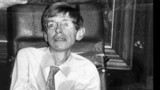
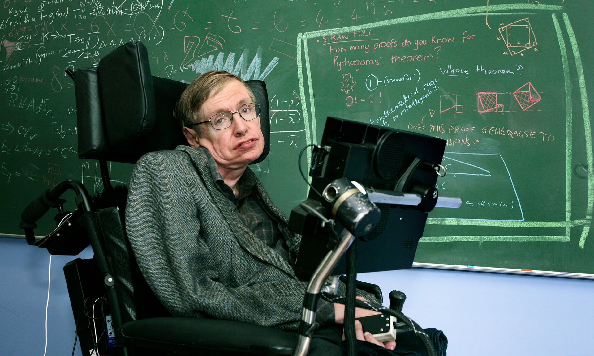

Stephen Hawking
===============

   Stephen Hawking(1942-2018)

Stephen Hawking - who died aged 76 - battled motor neurone disease
to become one of the most respected and best-known scientists of his age.

A man of great humour, he became a popular ambassador for science
and was always careful to ensure that the general public had ready access to his work.

His book A Brief History of Time became an unlikely best-seller although
it is unclear how many people actually managed to get to the end of it.

   Stephen Hawking

The image of Stephen Hawking – who has died aged 76 – in his motorised wheelchair,
with head contorted slightly to one side and hands crossed over to work the controls,
caught the public imagination, as a true symbol of the triumph of mind over matter.
As with the Delphic oracle of ancient Greece, physical impairment seemed compensated
by almost supernatural gifts, which allowed his mind to roam the universe freely,
upon occasion enigmatically revealing some of its secrets hidden from ordinary mortal view.

Of course, such a romanticised image can represent but a partial truth. Those who knew Hawking
would clearly appreciate the dominating presence of a real human being, with an enormous zest for life,
great humour, and tremendous determination, yet with normal human weaknesses, as well as his more obvious strengths.
It seems clear that he took great delight in his commonly perceived role as “the No 1 celebrity scientist”; 
huge audiences would attend his public lectures, perhaps not always just for scientific edification.
