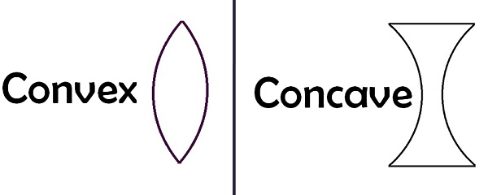
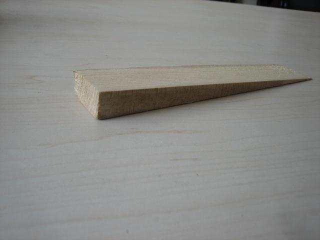
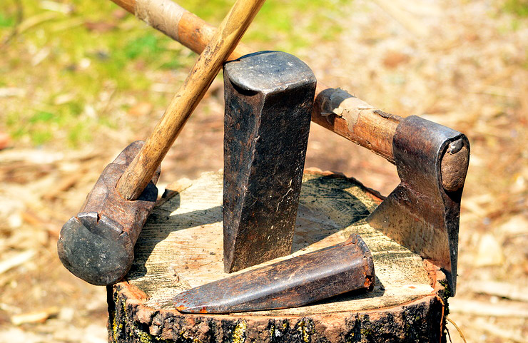

***************
English Note 11
***************

Electricity travels a foot in a nanosecond.

Only paranoid can surrive.

| a bitter pill (to swallow)
| Definition: an unpleasant or painful necessity (to accept).
| 
| sugar
| Definition: sweeten, sprinkle, or coat with sugar. [糖衣]
| Usage: she absentmindedly sugared her tea.
| Usage: sugared walnut. [琥珀核桃]
| Definition: make more agreeable or palatable.
| Usage: the novel was preachy but sugared heavily with jokes.
| 
| palatable
| Definition: (of food or drink) pleasant to taste.
| Usage: a very palatable local red wine.
| Definition: (of an action or proposal) acceptable or satisfactory.
| Usage: Some of the dialogue has been changed to make it more palatable to an American audience. 
| 
| tricky
| Definition: (of a person or act) deceitful, crafty, or skillful.
| Definition: (of a task, problem, or situation) requiring care and skill because difficult or awkward.
| Usage: applying eyeliner can be a tricky business.
| 
| dog-ear [书页折角做标记]
| Definition: Fold down the corner of (a book or magazine), typically to mark a place.
| 
| rectify
| Definition: put (something) right; correct. [澄清，修正]
| Usage: mistakes made now cannot be rectified later.
| 
| exorcism
| exorcist
| exorcise
| Definition: drive out (an evil spirit) from a person or place. 
| Usage: blue exorcist (青のエクソシスト). [驱魔师]
| Usage: Infants were exorcised prior to baptism.
| make someone's hair stand on end
| make (one's) / the hair stand up on the back of (one's) neck
| Definition: to scare or horrify someone. [毛骨悚然]
| Usage: Walking past the cemetery alone at night made Mary's hair stand up on the back of her neck.
| Usage: Just the thought of going into that abandoned building makes the hair stand up on the back of my neck.
| Usage: The hairs stand up on the back of your neck when you realise you have discovered something as astonishing as these boxing gloves.
| 
| hair
| Usage: A woman with shoulder-length fair hair. [披肩发] 
| Defintion: (a hair) a very small quantity or extent.
| Usage: His magic takes him a hair above the competition.
| 
| hair of the dog
| Definition: an alcoholic drink taken to cure a hangover. [宿醉] [醒酒药]
| Origin: from hair of the dog that bit you, formerly recommended as a remedy for the bit of a mad dog.
| 
| put hair on one's chest
| Definition: (of an alcoholic drink) be very strong.
| 
| in (or out of) one's hair
| Definition: annoying (or ceasing to annoy someone).
| Usage: I'm glad he's out of my hair.
| 
| let one's hair down
| Definition: (informal) behave in an uninhibited or relaxed manner.
| Usage: Let you hair down and just have some fun.
| 
| not a hair out of place
| Definition: used to convey that a person is extremely neat and tidy in appearance.
| 
| not turn a hair
| Definition: remain apparently unmoved or unaffected.
| Usage: The old womal didn't turn a hair; she just sat quietly rocking.
| 
| split hair
| Definition: make small and overfine distinctions.
| Synonyms: find fault. [找茬儿]
| Usage: Don't split hairs. You know what I'm getting at.
| 
| contrapositive
| contraposition [互逆]
| Definition: conversion of a proposition from all A is B to all not-B is not-A.
| 
| trichotomy
| Definition: a division into three categories.
| Usage: the pragmatics–semantics–syntax trichotomy.
| 
| quirk
| quirky
| Definition: a peculiar behavioral habit.
| Usage: his distaste for travel is an endearing quirk.
| Usage: her sense of humor was decidedly quirky.
| 
| fair and square
| Definition: honestly and straightforwardly.
| Usage: Well I appreciate it, but I prefer to win fair and square.
| 
| ephemeral
| ephemerality
| Definition: lasting for a very short time.
| Usage: fashions are ephemeral.
| Definition: (chiefly of plants) having a very short life cycle. [寄蜉蝣于天地，渺沧海之一粟]
| 
| offload
| Definition: unload (a cargo).
| Usage: men were offloading bags of salt.
| Definition: rid oneself of (something) by selling or passing it on to someone else.
| Usage: a dealer offloaded 5,000 of these shares on a client.
| Definition: relieve oneself of (a problem or worry) by talking to someone else.
| Usage: it would be nice to have been able to offload your worries onto someone.
| Definition: move (data or a task) from one processor to another in order to free the first processor for other tasks.
| Usage: a system designed to offload the text on to a host computer.
| 
| berserk
| berserker [狂战士]
| Defintion: out of control with anger or excitement; wild or frenzied.
| Usage: after she left him, he went berserk, throwing things around the apartment.
| 
| bite (someone) in the ass / butt
| Definition: To punish or take revenge on someone for their misjudgment or misdeed(s). 
| Usage: Your poor treatment of your employees might come back to bite you in the ass some day. 
| Usage: I got too greedy with my gambling, and now it has bitten me in the ass.
| 
| get-go
| Definition: the very beginning.
| Usage: Lawrence knew from the get-go that he could count on me to tell him the truth.
| 
| inflection 
| Grammar: a change in the form of a word (typically the ending) to express a grammatical function or attribute such as tense, mood, person, number, case, and gender.
| Mathematics: a change of curvature from convex to concave at a particular point on a curve.
| 
| die hard
| Definition: disappear or change very slowly.
| Usage: old habits die hard. [百足之虫，死而不僵]
| 
| never say die
| Definition: used to encourage someone in a difficult situation.
| Usage: old soldiers never die, they just fade away.
| 
| to die for
| Definition: extremely good or desirable.
| Usage: The ice cream is to die for.
| 
| die on the vine
| Definition: be unsuccessful at an early stage.
| Usage: Many of the resources for students with learning disabilities have died on the vine following the school board's budget cuts.
| 
| vine
| Definition: a climbing or trailing woody-stemmed plant of the grape family.
| Definition: the slender stem of a trailing or climbing plant. [藤本科植物]
| 
| attribute
| attributable
| Definition: regarded as being caused by.
| Usage: 43% of all deaths in Ireland were attributable to cardiovascular disease.
| Definition: (of a work or remark) able to be ascribed to a particular author, artist, or speaker.
| Usage: some 50 liturgical works by or attributable to him have survived.
| Usage: this may be Leonardo 's earliest securely attributable painting.
| 
| corpus
| Definition: a collection of written texts, especially the entire works of a particular author or a body of writing on a particular subject.
| Usage: the Darwinian corpus. 
| Definition: a collection of written or spoken material in machine-readable form, assembled for the purpose of studying linguistic structures, frequencies, etc.
| 
| desist
| Definition: cease; abstain.
| Usage: each pledged to desist from acts of sabotage.
| 
| lame
| unable to walk well because of an injury to the leg or foot.
| Definition: His horse went lame.
| 
| terminate
| termination
| Definition: the action of bringing something or coming to an end.
| Usage: the termination of a contract.
| Definition: an act of dismissing someone from employment. 
| Usage: termination letter. [解雇信]
| 
| nitty-gritty
| Definition: the most important aspects or practical details of a subject or situation.
| Usage: Time ran out before we could get down to the real nitty-gritty.
| 
| overkill
| Definition: too much of sth that reduces the effect it has. [过犹不及]
| Usage: There is a danger of overkill if you plan everything too carefully.
| 
| gory
| Definition: involving or showing violence and bloodshed.
| Usage: a gory horror film. [恐怖电影]
| Usage: a gory accident. [流血事件]
| Usgae: a gory figure. [血迹斑斑的人]
| Phrase: the gory details
| Definition: the explicit details of something
| Usage: she told him the gory details of her past.[往事不堪回首]
| 
| hallmark
| Definition: a mark stamped on articles of gold, silver, or platinum in Britain, certifying their standard of purity.
| Definition: a distinctive feature, especially one of excellence.
| Usage: the tiny bubbles are the hallmark of fine champagnes.
| Usage: Police said the explosion bore all the hallmarks of a terrorist attack.
| 
| benchmark
| Definition: a standard or point of reference against which things may be compared or assessed.
| Usage: we are benchmarking our performance against external criteria.
| 
| fabrication
| Definition: the action or process of manufacturing or inventing something.
| Usage: The assembly and fabrication of electronic products.
| Definition: an invention; a lie.
| Usage: The story was a complete fabrication. [本故事纯属虚构]
| 
| built-in
| Definition: forming an integral part of a structure or device.
| Usage: a camera with a built-in zoom lens. [内置镜头]
| Definition: (of a characteristic) inherent; innate.
| Usage: the system has a built-in resistance to change.
| 
| spleen
| splenic
| spleenful
| Definition: an abdominal organ involved in the production and removal of blood cells in most vertebrates and forming part of the immune system. [脾脏]
| Definition: bad temper; spite.
| Usage: he could vent his spleen on the institutions that had duped him.[from the earlier belief that the spleen was the seat of such emotions.]
| Usage: He vented his spleen on the assembled crowd.
| 
| dupe
| Definition: deceive; trick.
| Usage: the newspaper was duped into publishing an untrue story.
| 
| seat
| Definition: a place in an elected legislative or other body.
| Usage: he lost his seat in the 1998 election.
| Definition: a site or location of something specified.
| Usage: Washington, the seat of the federal government.
| 
| default
| Definition: failure to fulfill an obligation, especially to repay a loan or appear in a court of law.
| Usage: it will have to restructure its debts to avoid default.
| Usage: some had defaulted on student loans
| Definition: (of a computer program or other mechanism) revert automatically to (a preselected option).
| Usage: when you start a fresh letter the system will default to its own style.
| 
| azure
| Definition: bright blue in color like a cloudless sky.
| Usage: white beaches surrounded by azure seas.

   Magenta 品红

   Cyan 青色

   Wedge 楔子

.. figure:: images/Alan_Turing_Notebook.jpg

   Notes from a genius 

