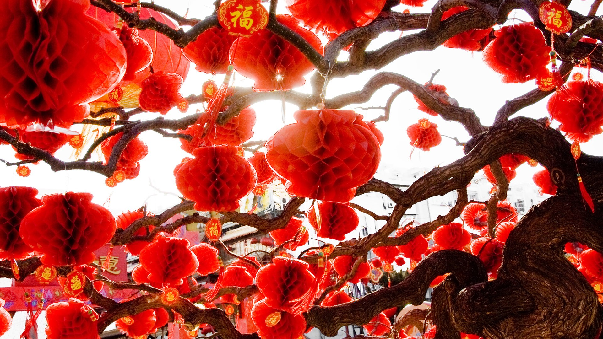

***************
English Note 12
***************

**累累若丧家之犬**

| uber
| Definition: denoting an outstanding or supreme example of a particular kind of person or thing.
| Usage: an uberbabe. [this describes a girl who’s ultra hot, beautiful and discerning]
| Usage: the uberregulator.
| 
| ingot
| Definition: a solid piece of metal, especially gold or silver, usually shaped like a brick.
| Usage: gold ingot. [金块] (gold dust [金砂])
| 
| underpin
| Definition:  to support a wall by putting metal, concrete, etc. under it [加固]
| Definition: to support or form the basis of an argument, a claim, etc.
| Usage: the theme of honor underpinning the two books.
| 
| pun [双关语]
| Definition: a joke exploiting the different possible meanings of a word or the fact that there are words which sound alike but have different meanings.
| Usage: the pigs were a squeal (if you'll forgive the pun) [not got it]
|
| wont
| Definition: (of a person) in the habit of doing something; accustomed.
| Usage: he was wont to arise at 5:30 every morning.
| 
| heretofore
| Definition: before now.
| Usage: diseases that heretofore were usually confined to rural areas.
| 
| hereafter
| Definition: from now on, in the future.
| Usage: Nothing I say hereafter is intended to offend.
| Definition: life after death.
| Usage: suffering is part of our preparation for the hereafter.
| 
| fable
| Definition:  a story, typically a supernatural one incorporating elements of myth and legend.
| Usage: *Aesops Fables*. [伊索寓言]
| 
| vignette
| bignettist
| Definition: a brief evocative description, account, or episode.
| Definition: a small illustration or portrait photograph that fades into its background without a definite border.
| 
| evocative
| Definition: bringing strong images, memories, or feelings to mind.
| Usage: Her new book is wonderfully evocative of village life. 
| 
| secretation
| Definition: the process by which liquid substances are produced by parts of the body or plants. [分泌过程]
| Usage: the secretion of bile by the liver. [肝脏分泌胆汁的过程]
| Definition: a liquid substance produced by parts of the body or plants [分泌物]
| 
| secret
| Definition: something that is kept or meant to be kept unknown or unseen by others.
| Usage: a state secret. [国家机密]
| Usage: at first I tried to keep it a secret from my wife.
| Definition: the resupply effort was probably kept secret from Congress.
| 
| Phrase: be in on the secret
| Definition: be among the few people who know something.
| Usage: Details of the proposals remain secret.
| Phrase: in secret
| Definition: without others knowing.
| Usage: The meeting was held in secret. 
| Phrase: make no secret of something
| Definition: make something perfectly clear.
| Usage: He made no secret of his ambition.
| 
| lunch
| Usage: public relations people lunch their clients there.
| Phrase: do lunch
| Definition: informal, chiefly North American meet for lunch.
| Phrase: out to lunch
| Definition: unaware of or inattentive to present conditions.
| Phrase: there's no such thing as a free lunch / there is no free lunch
| 
| par
| Defintion: (Golf) the number of strkes a first-class player should normally require for a hole or course.
| 
| shadow [影子]
| Usage: trees cast long shadows.
| Usage: the shadow of war fell across Europe.
| Definition: an inseparable attendant or companion.
| Usage: her faithful shadow, a Yorkshire terrier called Heathcliffe.
| Definition: follow and observe (someone) closely and secretly.
| Usage: he had been up all night shadowing a team of poachers.
| 
| reflection [倒影]
| Usage: Marianne surveyed her reflection in the mirror.
| Usage: he doesn't get much time for reflection. [consideration]
|
| golden
| Usage: curls of glossy golden hair.
| Usage: bake until golden.
| Definition: (of a period) very happy and prosperous.
| Usage: those golden days before World War I. [黄金时期]
| Definition: (of an opportunity) very favorable.
| Usage: a golden opportunity to boost foreign trade.
| Definition: denoting the fiftieth year of something.
| Usage: golden wedding anniversary. [金婚]
| Usage: A silver wedding is known to be 25 years of marriage anniversary. [银婚]
| 
| compromise
| Definition: settle a dispute by mutual concession.
| Definition: cause to become vulnerable or funtion less effectively.
| Usage: Last month’s leak of source code will not compromise your IT security.
| Usage: I should compromise the matter with my parents.
| 
| trade-off
| Definition: a balance achieved between two desirable but incompatible features; a compromise.
| Usage: a fundamental trade-off between capitalist prosperity and economic security
| 

.. image:: images/foothill.jpg
.. image:: images/sunrise.jpg
.. image:: images/river.jpg

   Laterns [灯笼]

   Hot air balloon [热气球]